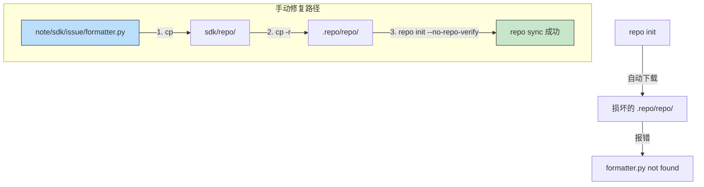

# 100ask BSP 源码同步与 Python 3.10 适配

> [!note]
> **Ref:** `note/sdk/issue/formatter.py` — polyfill 备份

## Issue

| 项 | 值 |
|----|----|
| 环境 | Ubuntu 22.04 / WSL2, Python 3.10+ |
| 触发 | `repo init` 拉取 100ask BSP manifest |
| 影响 | BSP 源码无法同步，初始化死锁 |

### 复现

```bash
cd ~/imx/sdk
repo init -u https://gitee.com/weidongshan/manifests.git \
    -b linux-sdk \
    -m imx6ull/100ask_imx6ull_linux4.9.88_release.xml
```

### 报错（先后出现）

```text
error: internal error: formatter.py not found
```

```text
AttributeError: module 'collections' has no attribute 'Iterable'
```

### 原因

两个 Python 3.10 breaking change 叠加：

1. `formatter` 标准库模块被彻底移除（3.4 deprecated → 3.10 删除）→ 旧版 `repo` import 失败
2. `collections.Iterable` 移至 `collections.abc.Iterable` → 即使补回 formatter，内部引用也崩溃

100ask 的 `repo` 启动器基于旧版 Google repo，硬依赖这两个已废弃 API。自动下载的 `.repo/repo/` 工具包同样不兼容。

### 修复架构



## Fix

### 步骤 1：部署 polyfill `formatter.py`

仓库备份位于 `note/sdk/issue/formatter.py`，是 Python 3.10 删除的 `formatter` 标准库模块的完整 shim 实现。

```bash
# 部署到 repo 工具目录
cp note/sdk/issue/formatter.py sdk/repo/formatter.py

# 同步到 .repo 内部目录（防止 repo 自动下载覆盖）
mkdir -p .repo/repo
cp -r sdk/repo/* .repo/repo/
```

### 步骤 2：使用本地 repo 初始化

```bash
sdk/repo/repo init -u https://gitee.com/weidongshan/manifests.git \
    -b linux-sdk \
    -m imx6ull/100ask_imx6ull_linux4.9.88_release.xml \
    --no-repo-verify

repo sync
```

`--no-repo-verify` 阻止从网络拉取不兼容的旧版工具包。

---

## Appendix: formatter.py

> 完整 polyfill 源码，重新实现被 Python 3.10 移除的 `formatter` 标准库模块。
> 备份路径：`note/sdk/issue/formatter.py`

```python
import sys
import warnings

# This module is deprecated in Python 3.4 and removed in Python 3.10.
# We provide a shim here for compatibility.

class NullFormatter:
    def __init__(self, writer=None):
        pass
    def end_paragraph(self, blankline): pass
    def add_line_break(self): pass
    def add_hor_rule(self, *args, **kw): pass
    def add_label_data(self, format, counter, blankline=None): pass
    def add_flowing_data(self, data): pass
    def add_literal_data(self, data): pass
    def flush_softspace(self): pass
    def push_alignment(self, align): pass
    def pop_alignment(self): pass
    def push_font(self, x): pass
    def pop_font(self): pass
    def push_margin(self, margin): pass
    def pop_margin(self): pass
    def set_spacing(self, spacing): pass
    def push_style(self, *styles): pass
    def pop_style(self, n=1): pass
    def assert_line_data(self, flag=1): pass

class AbstractFormatter:
    def __init__(self, writer):
        self.writer = writer
        self.align = None
        self.align_stack = []
        self.font_stack = []
        self.margin_stack = []
        self.spacing = None
        self.style_stack = []
        self.nook = 0
        self.softspace = 0
        self.para_end = 1
        self.parskip = 1
        self.hard_break = 1
        self.have_label = 0

    def end_paragraph(self, blankline):
        if not self.hard_break:
            self.writer.send_line_break()
            self.have_label = 0
        if self.parskip < blankline and not self.have_label:
            self.writer.send_paragraph(blankline - self.parskip)
            self.parskip = blankline
            self.have_label = 0
        self.hard_break = 1
        self.para_end = 1
        self.softspace = 0

    def add_line_break(self):
        if not (self.hard_break or self.para_end):
            self.writer.send_line_break()
            self.have_label = 0
            self.parskip = 0
        self.hard_break = 1
        self.softspace = 0

    def add_hor_rule(self, *args, **kw):
        if not self.hard_break:
            self.writer.send_line_break()
            self.writer.send_hor_rule(*args, **kw)
            self.hard_break = 1
            self.parskip = 1
            self.have_label = 0
            self.softspace = 0

    def add_label_data(self, format, counter, blankline=None):
        if self.have_label or not self.hard_break:
            self.writer.send_line_break()
        if not self.para_end:
            self.writer.send_paragraph((blankline and 1) or 0)
        if isinstance(format, str):
            self.writer.send_label_data(format)
        else:
            self.writer.send_label_data(format % counter)
        self.have_label = 1
        self.hard_break = 1
        self.para_end = 1
        self.softspace = 0
        self.parskip = 0

    def add_flowing_data(self, data):
        if not data: return
        prespace = data[:1].isspace()
        postspace = data[-1:].isspace()
        data = " ".join(data.split())
        if self.nook or (self.have_label and not self.hard_break):
            self.nook = 0
        elif (self.softspace and not prespace) or (not self.softspace and prespace):
            if not self.hard_break:
                self.writer.send_flowing_data(' ')
        self.hard_break = 0
        self.para_end = 0
        self.writer.send_flowing_data(data)
        self.softspace = postspace
        self.have_label = 0

    def add_literal_data(self, data):
        if not data: return
        if self.softspace:
            self.writer.send_flowing_data(" ")
        self.hard_break = data[-1:] == '\n'
        self.para_end = 0
        self.writer.send_literal_data(data)
        self.softspace = 0
        self.have_label = 0

    def flush_softspace(self):
        if self.softspace:
            self.hard_break = 0
            self.para_end = 0
            self.writer.send_flowing_data(' ')
            self.softspace = 0

    def push_alignment(self, align):
        if align and align != self.align:
            self.writer.new_alignment(align)
            self.align = align
            self.align_stack.append(align)
        else:
            self.align_stack.append(self.align)

    def pop_alignment(self):
        if self.align_stack:
            del self.align_stack[-1]
        if self.align_stack:
            self.align = self.align_stack[-1]
        else:
            self.align = None
        self.writer.new_alignment(self.align)

    def push_font(self, font):
        self.font_stack.append(font)
        self.writer.new_font(font)

    def pop_font(self):
        if self.font_stack:
            del self.font_stack[-1]
        if self.font_stack:
            font = self.font_stack[-1]
        else:
            font = None
        self.writer.new_font(font)

    def push_margin(self, margin):
        self.margin_stack.append(margin)
        self.writer.new_margin(margin, len(self.margin_stack))

    def pop_margin(self):
        if self.margin_stack:
            del self.margin_stack[-1]
        self.writer.new_margin(
            self.margin_stack[-1] if self.margin_stack else None,
            len(self.margin_stack))

    def set_spacing(self, spacing):
        self.spacing = spacing
        self.writer.new_spacing(spacing)

    def push_style(self, *styles):
        if self.softspace:
            self.writer.send_flowing_data(' ')
            self.softspace = 0
        self.style_stack.append(styles)
        self.writer.new_styles(tuple(styles))

    def pop_style(self, n=1):
        if self.softspace:
            self.writer.send_flowing_data(' ')
            self.softspace = 0
        del self.style_stack[-n:]
        self.writer.new_styles(
            self.style_stack[-1] if self.style_stack else ())

    def assert_line_data(self, flag=1):
        self.nook = flag
        self.have_label = 0

class NullWriter:
    def __init__(self): pass
    def flush(self): pass
    def new_alignment(self, align): pass
    def new_font(self, font): pass
    def new_margin(self, margin, level): pass
    def new_spacing(self, spacing): pass
    def new_styles(self, styles): pass
    def send_paragraph(self, blankline): pass
    def send_line_break(self): pass
    def send_hor_rule(self, *args, **kw): pass
    def send_label_data(self, data): pass
    def send_flowing_data(self, data): pass
    def send_literal_data(self, data): pass

class DumbWriter(NullWriter):
    def __init__(self, file=None, maxcol=72):
        self.file = file or sys.stdout
        self.maxcol = maxcol
        self.reset()

    def reset(self):
        self.col = 0
        self.atbreak = 0

    def send_paragraph(self, blankline):
        self.file.write('\n' * blankline)
        self.col = 0
        self.atbreak = 0

    def send_line_break(self):
        self.file.write('\n')
        self.col = 0
        self.atbreak = 0

    def send_hor_rule(self, *args, **kw):
        self.file.write('\n' + '-' * self.maxcol + '\n')
        self.col = 0
        self.atbreak = 0

    def send_literal_data(self, data):
        self.file.write(data)
        i = data.rfind('\n')
        if i >= 0:
            self.col = 0
            data = data[i+1:]
        self.col += len(data)
        self.atbreak = 0

    def send_flowing_data(self, data):
        if not data: return
        atbreak = self.atbreak or data[0].isspace()
        col = self.col
        maxcol = self.maxcol
        for word in data.split():
            if atbreak:
                if col + len(word) >= maxcol:
                    self.file.write('\n')
                    col = 0
                else:
                    self.file.write(' ')
                    col += 1
            self.file.write(word)
            col += len(word)
            atbreak = 1
        self.col = col
        self.atbreak = atbreak
```
