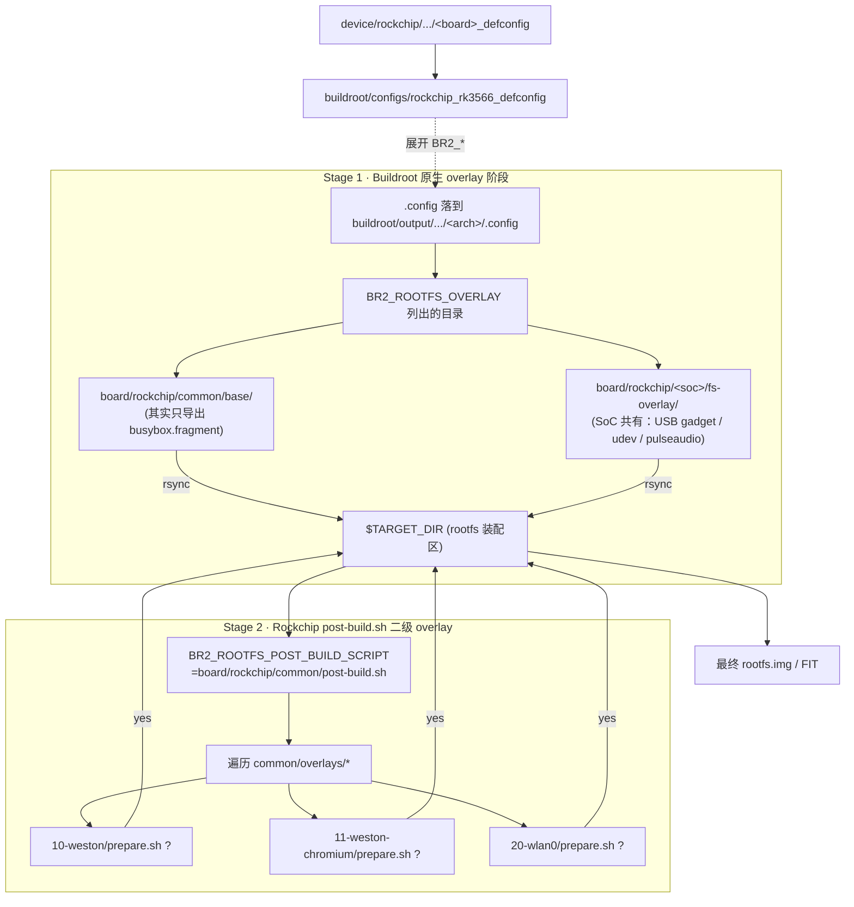

# Buildroot `board/` 目录作用与 Rockchip 二级 overlay 机制

> [!note]
> **Ref:**
> - [buildroot/board/rockchip/common/post-build.sh](../../../sdk/tspi-rk3566-sdk/buildroot/board/rockchip/common/post-build.sh)
> - [buildroot/board/rockchip/rk3566_rk3568/fs-overlay/](../../../sdk/tspi-rk3566-sdk/buildroot/board/rockchip/rk3566_rk3568/)
> - [buildroot/board/rockchip/common/overlays/](../../../sdk/tspi-rk3566-sdk/buildroot/board/rockchip/common/overlays/)
> - Buildroot 官方手册 §9.2 *Customizing the generated target filesystem*

## 1. Buildroot upstream 视角：`board/` 是什么

Buildroot 把"**与板子/厂商强绑定、但不属于上游 package 维护范围**"的内容统一放在仓库根的 `board/<vendor>/<soc-or-board>/` 下。它不参与 `make` 默认行为，**完全靠 defconfig 里几个变量按需引用**：

| Buildroot 变量 | 触发时机 | 典型放置内容 |
|---|---|---|
| `BR2_ROOTFS_OVERLAY` | rootfs 打包前，对 `$TARGET_DIR` 做 rsync 合并 | `fs-overlay/` 目录（`etc/`、`usr/share/`、`/usr/lib/udev/rules.d` …） |
| `BR2_ROOTFS_POST_BUILD_SCRIPT` | overlay 合并完之后、生成镜像之前 | `post-build.sh`（生成 `inittab`、调权限、塞版本号…） |
| `BR2_ROOTFS_POST_IMAGE_SCRIPT` | rootfs 镜像（ext4/squashfs/cpio）做完之后 | `post-image.sh`、`genimage.cfg.in`（拼最终 SD 卡 / FIT 镜像） |
| `BR2_LINUX_KERNEL_CUSTOM_DTS_PATH` | 内核编译期 | 板级 `.dts` 补丁 |
| `BR2_PACKAGE_BUSYBOX_CONFIG_FRAGMENT_FILES` | busybox 配置阶段 | `busybox.fragment`（追加 applet 开关） |

> [!IMPORTANT]
> **`board/` 并非"自动生效"的目录**。`buildroot/board/rockchip/` 下塞了几十个 SoC 子目录，但只有 defconfig 显式把它们路径写进上述变量，对应文件才会被 Buildroot 拉进 rootfs 或编译流程。看一个新板子要先看它的 defconfig 引用了 `board/` 下哪些路径，**不是按名字猜**。

举个反例：树莓派的 `buildroot/board/raspberrypi/` 里有 `cmdline.txt`、`config_*.txt`、`genimage.cfg.in`，全是给 `post-image.sh` 拼 SD 卡镜像用的；树莓派的 rootfs overlay 反而是空的。

## 2. tspi-rk3566 实际接线

板级 defconfig（`device/rockchip/rk3566_rk3568/rockchip_rk3566_taishanpi_1m_v10_defconfig`）只挑了 board/kernel DTS 名等高层旋钮；真正落到 buildroot `.config` 的是上一层 `buildroot/configs/rockchip_rk3566_defconfig` 经过预处理后的结果。可以直接查 build 出来的 `.config` 验证：

```sh
$ grep -E "BR2_ROOTFS_(OVERLAY|POST_BUILD_SCRIPT|POST_IMAGE_SCRIPT)" \
    buildroot/output/rockchip_rk3566_taishanpi_1m_v10/rockchip_rk3566/.config
BR2_ROOTFS_OVERLAY="board/rockchip/common/base board/rockchip/rk3566_rk3568/fs-overlay/"
BR2_ROOTFS_POST_BUILD_SCRIPT="board/rockchip/common/post-build.sh"
BR2_ROOTFS_POST_IMAGE_SCRIPT=""
```

含义拆开看：

1. **`BR2_ROOTFS_OVERLAY` 是空格分隔的多路径**，Buildroot 依次 rsync 进 `$TARGET_DIR`：
   - `board/rockchip/common/base/` —— 这里**只有一个 `busybox.fragment`**，并不是真的"要落进 rootfs"的文件；同一个文件被另外一条 `BR2_PACKAGE_BUSYBOX_CONFIG_FRAGMENT_FILES` 引用，作为 busybox kconfig fragment 起作用。命名是历史包袱，知道即可。
   - `board/rockchip/rk3566_rk3568/fs-overlay/` —— **真正的板级 overlay**，里面落 SoC 级别共有的：
     - `etc/.usb_config`、`etc/usb-gadget.d/rndis.sh` —— USB Gadget 默认走 RNDIS
     - `etc/udev/rules.d/90-pulseaudio-rockchip.rules`
     - `usr/share/pulseaudio/alsa-mixer/...` —— Rockchip 自家 ALSA profile
2. **`BR2_ROOTFS_POST_BUILD_SCRIPT` 只有一个**，因为 Buildroot 上游就是单脚本钩点。Rockchip 通过这个唯一入口又分发出二级机制（下一节）。

## 3. Rockchip 二级机制：`overlays/*/prepare.sh` 条件 overlay

`buildroot/board/rockchip/common/post-build.sh:9` 真正干活的就这一段：

```sh
OVERLAYS="$(dirname "$0")/overlays"
for dir in $(ls "$OVERLAYS"); do
    OVERLAY_DIR="$OVERLAYS/$dir"
    if [ -x "$OVERLAY_DIR/prepare.sh" ] && \
        ! "$OVERLAY_DIR/prepare.sh" "$TARGET_DIR"; then
        echo ">>> Ignored $OVERLAY_DIR"
        continue
    fi
    rsync -av --chmod=u=rwX,go=rX --exclude .empty --exclude /prepare.sh \
        "$OVERLAY_DIR/" "$TARGET_DIR/"
done
```

每个 `overlays/<NN-name>/` 子目录 = "**一组开机就该存在的文件 + 一个 `prepare.sh` 用来判断要不要装**"。判断逻辑通常就是检查某个 `BR2_PACKAGE_*` 是否启用：

```sh
# board/rockchip/common/overlays/10-weston/prepare.sh
[ "$BR2_PACKAGE_WESTON" ]   # 没装 weston 就返回非 0 → rsync 跳过
```

当前 `common/overlays/` 里有：

| 子目录 | 守门条件 | 装什么 |
|---|---|---|
| `10-weston/` | `BR2_PACKAGE_WESTON` | `weston.ini` + 桌面背景/图标/launcher 配置 |
| `11-weston-chromium/` | `BR2_PACKAGE_WESTON` + Chromium | 把 Chromium 当成 weston launcher |
| `20-wlan0/` | wifi 包 | `if-up.d/dhcp-up.sh` 等网络脚本 |

**关键设计：把"功能 = 一组文件 + 一个 prepare.sh"打包成原子单元**，不需要再回去改 `BR2_ROOTFS_OVERLAY` 的列表。Buildroot 上游本身没有这种"可条件触发的 overlay 包"概念，Rockchip 用 `post-build.sh` 这一个钩子模拟出了次级机制。

## 4. 两级流水线串成一张图



执行序：**Stage 1（无条件 rsync）→ Stage 2（条件 rsync）**。所以同名文件 Stage 2 会覆盖 Stage 1，可以用来做"默认值 + 特性级覆盖"。

## 5. `board/` 与 `device/rockchip/` 的分工

容易混淆的一点：tspi-rk3566-sdk 里同时有 `buildroot/board/rockchip/` 和顶层 `device/rockchip/`，两者**作用域不同**：

| 目录 | 作用域 | 解决什么问题 |
|---|---|---|
| `buildroot/board/rockchip/` | 只服务 Buildroot 阶段 | rootfs overlay、busybox fragment、Buildroot post-build |
| `device/rockchip/` | 顶层 SDK 全局（U-Boot / Kernel / Recovery / Buildroot 都用） | 板级 defconfig、分区表 (`parameter-*.txt`)、`boot.its`、`post-hooks/`（含 dtbo 安装、A/B 升级处理） |

如果只在 buildroot 范围内改 rootfs，**改 `board/` 即可**；要改分区、内核 DTS、bootloader 行为，那是 `device/rockchip/` 的活。

## 6. 上手实操速查

- **看一个文件是怎么进 rootfs 的**：先在 `buildroot/output/.../<arch>/.config` 里 grep `BR2_ROOTFS_OVERLAY`，再 `find` 那些目录；如果都不在，多半是某个 package 的 install hook 装的。
- **加一个开机就要存在的脚本**：放 `buildroot/board/rockchip/<soc>/fs-overlay/etc/init.d/SXX_foo`，无条件生效。
- **加一个"装了某包才生效"的配置**：在 `buildroot/board/rockchip/common/overlays/` 下新建 `NN-foo/`，写一个 `prepare.sh` 用 `[ "$BR2_PACKAGE_FOO" ]` 守门。
- **改 busybox applet 开关**：编辑 `common/base/busybox.fragment`，加一行 `CONFIG_XXX=y`，然后 `./build.sh bmake busybox-rebuild`。

> [!note]
> **不要直接编辑 buildroot/output/<arch>/target/**，那是 rsync 的产物，下一次 `make` 会被覆盖。所有 rootfs 改动都要落到 `board/` 或 package install hook 里。
