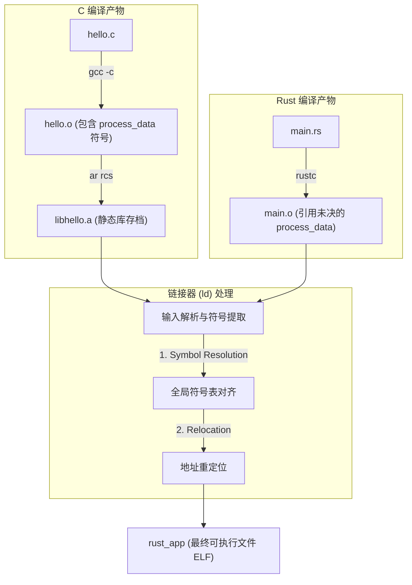

# 01-ABI-ld-cfg 链接过程深度解剖

> [!note]
> **Ref:** 
> - Demo 路径: `note/ABI/demo/rust_app`
> - GNU Linker (`ld`) Documentation

在混合编程中，编译器（gcc / rustc）的任务只是将源代码翻译成特定架构的机器码并生成 **可重定位目标文件 (`.o`)**。真正的“缝合怪”魔法，是由 **链接器 (Linker, 通常是 `ld`)** 完成的。

本笔记以 Demo 中的 `libhello.a` 与 `rust_app` 为例，拆解静态链接的微观过程。

## 1. 链接全景数据流 (Data Flow)



## 2. 核心阶段详解

链接过程主要分为两个核心步骤：**符号解析 (Symbol Resolution)** 与 **重定位 (Relocation)**。

### 2.1 符号解析 (Symbol Resolution)

在链接开始时，链接器会维护三个集合：
- **E (Executable)**: 将被合并到最终可执行文件中的目标文件集合（比如 Rust 的 `main.o` 和 C 的 `hello.o`）。
- **U (Unresolved)**: 当前未解析的符号引用集合。
- **D (Defined)**: 已经定义的符号集合。

**解析过程**：
1. `rustc` 将 Rust 侧的代码编译为 `main.o`，放入 **E** 集合。
2. 扫描 `main.o`，发现它调用了 `process_data`，但本地没有实现。链接器将 `process_data` 加入未决集合 **U**。
3. 链接器按照参数顺序，开始处理静态库 `libhello.a`。
4. 链接器在 `libhello.a` 中寻找能匹配集合 **U** 中符号的对象文件。它发现存档内的 `hello.o` 定义了 `process_data`。
5. 链接器将 `hello.o` 从静态库中解压出来，放入 **E** 集合，并将 `process_data` 从 **U** 移入 **D**（已定义）。
6. 如果最终扫描完毕，**U** 集合不为空（即存在找不到的符号），链接器报错：`undefined reference to xxx`。

### 2.2 重定位 (Relocation)

当符号解析完成，链接器确认了所有需要的代码段 (`.text`) 和数据段 (`.data`)。接下来，它要进行重定位：
1. **段合并 (Section Merging)**：将 Rust 的 `.text` 和 C 的 `.text` 拼接到一起，分配最终的虚拟运行地址。
2. **修改引用地址**：在汇编阶段，Rust 的 `call process_data` 指令后面跟着的地址是假的（通常是 `0x0` 或一个相对偏移量占位符）。链接器在分配好所有指令的真实虚拟地址后，会回溯到这个 `call` 指令，把占位符替换为 `process_data` 真正的内存地址。

## 3. Cargo 与链接器的通信 (build.rs 的作用)

在 Rust 生态中，`rustc` 通常不直接调用 `ld`，而是调用系统的 C 编译器（如 `gcc` 或 `cc`）作为链接器前端。

我们在 `build.rs` 中写的指令，实质上是告诉 Cargo 如何生成传给链接器前端的参数：

```rust
// 告诉 cargo: 库所在的搜索路径
println!("cargo:rustc-link-search=native={}", out_dir);
// 等价于链接参数: -L/path/to/out_dir

// 告诉 cargo: 需要链接的静态库名称 (省略 lib 前缀和 .a 后缀)
println!("cargo:rustc-link-lib=static=hello");
// 等价于链接参数: -lhello (并在上下文中加上 -Wl,-Bstatic 强制静态链接)
```

最终，Cargo 会在底层组装出类似这样极其冗长的命令：
`cc -m64 /tmp/rust_main.o ... -L/path/to/out_dir -Wl,-Bstatic -lhello -Wl,-Bdynamic -lgcc_s -lc ... -o rust_app`

### 3.1 为什么顺序很重要？

如果 `-lhello` 放在 `main.o` 之前，会发生什么？
- 链接器先处理 `libhello.a`，发现此时未决集合 **U** 是空的（因为还没扫描 `main.o`），它会认为这个静态库“毫无用处”，直接跳过。
- 接着处理 `main.o`，将 `process_data` 加入 **U** 集合。
- 此时输入参数已经处理完，**U** 集合仍然有未解析的 `process_data`，导致链接失败！

**结论**：`rustc` 与 Cargo 自动处理了依赖拓扑排序，确保静态库（提供者）的链接参数始终跟在目标文件（消费者）之后。

## 4. 总结

在 C/Rust 混合编程中，**ABI 保证了指令运行时在寄存器层面的兼容，而链接器 (ld) 保证了符号在物理地址层面的接驳**。`build.rs` 则充当了这两者的配置粘合剂，使得原本复杂的 `-L`、`-l` 以及静态库打包流程被自动化在标准的构建生命周期中。
