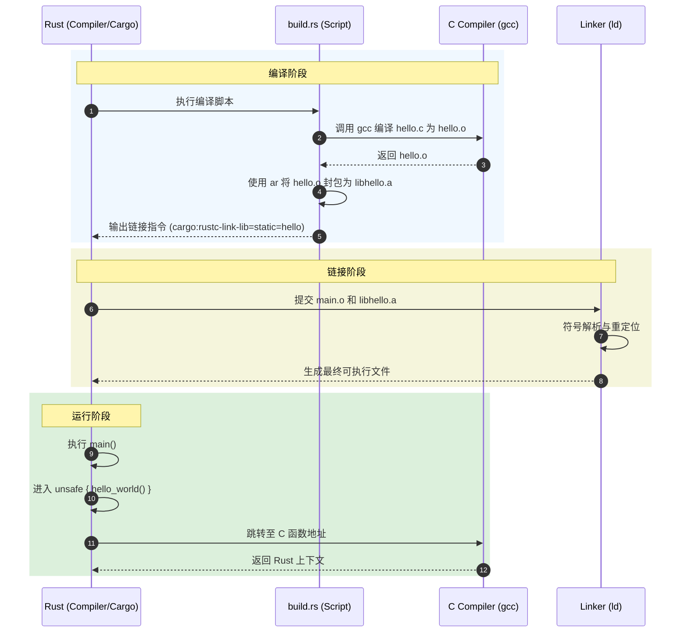

# 混合编程-ABI 核心原理

> [!note]
> **Ref:** [The Rust FFI Guide](https://doc.rust-lang.org/nomicon/ffi.html), [System V ABI](https://refspecs.linuxfoundation.org/elf/x86_64-abi-0.99.pdf), 本地代码 `note/ABI/demo/`

在嵌入式开发中，单一语言往往难以兼顾开发效率与底层控制。混合编程（如 Rust 调用 C）的关键在于 **ABI (Application Binary Interface)**。

## 1. 什么是 ABI？

ABI 是二进制层面的约定，定义了以下关键点：
- **函数调用约定 (Calling Convention)**：参数是通过寄存器传递还是栈传递？谁负责清理栈（调用者还是被调用者）？
- **数据对齐 (Data Alignment)**：结构体成员在内存中如何排列？
- **符号重整 (Name Mangling)**：C 语言保持原名，而 Rust/C++ 默认会对符号进行重整。

## 2. 跨语言调用的关键现象 (Phenomenon)

在本次 Demo 中，我们可以观察到以下关键点：

### 2.1 符号链接 (Symbol Linking)
Rust 主程序中并不包含 `hello_world` 的具体实现，它通过 `extern "C"` 块向链接器发出请求。
- **现象**：如果 C 代码未被正确编译并链接，Rust 会报 `linker error: undefined reference to 'hello_world'`。
- **要点**：C 编译器的输出（`.o` 或 `.a`）必须显式告知 Rust 链接器。

### 2.2 静态链接 (Static Linking)
本例将 C 代码打包成了 `libhello.a` 静态库。
- **现象**：最终生成的二进制文件 `target/debug/rust_app` 是一个单一的 ELF 文件，内部包含了 Rust 运行时和 C 的 `printf` 调用逻辑。
- **分析**：链接器将 Rust 生成的目标文件与 C 生成的目标文件合并，并重定位符号地址。

### 2.3 内存布局与 ABI 传参握手
```rust
#C侧
int process_data(int a, int b){
    return a+b;
}
#rust侧
extern "C" {
    fn process_data(a: i32, b: i32) -> i32;
}
```
这段代码强制 Rust 编译器在调用该函数时，遵循目标平台的 **Standard C Calling Convention**（如 x86_64 下的 System V ABI，或 ARM 下的 AAPCS）。
- **寄存器传递参数**：Rust 在执行 `call process_data` 前，会严格按照 ABI 规则将参数入栈或装入寄存器。例如在 x86_64 Linux 中，参数 `a` 会被放入 `EDI` 寄存器，参数 `b` 会被放入 `ESI` 寄存器。
- **寄存器接收返回值**：C 函数执行 `return a + b;` 后，结果会被存入 `EAX/RAX` 寄存器。当控制流返回 Rust 时，Rust 会直接从 `EAX/RAX` 中提取该返回值作为 `result`。

## 3. 混合编程流程图



## 4. 实验现象进阶：Release 构建与编译器行为

当我们使用 `cargo build --release` 编译此工程时，会出现几个显著的现象：

### 4.1 体积缩减
- **现象**：`target/debug/rust_app` 的大小通常在数 MB（示例中约 3.8MB），而 `target/release/rust_app` 的大小会锐减（示例中约 427KB）。
- **分析**：Release 构建去除了大量的调试符号 (Debug Info)，并且链接器执行了死代码消除 (Dead Code Elimination)。

### 4.2 Rust 侧的极致内联与寄存器装填
通过对 Release 产物的 `main` 函数进行反汇编（`objdump -d`），我们观察到了 Rust 编译器对于调用 C 函数的汇编级表现：
```assembly
# Rust_app::main (精简版片段)
1467a:       bf 0f 00 00 00          mov    $0xf,%edi     # 将参数 a = 15 (0x0f) 装入 EDI 寄存器
1467f:       be 1b 00 00 00          mov    $0x1b,%esi    # 将参数 b = 27 (0x1b) 装入 ESI 寄存器
14684:       ff 15 5e 17 04 00       call   *0x4175e(%rip) # 通过地址跳转调用 process_data (C函数)
1468a:       89 44 24 0c             mov    %eax,0xc(%rsp) # 从 EAX 取得返回值 42 并存入栈中，准备给 println! 使用
```
- **硬编码优化**：Rust 并没有在栈上为变量 `x` 和 `y` 分配空间，而是直接将常量值 `0xf` (15) 和 `0x1b` (27) **硬编码**到了寄存器赋值指令中。
- **跨越语言的指令级对接**：Rust 准备好寄存器后，仅仅是一个 `call` 指令就进入了 C 代码的领域，没有任何“粘合层”代码。这就是 ABI 的威力。

### 4.3 跨语言的优化壁垒 (LTO 缺失时的限制)
尽管 Rust 进行了高度优化，但由于我们是分别调用 `gcc -c` 和 `rustc` 的：
- Rust 编译器 (基于 LLVM) 看不到 C 编译器 (GCC) 生成的机器码细节。
- **现象**：即使 `process_data` 逻辑极其简单（仅一个 `printf` 和一次加法），Rust 也**无法将其内联 (Inline)** 到 `main` 函数中。
- **解决方案**：要打破这种跨语言的优化壁垒，必须启用 **LTO (Link Time Optimization)**，并确保 C 和 Rust 代码由兼容的编译器套件（如 Clang + Rustc 均基于 LLVM）共同在链接阶段进行全局优化。

## 5. 实验结论

1. **二进制兼容性**：只要遵循相同的 ABI，不同编译器生成的机器码可以在同一个进程空间中完美协作。
2. **安全边界**：Rust 强制要求 FFI 调用必须在 `unsafe` 块中，因为 Rust 无法静态验证 C 代码的内存安全性。
3. **自动化构建**：通过 `build.rs`，我们可以实现跨语言项目的“一键编译”，将 C 库作为 Rust 包的一个透明依赖。
