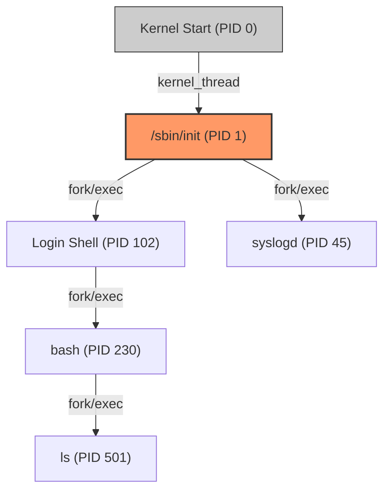

# 进程的起源：从 Init 到进程树

在 Linux 的世界里，**除了 0 号进程外，没有任何进程是凭空产生的。**每一个进程都有其“父亲”，这种血缘关系构成了 Linux 系统的**进程树 (Process Tree)**。

## 1. 0 号与 1 号：生命的起点

在内核启动的最后阶段，会涉及到两个极其特殊的进程：

- **0 号进程 (idle 进程/swapper):** 
  - 这是内核启动时自带的第一个执行流，执行Kernel Init ，此后为user态提供idle proc
  - 它在系统空闲时运行（执行 `wfi` 等指令降低功耗）。
  - 它通过 `kernel_thread` 产生了 1 号进程。
- **1 号进程 (init 进程):**
  - **身份转变:** 它是从内核态跳转到用户态执行的第一个进程。内核会尝试在文件系统中寻找 `/sbin/init` 或 `/init`（在 RAMDisk 中）。
  - **收割者 (The Reaper):** 它是一切用户态进程的祖先。如果一个父进程先于子进程退出，1 号进程会接管这些“孤儿进程”，防止系统充满僵尸进程。

## 2. 进程树的生长：Fork 与 Exec

进程树的扩张依赖于两个核心系统调用：

1.  **`fork()` (分身):** 产生一个与父进程几乎一模一样的子进程。此时，父子进程的代码段、数据段在逻辑上是相同的。

    > [!tip]
    >
    > there leaves a impotant optimiztion: COW (copy on write)

2.  **`execve()` (夺舍):** 子进程调用 `exec` 系列函数，加载新的二进制程序（如 `ls` 或 `bash`），替换掉原有的内存映像。



## 3. 核心身份标识 (PID)

为了管理这棵庞大的树，内核为每个进程分配了唯一的标识符：

- **PID (Process ID):** 进程的身份证号。在全系统内唯一。
- **PPID (Parent Process ID):** 父进程的 PID。通过它可以追溯血缘。
- **TGID (Thread Group ID):** 在多线程环境下，同一个进程下的所有线程具有相同的 TGID（通常等同于主线程的 PID）。但在内核 `task_struct` 结构体中，每个线程都有自己独立的 PID。

## 4. 观察进程树

在开发板（如 IMX6ULL）的终端中，你可以通过以下命令直观看到这棵树：

```bash
# 以树状结构显示所有进程
ps -ef --forest
# 或者
pstree -p
```

> [!note]
> **Ref:** 
> - 《嵌入式Linux应用开发完全手册V5.2》进程管理章节
> - Linux Kernel Source: `init/main.c` 中的 `rest_init()` 函数
