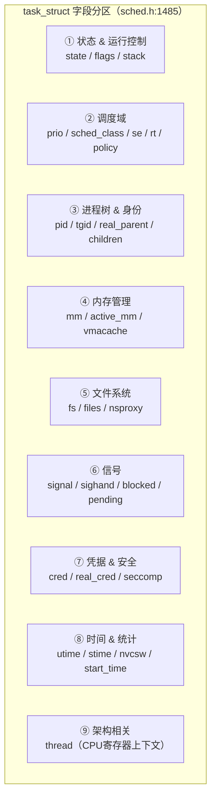
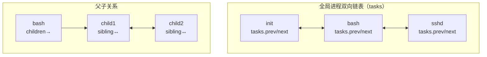
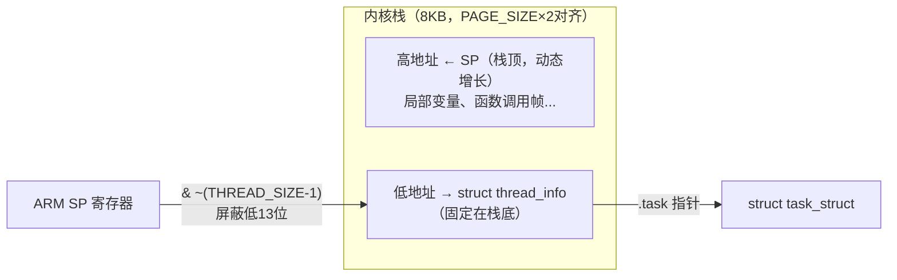
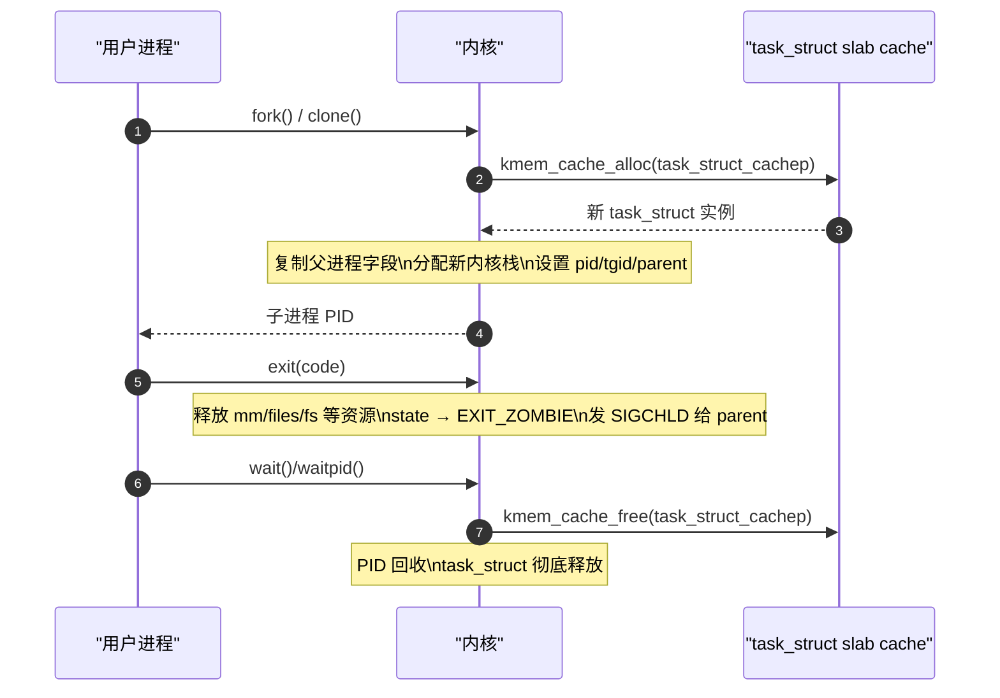

# 进程控制块：task_struct 的解剖

> [!note]
> **Ref:** [`sdk/Linux-4.9.88/include/linux/sched.h:1485`](../../../sdk/100ask_imx6ull-sdk/Linux-4.9.88/include/linux/sched.h), [`sdk/Linux-4.9.88/arch/arm/include/asm/thread_info.h`](../../../sdk/100ask_imx6ull-sdk/Linux-4.9.88/arch/arm/include/asm/thread_info.h)

## 1. 总体布局

`task_struct` 定义于 `include/linux/sched.h:1485`，是内核中最大的数据结构之一。每个进程（包括线程）对应一个实例，常驻内核空间，生命周期横跨从 `fork()` 到父进程 `wait()` 回收。



---

## 2. ① 状态与运行控制

```c
/* sched.h:1493 */
volatile long state;   /* -1=不可运行, 0=可运行, >0=停止 */
void         *stack;   /* 指向内核栈（8KB，包含 thread_info）*/
atomic_t      usage;   /* 引用计数，降到0才真正释放 */
unsigned int  flags;   /* PF_* 标志位，如 PF_KTHREAD / PF_EXITING */
unsigned int  ptrace;  /* ptrace 状态标志 */
```

`state` 与 `exit_state` 共同描述进程完整生命周期：

```c
/* sched.h:1567 */
int exit_state;          /* EXIT_ZOMBIE(16) / EXIT_DEAD(32) */
int exit_code;           /* 传给父进程的退出码 */
int exit_signal;         /* 退出时发给父进程的信号（通常 SIGCHLD）*/
int pdeath_signal;       /* 父进程先死时发给本进程的信号 */
```

`flags` 常用位：

| 宏 | 值 | 含义 |
|----|-----|------|
| `PF_IDLE` | `0x00000002` | 空闲线程 |
| `PF_EXITING` | `0x00000004` | 进程正在退出（do_exit 中）|
| `PF_KTHREAD` | `0x00200000` | 内核线程（无用户地址空间）|
| `PF_FORKNOEXEC` | `0x00000040` | 已 fork 但未 exec |
| `PF_SUPERPRIV` | `0x00000100` | 使用过超级用户权限 |

---

## 3. ② 调度域

```c
/* sched.h:1513 */
int                      prio;          /* 动态优先级（受 nice 和 RT boost 影响）*/
int                      static_prio;   /* 静态优先级（用户 nice 值映射）*/
int                      normal_prio;   /* 归一化优先级（RT/CFS 统一表示）*/
unsigned int             rt_priority;   /* 实时优先级（1–99，仅 RT 进程有效）*/

const struct sched_class *sched_class;  /* 调度类（CFS/RT/DL/IDLE）*/
struct sched_entity      se;            /* CFS 调度实体（挂入红黑树）*/
struct sched_rt_entity   rt;            /* RT 调度实体 */
struct sched_dl_entity   dl;            /* Deadline 调度实体 */

unsigned int             policy;        /* 调度策略 */
cpumask_t                cpus_allowed;  /* 允许运行的 CPU 集合 */
int                      nr_cpus_allowed;
int                      on_rq;         /* 是否在 runqueue 上（1=是）*/
```

**调度策略 `policy` 取值：**

| 策略 | 值 | 特性 |
|------|----|------|
| `SCHED_NORMAL` | 0 | 普通进程，CFS 调度 |
| `SCHED_FIFO` | 1 | 实时，先进先出 |
| `SCHED_RR` | 2 | 实时，时间片轮转 |
| `SCHED_BATCH` | 3 | 批处理，让出 CPU 倾向更强 |
| `SCHED_IDLE` | 5 | 极低优先级后台 |
| `SCHED_DEADLINE` | 6 | EDF 最早截止期限优先 |

**优先级数值范围（数值越小优先级越高）：**

```
实时进程:  prio = 0–99       (对应 rt_priority 99–1 的映射)
普通进程:  prio = 100–139    (对应 nice -20 ~ +19)
           static_prio = MAX_RT_PRIO + nice + 20
                       = 100 + (0 + 20) = 120  (nice=0 默认值)
```

---

## 4. ③ 进程树与身份标识

```c
/* sched.h:1606 */
pid_t  pid;    /* 内核级线程 ID（每个线程唯一）*/
pid_t  tgid;   /* 线程组 ID = 主线程 pid（用户态 getpid() 返回值）*/
```

> **`pid` vs `tgid`：** 多线程进程中，所有线程 `tgid` 相同（等于主线程 `pid`），各自 `pid` 不同。`ps` 默认显示 `tgid`（即用户感知的进程号）；`ps -L` 显示每个线程的 `pid`（LWP 列）。

```c
/* sched.h:1618 */
struct task_struct __rcu *real_parent; /* 真实父进程（不变）*/
struct task_struct __rcu *parent;      /* SIGCHLD 接收者（ptrace 时可能不同）*/
struct list_head          children;    /* 子进程链表头 */
struct list_head          sibling;     /* 挂入父进程 children 链表的节点 */
struct task_struct       *group_leader;/* 线程组领头（主线程）*/
char comm[TASK_COMM_LEN];              /* 进程名（16字节，ps/top显示的 COMMAND）*/
```

**进程树的双向链表结构：**



```c
struct list_head tasks;  /* 挂入全局进程链表（init_task 为链表头）*/
```

---

## 5. ④ 内存管理

```c
/* sched.h:1559 */
struct mm_struct *mm;          /* 用户态地址空间描述符（内核线程为 NULL）*/
struct mm_struct *active_mm;   /* 当前激活的 mm（内核线程借用前一进程的）*/

/* per-thread VMA 缓存（加速 page fault 处理）*/
u32                   vmacache_seqnum;
struct vm_area_struct *vmacache[VMACACHE_SIZE];  /* 最近访问的 VMA 缓存 */
```

> **`mm` vs `active_mm`：** 用户进程两者相同。内核线程 `mm=NULL`，切换到内核线程时 `active_mm` 暂借前一进程的 `mm`（保持页表映射不变），切回用户进程时 `active_mm` 重置为该进程的 `mm`。

---

## 6. ⑤ 文件系统

```c
/* sched.h:1694 */
struct fs_struct    *fs;      /* 工作目录（cwd）和根目录（root）*/
struct files_struct *files;   /* 打开的文件描述符表（fd_array）*/
struct nsproxy      *nsproxy; /* 命名空间集合（pid/net/mnt/uts/ipc ns）*/
```

`files->fd_array[fd]` 直接对应用户态的 `int fd`，指向 `struct file`，进而指向 VFS 的 `inode`。

---

## 7. ⑥ 信号处理

```c
/* sched.h:1700 */
struct signal_struct  *signal;       /* 线程组共享的信号信息（pending队列等）*/
struct sighand_struct *sighand;      /* 信号处理函数表（handler数组）*/
sigset_t               blocked;      /* 被屏蔽的信号集（sigmask）*/
sigset_t               real_blocked; /* 实际屏蔽集（不含临时修改）*/
struct sigpending      pending;      /* 本线程私有的 pending 信号队列 */
```

---

## 8. ⑦ 凭据与安全

```c
/* sched.h:1673 */
const struct cred __rcu *real_cred; /* 真实凭据（UID/GID，执行 setuid 前的值）*/
const struct cred __rcu *cred;      /* 有效凭据（当前权限检查使用）*/
struct seccomp           seccomp;   /* seccomp 过滤器（系统调用限制）*/
```

---

## 9. ⑧ 时间与统计

```c
/* sched.h:1644 */
cputime_t utime, stime;         /* 用户态/内核态累计 CPU 时间 */
u64       start_time;           /* 进程启动时刻（单调时钟，nsec）*/
u64       real_start_time;      /* 启动时刻（含系统挂起时间）*/
unsigned long nvcsw, nivcsw;    /* 自愿/非自愿上下文切换次数 */
unsigned long min_flt, maj_flt; /* 次要/主要缺页错误计数 */
```

---

## 10. ⑨ 架构相关：`thread_info` 与内核栈

### ARM Cortex-A7 的 `thread_info`（arch/arm/include/asm/thread_info.h:49）

```c
struct thread_info {
    unsigned long        flags;         /* TIF_* 低级标志（TIF_SIGPENDING等）*/
    int                  preempt_count; /* 抢占计数：0=可抢占，>0=禁止抢占 */
    mm_segment_t         addr_limit;    /* 地址上限（USER_DS/KERNEL_DS）*/
    struct task_struct  *task;          /* 反向指向 task_struct */
    __u32                cpu;           /* 当前所在 CPU 编号 */
    struct cpu_context_save cpu_context;/* 进程切换时保存的 CPU 寄存器 */
    __u32                syscall;       /* 当前系统调用号 */
    unsigned long        tp_value[2];   /* TLS 寄存器值（TPIDRURW/TPIDRURO）*/
};
```

### `current` 宏的实现原理（ARM-specific）

ARM Linux-4.9 采用"内核栈底存放 `thread_info`"的经典方案：



```c
/* arch/arm/include/asm/thread_info.h:91 */
static inline struct thread_info *current_thread_info(void)
{
    /* SP & ~(8192-1) = SP & ~0x1FFF
     * 将 SP 对齐到 8KB 边界，直接得到 thread_info 地址 */
    return (struct thread_info *)
        (current_stack_pointer & ~(THREAD_SIZE - 1));
}

/* include/asm-generic/current.h */
#define current  (current_thread_info()->task)
/* 最终展开：
 * current = ((thread_info*)(SP & ~0x1FFF))->task
 * 两次内存读取，无需寄存器缓存，代价极低 */
```

### `cpu_context_save`：进程切换的寄存器快照

```c
/* arch/arm/include/asm/thread_info.h */
struct cpu_context_save {
    __u32 r4, r5, r6, r7, r8, r9, sl;  /* 被调用者保存寄存器 */
    __u32 fp;   /* 帧指针 R11 */
    __u32 sp;   /* 内核栈指针（切换回来时恢复）*/
    __u32 pc;   /* 切换回来时的执行地址 */
    __u32 extra[2];  /* 保留 */
};
```

> `context_switch()` 调用 `__switch_to()` 时将当前寄存器存入 `prev->thread_info.cpu_context`，再从 `next->thread_info.cpu_context` 恢复，完成进程切换。

---

## 11. `task_struct` 的存储与生命周期



**`task_struct` 使用 slab 专用缓存** (`task_struct_cachep`) 而非普通 `kmalloc`，原因是：
1. 分配/释放频繁，slab 池化避免碎片
2. `task_struct` 需要特定内存对齐（与内核栈 8KB 边界对齐）
3. SLAB/SLUB 统计可方便追踪进程对象泄漏
