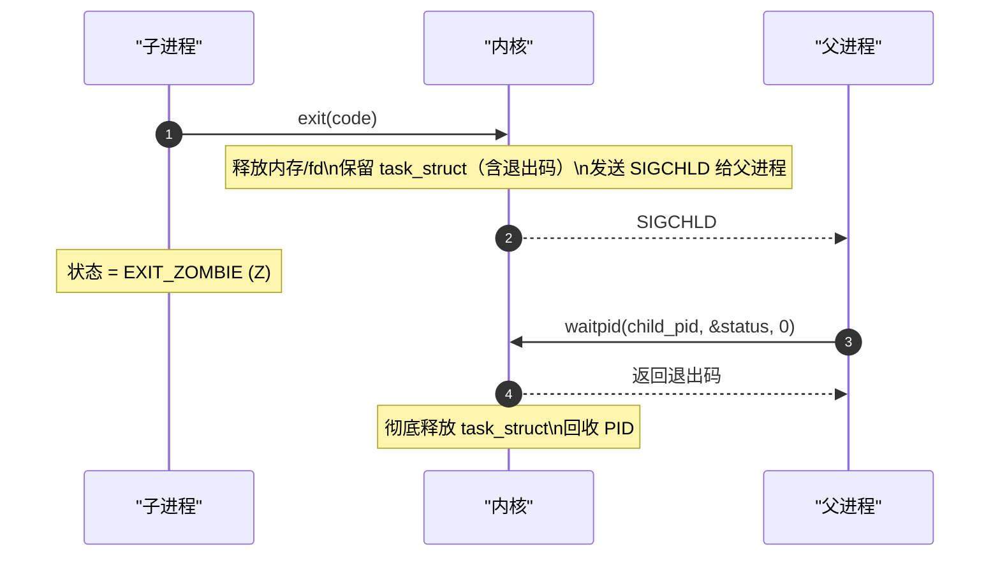
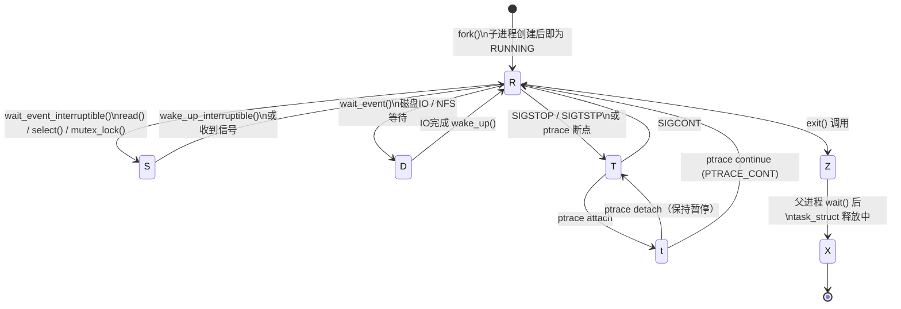

# 进程状态管理

> [!note]
> **Ref:** [`sdk/Linux-4.9.88/include/linux/sched.h`](../../../sdk/100ask_imx6ull-sdk/Linux-4.9.88/include/linux/sched.h), [`note/虚拟化/程序和进程/01-进程控制块：task_struct-的解剖.md`](./01-进程控制块：task_struct-的解剖.md)

## 1. 状态字段在 task_struct 中的位置

```c
/* include/linux/sched.h */
struct task_struct {
    volatile long   state;      /* 当前状态，-1=不可运行，0=可运行，>0=停止 */
    int             exit_state; /* 退出状态：EXIT_ZOMBIE / EXIT_DEAD */
    /* ... */
};
```

`state` 用**位掩码**表示，核心定义：

```c
#define TASK_RUNNING            0
#define TASK_INTERRUPTIBLE      1
#define TASK_UNINTERRUPTIBLE    2
#define __TASK_STOPPED          4
#define __TASK_TRACED           8
/* exit_state 字段 */
#define EXIT_ZOMBIE             16
#define EXIT_DEAD               32
```

---

## 2. 状态全览

### TASK_RUNNING（R）— 运行 / 就绪

进程正在 CPU 上执行，**或**已就绪挂在调度器 runqueue 中等待分配 CPU。

> Linux 将教科书的「运行」和「就绪」**合并为同一状态**，区分方式是看是否是 `current`（当前 CPU 正在执行的进程）。

---

### TASK_INTERRUPTIBLE（S）— 可中断睡眠

进程在等待某个条件，挂在 `wait_queue_head_t` 上，**可以被信号打断**。

- 条件满足（如数据到达、锁可用）→ `wake_up_interruptible()` → 转为 **R**
- 收到信号 → 提前唤醒，ISR 处理后可能退出等待

```c
/* 内核实现：进程主动睡眠 */
wait_event_interruptible(wq, condition);
/* 本质：设置 state = TASK_INTERRUPTIBLE → schedule() → 让出CPU */
```

> `ps` 显示 `S`，是系统中**最常见**的睡眠状态。`sleep`、`read()`、`select()` 等均产生此状态。

---

### TASK_UNINTERRUPTIBLE（D）— 不可中断睡眠

进程等待**不可撤销的内核操作**（磁盘 IO、NFS 应答、内核互斥），**信号无法打断**，`kill -9` 也无效。

- 设计目的：保证内核与硬件交互的原子性，防止数据结构破坏
- 操作完成后由内核 `wake_up()` 直接转为 **R**
- 超时或 IO 错误后内核也会转出

> `ps` 显示 `D`。系统中大量 D 状态进程是 **IO 瓶颈或内核死锁**的直接信号。

---

### TASK_STOPPED（T）— 暂停

进程被**信号显式暂停**，不在 runqueue 中，不消耗 CPU。

| 触发信号 | 恢复信号 |
|----------|----------|
| `SIGSTOP`（不可忽略）| `SIGCONT` |
| `SIGTSTP`（终端 Ctrl+Z，可忽略）| `SIGCONT` |

```bash
kill -STOP <pid>   # 暂停进程
kill -CONT <pid>   # 恢复进程
```

---

### TASK_TRACED（t）— 被调试追踪

进程被 `ptrace()` 附加（如 gdb、strace），每次触发调试事件（断点、syscall 入口/出口）后暂停，等待调试器继续指令。

```bash
gdb -p <pid>       # attach 后进程进入 t 状态
strace -p <pid>    # 每个 syscall 前后短暂 t 状态
```

---

### EXIT_ZOMBIE（Z）— 僵尸

进程已调用 `exit()`，内核已回收其内存和文件描述符，但 **`task_struct` 仍保留**，等待父进程通过 `wait()` / `waitpid()` 读取退出码。



**危害：** Z 状态本身不占 CPU 和内存，但**占用 PID**。系统 PID 上限（`/proc/sys/kernel/pid_max`，默认 32768）耗尽后无法创建新进程。

**根因：** 父进程有 bug，未调用 `wait()` 回收子进程。

**处置：**

```bash
# 1. 找到僵尸进程的父进程
ps -o ppid= -p <zombie_pid>
# 2. 发送 SIGCHLD 提示父进程回收
kill -CHLD <parent_pid>
# 3. 若父进程本身已退出，僵尸会被 init(PID=1) 自动接管并回收
# 4. 最终手段：kill 父进程，init 接管回收
```

---

### EXIT_DEAD（X）— 死亡

父进程已调用 `wait()`，`task_struct` 正在被彻底释放的瞬态。持续时间极短，几乎无法在 `ps` 中观察到。

---

## 3. 状态转换全景



---

## 4. `ps` / `top` 状态字母速查

```bash
ps aux     # STAT 列
top        # S 列
```

| 字母 | 内核宏 | 含义 |
|------|--------|------|
| `R` | `TASK_RUNNING` | 运行或就绪 |
| `S` | `TASK_INTERRUPTIBLE` | 可中断睡眠（正常）|
| `D` | `TASK_UNINTERRUPTIBLE` | 不可中断睡眠（IO/内核等待）|
| `T` | `__TASK_STOPPED` | 被信号暂停 |
| `t` | `__TASK_TRACED` | 被调试器追踪 |
| `Z` | `EXIT_ZOMBIE` | 僵尸（等待父进程回收）|
| `X` | `EXIT_DEAD` | 死亡（瞬态）|
| `I` | `TASK_IDLE` | 空闲内核线程（4.14+）|

**STAT 附加修饰符：**

| 字符 | 含义 |
|------|------|
| `<` | 高优先级（nice < 0）|
| `N` | 低优先级（nice > 0）|
| `s` | session leader（如 bash）|
| `+` | 前台进程组成员 |
| `l` | 多线程（`CLONE_THREAD`）|
| `L` | 页面已锁入内存（`mlock`）|

---

## 5. 内核操作进程状态的 API

驱动/内核代码直接操作 `task_struct.state`：

```c
/* 设置当前进程状态（通常紧跟 schedule() 前）*/
set_current_state(TASK_INTERRUPTIBLE);
set_current_state(TASK_UNINTERRUPTIBLE);

/* 调用 schedule() 真正让出 CPU */
schedule();

/* 唤醒特定进程（设置 state=TASK_RUNNING 并加入 runqueue）*/
wake_up_process(task);        /* 唤醒任意状态的 task */

/* 通过 wait_queue 批量唤醒（驱动最常用）*/
wake_up(&wq_head);                    /* 唤醒 RUNNING + INTERRUPTIBLE */
wake_up_interruptible(&wq_head);      /* 只唤醒 INTERRUPTIBLE */
```

---

## 6. 诊断命令速查

```bash
# 查看所有进程状态
ps aux

# 只看 D 状态进程（定位 IO 瓶颈）
ps aux | awk '$8 ~ /D/ {print}'

# 只看僵尸进程
ps aux | awk '$8 ~ /Z/ {print}'

# 实时监控（top 的 S 列）
top

# 查看某进程的详细状态
cat /proc/<pid>/status | grep -E "State|Pid|PPid"

# 查看进程等待的内核调用栈（D 状态诊断关键）
cat /proc/<pid>/wchan          # 等待在哪个内核函数
cat /proc/<pid>/stack          # 完整内核调用栈（需 CONFIG_STACKTRACE）
```

**`/proc/<pid>/status` 示例输出：**

```
Name:   bash
State:  S (sleeping)          ← 内核状态字符
Pid:    1234
PPid:   1                     ← 父进程 PID
Threads:1
```
