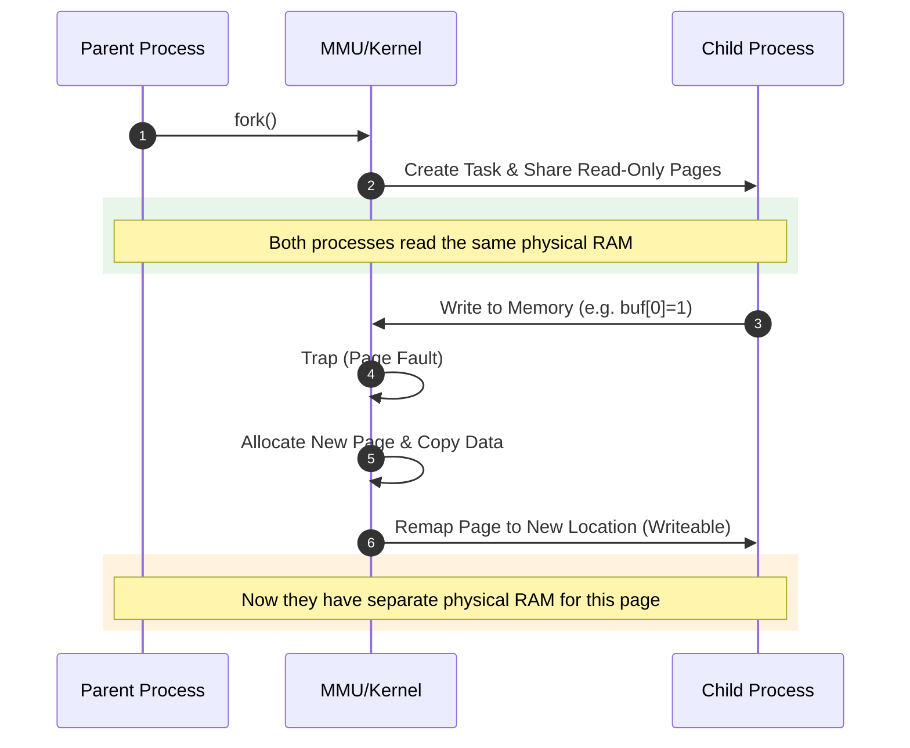

# 进程创建的艺术：fork 与写时拷贝 (COW)

> [!note]
> **Ref:** 内核源码与 demo 实测见 [`note/SysCall/进程API/01-fork-COW优化.md`](../../SysCall/进程API/01-fork-COW优化.md)；本篇聚焦原理与动机。

在 Linux 中，创建进程的代价出奇地低。这得益于一个精妙的设计：**写时拷贝 (Copy-on-Write, COW)**。

## 1. 传统 fork 的痛点 (Naive Fork)

在早期的 Unix 系统中，`fork()` 会完整地复制父进程的所有资源（内存、堆栈、页表等）。
- **效率低下:** 如果父进程占用了 1GB 内存，`fork` 就要拷贝 1GB，极其缓慢。
- **资源浪费:** 绝大多数子进程在 `fork` 之后会立即调用 `exec()` 加载新程序。这意味着刚才辛苦拷贝的 1GB 内存会被立刻丢弃并重新映射。

## 2. 现代 Linux 的解决方案：COW

为了解决上述问题，Linux 引入了 **COW 机制**。其核心思想是：**“只读共享，写时才变”**。

### A. Fork 瞬间：克隆页表而非内存
当 `fork()` 被调用时，内核并不会拷贝物理内存：
1.  **浅拷贝:** 内核只为子进程创建一个新的 `task_struct`，并复制父进程的**页表 (Page Tables)**。
2.  **权限设为只读:** 内核将父子进程的所有物理页面的访问权限都标记为 **只读 (Read-Only)**。
3.  **引用计数:** 这些物理页面被两个进程同时共享。

### B. 触发拷贝：第一次写入
当父进程或子进程尝试修改某个页面（例如写入一个全局变量）时：
1.  **异常触发:** CPU 检测到向“只读页面”写入，触发一个 **缺页异常 (Page Fault)**。
2.  **内核介入:** 内核检查到该页面是被标记为 COW 的共享页面。
3.  **现场拷贝:** 内核申请一个崭新的物理页，将原页面的内容拷贝过去。
4.  **重新映射:** 将发生写入动作的那个进程的页表指向这个新页面，并赋予其**读写权限 (Read-Write)**。

## 3. COW 的巨大优势

1.  **极速启动:** `fork()` 的耗时仅与页表的大小成正比，通常在微秒量级。
2.  **内存节省:** 多个进程运行相同的程序（如多个 `bash` 实例）时，绝大部分只读的代码段（Code Segment）在物理内存中只有一份副本。
3.  **优雅处理 exec:** 如果子进程紧接着执行 `exec()`，旧的共享页表会被直接销毁，没有任何无效的物理内存拷贝发生。

## 4. 驱动开发中的启示

在编写字符设备驱动时，我们通常需要在 `.mmap` 接口中决定是否支持共享。理解 COW 有助于我们理解为何 `copy_to_user` 有时会触发静默的页面分配逻辑。

> [!note]
> **Ref:**
> - Linux Kernel Source: `kernel/fork.c` 中的 `copy_process()`
> - 《Linux内核设计与实现》 第3章 进程管理
