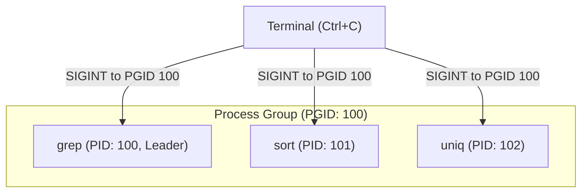

# 控制的边界：进程组与会话

我们在之前讨论了进程的血缘关系（父子进程，PPID）。但这对于操作系统来说还不够。
试想一个场景：你在终端输入了 `cat mylog.txt | grep "error" | sort`，这会产生 3 个平级的子进程。如果你按下 `Ctrl+C`，内核怎么知道要把这 3 个进程全部杀掉，而不是只杀掉某一个？

为了进行**批量管理**和**终端控制**，Linux 引入了比“父子关系”更高维度的组织形式：**进程组 (Process Group)** 和 **会话 (Session)**。

## 1. 进程组 (Process Group): “小团队”

进程组是一个或多个进程的集合。它们通常是为了完成同一个任务而协同工作的。

- **PGID (Process Group ID):** 每个进程组都有一个唯一的 ID。
- **组长 (Group Leader):** 进程组创建时的第一个进程就是组长。组长的 PID 等于该进程组的 PGID。
- **生命周期:** 只要组内还有一个进程存在，这个进程组就存在，与组长是否存活无关。

**核心意义：信号分发**
进程组的最大意义在于**接收信号**。当你使用 `kill -SIGINT -<PGID>`（注意前面的负号），内核会将这个信号群发给该组内的所有进程。这也是 `Ctrl+C` 的底层原理。



## 2. 会话 (Session): “大公司”

会话是比进程组更大的一级组织。一个会话可以包含多个进程组。

当你通过 SSH 登录服务器，或者打开一个终端窗口时，内核就会为你创建一个新的**会话**。

- **SID (Session ID):** 每个会话也有一个唯一的 ID。
- **首进程 (Session Leader):** 创建这个会话的进程（通常是你的 Login Shell，如 bash）。SID 等于首进程的 PID。
- **前台与后台:** 在一个会话中的多个进程组中，只能有一个是**前台进程组 (Foreground Process Group)**，其余都是**后台进程组 (Background Process Group)**。

**前台特权：** 只有前台进程组才能从控制终端（Terminal）读取输入，并接收键盘产生的信号（如 `Ctrl+C` 产生的 SIGINT，`Ctrl+Z` 产生的 SIGTSTP）。如果在 `&` 后台运行的进程尝试读取终端输入，它会被内核发出 `SIGTTIN` 信号并挂起。

## 3. 控制终端 (Controlling Terminal)

会话通常会绑定一个控制终端（如 `/dev/tty1` 或 `/dev/pts/0`）。

**断开连接的灾难 (SIGHUP):**
如果你直接关闭终端窗口或拔掉网线，控制终端就丢失了。此时，内核会向该终端绑定的会话的**首进程（你的 bash）**发送一个 `SIGHUP` (挂断信号)。
由于 bash 通常是其他进程的父进程，bash 退出时会连锁导致会话内的所有进程（包括你在后台运行的程序）都被杀掉。

## 4. 守护进程 (Daemon) 的核心：脱离会话

这也就是为什么我们需要 `nohup` 命令，或者为什么要编写**守护进程 (Daemon)**。

守护进程（如 Web 服务器、系统日志服务）必须在后台默默运行，绝不能因为用户注销或关闭终端而死掉。它的核心实现原理就是**创建一个新的会话，并“自立门户”**。

### 守护进程创建的经典代码模型：
```c
pid_t pid = fork();
if (pid > 0) {
    exit(0); // 1. 父进程先死，子进程变成孤儿，被 init(PID=1) 收养
}

// 2. 子进程调用 setsid()。
// 这会创建一个全新的会话，子进程成为新会话的首进程，新进程组的组长，并且彻底脱离原来的控制终端！
setsid(); 

// 3. 通常会再 fork 一次并让父进程退出。
// 这样可以确保新进程不是会话首进程，从而彻底失去重新打开控制终端的能力。
pid = fork();
if (pid > 0) exit(0); 

// 4. 关闭不需要的文件描述符 (0, 1, 2)
// 5. 改变工作目录到根目录 (chdir("/"))
// 6. 执行核心逻辑...
```

> [!note]
> **Ref:**
> - 《UNIX环境高级编程 (APUE)》第9章 进程关系
> - 终端命令实战: `ps -xj` (查看 PPID, PID, PGID, SID 和 TTY)
