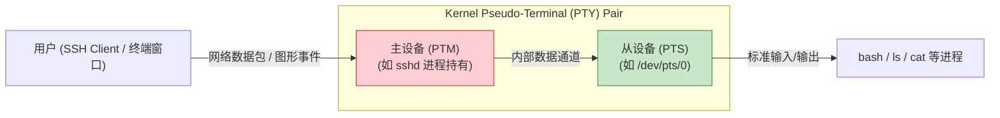

# 终端的虚幻与真实：TTY 与 PTS 详解

当你在终端输入 `tty` 命令时，系统通常会返回类似 `/dev/tty1` 或者 `/dev/pts/0` 的路径。这两个看似相似的名字，背后却代表着两种完全不同的终端实现机制。

## 1. 什么是 TTY？(Teletypewriter)

**TTY** 的全称是 Teletypewriter（电传打字机）。这是一个极具历史感的名字。
在计算机还像房间那么大的年代，操作员通过一根串行线连接一台类似打字机的物理设备来输入指令并打印结果。这根串行线连接的接口，在 Linux 内核中就被抽象成了 `tty` 设备。

### 现代 Linux 中的 TTY
虽然物理打字机没了，但 `tty` 这个名字保留了下来，通常指代**直接连接到系统的物理或虚拟控制台**。
- **`/dev/ttyS0` 等:** 真正的**硬件串口终端**。在嵌入式开发（如 IMX6ULL）中，你通过 USB 转串口线连接板子并打开 SecureCRT/MobaXterm，你登录的通常就是 `/dev/ttySTM1` 或 `/dev/ttymxc0`。
- **`/dev/tty1` 到 `/dev/tty6`:** 这是 Linux 系统提供的**虚拟控制台 (Virtual Console)**。当你直接面对一台装有 Linux 的实体电脑（或虚拟机），通过键盘输入，并在显示器上看到字符界面时，你使用的就是虚拟控制台。你可以通过 `Ctrl+Alt+F1` 到 `F6` 在它们之间切换。

## 2. 什么是 PTS？(Pseudo-Terminal Slave)

**PTS** 的全称是 Pseudo-Terminal Slave（伪终端从设备）。其中的 "P" 代表 Pseudo（伪造的、虚拟的）。

### 为什么需要伪终端？
随着网络的发展，人们不再只坐在物理机器前面操作了，而是通过网络（如 SSH、Telnet）远程登录。此时，用户并没有直接连接物理键盘或显示器。
同时，在现代图形界面（GUI）中，我们打开的终端模拟器（如 WSL 终端、Gnome Terminal、MobaXterm 的 SSH 标签页），它们本身只是一个普通的图形应用程序窗口，**内核怎么知道把这些网络发来的数据或窗口里的输入当成“敲键盘”来处理呢？**

为了解决这个问题，Linux 发明了**伪终端 (Pseudo-Terminal, PTY)** 机制。

### PTY 的“主从”架构
伪终端总是成对出现的：**一个主设备 (PTM, Master) 和一个从设备 (PTS, Slave)**。

1. **主设备 (Master):** 由**终端模拟器软件**或 **SSH 服务端 (sshd)** 打开和控制。它负责接收来自网络或图形界面的原始字节流。
2. **从设备 (Slave, 即 `/dev/pts/X`):** 它的行为表现得**完全像一个真正的硬件 `tty`**。它被分配给你的 Bash Shell，作为它的标准输入（0）、标准输出（1）和标准错误（2），并成为它的**控制终端**。

### 工作流程示例 (SSH 登录)
当你在 Windows 上通过 SSH 连接到 IMX6ULL 或 Ubuntu 时：
1. Linux 上的 `sshd` 服务进程接收到你的连接。
2. `sshd` 请求内核分配一对伪终端。
3. `sshd` 握住 Master 端。
4. `sshd` 启动一个 `bash` 进程，并将这个 `bash` 的输入输出重定向到 Slave 端（例如 `/dev/pts/0`）。
5. 你在 Windows 敲击 `ls`，数据通过网络发给 `sshd`。
6. `sshd` 将 `ls` 写入 Master 端。内核将数据传到 Slave 端（`/dev/pts/0`）。
7. `bash` 从 `/dev/pts/0` 读到了 `ls`，执行命令，并将结果写入 `/dev/pts/0`。
8. 结果通过内核传回 Master 端，`sshd` 读出并打包通过网络发回你的 Windows。

## 3. 核心总结对比

| 特性 | TTY (硬件/虚拟控制台) | PTS (伪终端从设备) |
| :--- | :--- | :--- |
| **全称** | Teletypewriter | Pseudo-Terminal Slave |
| **连接方式** | 直接连接（物理串口线、直连键盘/显示器） | 间接连接（网络 SSH、图形界面终端模拟器） |
| **设备路径** | `/dev/tty1`, `/dev/ttyS0`, `/dev/ttymxc0` | `/dev/pts/0`, `/dev/pts/1` |
| **谁在管理** | 硬件驱动程序 (串口驱动、显卡驱动) | 软件程序 (sshd, Gnome Terminal, tmux) |
| **在 IMX6ULL 中的体现** | 插上 USB 串口线看到的调试终端 | 通过网线 SSH 登录后看到的终端 |

> [!note]
> **Ref:** 
> - 终端命令实战: `tty` (查看当前终端), `w` 或 `who` (查看当前登录的所有用户及其终端类型)
> - 《UNIX环境高级编程 (APUE)》第18章 终端I/O，第19章 伪终端
