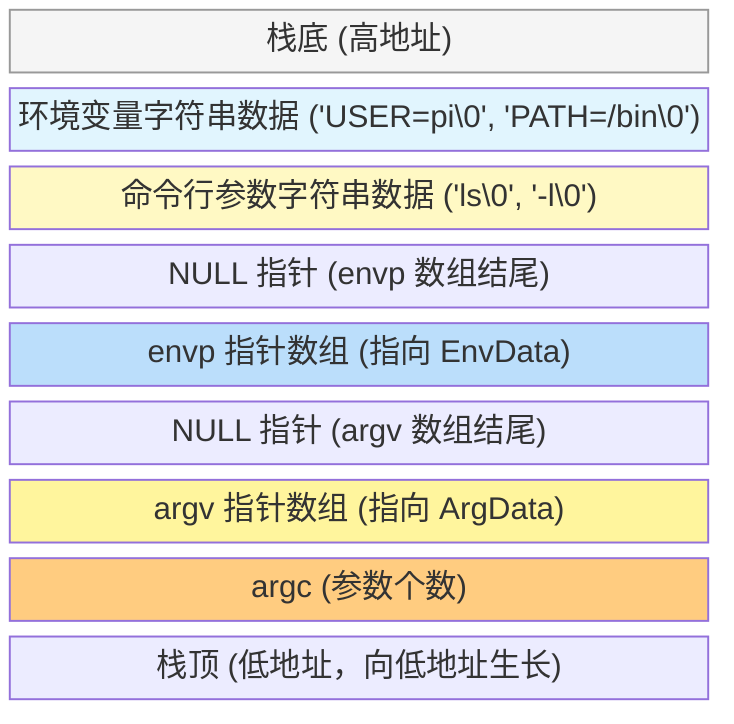

# 执行参数传递：从 exec 到 main

当我们使用 `exec` 族函数启动一个新程序时，旧程序的灵魂被抽离，新程序（ELF 可执行文件）被加载。在这个“夺舍”的瞬间，**参数和环境变量是如何跨越生死，传递给新程序的 `main` 函数的？**

标准 C 语言中，`main` 函数的完整签名是这样的：
```c
int main(int argc, char *argv[], char *envp[]);
```

## 1. argv[0] 的特殊地位：我是谁？

无论是使用 `execl` 还是 `execv`，参数列表的**第一个参数（索引为 0）总是特殊的**。

按照 Unix 的惯例，`argv[0]` 应该包含**当前正在执行的程序的名称**。

### 为什么要有 argv[0]？
因为在 Linux 中，同一个可执行文件可以有多个名字（通过硬链接或软链接）。程序可以通过检查 `argv[0]` 来决定自己的行为。
- **经典案例 (BusyBox):** 你的 IMX6ULL 里的 `/bin/ls` 和 `/bin/cp` 实际上都是指向 `/bin/busybox` 的软链接。当你在终端敲下 `ls` 时，系统最终执行的是 `busybox`，但传入的 `argv[0]` 是 `"ls"`。BusyBox 内部就是通过判断 `argv[0]` 是 `"ls"` 还是 `"cp"`，来执行不同的子功能的。

### exec 时的常见错误
初学者经常写出这样的代码：
```c
// 错误写法：忘记了 argv[0]
execlp("ls", "-l", "-a", NULL); 
```
如果这样写，新程序的 `argv[0]` 会变成 `"-l"`，`argv[1]` 变成 `"-a"`。这会让被调用的程序感到困惑。

**正确写法：** 第一个参数是路径/文件名，第二个参数才是传给新程序的 `argv[0]`（通常约定为程序名本身）。
```c
// 正确写法：第二个 "ls" 就是传给新 main 函数的 argv[0]
execlp("ls", "ls", "-l", "-a", NULL); 
```

## 2. 图解参数传递过程：execve

所有 `exec` 族函数（如 `execl`, `execvp` 等）最终都会调用系统调用 **`execve`**。

```c
int execve(const char *pathname, char *const argv[], char *const envp[]);
```

当内核处理 `execve` 系统调用并准备启动新程序时，它会在新程序的**用户栈（User Stack）的高地址区域**，精心布置这些参数。

### 内存布局示意图 (新程序的初始栈)



1.  **字符串拷贝:** 内核首先将 `execve` 传入的 `argv` 和 `envp` 指向的**字符串内容**，拷贝到新程序的栈空间中。
2.  **构建指针数组:** 内核在栈上构建新的指针数组，让它们指向刚刚拷贝好的字符串。
3.  **计算 argc:** 内核计算出参数的个数，并压入栈中。
4.  **跳转:** 内核将 CPU 的指令指针寄存器（PC/IP）指向新程序的入口点（如 glibc 的 `_start`），并将栈指针寄存器（SP）指向 `argc` 所在的位置。

当 C 库的启动代码（`_start` -> `__libc_start_main`）接管控制权时，它会从栈上取出这些准备好的数据，并作为参数调用我们编写的 `main(argc, argv, envp)`。

## 3. 实战演示：编写一个参数查看器

我们可以写一个简单的 C 程序来验证这个过程。

```c
// my_viewer.c
#include <stdio.h>

int main(int argc, char *argv[], char *envp[]) {
    printf("--- Arguments (argc = %d) ---\n", argc);
    for (int i = 0; i < argc; i++) {
        printf("argv[%d]: %s\n", i, argv[i]);
    }
    
    // argv 数组保证以 NULL 结尾，所以也可以这样遍历：
    // for (char **ptr = argv; *ptr != NULL; ptr++) ...

    printf("\n--- Environment Variables ---\n");
    // 打印前两个环境变量作为演示
    for (int i = 0; i < 2 && envp[i] != NULL; i++) {
        printf("envp[%d]: %s\n", i, envp[i]);
    }

    return 0;
}
```

**如何用 execv 调用它？**

```c
// caller.c
#include <unistd.h>
#include <stdio.h>

int main() {
    // 必须以 NULL 结尾！
    char *args[] = {"fake_name", "arg1", "arg2", NULL};
    
    // 注意：这里我们故意把 argv[0] 传成了 "fake_name"
    execv("./my_viewer", args);
    
    perror("execv failed");
    return 1;
}
```

**预期输出:**
```text
--- Arguments (argc = 3) ---
argv[0]: fake_name
argv[1]: arg1
argv[2]: arg2

--- Environment Variables ---
envp[0]: SHELL=/bin/bash
envp[1]: PWD=/home/pi/imx/prj
```
可以看到，`my_viewer` 完全不知道自己本来的名字是 `./my_viewer`，它只认 `exec` 传给它的 `argv[0]`。

> [!note]
> **Ref:** 
> - 《深入理解计算机系统 (CSAPP)》第 8 章 异常控制流
> - Linux `man 2 execve`
