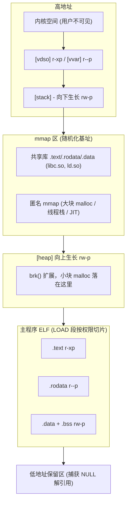

# 进程地址空间全景

> [!note]
> **Ref:**
> - 实测工具与原始数据：[`./demo/README.md`](./demo/README.md)
> - 内核观测接口：`/proc/[pid]/maps`、`/proc/[pid]/mem`
> - 后续主题：[`01-vDSO与vvar.md`](./01-vDSO与vvar.md) · [`02-页表与MMU.md`](./02-进程地址空间-页表与MMU.md) · [`03-虚实之间.md`](./03-虚实之间：MMU的无感与负担.md)

虚拟地址空间 (Virtual Address Space / Virtual Memory Address, **VMA**) 是 Linux 给每个进程的"独占假象"：进程看到的指针是一套从 0 起的虚地址，**内核 + MMU + 页表**联手把它翻译成真实的物理地址。本篇用 [`demo/`](./demo/) 中的实测数据，把 VMA 的**布局结构、权限隔离、随机化、特殊区域**讲清楚，并指出每条线接下来通向哪一篇笔记。

## 1. 实测：一个普通进程到底有什么

`demo/target` 在每个段里"种"一个变量并打印地址，`as_analyzer.py` 把每个地址反查回所属 VMA。完整数据见 [`demo/README.md §3`](./demo/README.md)，下面只摘最关键的对照：

| 种子 | 打印地址 | 反查结果 | VMA 权限 |
|------|---------|----------|----------|
| `plant_text` (函数) | `0x59ce…43b9` | `exe-text`  | `r-xp` |
| `g_rodata_str` (`const char[]`) | `0x59ce…5008` | `exe-rodata` | `r--p` |
| `g_data_init` (全局已初始化) | `0x59ce…7010` | `exe-data` | `rw-p` |
| `g_bss_uninit` (全局未初始化) | `0x59ce…7024` | `exe-data` | `rw-p` |
| `malloc(64)` | `0x59ce…2a0`  | `[heap]`   | `rw-p` |
| `mmap(2MiB)` | `0x7970…0000` | `[anon]`   | `rw-p` |
| `l_stack_var` | `0x7ffd…3bc`  | `[stack]`  | `rw-p` |
| `&printf` | `0x7970…06f0` | `lib-text` (libc.so) | `r-xp` |

24 个 VMA、约 4 MiB 的虚拟内存里，**没有任何一段同时具有 `w` 和 `x`**（`as_analyzer.py --check-wx` 全绿）。这就是后面要讲的两条主线之一：**权限隔离 (W^X)**。

## 2. 布局：VMA 的"地图"

```bash
=== address space of PID 64049 (24 VMAs) ===
         start             end    size  perms  class        path
------------------------------------------------------------------------------------------
  7ffd00565000  7ffd00567000      8K  r-xp  vdso         [vdso]
  7ffd00561000  7ffd00565000     16K  r--p  vvar         [vvar]
  7ffd0043a000  7ffd0045c000    136K  rw-p  stack        [stack]
  ...
  74df92dbd000  74df92e15000    352K  r--p  lib-rodata   .../libc.so.6
  74df92c28000  74df92dbd000      1M  r-xp  lib-text     .../libc.so.6
  74df92c00000  74df92c28000    160K  r--p  lib-rodata   .../libc.so.6
  74df92a00000  74df92c00000      2M  rw-p  anon-rw      [anon]              ← mmap(2MiB)
  556cc2934000  556cc2955000    132K  rw-p  heap         [heap]
  556c9e675000  556c9e676000      4K  rw-p  exe-data     .../target          ← .data + .bss
  556c9e674000  556c9e675000      4K  r--p  exe-rodata   .../target          ← .data.rel.ro
  556c9e673000  556c9e674000      4K  r--p  exe-rodata   .../target          ← .rodata
  556c9e672000  556c9e673000      4K  r-xp  exe-text     .../target          ← .text
  556c9e671000  556c9e672000      4K  r--p  exe-rodata   .../target          ← ELF header
```




几个**反直觉**的点（都在 demo 里被实测验证）：

1. **`.bss` 不是独立 VMA**。`g_bss_uninit` 与 `g_data_init` 落在**同一段** `exe-data`（`0x59ce…7000-…8000`）。链接器把 `.data` 和 `.bss` 合并到同一个 LOAD 段；`.bss` 不占文件大小、由内核清零，但运行时与 `.data` 共享同一个 RW 页。
2. **同一个 ELF 文件被切成 5 段**。`target` 只有 16KB，却出现 5 个不同权限的 VMA：1 个 `r--p` (ELF header)、1 个 `r-xp` (.text)、2 个 `r--p` (.rodata、.data.rel.ro)、1 个 `rw-p` (.data+.bss)。每段权限不同 → 必须各占一个独立 VMA。
3. **`malloc(64)` 在 `[heap]`，`mmap(2MiB)` 不在**。glibc 的策略：分配 ≥ `M_MMAP_THRESHOLD`（默认 128 KiB）直接走 `mmap(MAP_ANON)`，**绕开 `[heap]`**。所以"堆"在 Linux 里指的是 `brk()` 维护的那一块，不是所有动态分配。
4. **共享库出现 ≥7 个段**，其中包括一个 `---p` 的 PROT_NONE guard 页 —— 链接器在 RX 与 RW 段之间留一道"隔离带"防越界写穿到代码。

## 3. 权限隔离：W^X 是怎样落地的

W^X（Write XOR Execute）= "一段内存要么可写要么可执行，永不同时具备"。它不是一条规则，而是**编译器、链接器、内核加载器、MMU** 四层协作的结果：

| 层级 | 责任 |
|------|------|
| 编译器 | 把不同性质的数据放进不同 section（`.text` / `.rodata` / `.data` / `.bss`） |
| 链接器 | 把权限相同的 section 合并到同一个 ELF **LOAD 段**，并给出页对齐 |
| 内核 ELF 加载器 (`load_elf_binary`) | 按 LOAD 段的 `p_flags` 调 `mmap()` 把每段映射进 VMA，并设置正确的 `PROT_*` |
| MMU + 页表 | 每个 PTE 的 R/W/NX 位由内核写入；CPU 执行越权访问时硬件直接发 SIGSEGV |

→ 权限的根在硬件页表，原理细节见 [`02-页表与MMU.md`](./02-进程地址空间-页表与MMU.md) 与 [`03-虚实之间.md`](./03-虚实之间：MMU的无感与负担.md)。

## 4. 随机化：ASLR

把 `target` 跑两遍，所有地址都不一样（demo 里每次 PID 不同时基址全变）。Linux 对 4 类区域**独立**做随机化：

| 区域 | 随机化由谁决定 |
|------|----------------|
| 主程序基址 (PIE) | 内核 `load_elf_binary`（依赖编译时 `-pie`） |
| 共享库 / mmap 区 | 内核 `arch_pick_mmap_layout` |
| `[heap]` 起点 | `brk_randomize` (`/proc/sys/kernel/randomize_va_space`) |
| `[stack]` 顶 | 内核 `setup_arg_pages`，向下随机偏移 |

ASLR 的目的：让攻击者**无法预知**返回地址、libc 函数地址，从而 ROP / ret2libc 类攻击难以构造稳定 payload。

> 验证小技巧：`echo 0 > /proc/sys/kernel/randomize_va_space` 临时关闭 ASLR，重跑 demo 会看到地址完全固定 —— 注意只在排查时使用。

## 5. 两个特殊邻居：`[vvar]` 与 `[vdso]`

demo 在 maps 末尾抓到：

```
7ffdb6eda000  7ffdb6ede000  16K  r--p  vvar   [vvar]
7ffdb6ede000  7ffdb6ee0000   8K  r-xp  vdso   [vdso]
```

并且实测：
```
vDSO  clock_gettime    avg =  28.6 ns/call
raw   syscall(...)     avg = 463.6 ns/call   (×16.2 slower)
```

→ 这两段内存的存在，是为了**让 `clock_gettime` / `gettimeofday` 这类高频系统调用绕过 ring 切换**。`[vvar]` 是内核维护的只读时间快照，`[vdso]` 是一个**完整的 in-memory ELF 共享对象**（demo 实测首 4 字节正是 `7f 45 4c 46`），里面有 `__vdso_clock_gettime` 等符号。glibc 在进程启动时通过 `AT_SYSINFO_EHDR` 辅助向量找到它，把 `clock_gettime` 的实现透明替换。

完整原理、ELF 反汇编步骤、安全性论证 → [`01-vDSO与vvar.md`](./01-vDSO与vvar.md)。

## 6. 由本篇引出的进阶线索

| 线索 | 进阶笔记 |
|------|---------|
| `[vdso]` / `[vvar]` 的内核构造、安全模型、性能数量级 | [`01-vDSO与vvar.md`](./01-vDSO与vvar.md) |
| VA → PA 的硬件翻译过程、ARMv7/v8 多级页表布局 | [`02-页表与MMU.md`](./02-进程地址空间-页表与MMU.md) |
| MMU 在 ISA / OS / App 三个层级各自的"透明度" | [`03-虚实之间.md`](./03-虚实之间：MMU的无感与负担.md) |
| 调试工具（GDB、readelf、objdump、strace） | [`note/devp/debug/`](../../devp/debug/_index.md) |
| `task_struct.mm` 与 VMA 数据结构 | [`../程序和进程/01-进程控制块-task_struct.md`](../程序和进程/01-进程控制块-task_struct.md) |
