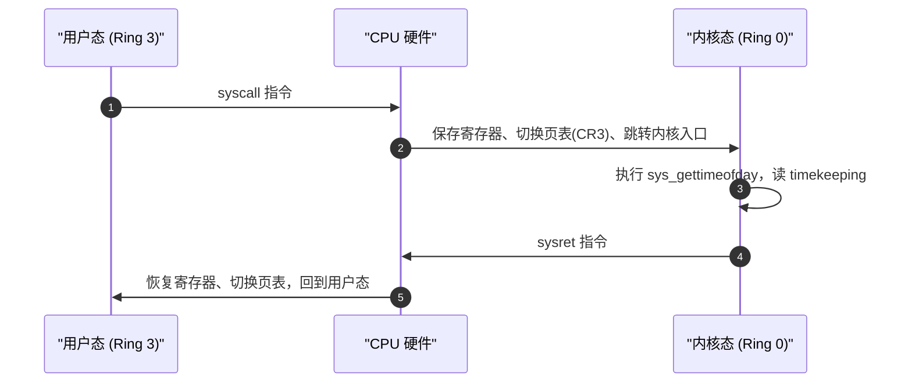
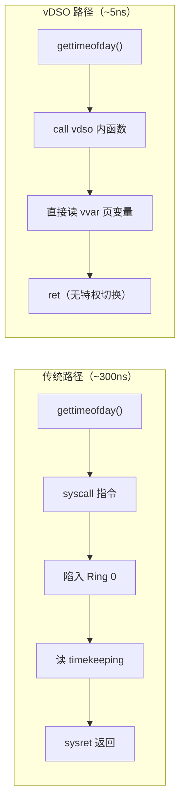

# vDSO 与 vvar：零切换系统调用机制

> [!note]
> **Ref:**
> - 观测入口：`/proc/[pid]/maps` 中的 `[vdso]` 与 `[vvar]` 行
> - 内核源码：`linux/arch/x86/vdso/`、`linux/kernel/time/vsyscall.c`
> - 上级综述：[进程地址空间全景解析](./00-进程地址空间.md)

## 1. 问题起点：系统调用的代价

用户态访问内核服务的标准路径是**系统调用**。以 `gettimeofday()` 为例，完整路径涉及两次特权级切换：



每次切换代价约 **100~500 ns**（含 TLB 刷新、流水线冲刷）。对于每秒百万次调用的 `clock_gettime`，这是不可忽视的开销。

## 2. vDSO 的解法

### 2.1 核心思想

内核在启动时，在自身内存中构造一个微型 ELF 共享库（`vdso.so`），并在每个进程创建时通过 `mmap` **直接映射进用户空间高端**，无需磁盘文件：

```
7ffeaf1dd000-7ffeaf1e1000 r--p   [vvar]   ← 内核持续维护的只读数据页
7ffeaf1e1000-7ffeaf1e3000 r-xp   [vdso]   ← 内核注入的微型共享库（可执行）
```

两个区域**物理页由内核持有**，用户态拿到的只是只读/可执行的映射权限，无法篡改。

### 2.2 两个区域的分工

| 区域 | 权限 | 内容 | 更新者 |
|------|------|------|--------|
| `[vvar]` | `r--p` | 时间戳、CPU 频率、序列号等内核变量的快照 | **内核**（定时写入，用户不可写） |
| `[vdso]` | `r-xp` | 读取 vvar 并返回结果的极简函数（ELF `.text`） | 内核构造，**只读** |

### 2.3 调用路径对比



glibc 在进程启动时通过 `AT_SYSINFO_EHDR` 辅助向量（`auxiliary vector`）获得 vDSO 基址，解析其 ELF 符号表，将 `gettimeofday` 等函数指针重定向到 vDSO 实现。之后所有调用**透明地走快速路径**，调用者无感知。

## 3. 为什么反汇编起始地址看到"乱码"

在 `as_analyzer.py` 的输出中，对 `[vdso]` 起始地址直接反汇编得到：

```
af1e1000:  7f 45   jg  0xaf1e1047   ← 错误：这是 ELF 魔数 \x7fELF
af1e1002:  4c      rex.WR
```

原因：`[vdso]` 不是裸机器码，而是完整的 **ELF 共享对象**，起始字节是 ELF header（`\x7f 'E' 'L' 'F'`），而非 `.text` 段。必须先解析 ELF 结构找到代码段偏移，再反汇编：

```bash
# 1. 从 maps 找到 vDSO 基址，从 /proc/mem dump 出来
sudo dd if=/proc/98562/mem bs=1 skip=$((16#7ffeaf1e1000)) count=8192 of=vdso.so 2>/dev/null

# 2. 验证是合法 ELF
file vdso.so
# → ELF 64-bit LSB shared object, x86-64 ...

# 3. 正确反汇编
objdump -d vdso.so
# 可见 __vdso_gettimeofday、__vdso_clock_gettime 等符号
```

## 4. vDSO 与普通共享库的对比

| 特性 | 普通共享库（`libc.so`） | vDSO |
|------|------------------------|------|
| 来源 | 磁盘 ELF 文件，`mmap` 加载 | 内核运行时在内存中生成，无磁盘文件 |
| 数据来源 | 自身数据段或发起 syscall | `[vvar]` 页（内核直接填充） |
| 特权切换 | 可能触发（如 `malloc` 调用 `brk`） | **绝不触发**（纯用户态读内存） |
| 典型函数 | `printf`, `malloc`, `pthread_*` | `gettimeofday`, `clock_gettime`, `getcpu`, `time` |
| 可被替换 | 可通过 `LD_PRELOAD` 劫持 | 不受 `LD_PRELOAD` 影响，由内核注入 |

## 5. 安全性保证

vDSO 机制在开放"内核代码可在用户态执行"的同时，通过以下方式保证安全：

- **`[vdso]` 只读可执行**：用户态无法修改代码逻辑（`r-xp`，W^X）。
- **`[vvar]` 只读**：用户态只能读取时间等安全变量，无法向内核写入任何状态（`r--p`）。
- **ASLR 随机化基址**：每次运行 vDSO 映射地址随机，防止利用固定地址进行 ROP 攻击。
- **内容由内核完全控制**：vDSO 内容在内核编译时确定，运行时用户不可替换。

## 6. 涉及的 vDSO 函数（x86-64）

| 函数 | 对应 syscall | 加速原理 |
|------|-------------|----------|
| `__vdso_clock_gettime` | `clock_gettime(2)` | 读 vvar 中 `tk_fast_mono` 时间快照 |
| `__vdso_gettimeofday` | `gettimeofday(2)` | 同上，返回 wall clock |
| `__vdso_time` | `time(2)` | 读 vvar 中秒级时间戳 |
| `__vdso_getcpu` | `getcpu(2)` | 读 CPU 本地 `cpu` 和 `node` 编号 |
