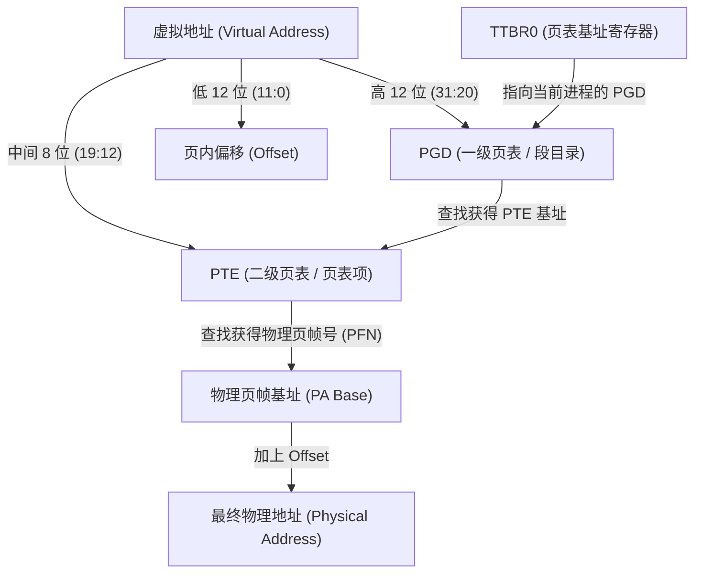

# 进程地址空间-页表与MMU

在系统调用发生时（如执行 `svc #0` 进入 SVC 模式），CPU 虽然获得了最高权限，但它看到的地址空间依然是**虚拟地址（Virtual Address, VA）**。当内核需要读取用户传入的指针（如 `char *buf`）时，必须依靠 **MMU (Memory Management Unit)** 和 **页表 (Page Table)** 将其翻译为真实的 **物理地址 (Physical Address, PA)**。

> [!tip]
>
> REF : 《数字逻辑与计算机体系结构》(黑皮书) ，Part.虚地址
>
> PRE: 
>
> - **TLB**（Translation Lookaside Buffer，地址转换后备缓冲器）是计算机系统中用于加速虚拟地址到物理地址转换的硬件组件。它是一个高速缓存，存储了页表的副本，主要目的是减少地址转换的开销，提高程序的执行效率。当处理器需要进行地址翻译时，TLB会首先检查是否能在其缓存中找到所需的页表项，从而避免访问主存储器，提升性能。

## 1. 为什么需要页表？

**在 Linux 中，每个用户进程都“自以为”拥有完整的 3G（或更大）独立内存空间。**

- **隔离性:** 进程 A 的 `0x12345678` 和进程 B 的 `0x12345678` 映射到不同的物理内存，互不干扰。
- **按需分配:** 用户申请的内存不必是物理连续的，甚至不必立即分配（通过缺页异常 Page Fault 延迟分配）。

## 2. ARMv7 (IMX6ULL) 的两级页表寻址

IMX6ULL 是 32 位处理器，通常采用 4KB 页大小，使用 **两级页表** 进行翻译。

**关键寄存器：**
- **CP15 协处理器中的 TTBR0 (Translation Table Base Register 0):** 当 Linux 调度器切换进程时，会将新进程的 PGD 物理首地址写入 TTBR0 寄存器。MMU 硬件就是通过这个寄存器找到当前进程的“翻译字典”。

## 3. 系统调用中的“跨界取货”：`copy_from_user`

既然内核态能访问全部地址，为什么驱动开发中读取用户数据不能直接用 `memcpy`，而必须用 `copy_from_user` 呢？

### 原因一：权限与合法性校验 (`access_ok`)
内核必须检查用户传来的指针是否真正位于属于用户空间的地址范围（如小于 `PAGE_OFFSET` / 0xC0000000）。如果恶意用户传入了一个内核地址（如 `sys_call_table` 的地址），直接 `memcpy` 会导致内核泄露或被篡改。

### 原因二：应对缺页异常 (Page Fault)
用户空间的内存通常是按需分配的。当系统调用发生时，指针指向的虚拟页可能尚未分配物理页，或者被 Swap 到了磁盘。
- 如果用 `memcpy`：内核在访问未分配的内存时触发异常，直接导致内核崩溃（Kernel Panic / Oops）。
- 如果用 `copy_from_user`：内核有一套特殊的**异常修正机制 (Exception Fixup)**。当触发缺页时，内核知道这是“预期内的风险”，会挂起当前操作，先去分配物理页并更新页表，然后再回来继续拷贝。

## 4. 横向视野：64 位架构的双页表机制 (ARMv8 / x86_64)

在 32 位的 ARMv7 中，内核空间和用户空间共用一个 TTBR0 寄存器（或者通过内核页表共享映射）。当进程切换时，整个地址空间的上下文都跟着切换。

到了 64 位（如 RK3568 ARMv8-A 或 x86_64），由于地址空间出现了巨大的“鸿沟”（见前篇笔记），硬件上直接引入了**双页表基址寄存器**：

- **ARMv8:**
  - `TTBR0_EL1`: 负责翻译低地址部分（User Space）。
  - `TTBR1_EL1`: 负责翻译高地址部分（Kernel Space）。
- **x86_64:** (虽然只有 CR3，但在 KPTI 开启后，拥有两套页表切换逻辑)

**优势：**
1. **进程切换更快:** 切换进程时，只需更新 `TTBR0`（换用户字典），`TTBR1`（内核字典）永远不需要变，因为所有进程共享同一个内核空间。
2. **TLB 效率高:** 硬件很容易区分哪些 TLB 缓存是内核的（全局有效），哪些是用户的（带 ASID，进程专属），极大地提高了翻译缓存的命中率。

## 5. 小结

在系统调用的上下文中，**MMU 是硬件红绿灯，页表是通行规则**。
系统调用进入内核态后，CPU 特权级变高，但 MMU 依然在根据当前进程的页表工作。内核通过 `copy_from_user` / `copy_to_user` 在 MMU 的庇护与限制下，安全地完成用户态与内核态的数据穿梭。
