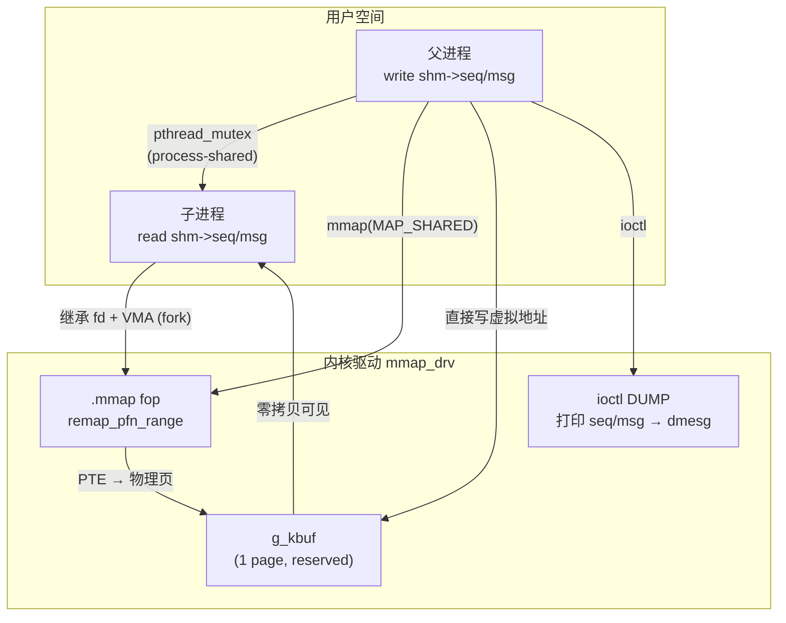

# mmap IPC — 驱动接口与跨进程同步

> [!note]
> **Ref:** [`prj/02_mmap_drv/`](../../../../prj/02_mmap_drv/), Linux kernel `mm/memory.c` (`remap_pfn_range`), `man 2 mmap`, `man 3 pthread_mutexattr_setpshared`

## 整体架构



---

## 一、驱动侧：缓冲区分配与 mmap fop

### 为何用 `__get_free_page` 而非 `kmalloc`

| | `kmalloc` | `__get_free_page` |
|---|---|---|
| 对齐 | 不保证页对齐 | 保证页对齐 |
| 物理连续 | ≤ PAGE_SIZE 时是 | 是 |
| `remap_pfn_range` | 需额外对齐确认 | 直接取 PFN |

```c
// driver_main.c
g_kbuf = (void *)__get_free_page(GFP_KERNEL);
SetPageReserved(virt_to_page(g_kbuf));   // 防止内核回收/swap
```

`SetPageReserved` 是关键：它在 `struct page` 中设置 `PG_reserved` 标志，告知内存管理子系统该页正被用于特殊映射，不得回收。

### remap_pfn_range 调用链

```
mmap(2) 系统调用
  └─ do_mmap()              // mm/mmap.c：建立 VMA
       └─ mmap_region()
            └─ call_mmap()  // 调用驱动 .mmap 回调
                 └─ mmap_drv_mmap()
                      └─ remap_pfn_range()   // mm/memory.c
                           └─ 遍历 [vm_start, vm_end)
                                └─ 填充 PTE → 指向 g_kbuf 物理页
```

```c
// driver_fops.c
static int mmap_drv_mmap(struct file *file, struct vm_area_struct *vma)
{
    unsigned long pfn = virt_to_phys(g_kbuf) >> PAGE_SHIFT;
    return remap_pfn_range(vma, vma->vm_start, pfn,
                           vma->vm_end - vma->vm_start,
                           vma->vm_page_prot);
}
```

映射建立后，用户对虚拟地址的读写**直接落在 `g_kbuf` 的物理页**，无任何内核拷贝。

---

## 二、用户侧：PTHREAD_PROCESS_SHARED mutex

### 共享区域布局

```c
typedef struct {
    int             seq;        // [0..3]   写计数
    char            msg[256];   // [4..259] payload
    int             _pad;       // [260..263] 对齐到 8 字节
    pthread_mutex_t lock;       // [264+]  跨进程 mutex
} SharedRegion;                 // 总 < 4096，在驱动的 PAGE_SIZE 缓冲区内
```

> **关键约束**：`pthread_mutex_t` 必须位于共享内存（同一物理页）中，不能在进程私有堆上。

### 初始化（fork 前执行一次）

```c
pthread_mutexattr_t attr;
pthread_mutexattr_init(&attr);
pthread_mutexattr_setpshared(&attr, PTHREAD_PROCESS_SHARED);
pthread_mutex_init(&shm->lock, &attr);
```

### 为何跨进程 mutex 能工作：futex 物理地址键

```
进程A 虚拟地址: 0x7f00_1000  ──┐
                                ├─ 同一物理页帧 (PFN)
进程B 虚拟地址: 0x7e80_3000  ──┘

futex(FUTEX_WAIT, uaddr) 内核路径：
  get_futex_key(uaddr)
    └─ follow_pfnmap_pte() / page_to_pfn()
         └─ 以 struct page * 作为 key，与虚拟地址无关
```

两个进程的 `shm->lock` 虚拟地址不同，但 `futex` 通过物理页帧识别同一锁，从而正确实现跨进程等待队列。

---

## 三、ioctl DUMP：零拷贝的证明

```c
// driver_fops.c
case MMAP_DRV_IOC_DUMP:
    printk("seq=%d msg='%.64s'\n", *(int*)g_kbuf, (char*)g_kbuf + 4);
```

内核从 `g_kbuf` 直接读出用户进程写入的数据，**整个通信路径没有 `read()`/`write()` 系统调用**：

```
用户写 shm->msg  →  写入物理页
内核读 g_kbuf    →  读同一物理页
```

---

## 四、部署到 i.MX6ULL

```bash
# 主机构建
source imx-env.sh
cd prj/02_mmap_drv
make

ssh imx && mount -a && cd/mnt

# 板上运行
insmod mmap_drv.ko
./mmap_drv_test
dmesg | tail -20    # 查看 kernel DUMP 输出
rmmod mmap_drv
```

### 预期输出

```
[parent pid=312   ] mmap OK at 0xb6f52000
[parent pid=312   ] wrote seq=1
[child  pid=313   ] read  seq=1  msg='hello from parent, round 1'
[parent pid=312   ] wrote seq=2
[child  pid=313   ] read  seq=2  msg='hello from parent, round 2'
...
[parent] triggering MMAP_DRV_IOC_DUMP → check dmesg

# dmesg:
mmap_drv [kernel view] seq=5 msg='hello from parent, round 5'
```

---

## 五、关键陷阱

| 陷阱 | 原因 | 解决 |
|------|------|------|
| mutex 放在私有堆 | futex key 不同，跨进程无效 | 放入 mmap 共享区 |
| 忘记 `SetPageReserved` | 物理页可能被 swap/回收 | `__get_free_page` + `SetPageReserved` |
| rmmod 时忘记 `ClearPageReserved` | 内存泄漏 | `module_exit` 中配对清除 |
| MAP_PRIVATE 误用 | COW：写操作不共享 | IPC 必须用 `MAP_SHARED` |
| 不同架构的 mutex 大小 | `sizeof(pthread_mutex_t)` 因 ABI 而异 | 用 `offsetof` 验证 layout |
