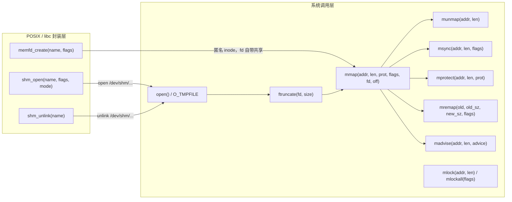
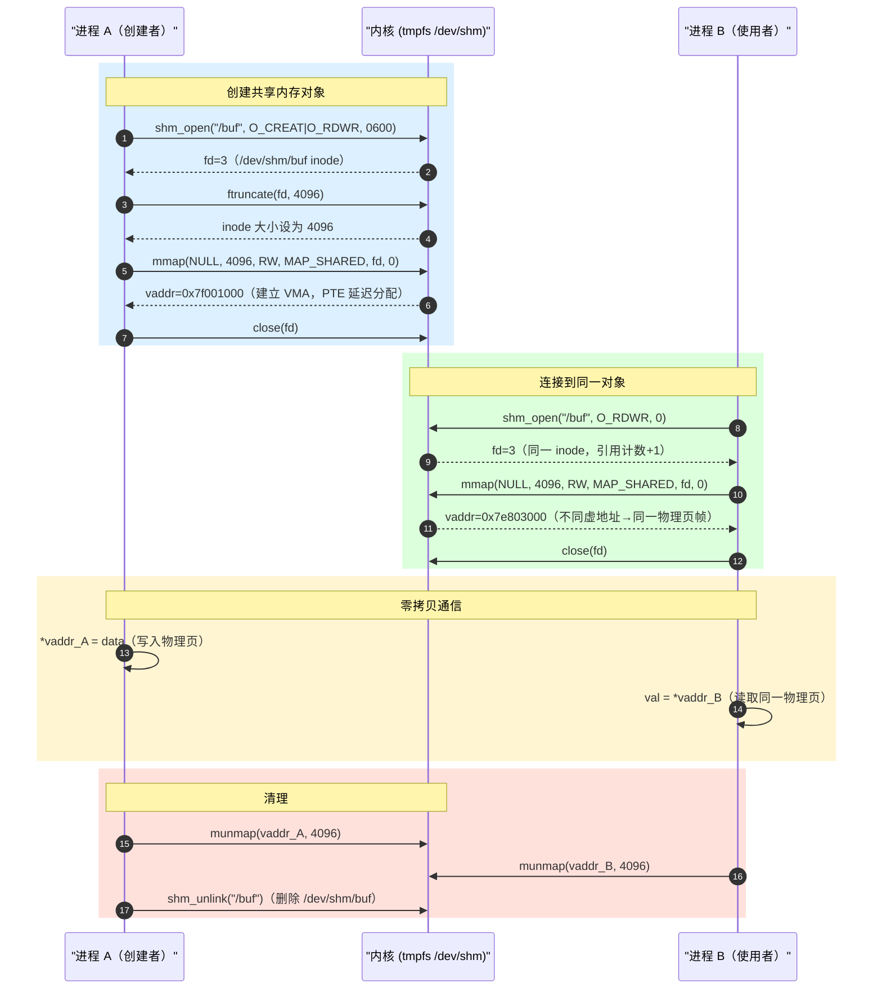
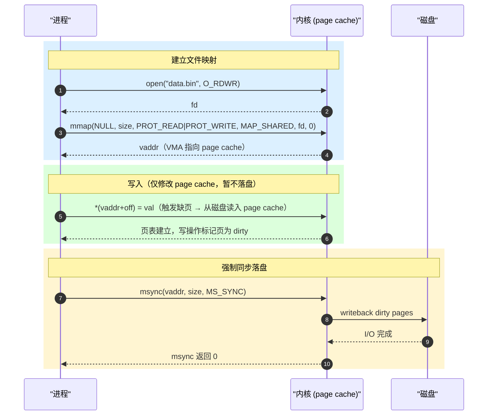

# mmap API 全景矩阵：系统调用层 vs POSIX 封装层

> [!note]
> **Ref:** `man 2 mmap` · `man 2 msync` · `man 3 shm_open` · `man 2 memfd_create` · [`note/虚拟化/进程通信IPC/mmap/00-driver-mmap-and-sync.md`](./00-driver-mmap-and-sync.md)

---

## 全景：两层架构



> **核心结论**：POSIX 封装层（`shm_open`/`memfd_create`）只负责创建"文件描述符作为共享内存对象的句柄"；真正的地址空间映射始终由 `mmap` 系统调用完成。

---

## 一、系统调用层

### 1.1 `mmap` — 映射核心

```c
#include <sys/mman.h>

void *mmap(void   *addr,    // 建议起始地址，NULL 让内核自选
           size_t  length,  // 映射长度（字节）
           int     prot,    // 页面权限
           int     flags,   // 映射类型与行为
           int     fd,      // 文件描述符（匿名映射传 -1）
           off_t   offset); // 文件偏移（需 PAGE_SIZE 对齐）
// 成功返回映射地址，失败返回 MAP_FAILED((void *)-1)
```

#### `prot` — 页面权限位

| 常量 | 含义 |
|------|------|
| `PROT_READ`  | 页面可读 |
| `PROT_WRITE` | 页面可写 |
| `PROT_EXEC`  | 页面可执行（JIT 场景） |
| `PROT_NONE`  | 不可访问（常用于 guard page） |

权限不能超过文件打开标志：只读打开的 fd 无法 `PROT_WRITE | MAP_SHARED`。

#### `flags` — 映射类型（必选其一 + 可选修饰）

| 常量 | 分类 | 含义 |
|------|------|------|
| `MAP_SHARED`  | 必选 | 写操作直接反映到底层文件/共享物理页，其他进程可见 |
| `MAP_PRIVATE` | 必选 | 写时拷贝（COW）：写操作产生私有副本，不影响原文件 |
| `MAP_ANONYMOUS` | 修饰 | 匿名映射，不关联文件，fd 必须为 -1，offset 为 0 |
| `MAP_FIXED`   | 修饰 | 强制从 addr 开始映射，已存在映射会被覆盖（**危险**） |
| `MAP_FIXED_NOREPLACE` | 修饰 | 同上但若 addr 已被占用则失败，Linux 4.17+ |
| `MAP_LOCKED`  | 修饰 | 同 `mlock()`，禁止 swap |
| `MAP_POPULATE` | 修饰 | 预填充页表（预触发 page fault），减少后续访问延迟 |
| `MAP_HUGETLB` | 修饰 | 使用大页（`/proc/sys/vm/nr_hugepages` 控制） |
| `MAP_NORESERVE` | 修饰 | 不预留 swap 空间（内存不足时可能 SIGBUS） |

**匿名共享内存惯用模式（fork IPC）：**

```c
// fork 前父进程建立共享匿名映射
void *shm = mmap(NULL, PAGE_SIZE,
                 PROT_READ | PROT_WRITE,
                 MAP_SHARED | MAP_ANONYMOUS,
                 -1, 0);
// fork 后父子共享同一物理页，无需文件
pid_t pid = fork();
```

---

### 1.2 `munmap` — 解除映射

```c
int munmap(void *addr, size_t length);
// addr 必须是 PAGE_SIZE 对齐的映射起始地址
// 可以只解除映射的一部分，内核会拆分 VMA
```

**关键行为：**
- 进程退出时内核自动解除所有映射，但**不保证 msync**，文件映射的脏页可能未刷回
- `munmap` 不关闭 fd，fd 是独立的引用计数

---

### 1.3 `msync` — 将内存同步到文件

```c
int msync(void *addr, size_t length, int flags);
```

| `flags` | 含义 |
|---------|------|
| `MS_SYNC`  | 同步写：等待 I/O 完成后返回 |
| `MS_ASYNC` | 异步写：仅标记脏页，立即返回，内核后台刷写 |
| `MS_INVALIDATE` | 使映射失效，强制下次访问从文件重新读 |

> **何时必须 msync：** `MAP_SHARED` 文件映射，在进程崩溃或文件共享场景下，依赖内核 pdflush 并不可靠。数据库（如 SQLite WAL 模式）必须在 `fsync` 前先 `msync(MS_SYNC)` 确保 mmap 脏页落盘。

---

### 1.4 `mprotect` — 动态修改页面权限

```c
#include <sys/mman.h>

int mprotect(void *addr, size_t len, int prot);
// addr 必须页对齐
```

**典型用途：**

```c
// JIT 编译器两阶段映射
void *buf = mmap(NULL, size, PROT_READ | PROT_WRITE,
                 MAP_PRIVATE | MAP_ANONYMOUS, -1, 0);
// ... 写入机器码 ...
mprotect(buf, size, PROT_READ | PROT_EXEC); // 改为可执行（W^X 策略）
```

```c
// guard page：在栈末尾插入不可访问页，捕获栈溢出
mprotect(stack_bottom, PAGE_SIZE, PROT_NONE);
// 越界访问 → SIGSEGV（而非悄悄踩内存）
```

---

### 1.5 `mremap` — 重新调整映射大小/位置

```c
#define _GNU_SOURCE
#include <sys/mman.h>

void *mremap(void *old_address, size_t old_size,
             size_t new_size, int flags, .../* void *new_address */);
```

| `flags` | 含义 |
|---------|------|
| `MAYMOVE` | 若原地无法扩展，允许移动到新地址 |
| `FIXED`   | 配合 `new_address` 强制移动到指定地址 |

`mremap` 是 `realloc` 在内核 VMA 层的对应物，避免了 `munmap + mmap` 的两步操作（期间地址失效窗口）。

---

### 1.6 `madvise` — 告知内核使用模式

```c
int madvise(void *addr, size_t length, int advice);
```

| `advice` | 含义 | 典型场景 |
|----------|------|---------|
| `MADV_NORMAL`   | 默认预读策略 | — |
| `MADV_SEQUENTIAL` | 顺序访问，激进预读 | 文件扫描、流处理 |
| `MADV_RANDOM`   | 随机访问，禁止预读 | 数据库随机 I/O |
| `MADV_WILLNEED` | 即将访问，提前预取 | 启动前预热 |
| `MADV_DONTNEED` | 不再需要，释放物理页（但 VMA 保留） | 缓存清理 |
| `MADV_FREE`     | 页可被回收，内容可能丢失（Linux 4.5+） | 内存分配器归还 |
| `MADV_HUGEPAGE` | 请求 THP 大页折叠 | NUMA 大数据 |
| `MADV_DONTFORK` | fork 后子进程不继承该映射 | GPU 驱动私有内存 |

---

### 1.7 `mlock` / `mlockall` — 锁定物理页

```c
#include <sys/mman.h>

int mlock(const void *addr, size_t len);    // 锁定指定范围
int mlock2(const void *addr, size_t len, unsigned int flags); // Linux 4.4+
int mlockall(int flags);                    // 锁定进程所有映射
// flags: MCL_CURRENT (已有页) | MCL_FUTURE (将来分配) | MCL_ONFAULT (首次缺页时锁)
int munlock(const void *addr, size_t len);
int munlockall(void);
```

需要 `CAP_IPC_LOCK` 权限或 `/etc/security/limits.conf` 中 `memlock` 配额。嵌入式实时系统（Xenomai、PREEMPT_RT）常用 `mlockall(MCL_CURRENT|MCL_FUTURE)` 消除 page fault 抖动。

---

## 二、POSIX / libc 封装层

### 2.1 `shm_open` / `shm_unlink` — POSIX 共享内存对象

```c
#include <sys/mman.h>
#include <fcntl.h>
#include <sys/stat.h>

int shm_open(const char *name, int oflag, mode_t mode);
// name: "/my_shm"（以 / 开头，不含二级目录）
// 实际创建 /dev/shm/my_shm（tmpfs）

int shm_unlink(const char *name);
// 链接: -lrt
```

**完整生命周期：**

```c
// 创建者
int fd = shm_open("/ipc_buf", O_CREAT | O_RDWR, 0600);
ftruncate(fd, sizeof(SharedData));           // 设置大小（必须）
void *p = mmap(NULL, sizeof(SharedData),
               PROT_READ | PROT_WRITE, MAP_SHARED, fd, 0);
close(fd);  // fd 可以关掉，映射已建立

// 使用完毕
munmap(p, sizeof(SharedData));
shm_unlink("/ipc_buf");  // 删除 /dev/shm 中的文件对象
```

```c
// 连接者（另一个进程）
int fd = shm_open("/ipc_buf", O_RDWR, 0);
void *p = mmap(NULL, sizeof(SharedData),
               PROT_READ | PROT_WRITE, MAP_SHARED, fd, 0);
close(fd);
```

> **与 `MAP_ANONYMOUS | MAP_SHARED` 的区别：** 匿名共享映射只能通过 `fork` 继承给子进程；`shm_open` 创建的对象可以被任意不相关的进程通过名字打开。

---

### 2.2 `memfd_create` — 匿名内存文件（无名但可共享）

```c
#define _GNU_SOURCE
#include <sys/memfd.h>

int memfd_create(const char *name, unsigned int flags);
// name: 仅用于调试（/proc/self/fd/ 中显示），不创建文件系统对象
// flags: MFD_CLOEXEC | MFD_ALLOW_SEALING
```

```c
int fd = memfd_create("shm_buf", MFD_CLOEXEC);
ftruncate(fd, PAGE_SIZE);
void *p = mmap(NULL, PAGE_SIZE, PROT_READ | PROT_WRITE, MAP_SHARED, fd, 0);

// 通过 SCM_RIGHTS 跨进程传递 fd（Unix socket sendmsg）
// 接收方 mmap 同一 fd → 共享同一物理页
```

**与 `shm_open` 对比：**

| 特性 | `shm_open` | `memfd_create` |
|------|-----------|----------------|
| 文件系统可见性 | `/dev/shm/name`（持久到 unlink） | 无（匿名 inode） |
| 进程无关共享 | 按名字打开即可 | 需通过 fd 传递（`sendmsg`） |
| 文件封印（Sealing） | 不支持 | `MFD_ALLOW_SEALING` + `fcntl(F_ADD_SEALS)` |
| 适用场景 | 简单命名 IPC | seccomp 沙盒、Wayland buffer 共享 |

---

## 三、典型调用链序列图

### 场景 A：`shm_open` 跨进程共享



### 场景 B：文件 mmap + msync 落盘



---

## 四、API 速查表

### 系统调用层

| 函数 | 头文件 | 用途 |
|------|--------|------|
| `mmap(addr, len, prot, flags, fd, off)` | `sys/mman.h` | 建立内存映射（核心） |
| `munmap(addr, len)` | `sys/mman.h` | 解除映射 |
| `msync(addr, len, flags)` | `sys/mman.h` | 脏页回写文件 |
| `mprotect(addr, len, prot)` | `sys/mman.h` | 动态修改页面权限 |
| `mremap(old, old_sz, new_sz, flags)` | `sys/mman.h` | 重调映射大小/位置 |
| `madvise(addr, len, advice)` | `sys/mman.h` | 访问模式提示 |
| `mlock(addr, len)` | `sys/mman.h` | 锁定物理页（防 swap） |
| `mlockall(flags)` | `sys/mman.h` | 锁定进程全部映射 |
| `ftruncate(fd, size)` | `unistd.h` | 设置文件/shm 对象大小 |

### POSIX / libc 封装层

| 函数 | 头文件 | 链接 | 底层 | 用途 |
|------|--------|------|------|------|
| `shm_open(name, flags, mode)` | `sys/mman.h` | `-lrt` | `open /dev/shm/...` | 创建/打开命名共享内存对象 |
| `shm_unlink(name)` | `sys/mman.h` | `-lrt` | `unlink /dev/shm/...` | 删除共享内存对象 |
| `memfd_create(name, flags)` | `sys/memfd.h` | — | 匿名 inode | 创建匿名内存文件（可 sendmsg 传递） |

---

## 五、关键陷阱速查

| 陷阱 | 原因 | 解决 |
|------|------|------|
| `mmap` 后忘记 `ftruncate` | 文件大小为 0，访问触发 `SIGBUS` | `shm_open`/`open` 后必须 `ftruncate` 设置大小 |
| `MAP_PRIVATE` 误用于 IPC | COW 导致写操作各自拷贝，对方不可见 | IPC 必须 `MAP_SHARED` |
| `munmap` 传入非对齐地址 | 内核拒绝，`EINVAL` | 始终保留 `mmap` 返回的原始地址 |
| 文件映射超出文件大小访问 | 访问超出 `st_size` 的页面触发 `SIGBUS` | `mmap` 前确认 `fstat` 或 `ftruncate` |
| `msync` 缺失导致数据丢失 | `MAP_SHARED` 脏页在崩溃时未刷回 | 关键路径必须 `msync(MS_SYNC)` |
| `mmap` 返回值未检查 | `MAP_FAILED` 是 `(void*)-1`，不是 `NULL` | `if (p == MAP_FAILED) { perror... }` |
| `shm_unlink` 忘记调用 | `/dev/shm` 文件残留，重启后仍占用内存 | 创建者退出前 `shm_unlink` |
