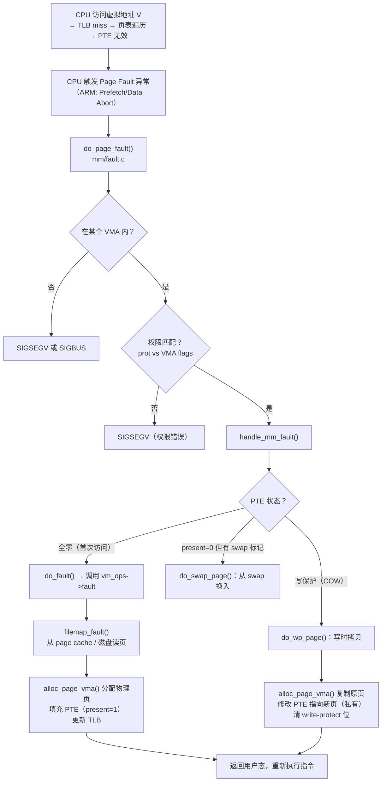
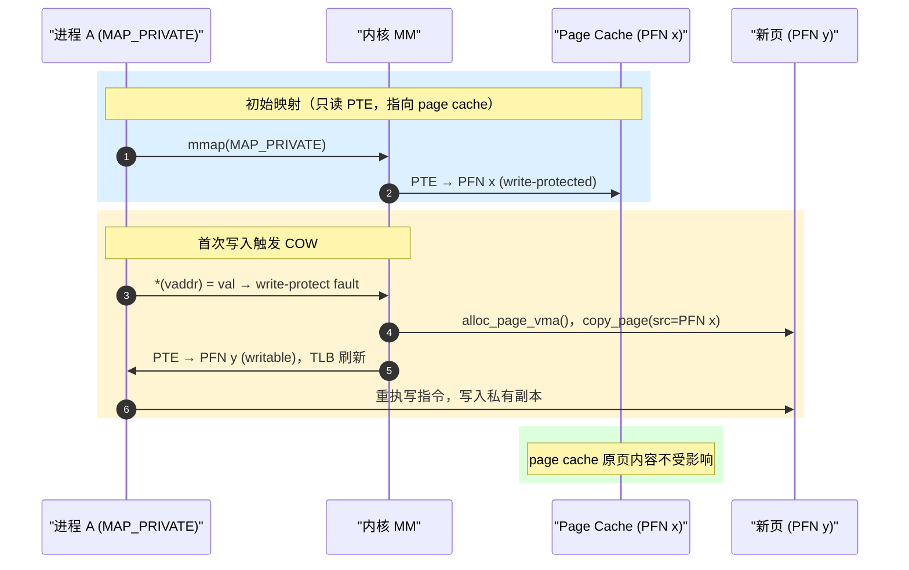
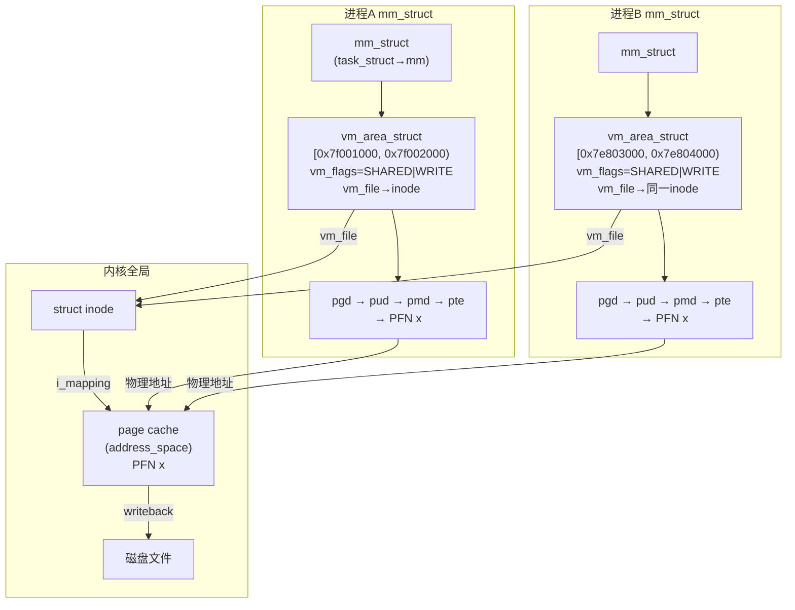

# mmap 内核机制：VMA、缺页异常与 MAP_SHARED vs MAP_PRIVATE

> [!note]
> **Ref:** `mm/mmap.c` · `mm/memory.c` · `mm/filemap.c` · [`note/虚拟化/进程通信IPC/mmap/00-driver-mmap-and-sync.md`](./00-driver-mmap-and-sync.md) · [`note/虚拟化/进程地址空间/02-进程地址空间-页表与MMU.md`](../../进程地址空间/02-进程地址空间-页表与MMU.md)

---

## 一、VMA（vm_area_struct）：映射的内核描述符

每次成功的 `mmap` 调用都在进程的 `mm_struct` 中插入一个 `vm_area_struct`（VMA）：

```c
// include/linux/mm_types.h（简化）
struct vm_area_struct {
    unsigned long  vm_start;   // VMA 起始虚拟地址（页对齐）
    unsigned long  vm_end;     // VMA 结束虚拟地址（不含）

    pgprot_t       vm_page_prot; // 页面保护位（对应 prot 参数）
    unsigned long  vm_flags;     // VM_READ | VM_WRITE | VM_EXEC | VM_SHARED ...

    struct file   *vm_file;    // 关联文件（匿名映射为 NULL）
    unsigned long  vm_pgoff;   // 文件内页偏移

    const struct vm_operations_struct *vm_ops; // 缺页/打开/关闭回调
    struct mm_struct *vm_mm;   // 所属进程 mm
};
```

**VMA 树状组织：**

```
mm_struct
  └─ mm_mt (maple tree，Linux 6.1+ 取代红黑树)
      ├─ VMA [0x400000, 0x401000) EXEC  ← .text
      ├─ VMA [0x401000, 0x402000) RO    ← .rodata
      ├─ VMA [0x402000, 0x403000) RW    ← .data/.bss
      ├─ VMA [0x7f001000, 0x7f002000) RW SHARED ← mmap 区域
      └─ VMA [0x7ffd0000, 0x7fff0000) RW ← 栈
```

`mmap` 本身**不分配物理页**，只插入 VMA 描述符；物理内存在首次访问时通过缺页异常按需分配（惰性分配）。

---

## 二、mmap 系统调用内核路径

```
用户态: mmap(addr, len, prot, flags, fd, off)
  │
  ▼ 陷入内核（syscall 入口）
sys_mmap_pgoff()                          // arch/arm/kernel/sys_arm.c
  └─ vm_mmap_pgoff()                      // mm/util.c
       └─ do_mmap()                       // mm/mmap.c
            ├─ 参数合法性检查（对齐、权限、地址空间限制）
            ├─ get_unmapped_area()        // 选择合适的虚拟地址区间
            ├─ mmap_region()             // 核心：创建并插入 VMA
            │    ├─ vma_merge()          // 尝试与相邻 VMA 合并
            │    ├─ vm_area_alloc()      // 分配新 vm_area_struct
            │    ├─ 设置 vma->vm_file, vm_pgoff, vm_ops
            │    └─ call_mmap(file, vma) // 调用文件/驱动的 .mmap 回调
            │         └─ 文件映射: generic_file_mmap() → 设置 vm_ops
            │            驱动映射: driver_mmap() → remap_pfn_range()
            └─ 返回 vm_start（映射起始虚拟地址）
```

**关键点：** `call_mmap` 之后，驱动可以选择在此时就调用 `remap_pfn_range` 建立 PTE（适用于设备内存/预分配缓冲区），或者依赖 `vm_ops->fault` 在缺页时动态建立（适用于普通文件、匿名映射）。

---

## 三、缺页异常处理流程

用户进程访问 VMA 内尚未建立 PTE 的地址时，CPU 产生缺页异常：



---

## 四、MAP_SHARED vs MAP_PRIVATE：物理页的命运分叉

### 4.1 MAP_SHARED：共享 page cache

```
进程 A 虚拟地址 0x7f001000 ──┐
                              ├── PTE → 同一 page cache 物理页 (PFN x)
进程 B 虚拟地址 0x7e803000 ──┘

写操作：直接修改物理页，page cache 标记 dirty
msync/pdflush：将 dirty 页写回磁盘文件
```

- 任何进程的写操作对其他映射同一文件的进程**立即可见**
- 适用于：IPC 共享缓冲区、数据库文件缓存、设备内存映射

### 4.2 MAP_PRIVATE：写时拷贝（COW）

```
初始状态（映射后、首次写入前）：
进程 A PTE → page cache 物理页 (PFN x) [只读]
进程 B PTE → page cache 物理页 (PFN x) [只读]

进程 A 写入：
  1. 写操作触发写保护缺页（do_wp_page）
  2. 内核分配新物理页 (PFN y)，拷贝原页内容
  3. 修改进程 A 的 PTE → PFN y [可读写]
  4. 进程 B 的 PTE 仍指向 PFN x

写后状态：
进程 A PTE → 私有副本 (PFN y) [RW] ← 仅进程 A 可见
进程 B PTE → 原始页面 (PFN x) [RO] ← 文件内容不受影响
```



---

## 五、fork 后的 VMA 继承与 COW

`fork()` 时内核复制父进程全部 VMA：

```
fork() → copy_mm() → dup_mmap()
  └─ 遍历每个 VMA：
       ├─ 复制 vm_area_struct 到子进程 mm
       ├─ copy_page_range()：将父进程 PTE 拷贝给子进程
       │    └─ 对 MAP_PRIVATE 可写页面：两侧 PTE 均改为只读（COW 标记）
       └─ MAP_SHARED VMA：两进程 PTE 指向同一物理页，均可读写
```

```
fork 后的地址空间示意：

父进程：
  VMA [stack]   PRIVATE → PTE(只读) → 物理页 P  ← COW 待写时复制
  VMA [shm]     SHARED  → PTE(RW)   → 物理页 S  ← 始终共享

子进程（继承）：
  VMA [stack]   PRIVATE → PTE(只读) → 物理页 P  ← 同一页，写时各自拷贝
  VMA [shm]     SHARED  → PTE(RW)   → 物理页 S  ← 同一页，立即可见
```

这解释了为何匿名 `MAP_SHARED` 映射在 `fork` 后可以作为父子进程共享内存：子进程继承了 `MAP_SHARED` VMA，双方 PTE 指向同一页且不设 write-protect。

---

## 六、匿名映射的物理页来源

文件映射的物理页来自 page cache（与文件 inode 关联）；匿名映射的页面来自零页（Zero Page）和匿名页池：

```
首次读访问 → 映射零页（zero_pfn，全局只读的全零页），无需分配
首次写访问 → do_anonymous_page()
              └─ alloc_zeroed_user_highpage_movable()
                   └─ 分配新物理页（已清零）
                        └─ PTE 指向新页
```

这解释了 Linux 的另一个性能优化：`mmap` 分配的匿名内存在首次写之前几乎不消耗物理内存（OOM killer 看到的是 VSZ，而不是 RSS）。

---

## 七、内核关键数据结构关系图



---

## 八、与驱动 `remap_pfn_range` 的对比

| 特性 | 普通文件 mmap | 驱动 `remap_pfn_range` |
|------|-------------|----------------------|
| 物理页来源 | page cache（动态分配） | 驱动预分配的内核页（`__get_free_page`）或设备寄存器物理地址 |
| 缺页时机 | 惰性：首次访问触发 `vm_ops->fault` | 立即：`mmap` 回调中直接填充 PTE |
| MAP_SHARED 语义 | 写操作回写文件 | 写操作直接到驱动缓冲区，不经过文件系统 |
| MAP_PRIVATE 支持 | 支持 COW | 通常不支持（设备内存无法 COW） |
| `msync` 效果 | 触发文件 writeback | 无意义（驱动内存不在 page cache） |

详见 [`00-driver-mmap-and-sync.md`](./00-driver-mmap-and-sync.md) 中的 `remap_pfn_range` 调用链分析。
