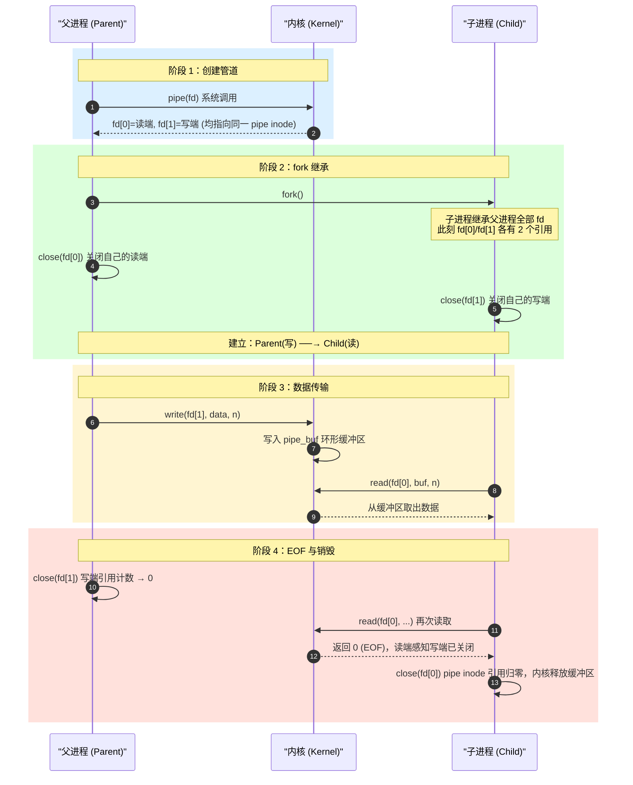

# 管道 (Pipe) 概念与生命周期

> [!note]
> **Ref:** `pipe(7)` man page · `note/虚拟化/程序和进程/04-进程生命周期管理` · `note/虚拟化/进程地址空间/00-进程地址空间.md`

管道是内核在 pipefs 伪文件系统中维护的有限环形缓冲区，通过两个 fd 暴露给进程：

四个关键属性：单向、字节流（无消息边界）、FIFO 有序、临时性（无路径）。

**生命周期依赖 fork() 继承 fd，再各自关闭不需要的那端：**
pipe() → fork() → 父close(fd[0]) + 子close(fd[1]) → 传输 → 父close(fd[1]) → 子read()返回EOF。

---

## 1. 管道的本质

管道不是文件，也不是 socket，它是内核在 **VFS 层**注册的一种**特殊 inode**：

```
用户进程 A              内核                用户进程 B
  fd[1] (write) ──→  [ pipe_buf: 环形队列 ]  ──→ fd[0] (read)
```

- **单向**：数据只能从写端流向读端，不能反向。
- **字节流**：无消息边界，读多少是由 `read()` 决定的。
- **FIFO**：先写入的数据先读出，严格有序。
- **临时性**：没有文件系统路径，进程退出后自动销毁（引用计数归零）。

---

## 2. 生命周期全景

管道的核心用法依赖 `fork()`。父进程创建管道后，`fork()` 使子进程继承两端的 fd，再由各自关闭不需要的那端，建立起单向通道。



---

## 3. 关键阻塞语义

管道的行为由**缓冲区状态**和**对端引用**共同决定：

| 操作 | 条件 | 行为 |
|------|------|------|
| `read()` | 缓冲区有数据 | 立即返回可用字节数 |
| `read()` | 缓冲区为空，写端**存在** | **阻塞**，直到有数据写入 |
| `read()` | 缓冲区为空，写端**全关** | 返回 `0`（EOF） |
| `write()` | 缓冲区有空间 | 立即写入并返回 |
| `write()` | 缓冲区已满，读端**存在** | **阻塞**，直到读端取走数据 |
| `write()` | 读端**全关** | 收到 `SIGPIPE`，`write` 返回 `-1` (`EPIPE`) |

> **核心结论**：正确关闭不使用的管道端，是防止进程永久阻塞的关键。

---

## 4. 原子性与 PIPE_BUF

写入管道的操作在 `≤ PIPE_BUF` 字节时是**原子的**（Linux 上为 **4096 字节**）。

- 多个进程同时向同一管道写入 `≤ PIPE_BUF` 的数据，内核保证数据不会交叉混合。
- 写入 `> PIPE_BUF`：原子性不保证，可能与其他写操作交叉。

```c
#include <limits.h>
// PIPE_BUF 通常为 4096，可通过 fpathconf(fd, _PC_PIPE_BUF) 查询
```

---

## 5. 匿名管道 vs 命名管道 (FIFO)

| 特性 | 匿名管道 (`pipe()`) | 命名管道 (`mkfifo()`) |
|------|--------------------|-----------------------|
| 文件系统路径 | 无 | 有（`/tmp/myfifo`） |
| 进程关系 | 必须有亲缘关系（共享 fd） | 任意进程 |
| 持久性 | 随进程消亡 | 路径持久，数据不持久 |
| 典型用场 | `shell` 管道、父子进程通信 | 守护进程间通信 |

命名管道本质上是 VFS 中一个类型为 `S_IFIFO` 的特殊文件，内核缓冲区机制与匿名管道完全相同，只是多了一个可寻址的文件系统入口。
