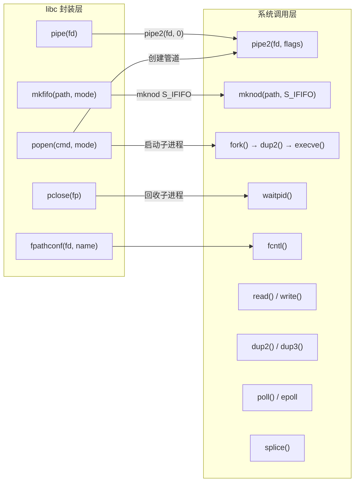
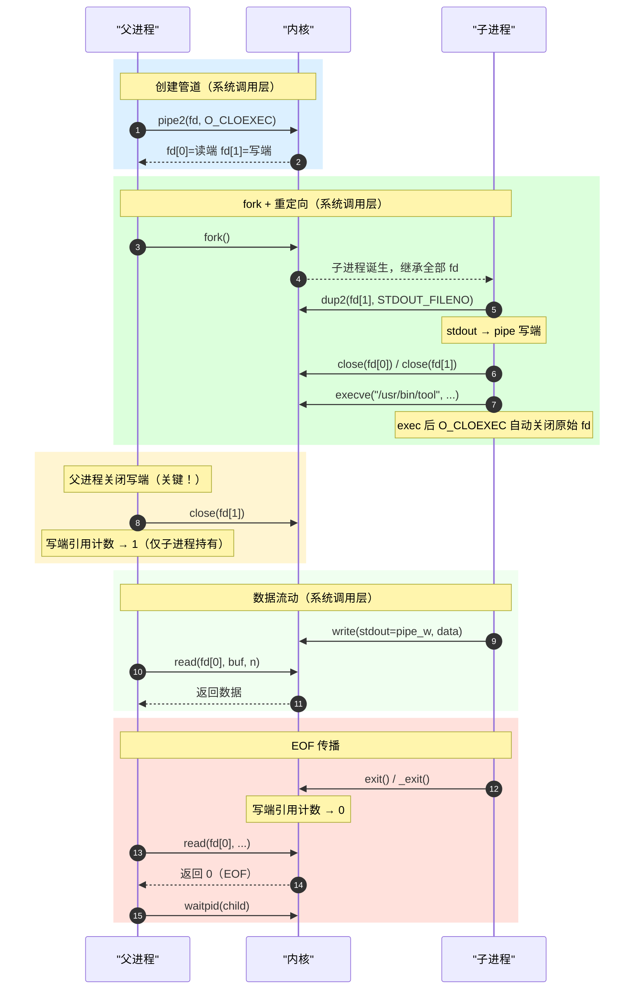
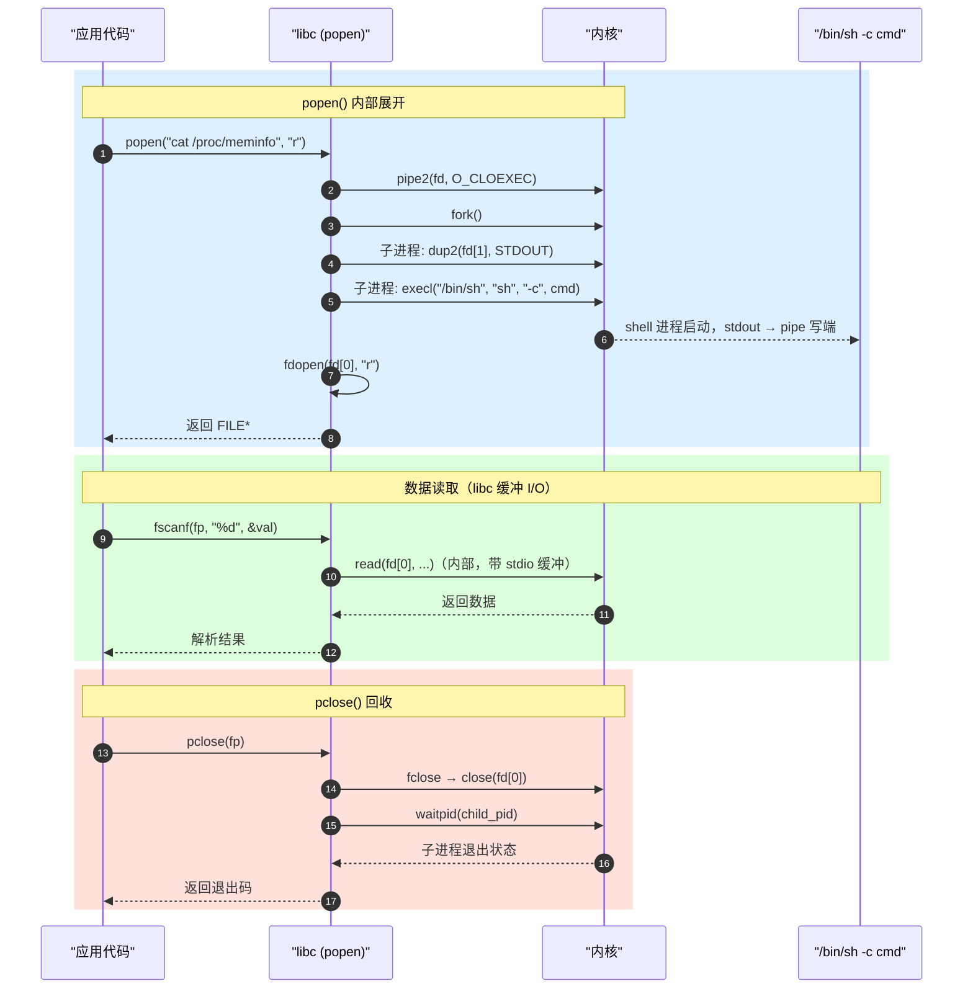

# 管道 API 两层矩阵

> [!note]
> **Ref:** `pipe2(2)` · `popen(3)` · `dup2(2)` · `pipe(7)` · `note/虚拟化/进程通信IPC/pipe/00-concept-and-lifecycle.md`

---

## 全景：两层架构与调用链路



> **核心结论**：libc 封装层将 `pipe2 + fork + dup2 + exec` 序列打包成一次 `popen()` 调用；系统调用层提供最细粒度的控制权。

---

## 一、系统调用层

直接陷入内核，无额外开销，是所有上层封装的基础。

### 1.1 创建匿名管道

```c
#define _GNU_SOURCE
#include <unistd.h>

int pipe2(int pipefd[2], int flags);
// pipefd[0] 读端  pipefd[1] 写端
// 成功返回 0，失败返回 -1
```

| `flags` | 作用 |
|---------|------|
| `O_CLOEXEC` | `exec` 后自动关闭两端 fd，**防止 fd 泄漏给子进程**（现代代码默认加） |
| `O_NONBLOCK` | 两端均非阻塞，缓冲区空/满时返回 `-1`/`EAGAIN` |
| `O_DIRECT` | 消息模式（内核 3.4+），每次 `write` 的数据作为独立包，保留消息边界 |

### 1.2 读写

```c
#include <unistd.h>

ssize_t read (int fd, void       *buf, size_t count);
ssize_t write(int fd, const void *buf, size_t count);
```

**`write()` 原子性边界（PIPE_BUF = 4096 字节）：**

| 写入大小 | 原子性 |
|----------|--------|
| `≤ PIPE_BUF` | 保证原子，不与其他 writer 交叉 |
| `> PIPE_BUF` | 不保证，可能分批写入并交叉 |

### 1.3 fd 重定向

```c
#include <unistd.h>

int dup2(int oldfd, int newfd);   // 将 newfd 重新指向 oldfd 所指的文件
int dup3(int oldfd, int newfd, int flags);  // 同上，支持 O_CLOEXEC（Linux 专有）
```

`dup2` 原子性地执行 `close(newfd)` + 复制表项，是 `fork → exec` 前重定向 stdin/stdout 的标准手段。

### 1.4 非阻塞控制 & 缓冲区容量

```c
#include <fcntl.h>

// 追加 O_NONBLOCK（对已有 fd）
int fl = fcntl(fd, F_GETFL);
fcntl(fd, F_SETFL, fl | O_NONBLOCK);

// 查询 / 调整管道缓冲区大小（Linux 专有，默认 64 KB）
int  cap = fcntl(pipe_fd, F_GETPIPE_SZ);
int  ret = fcntl(pipe_fd, F_SETPIPE_SZ, 1 << 20);  // 尝试设为 1 MB
// 系统上限：/proc/sys/fs/pipe-max-size（默认 1 MB）
```

非阻塞下行为：

| 操作 | 状态 | 返回 |
|------|------|------|
| `read()` | 缓冲区空 | `-1` / `EAGAIN` |
| `write()` | 缓冲区满 | `-1` / `EAGAIN` |
| `write()` | 读端全关 | `-1` / `EPIPE` + `SIGPIPE` |

### 1.5 I/O 多路复用

```c
#include <poll.h>

struct pollfd pfd = {
    .fd     = pipe_read_fd,
    .events = POLLIN,
};
poll(&pfd, 1, timeout_ms);
if (pfd.revents & POLLIN)  { /* 可读 */ }
if (pfd.revents & POLLHUP) { /* 写端全关，等价 EOF */ }
```

`epoll` 同样适用，`POLLHUP` 是写端关闭的可靠信号。

### 1.6 零拷贝：`splice()`

```c
#define _GNU_SOURCE
#include <fcntl.h>

ssize_t splice(int fd_in,  loff_t *off_in,
               int fd_out, loff_t *off_out,
               size_t len, unsigned int flags);
// fd_in / fd_out 至少一个必须是 pipe
```

```
disk ──splice──→ pipe ──splice──→ socket
        ↑ 无用户态内存拷贝 ↑
```

高性能文件传输（`sendfile` 底层实现）的核心原语。

---

## 二、libc 封装层

由 glibc/musl 实现，在系统调用之上添加缓冲、进程管理等便利能力。

### 2.1 `pipe()` — 系统调用的薄封装

```c
#include <unistd.h>

int pipe(int pipefd[2]);
// 等价于 pipe2(pipefd, 0)
```

仅作兼容保留，现代代码应直接用 `pipe2(fd, O_CLOEXEC)`。

### 2.2 `mkfifo()` — `mknod` 的便利封装

```c
#include <sys/stat.h>

int mkfifo(const char *pathname, mode_t mode);
// 内部调用：mknod(pathname, S_IFIFO | mode, 0)
```

创建后用标准 `open()` 读写：

```c
int wfd = open("/tmp/ctrl.fifo", O_WRONLY);            // 阻塞直到读端打开
int rfd = open("/tmp/ctrl.fifo", O_RDONLY | O_NONBLOCK); // 不阻塞立即返回
```

### 2.3 `popen()` / `pclose()` — 全套流水线封装

```c
#include <stdio.h>

FILE *popen(const char *command, const char *type);  // "r" 或 "w"
int   pclose(FILE *stream);
```

`popen("cmd", "r")` 在 libc 内部展开为：

```
pipe2(fd, O_CLOEXEC)
  → fork()
      子进程: dup2(fd[1], STDOUT) → close(fd) → execl("/bin/sh", "sh", "-c", cmd)
  → 父进程: fdopen(fd[0], "r") → 返回 FILE*
pclose() → waitpid() 回收子进程
```

**使用限制：**
- 只能拿到**一端**（`"r"` 读输出，`"w"` 写输入），无法同时捕获 stdout + stderr
- 命令经由 `/bin/sh -c` 解释，**存在 shell 注入风险**，不可传入用户未过滤的字符串
- 适合一次性查询（读 `/proc`、`/sys`），不适合长期高频通信

### 2.4 `fpathconf()` — POSIX 运行时查询

```c
#include <unistd.h>

long fpathconf(int fd, int name);
// 查询 PIPE_BUF（内部通过 fcntl 或内核接口实现）
long pipe_buf = fpathconf(fd, _PC_PIPE_BUF);  // Linux 通常返回 4096
```

---

## 三、典型调用链序列图

### 手动模式（`pipe2` + `fork` + `dup2` + `exec`）



### libc 快捷模式（`popen`）



---

## 四、API 速查表

### 系统调用层

| 函数 | 头文件 | 用途 |
|------|--------|------|
| `pipe2(fd, flags)` | `unistd.h` | 创建匿名管道（现代首选） |
| `read(fd, buf, n)` | `unistd.h` | 从管道读数据 |
| `write(fd, buf, n)` | `unistd.h` | 向管道写数据 |
| `dup2(old, new)` | `unistd.h` | fd 重定向（exec 前重定向 stdin/stdout） |
| `dup3(old, new, flags)` | `unistd.h` | 同上 + `O_CLOEXEC` |
| `fcntl(fd, F_GETPIPE_SZ)` | `fcntl.h` | 查询缓冲区大小 |
| `fcntl(fd, F_SETPIPE_SZ, n)` | `fcntl.h` | 设置缓冲区大小 |
| `fcntl(fd, F_SETFL, O_NONBLOCK)` | `fcntl.h` | 设置非阻塞 |
| `poll(pfds, n, timeout)` | `poll.h` | I/O 多路复用 |
| `splice(in, _, out, _, len, fl)` | `fcntl.h` | 零拷贝内核态传输 |

### libc 封装层

| 函数 | 头文件 | 底层展开 | 用途 |
|------|--------|----------|------|
| `pipe(fd)` | `unistd.h` | `pipe2(fd, 0)` | 兼容接口，不推荐 |
| `mkfifo(path, mode)` | `sys/stat.h` | `mknod(path, S_IFIFO\|mode, 0)` | 创建命名管道 |
| `popen(cmd, type)` | `stdio.h` | `pipe2+fork+dup2+exec+fdopen` | 执行命令并捕获 I/O |
| `pclose(fp)` | `stdio.h` | `fclose+waitpid` | 关闭 popen 流并回收子进程 |
| `fpathconf(fd, _PC_PIPE_BUF)` | `unistd.h` | `fcntl` 或内核查询 | 查询 PIPE_BUF 值 |

---

## 附：`exit()` vs `_exit()`

在管道场景（尤其是 `fork` 后子进程中）需要特别注意：

| | `exit()` | `_exit()` |
|---|---|---|
| 头文件 | `<stdlib.h>` | `<unistd.h>` |
| `atexit()` 回调 | 执行 | 不执行 |
| stdio 缓冲区刷新 | `fflush()` | 不刷新 |
| 内核资源回收 | 执行 | 执行 |
| async-signal-safe | **否** | **是** |

**`fork` 后子进程（未 `exec`）必须用 `_exit()`**：`exit()` 会 `fflush` 父进程的 stdio 缓冲区，导致数据被写两次。

**signal handler 必须用 `_exit()`**：`exit()` 内部调用非 async-signal-safe 的 `fflush()`，若主流程正持有 stdio 锁则死锁：

```
主流程: printf() → 持有 stdio 锁
          ↓ 信号打断
handler: exit() → fflush() → 尝试获取同一把锁 → 死锁

正确：handler 里用 _exit()，直接 exit_group 系统调用，绕过所有用户态清理
```
