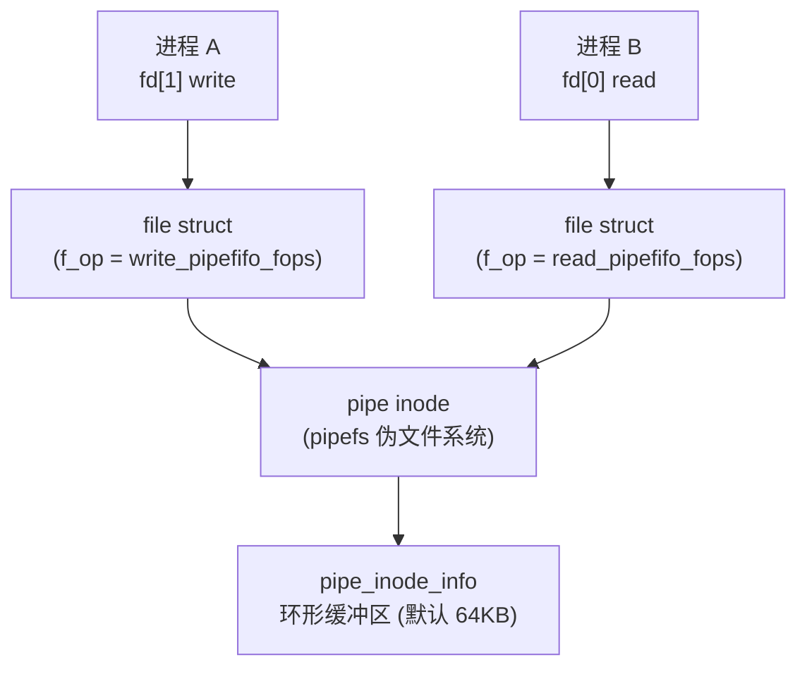
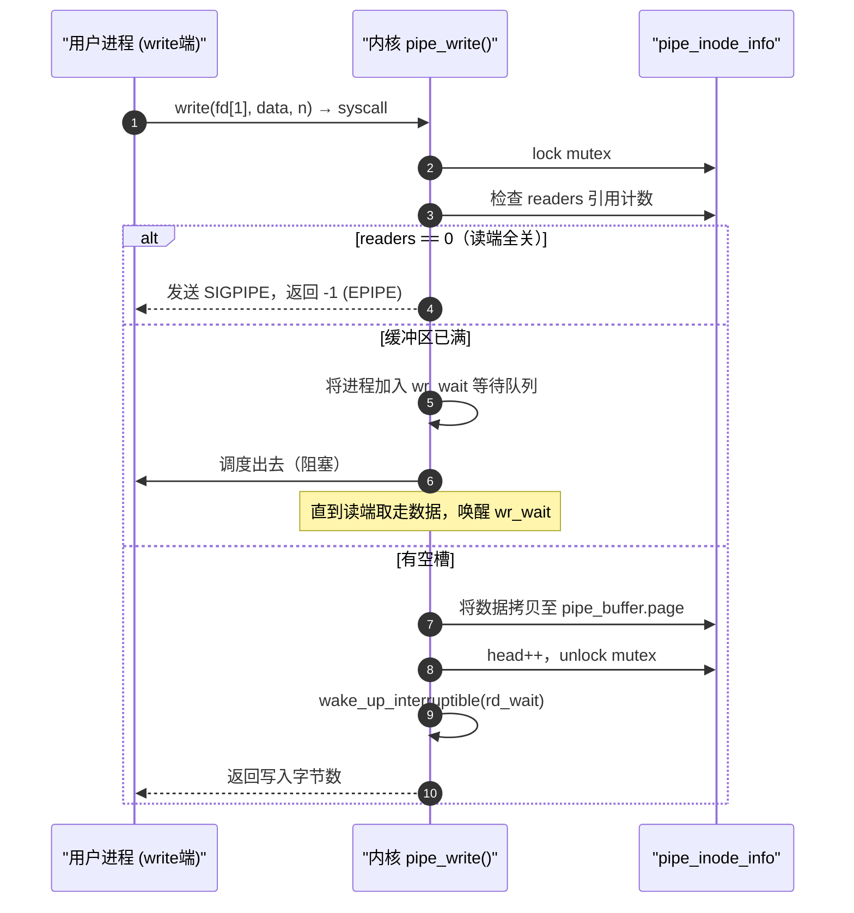
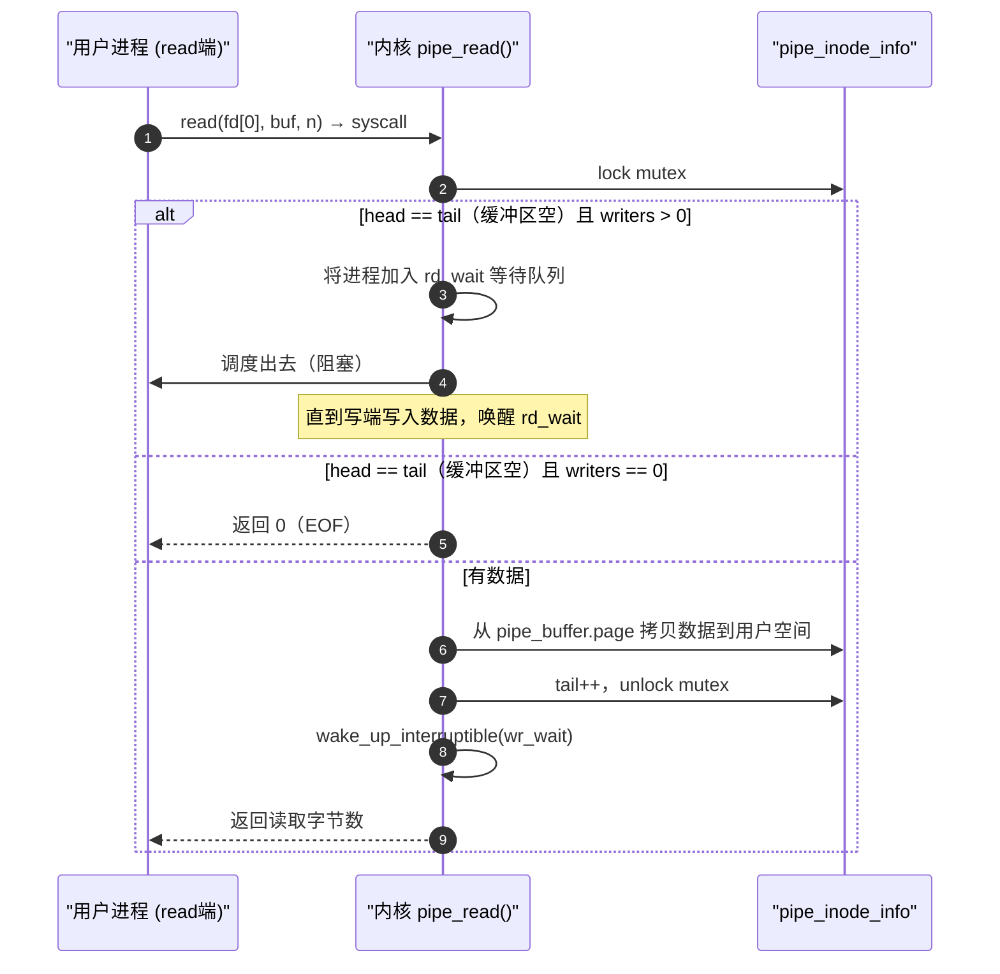

# 管道内核机制：VFS 层与缓冲区设计

> [!note]
> **Ref:** Linux kernel `fs/pipe.c` · `include/linux/pipe_fs_i.h` · `note/SysCall/00-系统调用全景.md`

---

## 1. 管道在 VFS 层的身份

在 Linux 内核中，一切皆文件。管道也不例外——它是 VFS 中挂载于 `pipefs` 这个伪文件系统下的一个**特殊 inode**。



调用 `pipe()` 时，内核做了三件事：
1. 在 `pipefs` 中分配一个匿名 inode。
2. 创建两个 `file` 结构体，分别绑定读/写 `file_operations`。
3. 将两个 fd 安装到当前进程的 `fd_table`。

---

## 2. 核心数据结构：`pipe_inode_info`

```c
// include/linux/pipe_fs_i.h (简化)
struct pipe_inode_info {
    struct mutex        mutex;          // 读写互斥锁
    wait_queue_head_t   rd_wait;        // 读等待队列
    wait_queue_head_t   wr_wait;        // 写等待队列

    unsigned int        head;           // 写入位置（环形索引）
    unsigned int        tail;           // 读取位置（环形索引）
    unsigned int        ring_size;      // 缓冲区槽位数（默认 16 个 page = 64KB）
    unsigned int        nr_accounted;   // 已使用的用户管道配额

    unsigned int        readers;        // 读端引用计数
    unsigned int        writers;        // 写端引用计数
    unsigned int        files;          // 关联的 file 对象数

    struct pipe_buffer  *bufs;          // 缓冲区页数组（每个槽一个 page）
};

struct pipe_buffer {
    struct page     *page;      // 指向实际物理内存页
    unsigned int    offset;     // 页内数据起始偏移
    unsigned int    len;        // 本槽位有效数据长度
    const struct pipe_buf_operations *ops;
    // ...
};
```

**环形结构示意（ring_size = 4 简化）：**

```
 tail                  head
  ↓                     ↓
[ buf0 | buf1 | buf2 | buf3 ]
  已读    已读   有数据  空槽
```

- `head` 指向下一个可写槽位，`tail` 指向下一个可读槽位。
- `(head - tail) == ring_size` 时缓冲区满，写端阻塞。
- `head == tail` 时缓冲区空，读端阻塞。

---

## 3. 写路径：`write()` 的内核执行流



---

## 4. 读路径：`read()` 的内核执行流



---

## 5. SIGPIPE：被忽视的写端陷阱

当进程向一个**读端已全部关闭**的管道写入时：

1. `pipe_write()` 检查 `pipe->readers == 0`。
2. 内核向当前进程发送 `SIGPIPE`（默认动作：终止进程）。
3. 若进程捕获或忽略了 `SIGPIPE`，`write()` 返回 `-1`，`errno = EPIPE`。

```c
// 常见处理方式：忽略 SIGPIPE，转而检查 EPIPE
signal(SIGPIPE, SIG_IGN);

ssize_t n = write(fd, buf, len);
if (n == -1 && errno == EPIPE) {
    // 读端已关闭，处理错误
}
```

> **Shell 管道的本质**：`ls | grep foo` 中，`grep` 提前退出后，`ls` 收到 `SIGPIPE` 被终止，这就是为什么你不会看到 `ls` 卡住等待。

---

## 6. `splice()` 零拷贝优化

Linux 提供 `splice()` 系统调用，可在两个 fd 之间直接在内核态传输数据，避免用户空间拷贝：

```c
#define _GNU_SOURCE
#include <fcntl.h>

// 将 fd_in 的数据直接转移到 fd_out，其中至少有一个必须是 pipe
ssize_t splice(int fd_in,  loff_t *off_in,
               int fd_out, loff_t *off_out,
               size_t len, unsigned int flags);
```

典型用法（文件 → 管道 → socket 的零拷贝链路）：

```
disk file ──splice──→ pipe ──splice──→ socket
              ↑无内存拷贝↑      ↑无内存拷贝↑
```

这是高性能文件传输（如 `sendfile` 的底层实现）的核心原语。
