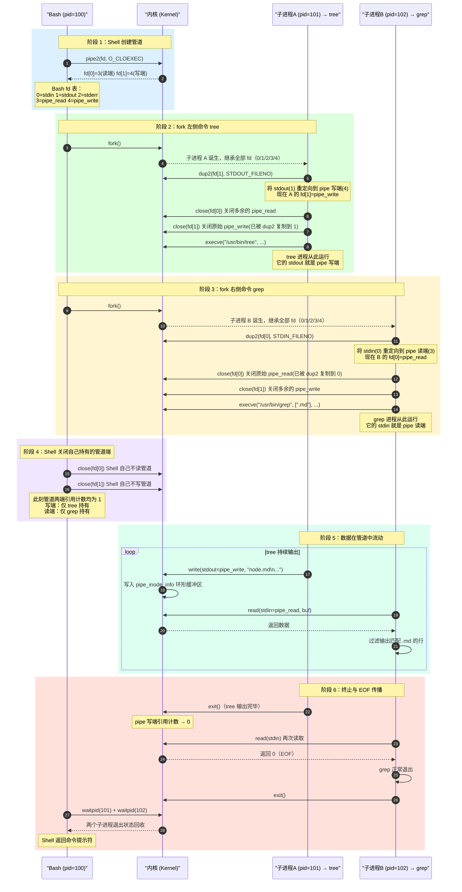

# Shell 管道全景：从命令行到内核的完整执行序列

> [!note]
> **Ref:** `note/虚拟化/程序和进程/04-进程生命周期管理` · `note/虚拟化/进程通信IPC/pipe/00-concept-and-lifecycle.md` · `execve(2)` · `dup2(2)`

当你在终端键入 `tree | grep .md` 并回车，Shell 并不是简单地"连接两个程序"——它精确地编排了一套 **fork → pipe → dup2 → exec** 的系统调用序列，将两个独立进程的 stdout/stdin 接驳到同一条内核管道上。

---

## 1. 角色总览

```
┌─────────────────────────────────────────────────────────┐
│  终端 (PTY)                                              │
│   │  用户输入：tree | grep .md                           │
│   ▼                                                     │
│  Bash (Shell 进程, pid=100)                              │
│   │  解析出两段命令，识别 | 操作符                        │
│   │                                                     │
│   ├─ fork ──→ 子进程 A (pid=101) ── exec ──→ tree        │
│   │                │  stdout ──→ pipe 写端               │
│   │                                                     │
│   └─ fork ──→ 子进程 B (pid=102) ── exec ──→ grep .md   │
│                    │  stdin  ←── pipe 读端               │
└─────────────────────────────────────────────────────────┘
```

---

## 2. 完整序列图



---

## 3. 关键细节拆解

### 3.1 dup2 的作用：重定向 fd 编号

`execve` 之后，新程序对 fd 编号一无所知——它只知道按约定从 `fd=0` 读 stdin、向 `fd=1` 写 stdout。

`dup2(oldfd, newfd)` 做的事：
1. 若 `newfd` 已打开，先 `close(newfd)`。
2. 将 `oldfd` 的文件描述符表项**复制**到 `newfd`。
3. 两个 fd 现在指向同一个 `file` 结构体（同一管道端）。

```
fork 后子进程 A 的 fd 表：         dup2(fd[1], 1) 后：
  0 → terminal stdin              0 → terminal stdin
  1 → terminal stdout     ──→     1 → pipe_write  ← stdout 被劫持
  2 → terminal stderr             2 → terminal stderr
  3 → pipe_read                   (close 3, 4 清理)
  4 → pipe_write
```

执行 `execve("tree")` 后，tree 进程写 stdout，数据就流入管道。

### 3.2 为何 Shell 必须关闭自己的管道端（步骤 9-10）

若 Shell 不关闭 `fd[1]`（写端），管道写端引用计数为 **2**（tree + Shell）。
当 tree 退出后，写端引用计数仅降到 **1**（Shell 仍持有），grep 的 `read()` **永远不会收到 EOF**，grep 进程将永久阻塞。

```
写端引用计数 = 持有写端的 fd 数量
只有计数降为 0，读端的 read() 才返回 EOF
```

### 3.3 O_CLOEXEC 的必要性

Shell 用 `pipe2(fd, O_CLOEXEC)` 创建管道，确保 `execve` 后管道 fd 自动关闭。

若不设置：`execve("tree")` 后，tree 进程会**意外继承** `fd[0]`（读端），导致管道写端引用计数异常，破坏 EOF 传播机制。

---

## 4. fd 状态全程追踪

| 时间点 | Shell fd 表 | 子进程 A (tree) fd 表 | 子进程 B (grep) fd 表 |
|--------|------------|----------------------|----------------------|
| pipe() 后 | 0,1,2,**3(r),4(w)** | — | — |
| fork A 后 | 0,1,2,3,4 | **继承** 0,1,2,3,4 | — |
| A dup2+close 后 | 0,1,2,3,4 | 0,**1→pipe_w**,2 | — |
| fork B 后 | 0,1,2,3,4 | 0,1→pipe_w,2 | **继承** 0,1,2,3,4 |
| B dup2+close 后 | 0,1,2,3,4 | 0,1→pipe_w,2 | **0→pipe_r**,1,2 |
| Shell close(3,4) | 0,1,2 | 0,1→pipe_w,2 | 0→pipe_r,1,2 |
| tree exit | 0,1,2 | ✗ | 0→pipe_r,1,2 |
| grep EOF+exit | 0,1,2 | ✗ | ✗ |

---

## 5. 多级管道的扩展

`cmd1 | cmd2 | cmd3` 是上述模式的线性扩展：Shell 创建两条管道，fork 三个子进程，**依次将相邻进程的 stdout/stdin 接驳：**

```
cmd1.stdout → pipe1 → cmd2.stdin
              cmd2.stdout → pipe2 → cmd3.stdin
```

每条 `|` 对应一次 `pipe()` 调用，每个命令对应一次 `fork + dup2 + exec`，Shell 最终关闭所有自持的管道端，等待所有子进程退出。
