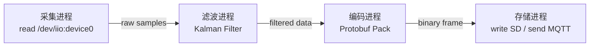

# 嵌入式 Linux 中的 Pipe 应用场景

> [!note]
> **Ref:** `note/虚拟化/进程通信IPC/pipe/00-concept-and-lifecycle.md` · `note/虚拟化/进程通信IPC/pipe/03-shell-pipe-sequence.md`

---

## 1. `popen()` 读取系统状态（最高频）

嵌入式应用常需要查询内核通过 `/proc`、`/sys` 暴露的系统信息，`popen()` 是最快捷的手段。

```c
// 读取 CPU 温度（iMX6ULL thermal zone）
FILE *fp = popen("cat /sys/class/thermal/thermal_zone0/temp", "r");
int temp_milli;
fscanf(fp, "%d", &temp_milli);
pclose(fp);
printf("CPU temp: %.1f °C\n", temp_milli / 1000.0);

// 获取网卡 IP 地址
FILE *fp2 = popen("ip addr show eth0 | grep 'inet ' | awk '{print $2}'", "r");
char ip[32];
fscanf(fp2, "%31s", ip);
pclose(fp2);
```

`popen()` 本质是 `pipe + fork + exec + dup2` 的封装，底层与 Shell 管道机制完全一致（参见 `03-shell-pipe-sequence.md`）。

**适用场景：** 读取 GPIO 状态、网络信息、内存占用、硬件版本号等一次性查询。

---

## 2. 子进程隔离 + 输出捕获

嵌入式设备执行高风险操作（OTA 固件刷写、文件系统挂载、驱动加载）时，将操作放入子进程隔离执行，通过管道捕获其 stdout/stderr：

```
主进程（监控/恢复）
  ├─ fork ──→ 子进程：执行 flash_write() / mount / modprobe
  │              stdout/stderr ──→ pipe 写端
  └─ pipe 读端 ──→ 主进程：实时读取进度与错误日志
```

```c
int fd[2];
pipe2(fd, O_CLOEXEC);

pid_t pid = fork();
if (pid == 0) {
    dup2(fd[1], STDOUT_FILENO);
    dup2(fd[1], STDERR_FILENO);
    close(fd[0]); close(fd[1]);
    execl("/usr/bin/flash_tool", "flash_tool", firmware_path, NULL);
    exit(127);
}

close(fd[1]);
// 主进程从 fd[0] 读取刷写进度，子进程崩溃不影响主进程
char buf[256];
while (read(fd[0], buf, sizeof(buf)) > 0)
    log_write(buf);

int status;
waitpid(pid, &status, 0);
// 根据 status 决定是否回滚
```

**核心价值：** 子进程崩溃不扩散至主进程；主进程可通过退出码和管道输出判断是否需要回滚。

---

## 3. 传感器数据采集流水线

多进程分工处理传感器数据，每个进程职责单一，通过管道串联：

```
采集进程           滤波进程              编码进程           存储/上报进程
(read ADC/I2C) ─pipe─→ (Kalman filter) ─pipe─→ (Protobuf/JSON) ─pipe─→ (SD卡/MQTT)
```



**优点：**
- 各进程可独立重启（滤波算法崩溃不影响采集）
- 易于替换单个环节（更换编码格式无需重编译整体）
- 在 iMX6ULL 多核场景下，不同进程可调度到不同核心

---

## 4. 命名管道 (FIFO) 做守护进程控制通道

守护进程（daemon）脱离终端运行，无法接收键盘输入。FIFO 提供一个**文件系统可寻址的运行时控制接口**，比信号能携带更多语义，比 Unix Socket 实现更轻量。

```c
// 守护进程启动时创建 FIFO 并监听
mkfifo("/var/run/myapp.fifo", 0600);
int ctl_fd = open("/var/run/myapp.fifo", O_RDONLY | O_NONBLOCK);

// 主循环中通过 poll 监听控制命令
struct pollfd pfd = { .fd = ctl_fd, .events = POLLIN };
poll(&pfd, 1, 1000);
if (pfd.revents & POLLIN) {
    char cmd[64];
    read(ctl_fd, cmd, sizeof(cmd));
    if (strncmp(cmd, "reload_config", 13) == 0) do_reload();
    if (strncmp(cmd, "dump_status",   11) == 0) do_dump();
}
```

```bash
# 运维脚本或 init 脚本发送控制命令
echo "reload_config" > /var/run/myapp.fifo
echo "dump_status"   > /var/run/myapp.fifo
```

**适用场景：** 无 D-Bus 的轻量嵌入式系统、BusyBox 环境下的服务控制。

---

## 5. 日志聚合：多进程 stderr 汇入日志守护进程

嵌入式系统通常没有完整的 syslog，可在 fork 之后、exec 之前将子进程 stderr 重定向到管道，由一个日志进程统一添加时间戳、进程名后写入文件：

```
子进程 A stderr ──┐
子进程 B stderr ──┼──→ 日志进程 ──→ /var/log/app.log
子进程 C stderr ──┘      (加时间戳 + 进程名前缀)
```

```c
// supervisor 在 fork 每个子进程时统一重定向
int log_pipe[2];
pipe2(log_pipe, O_CLOEXEC);

pid_t child = fork();
if (child == 0) {
    dup2(log_pipe[1], STDERR_FILENO);   // 子进程 stderr → 管道写端
    close(log_pipe[0]); close(log_pipe[1]);
    execv(child_argv[0], child_argv);
}
// supervisor 将 log_pipe[0] 交给日志线程/进程处理
register_log_reader(log_pipe[0], child_argv[0]);
close(log_pipe[1]);
```

**核心优势：** 子进程无需修改任何日志代码，`fprintf(stderr, ...)` 自动被捕获。

---

## 6. GStreamer 音视频管道（概念层 Pipe）

iMX6ULL 带 CSI 摄像头或音频 codec 时，GStreamer 是标准的媒体处理框架。其 `!` 连接符在设计上直接对应 Unix Pipe 思想：

```bash
# 从摄像头抓一帧 JPEG
gst-launch-1.0 v4l2src num-buffers=1 ! jpegenc ! filesink location=snapshot.jpg

# 实时推流（H.264 编码 → RTP → 网络）
gst-launch-1.0 v4l2src ! imxvpuenc_h264 ! rtph264pay ! udpsink host=192.168.1.100 port=5000
```

每个 `!` 两侧的 Element 在底层通过共享内存或 fd 传递 buffer，Pipe 是其架构的设计原型。在资源受限的场景下，也可以直接用 Shell 管道串联轻量工具替代 GStreamer。

---

## 总结

| 场景 | 管道类型 | 核心价值 |
|------|----------|----------|
| `popen()` 读 `/proc`、`/sys` | 匿名管道 | 最快捷的系统信息查询，一行代码 |
| 子进程隔离 + 输出捕获 | 匿名管道 | 故障隔离，防止崩溃扩散，支持回滚决策 |
| 传感器数据流水线 | 匿名管道 | 解耦采集/处理/存储，各环节独立重启 |
| 守护进程控制通道 | 命名管道 FIFO | 轻量运行时控制接口，无需 D-Bus |
| 多进程日志聚合 | 匿名管道 | 统一日志，子进程零感知 |
| GStreamer 音视频 | 概念层 Pipe | 模块化媒体处理，iMX6ULL 多媒体开发标配 |

> **落地优先级**：`popen()` 读系统状态 和 **子进程隔离** 是嵌入式日常开发最高频的两个落地点；FIFO 控制通道在无 D-Bus 的 BusyBox 环境下不可替代。
