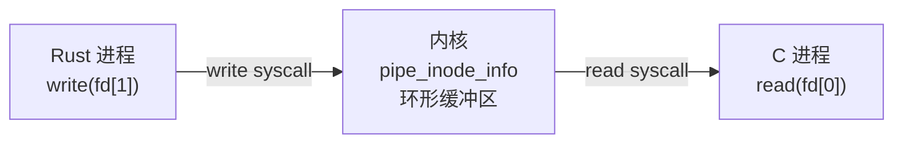
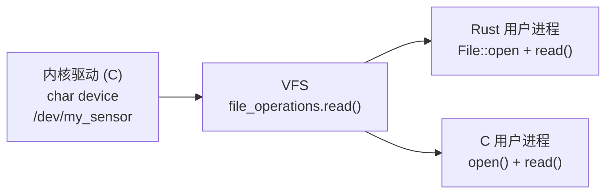

# 多进程跨语言 IPC 要点

> [!note]
> **Ref:** `note/虚拟化/进程通信IPC/pipe/00-concept-and-lifecycle.md` · `note/虚拟化/进程通信IPC/pipe/01-api-matrix.md` · `pipe(7)`

---

## 1. 核心结论：IPC 是内核机制，与语言无关

Pipe 的两端本质是**文件描述符（fd）**，内核不关心持有它的进程用什么语言编写。只要进程能发起 `read()` / `write()` syscall，就能读写管道。



C 进程与 Rust 进程可以混接同一条管道互相通信——内核只看 fd，不看语言。

---

## 2. Rust 中的 Pipe API 映射

### 2.1 Shell 管道捕获（对应 C 的 `popen`）

```rust
use std::process::{Command, Stdio};

// 等价于 popen("cat /proc/meminfo", "r")
let output = Command::new("cat")
    .arg("/proc/meminfo")
    .stdout(Stdio::piped())
    .output()
    .unwrap();

println!("{}", String::from_utf8_lossy(&output.stdout));
```

### 2.2 手动双向管道（对应 C 的 `pipe2 + fork + dup2 + exec`）

```rust
use std::process::{Command, Stdio};
use std::io::{Read, Write};

let mut child = Command::new("grep")
    .arg("MemFree")
    .stdin(Stdio::piped())    // 写端：向子进程输入数据
    .stdout(Stdio::piped())   // 读端：读取子进程输出
    .spawn()
    .unwrap();

child.stdin.take().unwrap()
    .write_all(b"MemFree: 123\nOther: 456\n")
    .unwrap();

let mut result = String::new();
child.stdout.take().unwrap()
    .read_to_string(&mut result)
    .unwrap();

println!("{}", result); // MemFree: 123
```

### 2.3 底层对应关系

| C（libc / syscall） | Rust（std） | 底层 syscall |
|---------------------|-------------|-------------|
| `pipe2(fd, O_CLOEXEC)` | `Stdio::piped()` | `pipe2` |
| `fork() + dup2() + exec()` | `Command::spawn()` | `clone + dup2 + execve` |
| `waitpid()` | `child.wait()` | `wait4` |
| `read(fd, buf, n)` | `Read::read()` | `read` |
| `write(fd, buf, n)` | `Write::write_all()` | `write` |

> Rust `std::process` 是对 `pipe2 + fork + dup2 + exec` 序列的安全封装，与 C 的 `popen` 同级，但能同时持有 stdin **和** stdout 两端（`popen` 只能拿一端）。

---

## 3. 其他 IPC 机制的跨语言适用性

所有基于 fd 或文件系统路径的 IPC 机制，均可跨语言使用：

| IPC 机制 | C API | Rust 等价 | 备注 |
|----------|-------|-----------|------|
| 匿名管道 | `pipe2()` | `Stdio::piped()` | 需亲缘进程 |
| 命名管道 FIFO | `mkfifo()` + `open()` | `fs::OpenOptions::open("/tmp/x.fifo")` | 任意进程，路径寻址 |
| Unix Domain Socket | `socket(AF_UNIX)` | `std::os::unix::net::UnixStream` | 双向，支持传 fd |
| 共享内存 | `mmap()` / `shm_open()` | `memmap2` crate | 零拷贝，需自行同步 |
| Signal | `kill()` / `sigaction()` | `signal-hook` crate | 携带信息量少 |

---

## 4. iMX6ULL 嵌入式场景：Rust 进程读取内核驱动

内核驱动暴露的字符设备、`/proc`、`/sys` 节点，Rust 进程用标准 `std::fs` 直接读，与 C 的 `open()/read()` 完全等价——最终都是同一个 syscall。



```rust
use std::fs;

// 读取 iMX6ULL CPU 温度（sysfs，与 C 的 popen("cat ...") 等价）
let temp_str = fs::read_to_string(
    "/sys/class/thermal/thermal_zone0/temp"
).unwrap();
let temp_mc: i32 = temp_str.trim().parse().unwrap();
println!("CPU: {:.1} °C", temp_mc as f32 / 1000.0);
```

**关键结论**：跨语言 IPC 的边界不在语言，而在**内核 / 用户态边界**。只要在用户态，任何语言都通过同一套 syscall 与内核及其他进程通信，语言只影响封装的便利性，不影响通信能力本身。
