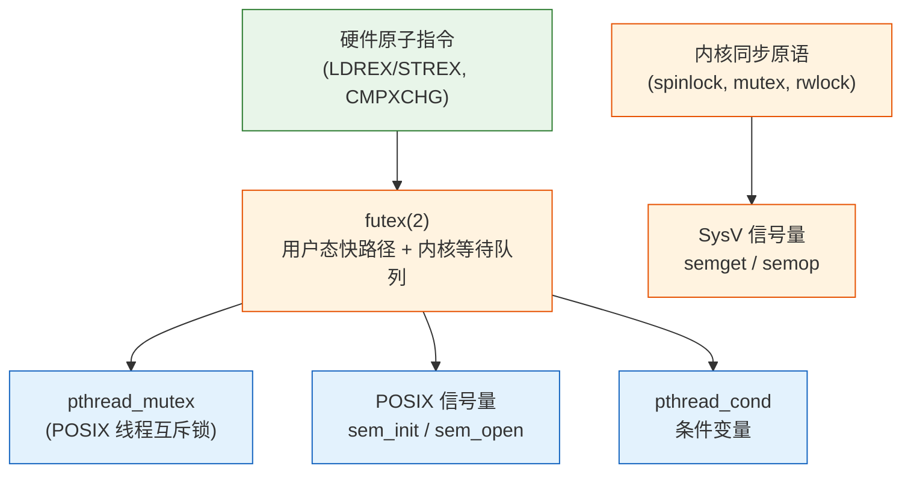

# 信号量：同步原语的概念与模型

> [!note]
> **Ref:** POSIX.1-2017 §sem_overview(7), Linux man-pages `sem_overview(7)`, `semop(2)`, `futex(2)`
> 本地参考：`sdk/Linux-4.9.88/kernel/futex.c`

---

## 1. 同步问题的本质

多进程/多线程共享资源时，必须保证：

| 问题 | 表现 |
|------|------|
| **互斥（Mutex）** | 同一时刻只有一个执行者进入临界区 |
| **同步（Sync）** | 执行顺序受控，如"生产者先于消费者" |
| **有界等待** | 不能无限期饿死某个等待者 |

信号量（Semaphore）是 Dijkstra 1965 年提出的**通用同步原语**，可以同时解决以上三类问题。

---

## 2. 信号量的数学模型

信号量 `S` 是一个非负整数，支持两个**原子操作**：

```
P(S) / wait(S) / sem_wait():
    if S > 0:  S -= 1          // 立即通过
    else:      block(caller)   // 挂起等待

V(S) / post(S) / sem_post():
    if waiters exist:  wake(one_waiter)   // 唤醒一个
    else:              S += 1             // 增加计数
```

> **原子性**是信号量的核心保证——P/V 不可分割，由内核或硬件保障。

### 两种基本用法

| 用途 | 初值 | 语义 |
|------|------|------|
| **互斥锁（binary semaphore）** | 1 | S=1 表示资源空闲，S=0 表示占用 |
| **计数信号量** | N | 允许 N 个并发访问者（如连接池、环形缓冲区） |

---

## 3. Linux 同步原语体系



---

## 4. POSIX 信号量 vs SysV 信号量

| 维度 | POSIX sem | SysV semaphore |
|------|-----------|----------------|
| **标准** | POSIX.1b (1993) | UNIX System V (1983) |
| **API 风格** | 简洁，类文件句柄 | 复杂，key/id 机制 |
| **粒度** | 单个信号量 | 信号量**数组**（semset） |
| **进程间共享** | 命名信号量（`sem_open`）或 mmap | 内核对象，ipcs 可见 |
| **线程间共享** | 匿名信号量（`sem_init`，`pshared=0`） | 通常用 semget |
| **持久性** | 命名：文件系统持久；匿名：随进程 | 随内核（需显式 semctl IPC_RMID） |
| **推荐场景** | 新代码首选 | 需要 semop 原子操作多个信号量时 |

---

## 5. futex：现代实现的基石

POSIX sem 和 pthread_mutex 在 Linux 上都基于 **futex（Fast Userspace muTEX）**：

```
用户态：                          内核态：
┌──────────────────────────┐      ┌─────────────────────────┐
│  sem_wait()              │      │  futex(FUTEX_WAIT)       │
│  atomic_dec(sem->value)  │      │  进程加入等待队列         │
│  if value < 0:           │─────▶│  调度器切换              │
│    syscall(futex_wait)   │      │                          │
└──────────────────────────┘      └─────────────────────────┘

sem_post():
  atomic_inc(sem->value)
  if 有等待者: syscall(futex_wake)  ← 只有竞争时才进内核
```

**关键优化**：无竞争时完全在用户态完成，不陷入内核 → 性能接近裸 atomic。

---

## 6. 学习路线图

```
00-concept-and-model.md        ← 当前文件
01-posix-api-matrix.md         POSIX sem API 全览与用法
02-sysv-api-matrix.md          SysV semget/semop/semctl 详解
03-classic-patterns.md         生产者消费者、读写锁、屏障经典模式
04-kernel-futex-mechanics.md   futex 内核实现与等待队列
05-embedded-pitfalls.md        嵌入式场景：优先级反转、实时性
```

---

## 小结

- 信号量 = **整数计数器 + 原子 P/V + 阻塞等待队列**
- Linux 提供两套用户态 API：POSIX（推荐）和 SysV（遗留）
- 底层都依赖 **futex** 实现用户态快路径
- 下一节：POSIX API 矩阵与典型用法
