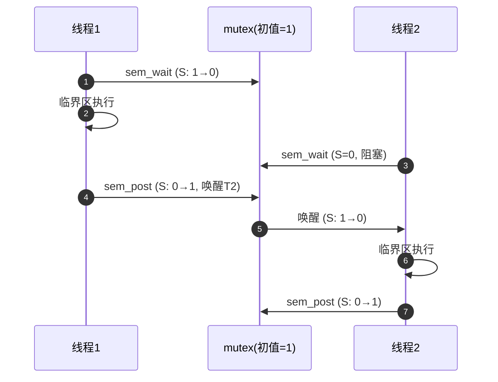
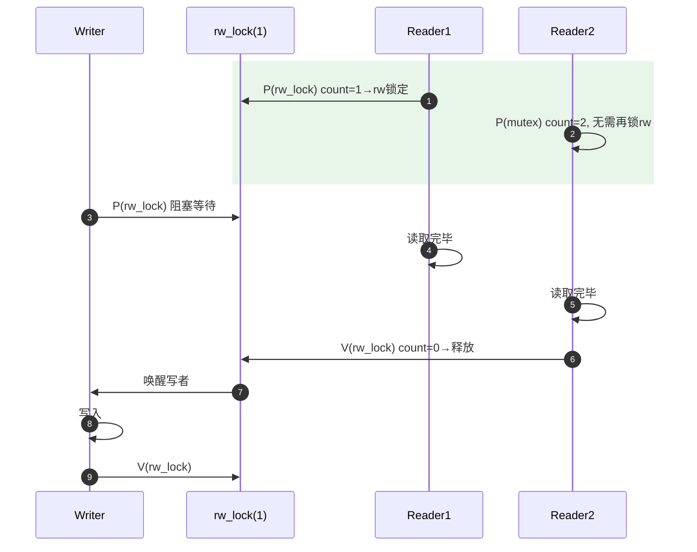
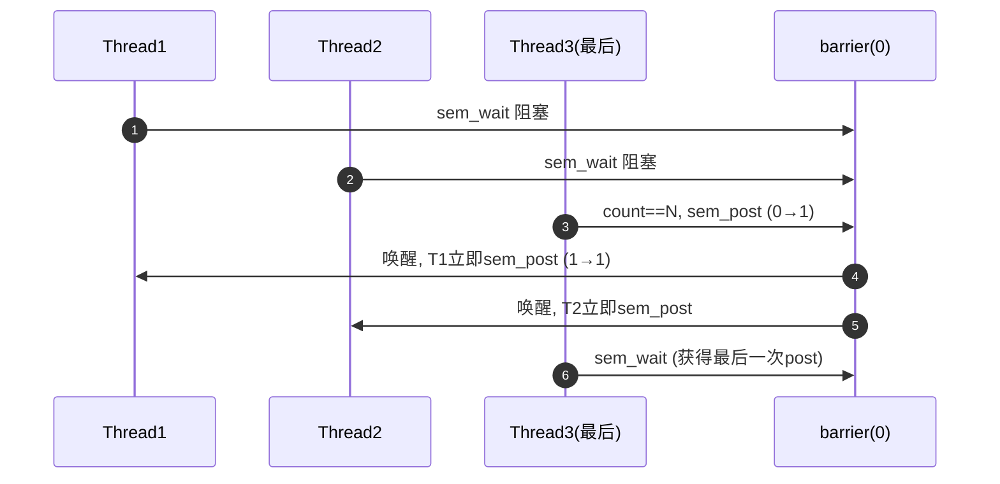

# 经典同步模式：信号量的四大范式

> [!note]
> **Ref:** 《The Little Book of Semaphores》Allen B. Downey (开源), POSIX.1-2017

---

## 模式一：互斥（Mutual Exclusion）

**问题**：多线程并发修改共享数据，需保证同一时刻只有一个线程在临界区。

```
mutex = Semaphore(1)    ← 初值1，binary semaphore

Thread:
    sem_wait(mutex)     ← P：进入临界区
    [critical section]
    sem_post(mutex)     ← V：离开临界区
```

**时序图**：



**陷阱**：不要在一个线程 P，另一个线程 V——那是同步语义，不是互斥。

---

## 模式二：生产者-消费者（有界缓冲区）

**问题**：生产者和消费者速率不匹配，需要一个有界环形缓冲区解耦。

```
empty = Semaphore(N)    ← 空槽数，初值=缓冲区大小
full  = Semaphore(0)    ← 满槽数，初值=0
mutex = Semaphore(1)    ← 保护缓冲区索引
```

```
Producer:                        Consumer:
    sem_wait(empty)                  sem_wait(full)
    sem_wait(mutex)                  sem_wait(mutex)
    buf[in] = data                   data = buf[out]
    in = (in+1) % N                  out = (out+1) % N
    sem_post(mutex)                  sem_post(mutex)
    sem_post(full)                   sem_post(empty)
```

**关键**：`mutex` 的 P 必须在 `empty`/`full` 的 P **之后** — 否则可能死锁：

```
❌ 错误顺序（死锁）：
    Producer: P(mutex) → P(empty)  ← 缓冲区满时，持有mutex等empty，Consumer拿不到mutex
```

---

## 模式三：读写锁（Readers-Writers）

**问题**：读操作可并发，写操作需独占。

### 读者优先版本

```
mutex    = Semaphore(1)   ← 保护 read_count
rw_lock  = Semaphore(1)   ← 读写互斥
read_count = 0
```

```
Reader:                          Writer:
    sem_wait(mutex)                  sem_wait(rw_lock)
    read_count++                     [write]
    if read_count == 1:              sem_post(rw_lock)
        sem_wait(rw_lock)   ← 第一个读者阻挡写者
    sem_post(mutex)
    [read]
    sem_wait(mutex)
    read_count--
    if read_count == 0:
        sem_post(rw_lock)   ← 最后一个读者放开写者
    sem_post(mutex)
```

**时序图（读者优先）**：



**缺点**：写者可能饿死。生产环境用 `pthread_rwlock_t` 更合适（内核实现了公平策略）。

---

## 模式四：屏障（Barrier）/ 集合点

**问题**：N 个线程必须全部到达某点后才能继续执行。

```
mutex   = Semaphore(1)
barrier = Semaphore(0)
count   = 0
N       = 线程总数
```

```
Thread:
    sem_wait(mutex)
    count++
    if count == N:
        sem_post(barrier)    ← 最后一个到达的线程打开闸门
    sem_post(mutex)

    sem_wait(barrier)        ← 等待所有人到达
    sem_post(barrier)        ← 转发（Turnstile 旋转门模式）
    [后续代码]
```

**Turnstile（旋转门）技巧**：每个线程 `sem_wait` 后立即 `sem_post`，信号量在 N 个线程间传递，形成级联唤醒，保证所有线程都能通过。



---

## 模式对比总结

| 模式 | 信号量数量 | 初值设置 | 关键约束 |
|------|-----------|---------|---------|
| 互斥 | 1 | 1 | 同一线程 P/V 配对 |
| 生产者消费者 | 3 | N,0,1 | mutex 的 P 在 empty/full 之后 |
| 读写锁（读优先） | 2+计数器 | 1,1 | 首尾读者操作 rw_lock |
| 屏障 | 2 | 1,0 | Turnstile 转发保证全部唤醒 |

---

## 嵌入式场景提示

在 Linux 内核模块中，这些模式对应：
- 互斥 → `mutex_lock` / `mutex_unlock`
- 生产消费 → `kfifo` + `wait_event` / `wake_up`
- 读写锁 → `down_read` / `up_read` / `down_write` / `up_write`
- 屏障 → `completion` 机制（`wait_for_completion` / `complete`）
