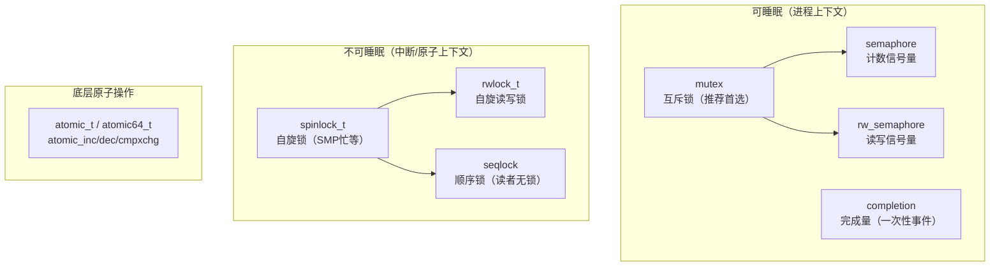
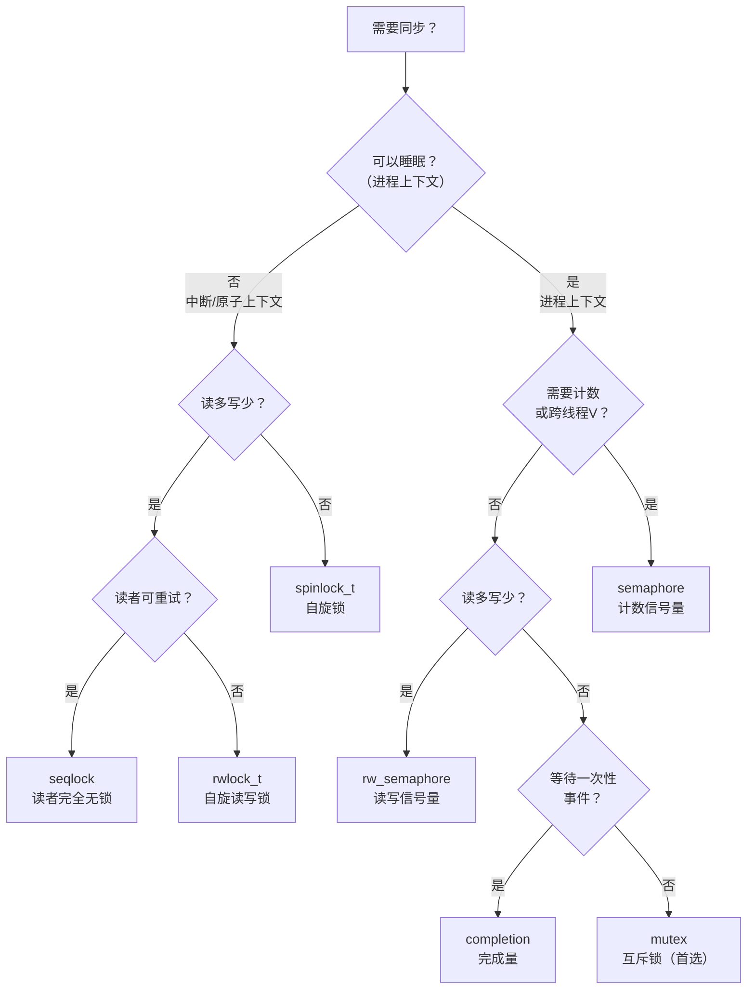

# Linux 内核同步原语全览

> [!note]
> **Ref:** `sdk/Linux-4.9.88/include/linux/mutex.h`, `spinlock.h`, `semaphore.h`, `completion.h`, `rwsem.h`, `seqlock.h`
> 实现源码：`sdk/Linux-4.9.88/kernel/locking/`

---

## 1. 体系总览



**核心选型原则**：

| 情境 | 选择 |
|------|------|
| 持锁期间可能睡眠 | mutex（不能用 spinlock） |
| 持锁期间绝不睡眠，临界区极短 | spinlock |
| 读多写少，持锁可睡眠 | rw_semaphore |
| 读多写少，不可睡眠 | seqlock（读者完全无锁） |
| 等待某个一次性事件 | completion |
| 需要计数（N个并发）| semaphore |

---

## 2. mutex — 互斥锁（日常首选）

**头文件**：`<linux/mutex.h>`

### 数据结构

```c
struct mutex {
    atomic_t         count;       // 1=空闲, 0=锁定, <0=锁定且有等待者
    spinlock_t       wait_lock;   // 保护等待队列
    struct list_head wait_list;   // 等待者链表
    struct task_struct *owner;    // 锁持有者（调试/自旋优化用）
    struct optimistic_spin_queue osq;  // MCS乐观自旋队列
};
```

### API

```c
// 静态定义
DEFINE_MUTEX(my_lock);

// 动态初始化（嵌入结构体时用）
struct my_dev { struct mutex lock; ... };
mutex_init(&dev->lock);

// 加锁（可睡眠，普通驱动首选）
mutex_lock(&my_lock);

// 加锁（可被信号中断，返回 -EINTR）—— open/ioctl 等系统调用层用
if (mutex_lock_interruptible(&my_lock))
    return -ERESTARTSYS;

// 加锁（只被 SIGKILL 中断）
if (mutex_lock_killable(&my_lock))
    return -EINTR;

// 非阻塞尝试（返回1成功，0失败）
if (!mutex_trylock(&my_lock))
    return -EBUSY;

// 解锁
mutex_unlock(&my_lock);

// 查询（仅供参考，勿依赖）
mutex_is_locked(&my_lock);
```

### 典型驱动用法

```c
struct my_drv {
    struct mutex    io_lock;
    u8              regs[32];
};

static ssize_t my_write(struct file *f, const char __user *buf,
                         size_t len, loff_t *off)
{
    struct my_drv *drv = f->private_data;

    if (mutex_lock_interruptible(&drv->io_lock))
        return -ERESTARTSYS;

    /* 访问硬件寄存器，可能睡眠（如 i2c 传输） */
    do_hardware_access(drv);

    mutex_unlock(&drv->io_lock);
    return len;
}
```

### 约束（违反会触发 lockdep 警告）

- **不能在中断上下文使用**（mutex_lock 可睡眠）
- **不能递归加锁**（同一线程再次 lock → 死锁）
- **加锁解锁必须同一进程/线程**（不像 semaphore 可跨进程 V）

---

## 3. spinlock — 自旋锁（中断上下文）

**头文件**：`<linux/spinlock.h>`

### 数据结构

```c
typedef struct spinlock {
    union {
        struct raw_spinlock rlock;  // arch_spinlock_t raw_lock（ARM: ticket lock）
    };
} spinlock_t;
```

### API

```c
DEFINE_SPINLOCK(my_spin);
// 或动态：spin_lock_init(&my_spin);

spin_lock(&my_spin);           // 仅禁抢占
spin_unlock(&my_spin);

spin_lock_irq(&my_spin);       // 禁抢占 + 禁本CPU中断
spin_unlock_irq(&my_spin);

spin_lock_irqsave(&my_spin, flags);    // 禁抢占 + 保存中断状态（推荐）
spin_unlock_irqrestore(&my_spin, flags);

spin_lock_bh(&my_spin);        // 禁抢占 + 禁软中断（softirq）
spin_unlock_bh(&my_spin);

spin_trylock(&my_spin);        // 非阻塞，成功返回1
```

### 变体选择

```
持锁代码会被中断处理程序访问？
    └─ 是 → spin_lock_irqsave（即使在中断上下文也安全）
       否 → 会被 softirq/tasklet 访问？
              └─ 是 → spin_lock_bh
                 否 → spin_lock（纯进程上下文竞争）
```

### 典型用法：中断+进程上下文共享数据

```c
struct my_dev {
    spinlock_t  lock;
    struct list_head pending;
};

/* 进程上下文（如 write 系统调用） */
void enqueue(struct my_dev *d, struct work *w)
{
    unsigned long flags;
    spin_lock_irqsave(&d->lock, flags);      // 防止中断抢断
    list_add_tail(&w->node, &d->pending);
    spin_unlock_irqrestore(&d->lock, flags);
}

/* 中断处理程序 */
irqreturn_t my_isr(int irq, void *data)
{
    struct my_dev *d = data;
    spin_lock(&d->lock);                     // 中断里直接 spin_lock 即可
    /* 处理 pending 队列 */
    spin_unlock(&d->lock);
    return IRQ_HANDLED;
}
```

---

## 4. semaphore — 内核计数信号量

**头文件**：`<linux/semaphore.h>`

### 数据结构

```c
struct semaphore {
    raw_spinlock_t   lock;       // 保护 count 和 wait_list
    unsigned int     count;
    struct list_head wait_list;
};
```

### API

```c
DEFINE_SEMAPHORE(my_sem);          // count=1（二进制信号量）
sema_init(&my_sem, N);             // count=N（计数信号量）

down(&my_sem);                     // P，阻塞（不可中断）
down_interruptible(&my_sem);       // P，可被信号中断（返回 -EINTR）
down_killable(&my_sem);            // P，只被 SIGKILL 中断
down_trylock(&my_sem);             // 非阻塞（0=成功，1=失败）
down_timeout(&my_sem, jiffies);    // 带超时

up(&my_sem);                       // V，唤醒等待者
```

### mutex vs semaphore

| 特性 | mutex | semaphore |
|------|-------|-----------|
| 计数 | 仅0/1 | 任意非负整数 |
| 跨进程/线程解锁 | 不允许 | 允许（可以 A down, B up） |
| 递归 | 不允许 | 不保证 |
| 性能（无竞争）| 优（MCS乐观自旋）| 略差 |
| lockdep 检测 | 完整 | 有限 |
| **推荐** | **日常互斥首选** | **需要计数或跨线程V时** |

---

## 5. completion — 完成量（事件通知）

**头文件**：`<linux/completion.h>`

### 数据结构

```c
struct completion {
    unsigned int      done;        // 0=未完成, >0=已完成次数
    wait_queue_head_t wait;        // 等待队列
};
```

### API

```c
DECLARE_COMPLETION(my_comp);       // 静态，done=0
// 或
struct completion c;
init_completion(&c);
reinit_completion(&c);             // 复用前重置（置 done=0）

/* 等待方（进程上下文） */
wait_for_completion(&c);                          // 无限等
wait_for_completion_interruptible(&c);            // 可信号中断
wait_for_completion_timeout(&c, HZ);              // 超时，返回剩余 jiffies 或 0
wait_for_completion_interruptible_timeout(&c, HZ);

/* 通知方（任意上下文，包括中断） */
complete(&c);       // 唤醒一个等待者（done++ 后唤醒）
complete_all(&c);   // 唤醒所有等待者（done=UINT_MAX/2）

/* 非阻塞查询 */
try_wait_for_completion(&c);   // 返回0=未完成，1=已完成
completion_done(&c);           // 查询 done > 0
```

### 典型用法：驱动初始化同步

```c
struct my_drv {
    struct completion fw_loaded;
};

/* 模块 probe：等待固件加载 */
int my_probe(struct platform_device *pdev)
{
    struct my_drv *drv = devm_kzalloc(...);
    init_completion(&drv->fw_loaded);

    request_firmware_nowait(..., fw_callback, drv);

    /* 等待中断或 workqueue 完成固件加载 */
    if (!wait_for_completion_timeout(&drv->fw_loaded, 5 * HZ)) {
        dev_err(&pdev->dev, "firmware load timeout\n");
        return -ETIMEDOUT;
    }
    return 0;
}

/* 固件加载回调（可能在 workqueue 中） */
void fw_callback(const struct firmware *fw, void *ctx)
{
    struct my_drv *drv = ctx;
    load_fw_to_hw(drv, fw);
    complete(&drv->fw_loaded);    // 通知 probe 可以继续
}
```

**completion vs semaphore**：completion 专为"等待一次性事件"设计，语义更清晰，且 `complete_all` 能一次唤醒所有等待者。

---

## 6. rw_semaphore — 读写信号量

**头文件**：`<linux/rwsem.h>`

### API

```c
DECLARE_RWSEM(my_rwsem);
init_rwsem(&my_rwsem);

/* 读者（共享） */
down_read(&my_rwsem);
up_read(&my_rwsem);
down_read_trylock(&my_rwsem);   // 成功返回1

/* 写者（独占） */
down_write(&my_rwsem);
up_write(&my_rwsem);
down_write_trylock(&my_rwsem);

/* 锁降级：写→读（持锁期间降级，无需重新竞争） */
downgrade_write(&my_rwsem);
```

### 适用场景

内核中 `mm_struct.mmap_sem` 就是典型的 `rw_semaphore`：
- `mmap/munmap`（修改映射）→ `down_write`
- `page fault`（读取映射） → `down_read`（允许多个 fault 并发）

---

## 7. seqlock — 顺序锁（读者无锁）

**头文件**：`<linux/seqlock.h>`

### 原理

seqlock 专为**读多写少、读操作可重试**的场景设计，读者完全**不加锁**：

```
sequence 计数（偶数=无写者，奇数=有写者正在写）

写者：
    write_seqlock()     → sequence++ (变奇数)
    [修改数据]
    write_sequnlock()   → sequence++ (变偶数)

读者：
    seq = read_seqbegin()       → 读取 sequence（必须是偶数）
    [读取数据]
    if read_seqretry(seq):      → sequence 变了？重试！
        goto retry
```

### API

```c
seqlock_t my_seq = SEQLOCK_UNLOCKED;

/* 写者 */
write_seqlock(&my_seq);
write_seqlock_irqsave(&my_seq, flags);
write_sequnlock(&my_seq);
write_sequnlock_irqrestore(&my_seq, flags);

/* 读者（无锁，可重试） */
unsigned seq;
do {
    seq = read_seqbegin(&my_seq);
    /* 读取共享数据（副本到局部变量） */
    local_data = shared_data;
} while (read_seqretry(&my_seq, seq));
```

### 内核实例

`jiffies_64`、`xtime`（系统时钟）就用 seqlock 保护：写者（时钟中断）极少，读者（gettimeofday）极多。

---

## 8. 选型决策树



---

## 9. lockdep — 死锁检测

内核内置 **lockdep**（配置 `CONFIG_PROVE_LOCKING`），运行时检测：

- 加锁顺序不一致（潜在死锁）
- 中断上下文使用 mutex
- 递归加锁
- 锁的生命周期违规

驱动开发时建议在测试内核（`CONFIG_DEBUG_MUTEXES=y`）上跑，lockdep 会在 `dmesg` 中打印完整的锁依赖链。

---

## 小结对照表

| 原语 | 头文件 | 初始化宏 | 加锁 | 解锁 | 可睡眠 | 计数 |
|------|--------|---------|------|------|--------|------|
| `mutex` | `linux/mutex.h` | `DEFINE_MUTEX` | `mutex_lock` | `mutex_unlock` | ✅ | 仅0/1 |
| `spinlock_t` | `linux/spinlock.h` | `DEFINE_SPINLOCK` | `spin_lock[_irqsave]` | `spin_unlock[_irqrestore]` | ❌ | - |
| `semaphore` | `linux/semaphore.h` | `DEFINE_SEMAPHORE` | `down` | `up` | ✅ | N |
| `completion` | `linux/completion.h` | `DECLARE_COMPLETION` | `wait_for_completion` | `complete` | ✅ | 一次性 |
| `rw_semaphore` | `linux/rwsem.h` | `DECLARE_RWSEM` | `down_read/write` | `up_read/write` | ✅ | R/W |
| `rwlock_t` | `linux/rwlock.h` | `DEFINE_RWLOCK` | `read/write_lock` | `read/write_unlock` | ❌ | R/W |
| `seqlock` | `linux/seqlock.h` | `SEQLOCK_UNLOCKED` | `write_seqlock` | `write_sequnlock` | ❌(写) | - |
