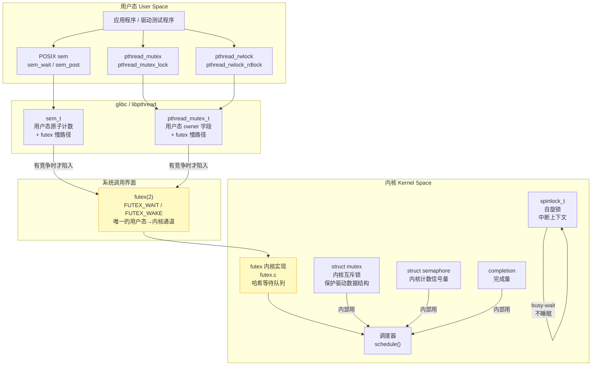
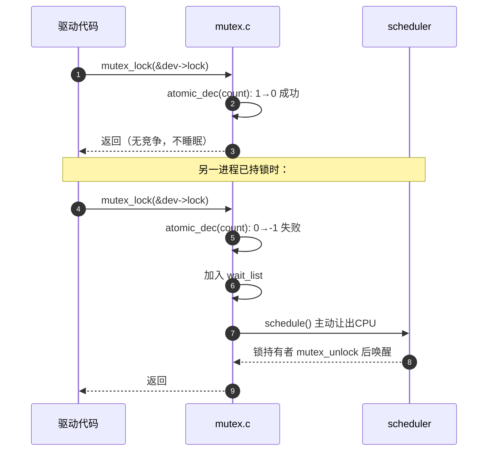

# POSIX/Linux API 与内核同步原语的关系

> [!note]
> **Ref:** `man futex(2)`, glibc source `nptl/pthread_mutex_lock.c`,
> `sdk/Linux-4.9.88/kernel/futex.c`, `kernel/locking/mutex.c`

---

## 1. 一张图说清楚



---

## 2. 两套体系，各司其职

| 维度 | 用户态（POSIX/Linux API） | 内核态原语 |
|------|--------------------------|-----------|
| **使用者** | 应用程序、用户态驱动 | 内核模块、驱动程序（.ko） |
| **头文件** | `<semaphore.h>` `<pthread.h>` | `<linux/mutex.h>` `<linux/spinlock.h>` |
| **保护的对象** | 用户态共享内存、全局变量 | 内核数据结构（设备私有数据、链表等）|
| **底层机制** | futex（有竞争才进内核） | 直接操作内核等待队列 / 自旋 |
| **能否在中断用** | 不能（用户态代码不跑在中断上下文） | spinlock 可以，mutex 不行 |
| **跨进程** | 命名信号量、mmap 共享 sem_t | 内核对象天然全局可见 |

> **最关键的认知**：`struct semaphore`（内核）和 `sem_t`（POSIX）**名字相似但毫无关系**。
> 前者在内核驱动里用，后者通过 futex 实现，供用户态程序用。

---

## 3. futex：唯一的桥梁

futex（**F**ast **U**serspace mu**TEX**）是用户态同步原语和内核之间的**唯一系统调用通道**。

### 无竞争快路径（纯用户态）

```
sem_post():
    old = atomic_fetch_add(1, &sem->value)
    if (old < 0):            // 有等待者（value 曾被减为负）
        futex(FUTEX_WAKE)    // 才陷入内核唤醒
    // 否则：直接返回，0 syscall

sem_wait():
    while (atomic_dec_if_positive(&sem->value) < 0):
        futex(FUTEX_WAIT)    // 减不下去才睡眠
```

**结论**：无竞争时 `sem_wait` / `sem_post` / `pthread_mutex_lock` **不发生任何系统调用**，性能接近裸 atomic 操作。

### futex 内核实现（有竞争时）

```c
// kernel/futex.c 简化逻辑
SYSCALL_DEFINE6(futex, ...) {
    switch (op) {
    case FUTEX_WAIT:
        // 1. 再次检查 uaddr 处的值是否等于 val（防止 TOCTOU）
        // 2. 将当前进程加入以 uaddr 为 key 的哈希等待队列
        // 3. schedule() 让出 CPU
    case FUTEX_WAKE:
        // 找到 uaddr 对应的等待队列
        // wake_up_q() 唤醒至多 nr_wake 个等待者
    }
}
```

---

## 4. 内核同步原语的实现层次

内核同步原语**不经过 futex**，直接使用调度器接口：



---

## 5. 为什么内核不用 futex？

futex 的设计前提是**地址在用户态虚拟空间**——内核用进程的虚拟地址作为等待队列的 key。

内核自己的数据结构在**内核虚拟地址空间**，可以直接用对象指针（`&mutex`）作为等待队列 key，无需绕道 futex 系统调用，而且：

- 内核代码需要在**中断上下文**运行 → 需要 spinlock（futex 会睡眠）
- 内核 mutex 需要 **lockdep 死锁检测**，与调度器深度集成
- 内核可以直接操作 `struct task_struct`，精确控制唤醒策略

---

## 6. 对应关系速查

| 用户态需求 | 推荐 API | 内核等价物 |
|-----------|---------|-----------|
| 线程互斥 | `pthread_mutex` | `struct mutex` |
| 进程间互斥 | `sem_open("/name")` | （无直接对应，内核对象天然全局）|
| 计数信号量 | `sem_init(n)` | `struct semaphore` |
| 等待一次性事件 | `sem_init(0)` + post | `completion` |
| 读多写少（可睡眠）| `pthread_rwlock` | `rw_semaphore` |
| 读多写少（不可睡眠）| 无 | `seqlock` / `rwlock_t` |
| 中断上下文保护 | 无（用户态无中断概念）| `spinlock_t` |

---

## 7. 编写驱动时的心智模型

```
写驱动 .ko 时，你活在内核空间：
    ├── 保护驱动私有数据  →  mutex（可睡眠时）/ spinlock（中断时）
    ├── 等待硬件事件完成  →  completion / wait_event
    └── 读多写少的配置表  →  rw_semaphore

写用户态测试程序时，你活在用户空间：
    ├── 线程间互斥        →  pthread_mutex（底层: futex）
    ├── 进程间事件通知    →  sem_open / sem_post（底层: futex）
    └── 生产消费模型      →  sem_init(empty/full/mutex 三件套）

两者之间的边界 = 系统调用（read/write/ioctl）
    驱动的 mutex 保护的数据 ≠ 用户态的 sem 保护的数据
    它们各自独立，通过 ioctl/read/write 交换信息
```

---

## 小结

1. **用户态 POSIX API**（sem_t、pthread_mutex）通过 **futex** 系统调用与内核交互，无竞争时纯用户态原子操作，有竞争才陷入内核等待队列。
2. **内核同步原语**（mutex、spinlock、semaphore）直接操作调度器和等待队列，供 **内核模块/驱动** 保护内核数据结构，与用户态 API **没有直接调用关系**。
3. futex 是唯一的桥梁，但它是**实现细节**，驱动开发者感知不到它的存在。
4. 名字相似的 `sem_t` ≠ `struct semaphore`，`pthread_mutex_t` ≠ `struct mutex`。
