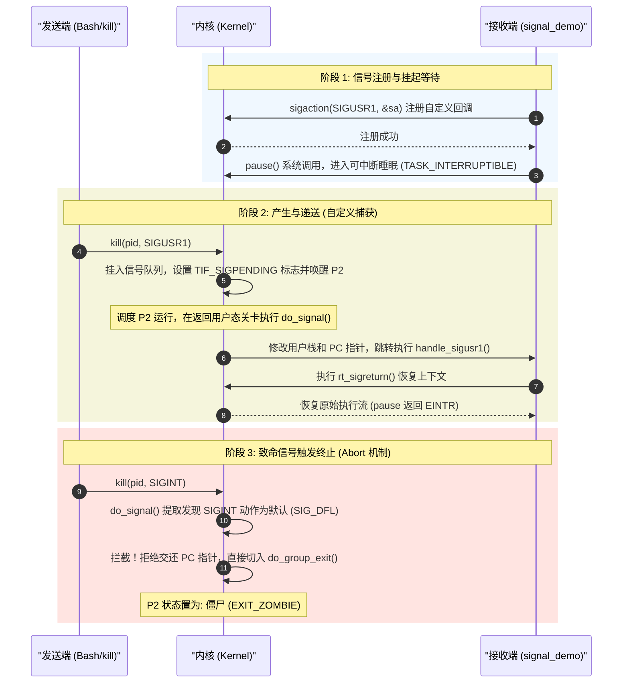

# 信号机制 (Signal) 概念与生命周期

> [!note]
> **Ref:** [The Linux Kernel API](https://www.kernel.org/doc/htmldocs/kernel-api/) , `note/Legacy/中断子系统.md`

信号是 Linux 系统中最古老的异步通知机制，本质上是一种**软件中断**。它允许内核或进程异步地通知目标进程发生了某种事件。

## 1. 信号全景时序图 (Lifecycle)

结合 Demo 实验，信号的完整生命周期包含：**注册、挂起、捕获分流、恢复/中止**。

> 若app 未注册这个信号量SIGUSR1，则会默认走exit流程。否则，仅会执行回调并resume现场。

## 2. 信号 vs 硬件中断

信号是软件对硬件中断机制的一种模拟。

| 特性 | 软中断 (Signal) | 硬中断 (Interrupt) |
| :--- | :--- | :--- |
| **触发源** | 进程或内核 (软件) | 硬件设备 (硬件) |
| **处理位置** | 目标进程上下文 | 中断上下文 (非进程) |
| **异步性** | 进程级异步 | 指令级异步 |
| **嵌套性** | 受 `sa_mask` 控制 | 受中断屏蔽位控制 |

## 3. 核心数据结构

- `task_struct->pending`: 挂起信号队列。
- `task_struct->sighand`: 信号处理函数映射表。
- `task_struct->blocked`: 信号屏蔽字（阻塞位图）。
