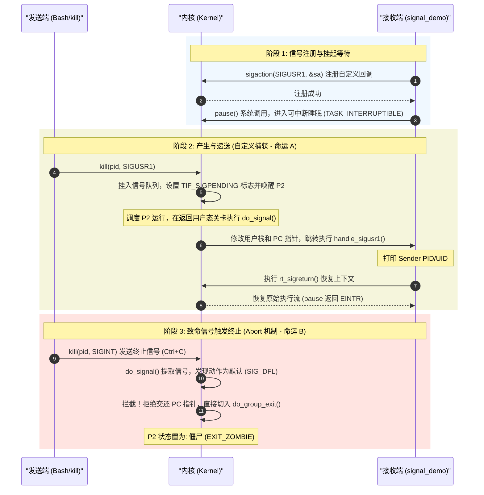

# 信号(Signal)机制演示实验

> [!note]
> **Ref:** 关联理论文档 `../00-concept-lifecycle.md`

本目录包含一个关于 Linux 进程间信号通信（Signal IPC）的实战 Demo。该 Demo 摒弃了过时的 `signal()` 函数，采用 POSIX 标准推荐的 `sigaction` 系统调用来实现对 `SIGUSR1` 信号的精准捕获和处理。

## 1. 代码框架简介

### 目录结构
```text
demo-signal/
├── signal_demo.c    # 核心源码：实现了信号注册、挂起等待与回调处理
├── Makefile         # 构建脚本：支持 out-of-source 编译 (产物输出到 output/)
├── .gitignore       # 忽略 output/ 目录下的编译产物
├── test.sh          # 自动化单终端测试脚本
└── README.md        # 本文档
```

### 核心机制 (`signal_demo.c`)

1. **高级信号注册 (`sigaction`)**：
   相比于传统的 `signal()`，`sigaction` 提供了更丰富的信号控制能力。
2. **发送者溯源 (`SA_SIGINFO`)**：
   通过为 `sa_flags` 设置 `SA_SIGINFO` 标志，内核会在调用信号处理函数时，传入额外的 `siginfo_t` 结构体。我们的 `handle_sigusr1` 回调函数借此直接提取了**发送该信号的进程 PID (`si_pid`)** 和 **用户 UID (`si_uid`)**。
3. **执行期信号屏蔽 (`sa_mask`)**：
   通过 `sigaddset(&sa.sa_mask, SIGINT);`，我们在配置中指明：**在执行 `SIGUSR1` 的处理函数期间**，如果收到了 `SIGINT` (Ctrl+C)，内核需将其暂时阻塞，直到 `SIGUSR1` 处理完毕，以防止处理函数被意外重入或中断。
4. **无缓冲输出 (`setvbuf`)**：
   使用 `setvbuf(stdout, NULL, _IONBF, 0);` 禁用了标准输出的缓冲，确保在后台运行或重定向日志时，内核传递的信号信息能被立刻打印出来。

## 2. 运行全景时序图 (Execution Flow)

本 Demo 的执行逻辑深度映射了内核对信号的“命运分流”处理：



## 3. 编译与运行测试

### 编译步骤
在当前 `demo-signal` 目录下执行 `make` 即可：
```bash
make
```
编译产物将生成在 `output/signal_demo`。

### 测试现象与操作流程

打开两个终端，或者将程序置于后台运行。

**终端 A (运行接收端):**
```bash
./output/signal_demo
```

**终端 B (作为发送端):**
向终端 A 提示的 PID 发送自定义信号 `SIGUSR1`（信号编号为 10）：
```bash
kill -SIGUSR1 <PID>
```

**现象解析：**
当终端 B 发送信号后，终端 A 的挂起状态被内核打断，迅速切换执行 `handle_sigusr1` 函数，并输出发送者的 PID 和 UID。

**测试终止：**
在终端 A 中按下 `Ctrl+C`（或者发送 `kill -SIGINT <PID>`）。由于 `SIGINT` 仅在 `SIGUSR1` 处理期间被阻塞，平时是放行的，因此程序会执行默认行为（退出），测试结束。

## 4. 进阶：单终端自动化测试脚本

在实际开发或持续集成（CI）环境中，我们通常无法手动开启多个终端进行交互式测试。此时，可以利用 Bash 的**后台运行 (`&`)**、**进程号捕获 (`$!`)** 以及**输出重定向**，在单个脚本中完成全自动化测试：

```bash
#!/bin/bash

# 1. 启动程序至后台，并将输出重定向至日志文件
./output/signal_demo > demo_output.log 2>&1 &

# 2. 获取刚才放入后台的进程 PID
DEMO_PID=$!
echo "后台进程启动，PID: $DEMO_PID"

# 给予进程 0.5 秒时间完成 sigaction 注册
sleep 0.5 

# 3. 发送测试信号
echo "发送 SIGUSR1 信号..."
kill -SIGUSR1 $DEMO_PID
sleep 0.5 # 等待进程处理完毕

# 4. 正常终止测试进程
echo "发送 SIGINT (Ctrl+C) 终止进程..."
kill -SIGINT $DEMO_PID
sleep 0.5

# 5. 打印测试结果并清理日志
echo "--- 进程输出日志 ---"
cat demo_output.log
rm demo_output.log
```
