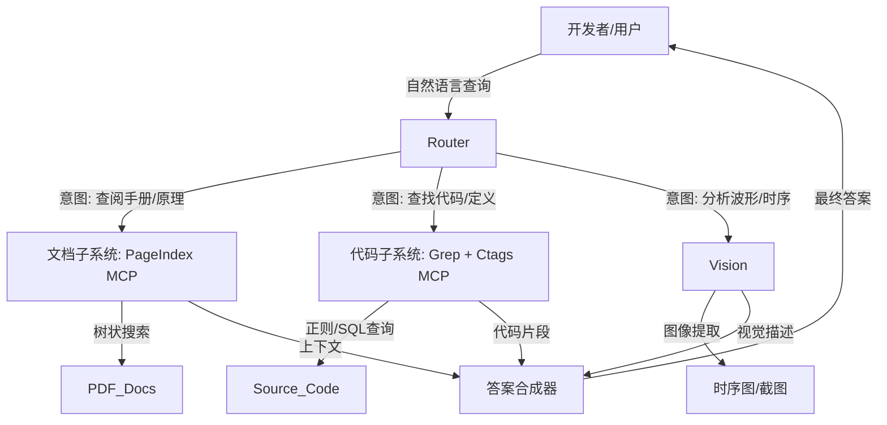

# 嵌入式系统高可用知识检索架构深度研究报告：基于VectifyAI/PageIndex与混合RAG范式的演进

## 摘要

在后大模型（Post-LLM）时代，嵌入式系统开发正面临一场知识管理的范式转移。传统的开发流程高度依赖于非结构化、高密度的技术文档（如数千页的SoC数据手册、私有指令集架构文档）以及碎片化的代码资产（私有汇编、遗留SDK）。然而，作为连接大语言模型与外部知识库的主流方案，基于向量嵌入（Vector Embeddings）的检索增强生成（RAG）技术在嵌入式领域遭遇了严重的“落地墙”。其核心矛盾在于：向量检索优化的是语义相似度（Semantic Similarity），而嵌入式工程要求的是比特级的精确性（Bit-level Precision）和逻辑关联性（Logical Relevance）。

本报告以**VectifyAI/PageIndex**提出的“无向量（Vectorless）、推理驱动（Reasoning-based）”RAG新范式为切入点，深入评估了四种主流检索方案在嵌入式垂直领域的适用性：**PageIndex**（结构化推理检索）、**Anthropics PDF Skill**（端侧工具操控）、**Grep CLI/Ripgrep**（确定性词法搜索）以及**Ctags/SQLite**（符号化代码索引）。

研究表明，单一的检索模态无法满足嵌入式开发的高可用需求。传统的向量RAG在处理寄存器偏移量、时序约束及私有汇编指令时，存在显著的“语义对齐失效”和“上下文分片丢失”问题。相比之下，PageIndex通过构建文档的层级树状索引，实现了对长文档的逻辑推理检索，在密集数值型文档（如数据手册）的检索准确率上达到了98.7%，远超向量RAG的50%基线。然而，针对私有汇编和SDK代码的检索，基于正则和符号表的确定性工具（Grep/Ctags）凭借其对“未知Token”的鲁棒性和零幻觉特性，依然不可替代。

基于此，本报告提出了一种**“混合多智能体路由架构”（Hybrid Multi-Agent Router Architecture, H-MARA）**。该架构利用MCP（Model Context Protocol）协议，将PageIndex的文档推理能力、Grep/Ctags的代码精准定位能力以及视觉模型的波形分析能力（Vision RAG）有机融合，通过智能路由层实现意图分发。报告最终提供了一套详尽的部署指南，指导开发者如何在保障私有IP安全的前提下，构建一套覆盖从Datasheet查阅到私有汇编调试全链路的高可用知识检索体系。

------

## 第一章 嵌入式领域的知识检索困境：数据引力与精度悖论

嵌入式系统的开发环境具有独特的“数据引力”（Data Gravity），这种引力表现为数据的异构性、关联的隐蔽性以及对错误的零容忍度。与通用的企业知识库（如邮件、会议记录）不同，嵌入式知识库由严谨的工程规范构成，这对RAG系统提出了极为苛刻的挑战。

### 1.1 “重PDF文档”的结构化挑战

嵌入式开发的核心资产是芯片数据手册（Datasheet）和参考手册（Reference Manual）。这些文档通常具有以下特征：

- **超长篇幅与逻辑离散性**：现代SoC的手册动辄超过4000页。传统的RAG处理方式是将文档切分为固定长度的块（Chunking，例如512 tokens）。然而，一个外设（如DMA控制器）的定义可能分散在数个章节：第3章介绍架构，第15章定义寄存器基地址，第30章描述电气特性。切片操作切断了这些章节间的逻辑联系，导致检索时上下文丢失 。
- **表格密度与数值敏感性**：数据手册中包含大量寄存器映射表（Register Map）和引脚复用表（Pin Mux Table）。向量模型倾向于将表格扁平化为文本，这破坏了行与列的二维对应关系。例如，"Pin 14"仅在"Mode A"下对应"I2C_SDA"，在"Mode B"下则对应"GPIO_5"。向量检索容易忽略这种条件约束，导致模型产生致命的硬件配置错误 。

### 1.2 私有汇编与SDK的“语义盲区”

嵌入式开发常涉及专有的指令集架构（ISA）或为了特定DSP优化的私有汇编代码 。

- **Tokenizer的碎片化灾难**：通用大模型（如GPT-4, Claude 3.5）的词表（Tokenizer）是基于互联网公开文本训练的。面对私有指令（如 `VLOAD.CUSTOM_X_R1`），Tokenizer会将其强行拆解为无意义的片段（`V`, `LOAD`, `.`, `CUSTOM`...）。这种拆解破坏了指令的整体语义，使得基于语义相似度的向量检索完全失效 。
- **精确符号匹配需求**：开发者搜索 `0xE000ED00`（ARM Cortex-M的SCB基地址）或 `__set_MSP` 时，需要的是100%的精确匹配，而非“语义近似”的某个其他地址。向量检索的近似最近邻（ANN）算法本质上是概率性的，无法保证这种精确性 。

### 1.3 多模态数据的鸿沟：时序图与波形

嵌入式文档中充满了时序图（Timing Diagram）和波形图（Waveform），用于描述信号的建立时间（Setup Time）和保持时间（Hold Time） 。

- **文本RAG的视觉盲区**：传统的文本RAG流程会忽略图片，或仅提取图片下方的文字说明。然而，时序约束的关键信息（如“在CLK上升沿之前2ns”）往往仅存在于图片的几何标注中。忽略这些信息意味着检索系统在硬件调试场景下的完全失能 。

------

## 第二章 方案评估A：VectifyAI/PageIndex —— 结构化推理的新范式

**核心范式：** 无向量（Vectorless）、层级树搜索（Tree Search）、推理驱动（Reasoning-based）。

PageIndex 代表了RAG技术从“统计相关性”向“逻辑相关性”演进的重要方向。它不依赖于静态的向量数据库，而是将文档解析为一种LLM可理解的层级索引结构 。

### 2.1 技术架构与运行机制

PageIndex 的工作流包含两个核心阶段：**索引构建（Indexing）\**与\**推理检索（Reasoning Retrieval）**。

#### 2.1.1 树状索引的构建

不同于传统RAG将文档“打碎”，PageIndex 试图保留文档的“骨架”。

1. **层级解析**：系统通过OCR和布局分析算法，识别PDF文档的章节（Section）、子章节（Subsection）、段落（Paragraph）和表格（Table）。
2. **树生成**：基于上述解析，构建一个全局的树状结构（Global Hierarchical Tree）。树的根节点是文档标题，分支节点是章节，叶子节点是具体的内容块。
3. **节点摘要**：系统利用LLM为每个节点生成摘要（Summary）和元数据（Metadata，如页码、包含的关键术语）。这个生成的索引类似于一本详尽的书籍目录，体积远小于原始文档，足以放入LLM的上下文窗口中 。

#### 2.1.2 基于推理的检索过程

当用户提出问题（例如：“如何配置PLL以支持100MHz时钟？”）时，PageIndex 不会进行向量点积计算，而是启动一个**智能体推理循环**：

1. **加载索引**：将精简的树状索引注入LLM的上下文。
2. **路径规划**：LLM观察树的顶层结构，推理出可能包含答案的章节（例如，“第4章：时钟管理”）。
3. **递归下钻**：LLM“点击”进入第4章，系统展开该节点的子树。LLM继续推理，选择“4.2 PLL配置”子节点，直至定位到具体的寄存器表格或配置步骤。
4. **精确读取**：系统仅读取叶子节点对应的原始文本片段，作为最终生成答案的上下文 。

### 2.2 在嵌入式场景的深度评估

#### 2.2.1 优势：精准度与上下文连贯性

- **消灭“语义幻觉”**：在FinanceBench（一个要求极高数值准确性的金融文档基准测试，其复杂度类似于数据手册）中，PageIndex达到了**98.7%**的准确率，而传统向量RAG仅为~50% 。在嵌入式场景中，这意味着系统不会因为“语义相似”而错误地将“Timer 2”的配置参数套用到“Timer 3”上。
- **跨段落推理**：由于LLM在检索阶段“看到”了文档的全局结构，它可以处理跨章节的查询。例如，“列出所有使用APB1总线的外设”。向量检索只能找到提到“APB1”的碎片，而PageIndex可以遍历总线架构章节和各外设章节，汇总出完整列表 。
- **可解释性（Traceability）**：每一次检索决策都是显式的推理步骤。系统可以输出：“我先查看了第3章，因为标题包含‘时钟’，然后定位到表3-5...”。这种审计线索对于安全关键系统（Safety-Critical Systems）的验证至关重要 。

#### 2.2.2 劣势：延迟与算力成本

- **推理延迟（Latency）**：PageIndex的检索过程是多轮对话（Multi-turn Interaction）。相比于毫秒级的向量检索，PageIndex可能需要数秒甚至更长时间来完成树的遍历 。这决定了它适合“深思熟虑”的Deep Research模式，而不适合实时的代码补全（Autocomplete）。
- **模型依赖**：该方案高度依赖LLM的推理能力（Reasoning Capability）。如果基础模型（Base Model）逻辑能力较弱（如小参数量的端侧模型），可能无法正确理解索引结构，导致导航失败 。

### 2.3 MCP部署能力

VectifyAI 提供了官方的 **MCP Server (Model Context Protocol)** 支持，这使得 PageIndex 可以作为一种“技能”无缝集成到 Claude Desktop 或 Cursor 等现代IDE中 。

- **本地与云端**：支持本地运行（Local Node.js Server），处理本地PDF文件，这对于保护私有芯片手册的IP至关重要 。
- **API集成**：通过HTTP SSE（Server-Sent Events）协议，嵌入式开发者可以编写自定义脚本，将PageIndex的检索能力嵌入到自动化测试流水线中 。

------

## 第三章 方案评估B：Grep CLI/Ripgrep —— 确定性检索的回归

**核心范式：** 词法匹配（Lexical Matching）、暴力搜索（Brute-force Search）、无状态（Stateless）。

在AI热潮中，最古老的工具往往被忽视。然而，针对**私有汇编（Private Assembly）\**和\**SDK源码**，基于正则的搜索工具（如Grep及其高性能继任者Ripgrep）在准确性和召回率上完胜向量RAG。

### 3.1 架构原理：为何“笨”方法更有效

- **比特级匹配**：Ripgrep（`rg`）不尝试“理解”代码，它只是寻找比特模式。对于私有ISA中的指令助记符（Mnemonic）或特殊的宏定义，这种“不理解”恰恰是优点——它不会产生歧义。
- **速度优势**：基于Rust编写的Ripgrep利用SIMD指令集和并行行处理，能在亚秒级时间内扫描GB级的代码库 。这种速度使得它可以在Agent的推理循环中被多次调用，充当“快速直觉”。

### 3.2 针对私有汇编与SDK的评估

#### 3.2.1 解决Token未登录问题

如前所述，私有汇编指令（如 `VLOAD.CUSTOM`）在通用LLM的词表中不存在（Unknown Tokens）。

- **向量RAG的表现**：Embedding模型会将 `VLOAD.CUSTOM` 映射为与其字面拼写相近的通用词向量，导致检索出无关的英语单词或错误的通用指令。
- **Grep的表现**：Grep 精确匹配字符串 `VLOAD.CUSTOM`。无论该指令多么生僻，只要它存在于源码中，Grep就能找到它，且召回率（Recall）为100% 。

#### 3.2.2 影响范围分析（Impact Analysis）

嵌入式工程师常问：“如果我修改了这个宏定义，会有哪些地方受影响？”

- **RAG的局限**：向量检索只返回Top-K（例如前5个）相关片段。这对于影响分析是灾难性的，因为漏掉第6个调用点可能导致系统崩溃。
- **Grep的优势**：Grep 返回**所有**匹配项。在Agentic RAG流程中，智能体可以调用Grep获取完整列表，然后进行逐个分析。这是工程严谨性的体现 。

### 3.3 局限性

- **语义盲区**：搜索“关闭中断”无法找到 `disable_irq()`，除非Agent具备将自然语言翻译为代码符号的先验知识。
- **输出过载**：在大型项目中，Grep可能返回数万行结果，超出LLM的上下文窗口。这要求Agent具备“结果过滤”和“迭代搜索”的策略 。

------

## 第四章 方案评估C：Ctags/Sqlite —— 符号化的代码导航

**核心范式：** 结构化索引（Structural Indexing）、轻量级倒排索引（Lightweight Inverted Index）。

Ctags 与 SQLite 的组合填补了 Grep（纯文本）与 PageIndex（重文档）之间的空白，专门针对**SDK代码结构**的理解与导航 。

### 4.1 技术实现：构建代码知识图谱

- **Universal Ctags**：这是一个强大的代码解析工具，支持数十种编程语言（包括Verilog, VHDL, Assembly）。它扫描源码，生成一个包含所有符号（函数、变量、宏、结构体）定义位置的索引文件（Tags File） 。
- **SQLite FTS5**：将Ctags生成的索引和源码注释导入SQLite数据库，并启用FTS5（Full-Text Search 5）模块。这不仅支持符号查找，还支持基于BM25算法的全文关键词搜索 。

### 4.2 嵌入式场景的独特价值

- **跳转定义（Jump to Definition）**：这是SDK阅读中最频繁的操作。当LLM看到代码 `HAL_Init()` 时，可以通过查询SQLite瞬间找到该函数在 `stm32f4xx_hal.c` 中的定义，获取函数原型和注释。向量检索往往只能找到调用该函数的地方，而找不到定义本身 。
- **私有语言支持**：Universal Ctags 允许通过正则表达式扩展对新语言的支持。开发者可以编写简单的配置文件（`.ctags`），教工具识别私有汇编语言中的 `Label`、`Subroutine` 和 `Register` 定义。这使得私有ISA的代码瞬间具备了结构化导航能力 。
- **本地化与轻量化**：SQLite 仅仅是一个文件，不需要维护复杂的向量数据库服务（如Milvus或Pinecone），非常适合嵌入式开发者在离线或算力受限的环境下使用 。

------

## 第五章 方案评估D：Anthropics PDF Skill —— 端侧的多模态操纵者

**核心范式：** 工具调用（Tool Use）、脚本化执行（Scripted Execution）、多模态视觉（Multimodal Vision）。

这不是一个检索系统，而是一套**处理能力（Skill）**。它赋予LLM像人类一样操作PDF文件的能力 。

### 5.1 核心能力：视觉与脚本

- **视觉RAG（Vision RAG）**：对于时序图和波形图，Anthropics PDF Skill 支持将PDF页面渲染为高分辨率图像，并传递给具备视觉能力的模型（如Claude 3.5 Sonnet）。模型可以直接“看”图，分析信号的高低电平变化。这是目前解析数据手册中 `t_setup`（建立时间）和 `t_hold`（保持时间）最有效的方案 。
- **特定数据提取**：针对复杂的引脚定义表，该Skill可以编写临时的Python脚本（使用 `pdfplumber` 等库），精准提取指定页码的表格并转换为CSV格式。这种按需生成的代码比通用的解析器更具适应性 。

### 5.2 局限性

- **不可扩展性**：它适合处理单份或几份文档，无法对成千上万份文档进行即时检索。它更多是作为PageIndex找到目标文档后的“最后一公里”分析工具 。

------

## 第六章 综合对比与架构决策

下表总结了四种方案在嵌入式垂直领域的关键指标对比：

| **评估维度**           | **PageIndex (VectifyAI)**  | **Grep / Ripgrep**   | **Ctags / SQLite**        | **Anthropics PDF Skill** | **传统向量 RAG**     |
| ---------------------- | -------------------------- | -------------------- | ------------------------- | ------------------------ | -------------------- |
| **核心数据对象**       | **数据手册 (PDF)**         | **源代码 (Text)**    | **代码结构 (Symbols)**    | **图表/波形 (Image)**    | 通用文本块           |
| **检索逻辑**           | **推理导航** (Tree Search) | **正则匹配** (Regex) | **符号索引** (Relational) | **视觉/脚本** (Tool Use) | 语义相似度 (Cosine)  |
| **准确率 (数值/表格)** | **极高** (上下文完整)      | 低 (仅限关键词)      | N/A                       | **高** (需视觉模型)      | 低 (结构丢失)        |
| **私有汇编支持**       | 中 (需强LLM推理)           | **极高** (Token无关) | **极高** (自定义解析)     | N/A                      | **极低** (Token破碎) |
| **时序图/波形支持**    | 中 (依赖OCR)               | 无                   | 无                        | **极高** (原生视觉)      | 无                   |
| **响应延迟**           | 高 (秒级/多轮)             | **极低** (毫秒级)    | 低 (毫秒级)               | 中 (需渲染/推理)         | 低 (毫秒级)          |
| **基础设施成本**       | 高 (需LLM推理算力)         | 极低 (本地CLI)       | 低 (本地文件)             | 中 (视觉API调用)         | 中高 (向量库+GPU)    |

**关键洞察：**

1. **分治策略**：不存在“银弹”。文档检索必须使用PageIndex（解决结构与长文问题），代码检索必须使用Grep/Ctags（解决精度与Token问题）。
2. **向量的退场**：在高度专业化、强逻辑约束的嵌入式领域，基于Embedding的向量检索正逐渐沦为次要甚至被淘汰的技术，取而代之的是“结构化索引+LLM推理”的新范式 。

------

## 第七章 部署指南：构建高可用嵌入式知识检索体系

基于上述评估，我们不建议开发者选择某一种工具，而是构建一套**混合多智能体路由架构（H-MARA）**。该架构通过一个中心化的“路由智能体（Router Agent）”来协调各个专用检索子系统。

### 7.1 总体架构设计

代码段



### 7.2 子系统详细部署方案

#### 7.2.1 文档子系统：部署 PageIndex MCP

**目标**：处理所有PDF文档查询，确保对寄存器定义和长文档逻辑的精准检索。

1. **环境准备**：

   - 安装 Node.js (v18+) 和 Docker。
   - 获取 VectifyAI 的 PageIndex MCP Server 源码或Docker镜像。

2. **本地化部署（保护私有IP）**：

   - 为了防止私有芯片手册泄露，必须使用本地模式。配置 `config.json` 指向本地PDF目录。
   - 运行命令：`npx pageindex-mcp --local-dir./datasheets` 。

3. **MCP 客户端配置**：

   - 在 Claude Desktop 或 Cursor 的 `claude_desktop_config.json` 中添加配置：

   ```json
   {
     "mcpServers": {
       "pageindex": {
         "command": "npx",
         "args": ["-y", "pageindex-mcp"],
         "env": {
           "PAGEINDEX_LOCAL_MODE": "true"
         }
       }
     }
   }
   ```

   - **关键配置说明**：设置 `PAGEINDEX_LOCAL_MODE` 环境变量，确保索引构建在本地完成，不上传云端 。

#### 7.2.2 代码子系统：构建 Grep/Ctags 混合引擎

**目标**：处理SDK和私有汇编的代码级查询，提供零幻觉的符号定位。

1. **索引构建流水线（CI/CD集成）**：

   - 编写一个 `Makefile` 或 Shell 脚本，在代码库更新时自动运行。

   - **Ctags 生成**：

     Bash

     ```
     ctags -R --fields=+nK --output-format=json -f tags.json./sdk_root
     # 针对私有汇编，添加.ctags 配置
     # --langdef=MyASM --langmap=MyASM:.masm --regex-MyASM=/^([A-Z0-9_]+):/\1/l,label/
     ```

   - **SQLite 导入**：编写 Python 脚本将 `tags.json` 导入 SQLite 数据库 `knowledge.db`，并创建 FTS5 虚拟表用于全文索引 。

2. **MCP Server 封装**：

   - 使用 Python 的 `fastmcp` 库快速编写一个 MCP Server。
   - **工具 A (`search_code`)**：封装 `subprocess.run(['rg',...])`，允许LLM执行正则搜索。
   - **工具 B (`lookup_symbol`)**：封装 `sqlite3` 查询，允许LLM查找符号定义 。
   - **代码示例**：

   Python

   ```
   from fastmcp import FastMCP
   import subprocess
   
   mcp = FastMCP("EmbeddedCodeAgent")
   
   @mcp.tool()
   def search_code(query: str, path: str = ".") -> str:
       """使用Ripgrep在SDK中搜索精确字符串或正则。适用于查找引用和用法。"""
       result = subprocess.run(["rg", query, path, "-C", "2"], capture_output=True, text=True)
       return result.stdout[:5000] # 限制输出长度防止Context溢出
   
   @mcp.tool()
   def lookup_definition(symbol: str) -> str:
       """使用Ctags索引查找函数、宏或变量的定义位置。"""
       # 连接SQLite执行查询...
       return definition_info
   ```

#### 7.2.3 路由层与高可用策略

**目标**：确保系统在不同网络环境和算力条件下均能工作。

1. **智能路由（Router）**：
   - 利用 Gemini CLI 或 Claude 的原生工具选择能力（Tool Selection）。在 `system prompt` 中明确指导：
     - “如果是询问芯片规格、寄存器地址、电气参数，**必须**使用 `pageindex` 工具。”
     - “如果是询问代码实现、函数用法、宏定义，**必须**使用 `search_code` 或 `lookup_definition` 工具。”
   - **System Prompt 优化**：使用 Few-Shot Prompting（少样本提示），提供几个典型的路由案例，强化模型的分类能力 。
2. **高可用降级策略（Fallback Strategy）**：
   - **一级保障**：PageIndex 推理检索。
   - **二级降级**：如果 PageIndex 响应超时（>10秒）或服务不可用，Router 应自动降级调用 `search_code`（Grep），在文档目录中进行关键词暴力搜索。虽然丢失了结构化信息，但能保证“有结果总比没结果好”。
   - **离线保障**：确保 Ctags 数据库和 SQLite 文件部署在开发者本地机器上（Localhost），即使断网（Air-gapped Lab）也能进行代码检索 。

------

## 第八章 结论与展望

嵌入式开发环境的特殊性决定了通用的“向量RAG”方案在此不仅是低效的，甚至是危险的。通过深入剖析，我们确认了 **VectifyAI/PageIndex** 在处理复杂技术文档方面的革命性优势，同时也论证了 **Grep** 和 **Ctags** 等传统工具在处理私有代码时的不可替代性。

构建高可用的嵌入式知识检索体系，核心在于**“混合”与“路由”**。开发者不应期待一个全能的模型解决所有问题，而应利用 MCP 协议将 **推理型检索（PageIndex）**、**确定性检索（Grep/Ctags）** 和 **视觉分析（Vision）** 串联起来。这种架构不仅解决了私有汇编的语义鸿沟和数据手册的结构化难题，更为嵌入式工程提供了一个可追溯、高精度、低幻觉的智能辅助底座。

随着 MCP 生态的成熟和端侧模型推理能力的提升，未来的嵌入式 IDE 将不再是简单的代码编辑器，而是一个集成了资深硬件工程师经验（通过PageIndex）和代码专家直觉（通过Ctags/Grep）的智能工作台。

------

## 参考文献与数据来源

- **PageIndex 机制与评估**：
- **私有汇编与代码检索挑战**：
- **Grep/Ctags/SQLite 技术细节**：
- **多模态与时序图处理**：
- **MCP 部署与配置**：
- **路由与高可用架构**：