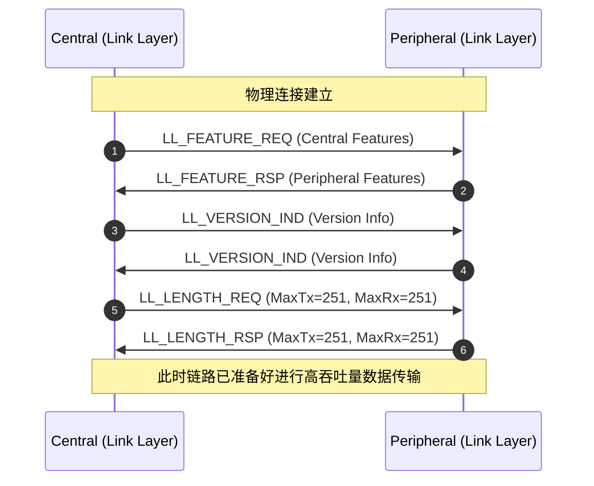

# 链路层控制协议 (Link Layer Control Protocol - LLCP)

> [!note]
> **Ref:** Bluetooth Core Spec v6.2, Vol 6, Part B (LL) - Section 5 Link Layer control

链路层控制协议 (LLCP) 是 BLE 设备在建立连接之后，用于在两个设备的 **Link Layer (链路层)** 之间直接交互控制信息的协议。LLCP 消息不对上层 (Host) 可见，专门用于管理和维护底层的物理连接。

## 1. LLCP 基础架构

所有的 LLCP 消息都是通过 **LL Data PDU (链路层数据 PDU)** 传输的。
在 LL Data PDU 的 Header 中，有一个 **LLID (Link Layer ID)** 字段用于区分数据报文和控制报文：
*   当 `LLID = 0b01` 时：表示是一个连续的数据片段 (Continuation fragment) 或空的 PDU。
*   当 `LLID = 0b10` 时：表示是一个 L2CAP PDU 的起始 (Start of an L2CAP PDU)。
*   当 `LLID = 0b11` 时：表示这是一个 **LL Control PDU (即 LLCP 报文)**。

### 1.1 LL Control PDU 格式

| 字段 | 长度 | 说明 |
| :--- | :--- | :--- |
| **Opcode** | 1 byte | 操作码，指示具体的 LLCP 命令类型。 |
| **CtrData** | 0~26 bytes | 控制数据参数，具体取决于 Opcode。 |

*注：早期 BLE 版本中 LLCP PDU 最大载荷为 27 字节（1字节 Opcode + 26字节 CtrData）。即便开启了 DLE (Data Length Extension)，LLCP PDU 仍主要保持在短包范围，但在特定的新特性中（如 Channel Sounding），CtrData 可能扩展。*

## 2. 核心 LLCP 流程 (Procedures)

LLCP 包含了众多用于维护连接状态的子流程 (Procedures)。以下是最常见和最重要的几个控制流程：

### 2.1 连接参数更新 (Connection Update Procedure)
用于修改当前的连接参数 (如 Connection Interval, Peripheral Latency, Supervision Timeout)。
*   **Opcode**: `LL_CONNECTION_UPDATE_IND`
*   **说明**: 通常由 Central 发起，用于告知 Peripheral 新的连接参数以及生效的 **Instant (触发时间点)**。Peripheral 如果需要修改参数，可以先通过 L2CAP 发送 `Connection Parameter Update Request`，或者使用下述的 `LL_CONNECTION_PARAM_REQ`。

### 2.2 连接参数请求 (Connection Parameters Request Procedure)
*   **Opcode**: `LL_CONNECTION_PARAM_REQ`, `LL_CONNECTION_PARAM_RSP`
*   **说明**: 允许 Central 或 Peripheral 都可以主动在 LL 层请求修改连接参数。这比上层通过 L2CAP 请求更加高效和直接。

### 2.3 信道映射更新 (Channel Map Update Procedure)
用于自适应跳频 (AFH)，当主设备发现某些信道存在干扰时，会更新可用信道地图。
*   **Opcode**: `LL_CHANNEL_MAP_IND`
*   **说明**: 只能由 Central 发起，包含新的信道映射表 (Channel Map) 和生效的 Instant。

### 2.4 数据长度更新 (Data Length Update Procedure)
用于协商最大传输单元 (DLE)。
*   **Opcode**: `LL_LENGTH_REQ`, `LL_LENGTH_RSP`
*   **说明**: 任何一方都可以发起，交换各自支持的最大接收/发送字节数 (MaxTxOctets, MaxRxOctets) 和时间 (MaxTxTime, MaxRxTime)。

### 2.5 PHY 更新 (PHY Update Procedure)
用于在 1M PHY, 2M PHY, 和 Coded PHY 之间切换。
*   **Opcode**: `LL_PHY_REQ`, `LL_PHY_RSP`, `LL_PHY_UPDATE_IND`
*   **说明**: 双方交换支持的 PHY 特性，并由 Central 最终决定生效的 PHY 和 Instant。

### 2.6 特性交换 (Feature Exchange Procedure)
用于发现对端 Link Layer 支持的特性 (如 DLE, 2M PHY, Extended Adv 等)。
*   **Opcode**: `LL_FEATURE_REQ`, `LL_FEATURE_RSP` (Central 发起)； `LL_PERIPHERAL_FEATURE_REQ`, `LL_FEATURE_RSP` (Peripheral 发起，蓝牙 4.1 引入)。

### 2.7 加密流程 (Encryption Procedure)
用于在链路上启动或暂停加密。
*   **Opcode**: `LL_ENC_REQ`, `LL_ENC_RSP`, `LL_START_ENC_REQ`, `LL_START_ENC_RSP`, `LL_PAUSE_ENC_REQ`, `LL_PAUSE_ENC_RSP`
*   **说明**: 配合上层 SMP (安全管理器) 派生的密钥，在 LL 层开启硬件加密引擎。

### 2.8 链路断开 (ACL Termination Procedure)
*   **Opcode**: `LL_TERMINATE_IND`
*   **说明**: 包含一个 `Error Code` 指示断开原因 (如 `0x13 Remote User Terminated Connection`)。发送或接收后，连接将在最后一个数据包确认或超时后终止。

## 3. LLCP 冲突与超时管理

### 3.1 过程冲突 (Procedure Collisions)
因为 BLE 是双向通信，Central 和 Peripheral 可能会同时发起不兼容的 LLCP 流程。
规则：
1. **优先级**：如果 Central 和 Peripheral 同时发起修改同一参数的流程（如同时发起 PHY Update），通常 Peripheral 的请求会被拒绝 (回复 `LL_REJECT_EXT_IND`，带有错误码 `0x23 Transaction Collision`)，而 Central 的流程继续。
2. **状态机排他性**：某些 LLCP 流程不能与其他流程同时进行。例如，在 Encryption Procedure 进行时，不能发起其他需要改变参数的流程。

### 3.2 响应超时 (Procedure Response Timeout - LL_PRT)
所有要求对端响应的 LLCP 流程都受 **Procedure Response Timeout (默认 40 秒)** 的保护。
如果一方发起了 `LL_LENGTH_REQ` 或 `LL_PING_REQ` 等，且在 40 秒内没有收到对应的 `RSP`，链路层会认为对端设备出现严重错误，从而触发 **链路断开 (Link Loss)**，上报 HCI Error Code `0x22` (LMP Response Timeout / LL Response Timeout)。

## 4. LLCP 交互示例 (Mermaid MSC)

下面是一个包含 Feature Exchange 和 DLE 协商的典型 LLCP 握手流程：

