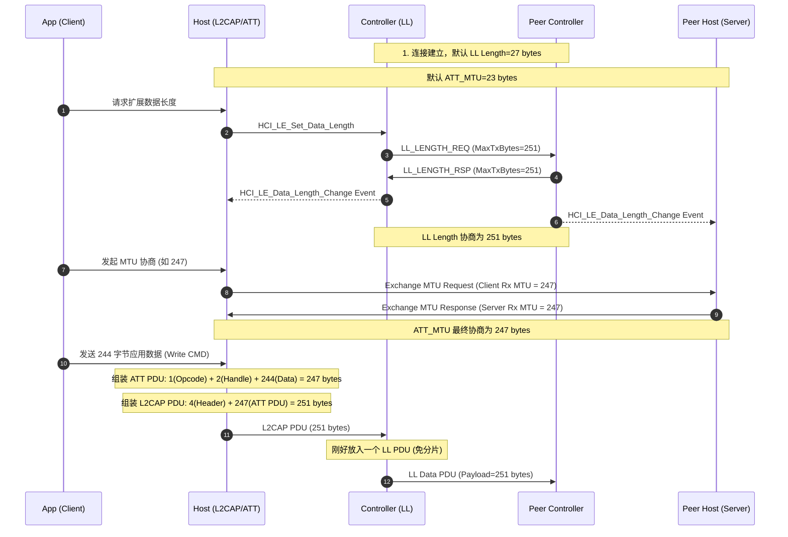

# 最大传输单元 (Max Transfer Unit - MTU)

> [!note]
> **Ref:** 
> - Bluetooth Core Spec v6.2, Vol 3, Part A (L2CAP) - Section 5.1 Maximum Transmission Unit (MTU)
> - Bluetooth Core Spec v6.2, Vol 3, Part G (GATT) - Section 4.3.1 Exchange MTU
> - Bluetooth Core Spec v6.2, Vol 6, Part B (LL) - Section 5.1.9 Data Length Update procedure

在低功耗蓝牙 (BLE) 协议栈中，数据从应用层向下传递至物理层空口发送时，每一层都有其特定的传输大小限制。**MTU (Maximum Transmission Unit)** 及相关长度参数深刻影响着蓝牙的传输速率和效率。理解不同层的 MTU 是优化 BLE 吞吐量的关键。

## 1. 协议栈各层的 MTU / 长度限制

BLE 协议栈中存在三个核心的“长度”概念，它们自上而下分别是：**ATT_MTU**、**L2CAP MTU** 和 **LL Data Length**。

### 1.1 ATT_MTU (Attribute Protocol MTU)
ATT_MTU 指的是 **Client 和 Server 之间单个 ATT 数据包的最大长度**。
*   **默认值**: 23 字节。
*   **有效载荷 (Payload)**: 除去 1 字节的 Opcode 和 2 字节的 Handle，默认情况下应用层一次最多只能发送 20 字节的有效数据。
*   **协商方式**: 通过 `Exchange MTU Request` 和 `Exchange MTU Response` 进行协商。双方取各自支持的 `Client Rx MTU` 和 `Server Rx MTU` 中的较小值作为最终的 ATT_MTU。
*   **最大值**: 512 字节（受限于规范）。

### 1.2 L2CAP MTU
L2CAP MTU 指的是 **L2CAP 层能够接收的 L2CAP SDU (Service Data Unit) 的最大长度**。
*   对于 LE 基础 L2CAP 通道，默认的 L2CAP MTU 也是 23 字节。
*   如果 ATT_MTU 被协商为一个较大的值 (例如 247)，L2CAP MTU 也必须足够大以容纳该 ATT 数据包。
*   如果 L2CAP SDU (即组装好的 ATT PDU) 大于底层的 LL Data PDU 载荷限制，L2CAP 层会将数据进行 **分片 (Fragmentation)**，交由底层分多次发送；接收端再进行 **重组 (Recombination)**。

### 1.3 LL Data PDU 长度 (Data Length Extension - DLE)
LL 层的长度限制指的是 **单个链路层数据 PDU (LL Data PDU) 中有效载荷的最大字节数**。
*   **默认值**: 27 字节。
*   **结构**: 27 字节中包含 4 字节的 L2CAP Header (Length + CID)，因此默认情况下，留给上一层的数据刚好是 23 字节。
*   **数据长度扩展 (DLE)**: 蓝牙 4.2 引入了 DLE 特性，允许通过 LLCP 的 `LL_LENGTH_REQ` 和 `LL_LENGTH_RSP` 协商将单个 LL PDU 的有效载荷提升至最大 **251 字节**。

## 2. 吞吐量优化与 MTU 协商流程

为了获得最大吞吐量，通常需要同时扩大 ATT_MTU 和 LL Data Length。

### 2.1 长度协商时序图 (MSC)

### 2.2 最优组合说明

如果只增大了 ATT_MTU，而没有开启 DLE (LL Length 依然是 27 字节)，那么一个大的 ATT 数据包 (例如 247 字节) 会在 L2CAP 层被切分为多个小分片 (Fragmentation)。由于每个底层的 LL PDU 都要携带头尾信息并占用空口时间，且受到 IFS (Inter Frame Space) 限制，这种方式的传输效率非常低下。

**最优吞吐量公式/组合**：
*   设定 `ATT_MTU = 247`
*   设定 `LL Payload = 251` (刚好等于 ATT_MTU + 4 字节的 L2CAP Header)
这样，一个完整的 ATT 封包可以直接塞入一个底层的 LL PDU 发送，无需 L2CAP 分片，最大化空口利用率。

## 3. L2CAP 分片与重组机制 (Fragmentation and Recombination)

当 L2CAP PDU 尺寸超过控制器（Controller）所支持的 HCI ACL 数据包最大长度（或 LL 层当前的最大 PDU 尺寸）时，Host/Controller 会对数据进行处理。

*   **Host 到 Controller 的分包 (Segmentation)**: L2CAP 层将大的 PDU 拆分为多个 HCI ACL 数据包。第一个 ACL 报文的边界标志 (PB Flag) 标记为 `First non-flushable` (或 `First automatically flushable`)，后续报文标记为 `Continuing fragment`。
*   **Controller 层的分片 (Fragmentation)**: 如果 HCI ACL 数据包仍然大于当前 LL 层的 `MaxTxOctets` (如未开启 DLE 时的 27 字节)，LL 层内部会自动将 ACL 数据切分成多个链路层 PDU (LL Data PDU)，并在 Header 中的 `LLID` 字段使用 `0b01` (Continuation fragment) 和 `0b10` (Start of an L2CAP PDU) 进行标记。

> [!important]
> 虽然蓝牙协议栈自动支持底层的分片与重组，保证了上层应用可以任意发送大包（在 ATT_MTU 范围内），但频繁的分片会导致巨大的通信开销。因此，**对齐各层的 MTU 和 Length (使其整数倍映射)** 是优化蓝牙吞吐量最重要的架构思维。
