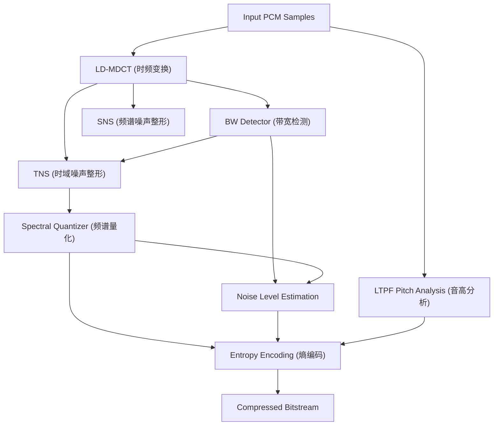

# LC3 技术细节与处理流程

> [!note]
> **Ref:** [Docs/LE-Audio/LC3_v1.0.1.pdf](Docs/LE-Audio/LC3_v1.0.1.pdf)

LC3 是一种谱变换编码器，通过一系列复杂的数学模块实现高效的音频压缩。

---

## 1. 编码器高层架构 (Encoder Overview)

LC3 编码器将时域 PCM 信号转换为频域表示，并进行感知加权量化。

---

## 2. 核心模块详解

### 2.1 LD-MDCT (低延迟改进型离散余弦变换)
- **功能**: 将音频采样从时域转换到频域。
- **窗口**: 使用不对称窗口以降低延迟。
- **谱线**: 对于 48 kHz (10ms)，产生 480 条谱线，其中前 400 条用于编码（对应 20 kHz 带宽）。

### 2.2 带宽检测器 (Bandwidth Detector)
- **功能**: 自动检测信号的有效带宽（NB 4k, WB 8k, SSWB 12k, SWB 16k, FB 20k）。
- **作用**: 引导 TNS 和噪声填充，防止在高频空白区引入人工噪声。

### 2.3 SNS (Spectral Noise Shaping)
- **功能**: 通过 16 个缩放因子对 MDCT 频谱进行整形。
- **算法**: 使用 Split VQ (矢量量化) 和 Pyramid VQ (金字塔量化)。
- **目的**: 使量化噪声符合人耳的掩蔽特性。

### 2.4 TNS (Temporal Noise Shaping)
- **功能**: 在频域上对系数进行预测，以减少时域上的量化噪声扩散。
- **场景**: 对具有瞬态特性（如打击乐）的信号尤为重要。

### 2.5 LTPF (Long Term Postfilter)
- **功能**: 分析音频的基音 (Pitch)。
- **作用**: 在编码器侧检测音高，并在解码器侧通过后滤波器增强语音/音乐的谐波结构。

---

## 3. 帧结构与比特分配 (Frame Structure)

LC3 的比特流载荷大小在 20 到 400 字节之间。

| 区域 | 描述 |
| :--- | :--- |
| **Side Info** | 包含带宽、全局增益、SNS 指数、TNS 数据、LTPF 参数。 |
| **Spectral Data** | 经过算术编码的频谱系数。 |
| **Residual Data** | 量化后的残差数据。 |

---

## 4. 丢包补偿 (PLC)
虽然 LC3 规范不强制要求特定的 PLC 算法，但附录 B 提供了一个参考实现：
- 当 **BFI (Bad Frame Indication)** 触发时，解码器进入 PLC 模式。
- 利用历史帧的音高信息进行波形外推。
- 随着连续丢包，逐渐降低输出音量。
