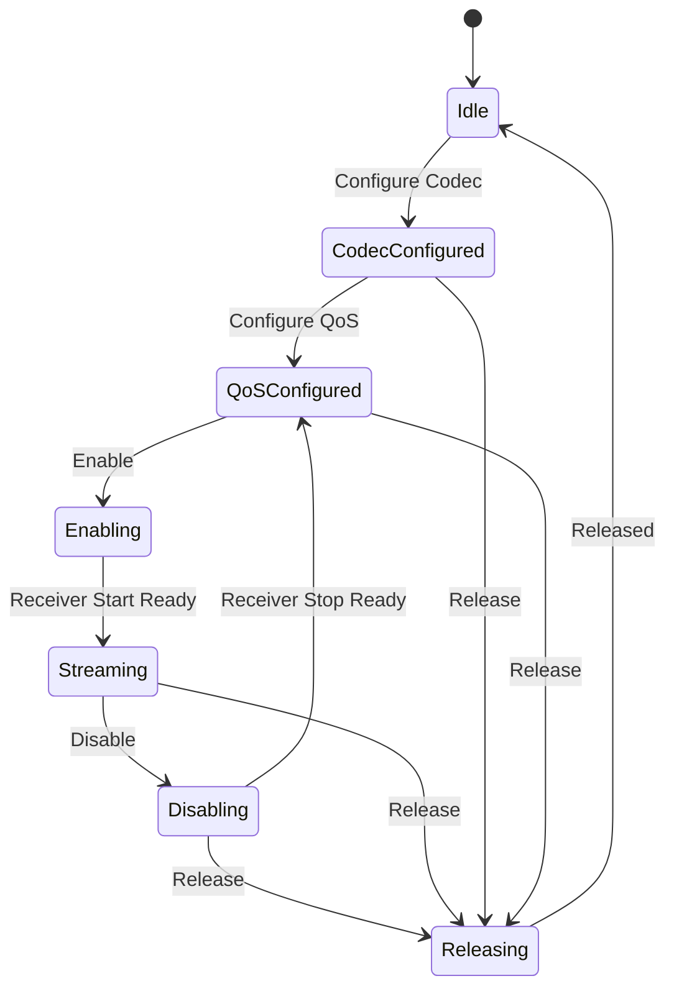

# BAP 架构与角色 (Basic Audio Profile)

> [!note]
> **Ref:** [Docs/LE-Audio/Basic Audio Profile ... .html](Docs/LE-Audio/Basic Audio Profile _ Bluetooth® Technology Website.html)

BAP 是 LE Audio 的核心配置文件，定义了如何在 LE 链路上建立、配置和控制音频流。它支持单播 (Unicast) 和广播 (Broadcast) 两种模式。

---

## 1. 角色定义 (Profile Roles)

BAP 定义了多个角色，涵盖了从音频源到接收器的各种设备类型。

### 1.1 单播角色 (Unicast Roles)
| 角色 | 典型设备 | 描述 |
| :--- | :--- | :--- |
| **Unicast Server** | 耳机、扬声器 | 运行 ASCS 和 PACS 服务，接收音频流（Sink）或发送麦克风流（Source）。 |
| **Unicast Client** | 手机、电脑 | 控制 Server 的状态机，启动音频配置和流建立。 |

### 1.2 广播角色 (Broadcast Roles)
| 角色 | 典型设备 | 描述 |
| :--- | :--- | :--- |
| **Broadcast Source** | 电视、公共广播 | 发送不可连接的等时流 (BIS)。 |
| **Broadcast Sink** | 耳机 | 同步并接收 BIS 流。 |
| **Broadcast Assistant** | 手机 | 扫描广播流，并通过 BASS 服务将同步信息传送给 Sink。 |
| **Scan Delegator** | 耳机 | 运行 BASS 服务，协助接收 Assistant 转发的广播扫描信息。 |

---

## 2. 核心服务 (Core Services)

BAP 依赖于以下 GATT 服务来实现音频控制：

- **PACS (Published Audio Capabilities Service)**:
    - 用于宣告设备支持哪些 Codec (如 LC3)、采样率、帧时长等能力。
    - 包含 Sink/Source PAC 特征。
- **ASCS (Audio Stream Control Service)**:
    - **最核心服务**。通过 ASE (Audio Stream Endpoint) 状态机控制单播音频流。
    - 客户端通过写入 ASE Control Point 来触发状态转换。
- **BASS (Broadcast Audio Scan Service)**:
    - 用于广播流的同步。Scan Delegator 接收 Assistant 写入的广播源信息。

---

## 3. 音频流状态机 (ASE State Machine)

单播音频流的生命周期由 ASCS 的 ASE 状态机管理：

---

## 4. 传输依赖 (Transport Dependencies)

- **LE ACL**: 传输 GATT 控制指令。
- **LE ISOC (Isochronous Channels)**:
    - **CIS (Connected Isochronous Stream)**: 用于单播。
    - **BIS (Broadcast Isochronous Stream)**: 用于广播。
- **CIG (Connected Isochronous Group)**: 多个 CIS 的组合（如 TWS 左右耳流）。
