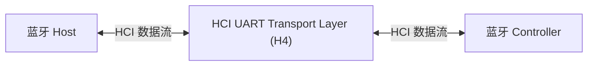
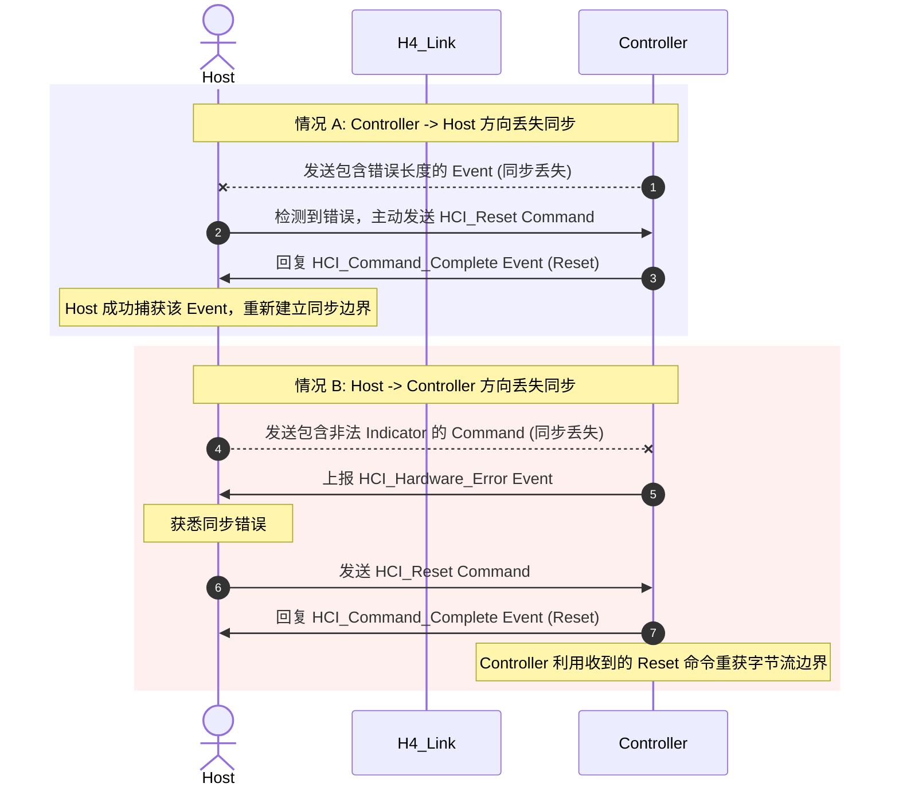

# HCI UART Transport Layer (H4)

> [!note]
> **Ref:** Bluetooth Core Specification v6.2 - Vol 4, Part A UART Transport Layer

HCI UART 传输层（通常称为 H4）旨在使蓝牙 HCI 能够通过同一块 PCB 上的两个 UART 之间的串行接口进行通信。HCI UART 传输层假设 UART 通信线路是**无误码**的（free from line errors）。如果线路存在较高错误率，应当考虑使用三线制 UART（Three-wire UART，即 H5）传输层。

## 1. 架构与连接

HCI UART 传输层位于主机（Host）与控制器（Controller）之间。所有的 HCI 命令（Command）、事件（Event）以及数据包（Data packets）都会流经此层，但该层**不会对这些包进行解码**。



## 2. 物理串口设置 (RS232 Settings)

HCI UART 传输层对底层物理串口的参数配置要求如下：

| 参数项 | 设定值 | 备注 |
| :--- | :--- | :--- |
| **Baud rate (波特率)** | 厂商自定义 | 常见如 115200, 921600 等 |
| **Data bits (数据位)** | 8 | 固定要求 |
| **Parity bit (校验位)** | 无 (No parity) | 固定要求 |
| **Stop bit (停止位)** | 1 | 固定要求 |
| **Flow control (流控)** | RTS / CTS | **必须开启硬件流控** |

> **硬件流控说明**：
> RTS/CTS 硬件流控仅用于防止临时性的 UART 缓冲区溢出，**不能**用于替代 HCI 协议自身的流量控制机制。
> - 当 CTS = 1 时：允许 Host / Controller 发送数据。
> - 当 CTS = 0 时：禁止 Host / Controller 发送数据。
>
> 物理连线需采用**交叉线（Null-modem）**方式：即本地 TXD 接远端 RXD，本地 RTS 接远端 CTS，反之亦然。

## 3. H4 协议格式 (Protocol)

HCI 协议本身并未在包头提供区分 HCI 包类型的能力。因此，当不同的 HCI 包通过同一个物理接口发送时，H4 协议要求在紧挨着 HCI 包之前**强制添加一个字节的包指示符 (Packet Indicator)**。

由于所有的 HCI 包内部都包含长度字段，H4 层利用该长度字段来确定当前 HCI 包的边界。当完整接收到一个 HCI 包后，接收方会期望下一个字节是新的包指示符。

### 3.1 封包格式

```text
+-------------------+-----------------------------------------------+
| Packet Indicator  |                   HCI Packet                  |
|     (1 Byte)      |             (Header + Payload)                |
+-------------------+-----------------------------------------------+
```

### 3.2 包指示符定义 (Packet Indicators)

目前共定义了 5 种 HCI 数据包指示符：

| 包类型 | 指示符 (Indicator) | 传输方向 |
| :--- | :--- | :--- |
| **HCI Command packet** | `0x01` | 仅 Host -> Controller |
| **HCI ACL Data packet** | `0x02` | 双向传输 |
| **HCI Synchronous Data packet** | `0x03` | 双向传输 |
| **HCI Event packet** | `0x04` | 仅 Controller -> Host |
| **HCI ISO Data packet** | `0x05` | 双向传输 |

## 4. 错误恢复机制 (Error Recovery)

由于 H4 假设物理链路可靠，其错误恢复机制主要用于处理**同步丢失 (Loss of Synchronization)**。同步丢失通常指检测到了非法的包指示符，或者解析出的 HCI 包长度超出了合理范围。

一旦发生同步丢失，必须对 Controller 进行复位以恢复通信链路：


