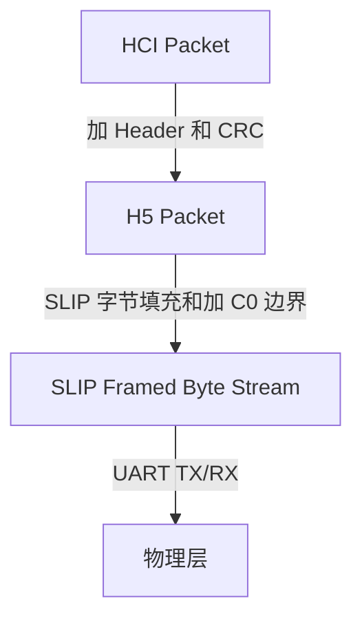

# HCI Three-wire UART Transport Layer (H5)

> [!note]
> **Ref:** Bluetooth Core Specification v6.2 - Vol 4, Part D Three-wire UART Transport Layer

与 H4 (UART) 假设底层无误码不同，HCI 三线制 UART 传输层（通常称为 H5）是一种**面向连接的、可靠的**传输协议。它被设计用于容忍线路误码、溢出和突发错误的 UART 环境。它得名于最少只需三根线（TX, RX, GND）即可工作（当然也支持硬件流控），其可靠性通过软件层的确认和重传机制来保障。

## 1. 协议栈层次与封包流程

H5 协议通过两个主要的步骤对原生的 HCI 包进行封装：
1. **Packet Header & CRC**: 为每个 HCI 包附加一个专用的 4 字节头部（描述包序列、类型等），并在尾部可选地附加 2 字节的 Data Integrity Check（CRC）。
2. **SLIP Layer (滑动层)**: 使用 SLIP 协议 (基于 RFC 1055) 对整个带头部的包进行成帧（Framing）和字节填充（Octet Stuffing），以便在连续的字节流中划定包的物理边界。



## 2. SLIP 成帧协议 (SLIP Layer)

SLIP 用于在不可靠的字节流中恢复包的边界，主要利用特殊的界定符（`0xC0`）。
- **包边界**: 在每个包的开始和结束插入 `0xC0`。
- **转义机制 (Escape Sequences)**: 如果原始数据中包含了转义字符，必须替换发送：
  - `0xC0` 被替换为 `0xDB 0xDC`
  - `0xDB` 被替换为 `0xDB 0xDD`
  - (如果启用了软件流控) `0x11` -> `0xDB 0xDE`，`0x13` -> `0xDB 0xDF`
- **同步恢复**: 如果接收方失去同步，它只需要丢弃收到的所有字节，直到遇到下一个 `0xC0`，即可重新捕获下一个包的起点。

## 3. H5 包结构 (Packet Format)

每个经过封装的 H5 数据包具有如下结构：

| Packet Header (4 Bytes) | Payload (0 - 4095 Bytes) | Data Integrity Check (0 或 2 Bytes) |
| :--- | :--- | :--- |

### 3.1 Packet Header 解析

Header 占据 4 字节 (32 bits)，按位定义如下：

- **Sequence Number (3 bits)**: 包序号（0-7 循环）。仅对可靠包有效。
- **Acknowledge Number (3 bits)**: 确认号。指示本端**期望接收的下一个**可靠包的 Sequence Number。
- **Data Integrity Check Present (1 bit)**: 如果置 1，说明 Payload 后附有 16-bit CCITT-CRC。
- **Reliable Packet (1 bit)**: 如果置 1，此包为可靠包（需要确认和重传）；置 0 则为不可靠包。
- **Packet Type (4 bits)**: 包类型。H5 不仅传输 HCI 数据，还传输链路控制和确认包：
  - `0`: 纯确认包 (ACK)
  - `1 - 5`: 对应 HCI Command, ACL, SCO, Event, ISO (其中 SCO 默认不可靠，其余均为可靠包)
  - `14`: Vendor Specific
  - `15`: 链路控制包 (Link Control Packet)
- **Payload Length (12 bits)**: Payload 的字节数。
- **Header Checksum (8 bits)**: 用于校验这 4 字节 Header 本身未受损的校验和。

## 4. 可靠传输与滑动窗口机制 (Reliable Packets & ARQ)

H5 通过 Sequence/Acknowledge 机制实现类似 TCP 的可靠传输：
1. 发送方每发出一个新可靠包，Sequence Number `+ 1 (mod 8)`。
2. 接收方收到正确的包后，在发送回复数据（或纯 ACK 包）时，将 Acknowledge Number 更新为期待的下一个 Seq。
3. **滑动窗口 (Sliding Window)**: 发送方在未收到确认的情况下，最多可连续发送的包数量（窗口大小由链路建立时协商，范围 1~7）。
4. **重传**: 如果超时未收到 ACK，发送方会原样重传这些包。如果接收方收到的包存在 CRC 错误、长度错误或 Header 校验错误，将直接丢弃；若收到乱序的包，也会发回包含当前期望 Seq 的 ACK。

## 5. 链路建立状态机 (Link Establishment)

在可以传输任何 HCI 数据之前，H5 两端必须完成链路建立过程（类似握手）。所有链路配置包类型均为 `15`，且不带 CRC。

```mermaid
stateDiagram-v2
    [*] --> Uninitialized
    Uninitialized --> Initialized: 收到 SYNC_RESPONSE
    Initialized --> Active: 收到 CONFIG_RESPONSE

    state Uninitialized {
        note "周期性广播 SYNC (0x01 0x7E)
用于波特率自动侦测"
    }
    state Initialized {
        note "周期性广播 CONFIG
携带配置参数(滑动窗口、CRC等)"
    }
    state Active {
        note "链路建立完成
可正常收发 HCI 数据"
    }
```

## 6. 低功耗机制 (Low Power)

H5 允许两端协商进入休眠状态，定义了三种消息进行状态同步：
1. **Sleep 消息 (0x07 0x78)**: 通知对端“我要睡觉了”。
2. **Wakeup 消息 (0x05 0xFA)**: 如果已知对方休眠，发送数据前必须先循环发送 Wakeup，直到收到响应。
3. **Woken 消息 (0x06 0xF9)**: 收到 Wakeup 后，回复 Woken，宣告自身已唤醒准备就绪。

## 7. 物理连线 (Hardware Configuration)

1. 必须使用 3 根线：**TX**, **RX**, **GND**。
2. 可选支持硬件流控（RTS / CTS）。若不支持硬件流控，H5 可通过协商开启**带外软件流控 (OOF Software Flow Control)**，利用 XON (`0x11`) 和 XOFF (`0x13`) 控制对端发送，这需要依赖 SLIP 的转义机制将其与普通 payload 数据区分开。
