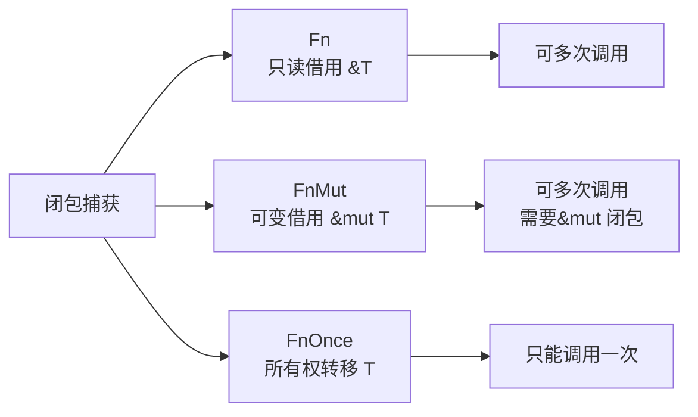
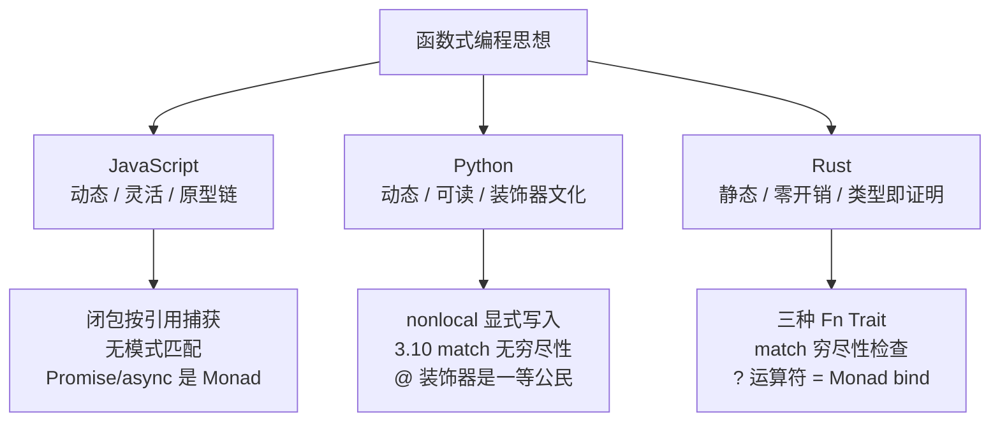

# Lambda Is All U Need

> [!note]
> **Ref:**
> - [MDN - Closures](https://developer.mozilla.org/en-US/docs/Web/JavaScript/Closures)
> - [PEP 318 - Decorators](https://peps.python.org/pep-0318/)
> - [The Rust Reference - Closures](https://doc.rust-lang.org/reference/types/closure.html)

> 函数式编程（Functional Programming, FP）并不是一门语言，而是一种看待"计算"的方式：
> **计算即求值，而非执行指令**。
> 一旦你把"函数"当成和"整数"同等地位的值去使用，整个语言的面貌就会发生变化。

本文从 FP 的五个关键特征出发，横向对比 **JavaScript / Python / Rust** 三门风格迥异的语言，理解它们各自的设计权衡。

---

## 1. 函数一等公民 (First-class Function)

> **判定标准**：函数能否像普通值一样被"赋值、传参、返回、存入容器"。

### 1.1 三语对照

```javascript
// JavaScript —— 函数就是对象，甚至可以挂属性
const add = (a, b) => a + b;
add.desc = "加法";
[1, 2, 3].map(x => x * 2);
```

```python
# Python —— 函数是 object，拥有 __name__、__doc__ 等属性
def add(a, b): return a + b
add.desc = "加法"              # 可以动态赋属性
list(map(lambda x: x * 2, [1, 2, 3]))
```

```rust
// Rust —— 函数是"值"，但类型系统把 fn / Fn / FnMut / FnOnce 分得很清
fn add(a: i32, b: i32) -> i32 { a + b }
let f: fn(i32, i32) -> i32 = add;          // 函数指针
let v: Vec<i32> = (1..=3).map(|x| x * 2).collect();
```

### 1.2 语言差异

| 维度 | JavaScript | Python | Rust |
|---|---|---|---|
| 函数本质 | Object（可挂属性） | Object（可挂属性） | 零尺寸类型 / 指针 / Trait 对象 |
| 类型系统 | 动态、无签名约束 | 动态（可 `typing.Callable` 标注） | 静态，区分 `fn` 指针与 `Fn*` Trait |
| 运行时开销 | 堆分配 + GC | 堆分配 + GC | 零开销抽象（编译期单态化） |

> Rust 的"一等公民"是**有类型等级**的：
> `fn` 是裸函数指针，而 `Fn / FnMut / FnOnce` 是三种捕获能力不同的闭包 Trait，体现了 **所有权系统对 FP 的改造**。

---

## 2. 闭包 (Closure)

> **闭包 = 函数 + 它所捕获的词法环境**。
> 三种语言对"捕获"这件事的态度，直接反映了它们的内存模型。

### 2.1 JS：词法作用域 + 引用捕获

```javascript
function counter() {
  let n = 0;
  return () => ++n;          // 捕获变量 n 的"引用"
}
const c = counter();
c(); c(); c();                // 1, 2, 3
```

JS 闭包按**引用**捕获外层变量，因此闭包可以修改外部状态——这也是 `var` 经典循环陷阱的根源。

### 2.2 Python：捕获"变量名绑定"，写入需 `nonlocal`

```python
def counter():
    n = 0
    def inc():
        nonlocal n            # 不写则 n 被视为 inc 的局部变量
        n += 1
        return n
    return inc
```

Python 的作用域规则是 **LEGB**（Local → Enclosing → Global → Built-in），闭包变量默认只读，写入必须显式声明。

### 2.3 Rust：三种捕获模式由编译器推导

```rust
let s = String::from("hello");

let by_ref   = || println!("{}", s);      // impl Fn     —— 借用 &s
let by_mut   = || { /* 修改 s */ };        // impl FnMut  —— 可变借用
let by_move  = move || drop(s);            // impl FnOnce —— 所有权转移
```



> Rust 的闭包**没有运行时魔法**——它本质上是一个由编译器自动生成的匿名 struct，
> 字段就是被捕获的变量，`call` 方法就是函数体。这也是"零开销"的秘密。

---

## 3. 装饰器 / 高阶函数语法糖 (Decorator)

> 装饰器的本质：**`f = decorator(f)`**，只是换了个好看的写法。

### 3.1 Python：`@` 是官方钦定的糖

```python
def timeit(fn):
    def wrapper(*args, **kw):
        import time; t = time.time()
        r = fn(*args, **kw)
        print(f"{fn.__name__}: {time.time()-t:.3f}s")
        return r
    return wrapper

@timeit                        # 等价于 slow = timeit(slow)
def slow(n): ...
```

### 3.2 JavaScript：TC39 Stage 3 + TypeScript 广泛使用

```javascript
function log(original, context) {
  return function (...args) {
    console.log(`call ${context.name}`);
    return original.apply(this, args);
  };
}

class Api {
  @log                         // 类方法装饰器
  fetch(url) { /* ... */ }
}
```

> JS 装饰器长期处于"提案"阶段，直到 2023 年才在 Stage 3 稳定。
> TS/Babel 用户其实已经用了很多年"旧版"装饰器，二者语义**并不兼容**。

### 3.3 Rust：没有运行时装饰器，但有**过程宏 (proc-macro)**

```rust
#[derive(Debug, Clone)]        // 属性宏：编译期生成 impl
struct Point { x: f64, y: f64 }

#[tokio::main]                 // 把 async fn main 改写成同步 main + runtime
async fn main() { /* ... */ }
```

Rust 用 **宏系统** 在编译期完成 Python/JS 需要运行时做的事：
- 优点：零运行时开销、类型安全；
- 代价：宏调试难度高，IDE 支持弱于普通代码。

| 特性 | Python `@` | JS `@` | Rust `#[...]` |
|---|---|---|---|
| 执行时机 | 运行时（模块加载时） | 运行时 | **编译期** |
| 本质 | 高阶函数调用 | 高阶函数调用 | 代码生成 (AST 变换) |
| 类型安全 | 无 | 有限 (TS) | 完全静态 |

---

## 4. 语法糖 (Syntactic Sugar)

> 同一种 FP 思想，在不同语言里会被糖衣包装成截然不同的样子。

### 4.1 管道与链式调用

```javascript
// JS —— 方法链
[1,2,3,4,5].filter(x => x%2).map(x => x*x).reduce((a,b) => a+b);
```

```python
# Python —— 生成器 + 推导式
sum(x*x for x in range(1,6) if x % 2)
```

```rust
// Rust —— Iterator Trait，惰性求值，编译期内联,零成本抽象
(1..=5).filter(|x| x % 2 == 1).map(|x| x*x).sum::<i32>()
```

### 4.2 解构 / 扩展

| 语法 | JS | Python | Rust |
|---|---|---|---|
| 数组解构 | `const [a, ...rest] = xs` | `a, *rest = xs` | `let [a, rest @ ..] = xs` |
| 对象解构 | `const {x, y} = p` | `**kwargs` | `let Point { x, y } = p` |
| 扩展 | `[...a, ...b]` | `[*a, *b]` | （无直接等价，靠 `chain`） |

### 4.3 `?` 与 Option/Result

Rust 的 `?` 操作符是 FP 思想（Monad 的 bind）落到工程语言的一次成功"糖化"：

```rust
fn parse(s: &str) -> Result<i32, ParseIntError> {
    let n: i32 = s.trim().parse()?;   // 失败则自动 early-return Err
    Ok(n * 2)
}
```

对应的 JS 写法（需要手写 try/catch）和 Python 写法（异常或 `Optional`）都远不及 `?` 优雅——**类型系统强制你处理错误**。

---

## 5. 模式匹配 (Pattern Matching)

> 模式匹配是 FP 从 ML / Haskell 继承来的"最锋利的刀"。

### 5.1 Rust：模式匹配是语言核心

```rust
enum Shape {
    Circle(f64),
    Rect { w: f64, h: f64 },
    Triangle(f64, f64, f64),
}

fn area(s: &Shape) -> f64 {
    match s {
        Shape::Circle(r)          => std::f64::consts::PI * r * r,
        Shape::Rect { w, h }      => w * h,
        Shape::Triangle(a, b, c) if a + b > c => {
            let s = (a + b + c) / 2.0;
            (s * (s-a) * (s-b) * (s-c)).sqrt()
        }
        _ => 0.0,
    }
}
```

特性：
- **穷尽性检查 (exhaustiveness)**：漏写分支编译不过；
- **守卫 (guard)**：`if` 子句；
- **嵌套解构 + 绑定 (`@`)**；
- 编译期展开为跳转表，零成本。

### 5.2 Python：3.10 引入 `match`（Structural Pattern Matching）

```python
match point:
    case (0, 0):                 print("原点")
    case (x, 0):                 print(f"X 轴 {x}")
    case (0, y):                 print(f"Y 轴 {y}")
    case Point(x=x, y=y) if x == y: print("对角线")
    case _:                      print("其他")
```

> 注意：Python 的 `match` **不做穷尽性检查**，遗漏分支时会静默落入"其他"或抛异常。

### 5.3 JavaScript：尚无原生模式匹配

TC39 有 [pattern matching proposal](https://github.com/tc39/proposal-pattern-matching)，但仍在 Stage 1。
目前只能靠 **解构 + `switch(true)`** 模拟：

```javascript
switch (true) {
  case shape.kind === "circle": return Math.PI * shape.r ** 2;
  case shape.kind === "rect":   return shape.w * shape.h;
  default: return 0;
}
```

---

## 6. 横向总结



### 三条主线的取舍

| 维度 | JavaScript | Python | Rust |
|---|---|---|---|
| **哲学** | "一切皆对象，动态即自由" | "可读性压倒一切" | "零成本抽象 + 内存安全" |
| **FP 深度** | 中（依赖 lib：Ramda / fp-ts） | 中（itertools / functools） | 深（类型系统贯彻 FP） |
| **学习曲线** | 低 | 低 | 高 |
| **适用场景** | Web 前端 / Node 服务 | 脚本 / 数据 / AI | 系统编程 / 嵌入式 / 高性能服务 |

---

## 7. 结语：Lambda Is All U Need?

> "Lambda Is All You Need" 是一个略带调侃的致敬 (*Attention Is All You Need*)。
> 真正要表达的是：**当你把"函数"这一原语打磨到极致时，几乎所有复杂抽象都可以由它构造出来**——
> 对象、控制流、错误处理、并发原语，莫不如是。

- **JS** 用 Lambda 把异步世界缝合成 Promise 链；
- **Python** 用 Lambda + 装饰器把"元编程"带入日常；
- **Rust** 用 Lambda 配合所有权与 Trait，证明 FP 可以既安全又零开销。

选择哪门语言，本质上是在选择**你愿意为抽象付出怎样的代价**。
而理解 FP，就是理解这一切代价背后的共同语言。
