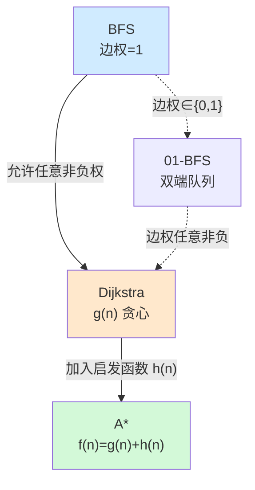
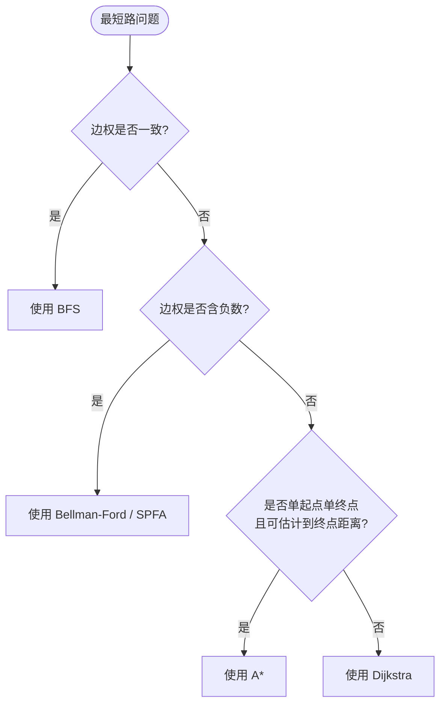

# 最短路算法总览：Dijkstra / BFS / A\*

> [!note]
> **Ref:** 本文基于 Dijkstra (1959) 原始论文思想，以及 Hart, Nilsson & Raphael (1968) 提出的 A\* 算法；结合图论经典教材 CLRS《Introduction to Algorithms》第 24 章。

最短路问题是图论中最核心的问题之一。本文对比三大经典算法——**BFS**、**Dijkstra**、**A\***，揭示它们之间的演化关系与本质差异。

## 一、核心定位

| 算法 | 本质 | 典型场景 |
|------|------|----------|
| **BFS** | 按层扩展的无权最短路 | 网格图、社交网络层数、边权恒定 |
| **Dijkstra** | 贪心 + 优先队列的非负权最短路 | 路由协议、地图导航、一般带权图 |
| **A\*** | Dijkstra + 启发函数的目标导向搜索 | 游戏寻路、单点对单点路径 |

## 二、三者特性对比

### 2.1 综合对照表

| 维度 | BFS | Dijkstra | A\* |
|------|-----|----------|-----|
| 边权要求 | 必须全部相同（通常为 1） | 非负 | 非负 |
| 数据结构 | FIFO 队列 | 小顶堆（优先队列） | 小顶堆 |
| 排序键 | 入队顺序（= 层数） | `g(n)` 实际代价(边权) | `f(n) = g(n) + h(n)`(h为启发函数) |
| 搜索方向 | 无方向（向四周扩散） | 无方向（向四周扩散） | 朝终点"偏向" |
| 求解类型 | 单源到所有点 | 单源到所有点 | 单源到单目标 |
| 时间复杂度 | `O(V+E)` | `O((V+E) log V)` | 取决于 `h` 的质量 |
| 空间复杂度 | `O(V)` | `O(V)` | `O(V)` |
| 最优性保证 | ✅ | ✅ | 需 `h` 可采纳（admissible） |

### 2.2 演化关系图

**本质理解**：三者是**同一思想在不同约束下的特化**——以"已知到起点的最小代价"为依据扩展节点，差别仅在于**如何度量"最小"**。

## 三、各算法特性详解

### 3.1 BFS — 无权最短路的极简实现

**核心特性**：
- 按"层"扩展，每层代表距起点的步数。
- **首次访问即最短**：节点第一次被加入队列时的距离就是最终答案。
- FIFO 队列天然保证出队顺序按距离升序（因队列中最多存在相邻两层 `k` 与 `k+1`）。

**局限**：
- 仅适用于边权一致的场景。
- 无法反映"不同地形代价不同"的真实世界。

**扩展：01-BFS**——当边权仅有 0 和 1 两种时，用双端队列（`deque`）替代普通队列，权 0 的边 `push_front`，权 1 的边 `push_back`，仍保持 `O(V+E)`。

### 3.2 Dijkstra — 非负权最短路的黄金标准

**核心特性**：

- **贪心策略**：

  - 维护`dist`向量，记录所有点到起点的最小距离；确定已优化集合U 和未优化集合V(优先队列维护)。初始状态:`dist[*]=\inx dist[A]=0,U={},V={ALL}` ;`V.top()=A` .

  - 每轮pop V队首，记为u，更新其所有后驱节点v，进行relax操作。更新完成后，v更新前驱路径`v.parent = u`,以dist[v]为键值，进入优先队列V。
  - u所有后驱节点relax后，出队V，重复操作，直到队列为空，此时由终点`Z.parent`溯源即可得知完整最短路路径

- **松弛操作**：`dist[v] = min(dist[v], dist[u] + w(u,v))`。,其中u为v的前驱顶点

- **正确性前提**：边权非负——否则"最小 `dist` 即最终值"的贪心假设被破坏。

**实现变体**：

| 实现 | 时间复杂度 | 适用 |
|------|-----------|------|
| 邻接矩阵 + 线性扫描 | `O(V²)` | 稠密图 |
| 邻接表 + 二叉堆 | `O((V+E) log V)` | 最常用 |
| 邻接表 + 斐波那契堆 | `O(E + V log V)` | 理论最优 |

**局限**：
- 不支持负权边（需 Bellman-Ford / SPFA）。
- **无方向性**：即便只需到单个目标点，也会向四周均匀扩展，浪费算力。

### 3.3 A\* — 目标导向的启发式搜索

**核心特性**：
- 对每个节点维护两个值：
  - `g(n)`：起点到 `n` 的实际代价（同 Dijkstra）。
  - `h(n)`：`n` 到终点的**估计**代价（启发函数）。
- 优先队列以 `f(n) = g(n) + h(n)` 为键排序。
- 扩展方向"偏向"终点，大幅减少无效搜索。

**启发函数 `h(n)` 的要求**：

| 性质 | 定义 | 结果 |
|------|------|------|
| **可采纳性 (admissible)** | `h(n) ≤` 真实剩余代价 | 保证最优解 |
| **一致性 (consistent)** | `h(u) ≤ w(u,v) + h(v)` | 无需重复扩展节点 |

**常见 `h` 的选择**（网格图）：
- 曼哈顿距离：`|x₁-x₂| + |y₁-y₂|`（四向移动）。
- 切比雪夫距离：`max(|dx|, |dy|)`（八向移动）。
- 欧几里得距离：`√(dx² + dy²)`（任意方向）。

**两个极端**：
- `h(n) = 0` → 退化为 **Dijkstra**（无启发信息）。
- `h(n) =` 真实剩余代价 → 直奔目标，零冗余扩展（但通常不可得）。
- `h(n) >` 真实代价 → 可能更快，但**不再保证最优**（称为 Weighted A\*）。

## 四、选择决策流程

## 五、关键结论

1. **BFS 是 Dijkstra 在均匀边权下的退化最优实现**——FIFO 队列隐式维护了距离有序性，省去堆的 `O(log V)` 开销。
2. **Dijkstra 是 A\* 在零启发信息下的特例**——当 `h(n) ≡ 0`，A\* 完全退化为 Dijkstra。
3. **算法选择的本质是"边权分辨率"与"信息丰富度"的权衡**：
   - 边权越单一 → 越应使用轻量的 BFS 类方法。
   - 终点信息越丰富 → 越应使用 A\* 这类导向性搜索。
4. 三者都遵循同一骨架：**"维护候选集合 + 按某种键取最优 + 松弛邻居"**，差别只在"键"的定义。

## 六、扩展阅读方向

- **多源最短路**：Floyd-Warshall (`O(V³)`)、Johnson 算法。
- **负权图**：Bellman-Ford、SPFA。
- **动态图**：D\* Lite、LPA\*（增量式 A\*，适合地图变化的机器人路径规划）。
- **双向搜索**：Bidirectional Dijkstra / Bidirectional A\*，从起点与终点同时扩展。
