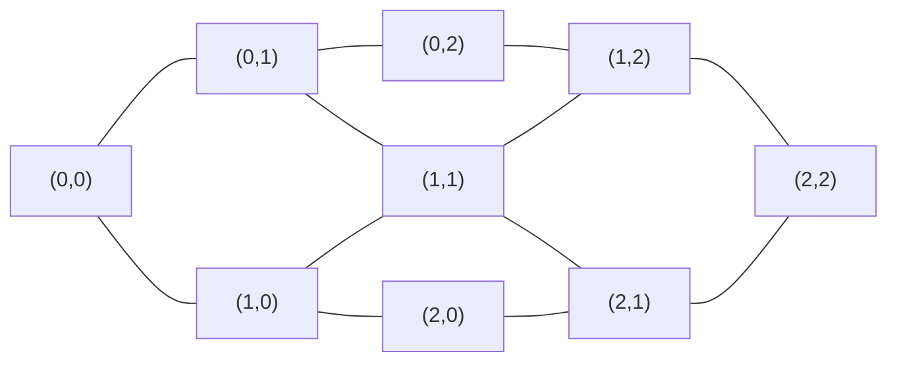
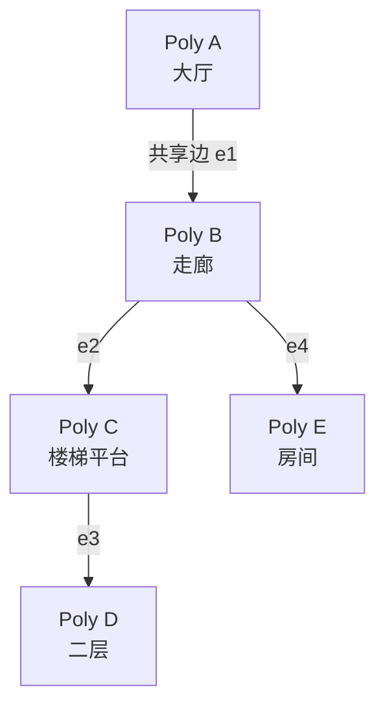
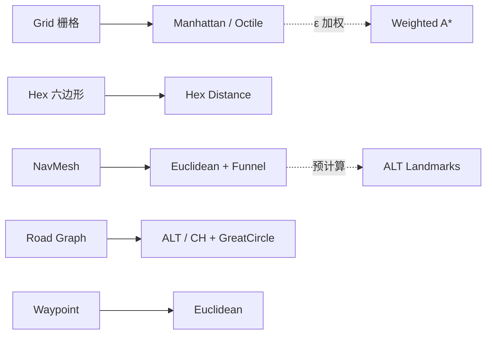

# 导航地图的数据结构建模与寻路启发函数设计

> [!note]
> **Ref:** 本地 `0.overview.md`；Amit Patel, [Red Blob Games — A\* Pages](https://www.redblobgames.com/pathfinding/a-star/introduction.html)；Mikko Mononen, [Recast & Detour](https://github.com/recastnavigation/recastnavigation)

导航地图的核心问题，是把**连续空间**压缩成一张**有限图** `G = (V, E, w)`，让 algorithm可以在 `O(E log V)` 级别的代价内找到"足够好"的路径。建模方式决定了可行路径的上界，启发函数 (heuristic) 决定了搜索效率。两者独立演化，但必须匹配。

---

## 一、空间 → 图：四种典型建模

不同场景下，节点 `V` 表达的语义差别很大。选错建模，再好的算法也救不回来。

### 1.1 Grid（栅格图）

最朴素的建模：把世界切成正方形/六边形格子，每格一个节点，相邻格连边。

- **优点**：建模极简；地形修改 (挖墙、爆炸) 代价为 `O(1)`；天然支持 RTS / Roguelike / 塔防。
- **缺点**：节点数随分辨率 `N²` 爆炸；8-邻接会产生锯齿路径 (zigzag)，需要后处理 string-pulling。
- **变体**：
  - **Hex Grid**：六邻接，各向同性更好 (六个邻居等距)，常见于《文明》《英雄无敌》。
  - **JPS (Jump Point Search)**：在均匀 grid 上跳过对称节点，实测比 A* 快 10×。

### 1.2 Waypoint Graph（路点图）

手动在关卡中标注关键点 (门口、楼梯口、掩体)，点之间拉可见性边。

- **优点**：节点数极少 (几十到几百)，搜索几乎免费；设计师可控。
- **缺点**：偏离路点的局部微调需要"脱图 / 回图"逻辑；动态障碍不友好。
- **适用**：老派 FPS 的 bot (Quake III bot、CS bot)。

### 1.3 NavMesh（导航网格）

把可行走表面三角化 (或凸多边形化)，多边形即节点，共享边即图边。

- **优点**：多边形内部可直线穿越，路径自然平滑；节点数比 grid 少 1–2 个数量级；支持 3D 非平面地形。
- **缺点**：烘焙 (bake) 过程复杂；动态修改需要重烘局部 tile (Recast 的 `DT_TILECACHE`)。
- **寻路两阶段**：① 在多边形图上 A\* 找一串 poly；② 用 **funnel algorithm** 在这串 poly 内抽出最短折线。
- **适用**：几乎所有 3A (Unity NavMesh、UE NavMesh、Recast/Detour)。

### 1.4 Road Graph（真实道路图）

现实导航 (Google Maps / OSM) 中，节点是**交叉口**，边是**路段**，边权融合距离 / 限速 / 实时路况 / 拥堵 / 收费。

- 边权是**时变函数** `w(e, t)`，严格意义上是 *time-dependent shortest path* 问题。
- 工程上用 **Contraction Hierarchies (CH)** / **Customizable Route Planning (CRP)** 预处理，把大陆级查询压到毫秒级。

---

## 二、边权 `w(e)`：代价的语义

`w` 不只是距离。真正把"路径规划"变成"行为规划"的是边权的设计。

| 场景 | 边权构成 |
| --- | --- |
| RTS 单位 | `distance + terrain_cost × tile_type + threat_field` |
| FPS bot | `distance + exposure_to_enemy × k1 + height_change × k2` |
| 汽车导航 | `length / speed_limit + traffic_delay + toll × money_weight` |
| 物流/无人机 | `distance + energy(battery, altitude) + no_fly_penalty` |

**关键原则**：边权单位必须**与启发函数单位一致** (通常都是"预计时间"或"预计距离")，否则 A\* 的可采纳性 (admissibility) 会崩。

---

## 三、启发函数 `h(n)`：寻路的灵魂

A\* 的评估函数：`f(n) = g(n) + h(n)`
- `g(n)`：从 start 到 `n` 的**实际**累计代价。
- `h(n)`：从 `n` 到 goal 的**估计**剩余代价。

`h` 必须满足：
- **Admissible (可采纳)**：`h(n) ≤ h*(n)`，即永不高估。→ 保证最优解。
- **Consistent (一致 / 单调)**：`h(n) ≤ w(n, n') + h(n')`。→ 保证每个节点只需展开一次 (closed set 可信)。

### 3.1 常见启发函数选型

| 移动模型 | 推荐 `h` | 说明 |
| --- | --- | --- |
| 4-邻接 grid | **Manhattan** `|dx|+|dy|` | 严格 admissible，tight |
| 8-邻接 grid (斜走 √2) | **Octile** `max(dx,dy) + (√2−1)·min(dx,dy)` | 考虑斜线实际代价 |
| NavMesh / 连续空间 | **Euclidean** `√(dx²+dy²)` | 各向同性 |
| 六边形 grid | **Hex distance** `(|dx|+|dy|+|dx+dy|)/2` | 立方坐标系下最简 |
| 道路网 | **大圆距离 / speed_max** | 下界：直线距离除以理论最高速 |

### 3.2 权重调参的 trade-off

把 `f = g + ε·h` (ε > 1) 叫做 **Weighted A\***：

- `ε = 0`：退化为 Dijkstra，最优但最慢。
- `ε = 1`：标准 A\*，最优且高效。
- `ε > 1`：**inadmissible**，失去最优性，但展开节点骤减；游戏里常用 `ε ≈ 1.2–2.0`，以"看起来合理的路径"换 10× 速度。
- `ε → ∞`：退化为 Greedy Best-First，贪心走直线，常被墙卡住。

### 3.3 高级启发：预计算下界

对静态大地图 (MMO 世界地图、道路网)，纯几何启发太松。工程做法：

- **Landmark / ALT (A\*, Landmarks, Triangle inequality)**：预选若干 landmark 节点，存每个节点到 landmark 的真实最短距离；查询时用三角不等式给出紧下界。
- **Contraction Hierarchies**：预处理构建层次化 shortcut，查询时双向搜索，几乎 `O(log V)`。这是现代汽车导航的底层。

### 3.4 特殊场景的启发构造

- **带方向/转弯代价**：状态空间扩展为 `(node, heading)`，`h` 取最小可能转弯 + 直线。
- **多 agent 避让**：`h` 可叠加 **时空地图** 上其他 agent 的占用惩罚 (CBS / WHCA\*)。
- **能量/电量约束**：`h` 必须同时是代价下界和资源消耗下界，否则可能搜到不可达路径。

---

## 四、建模与启发的匹配矩阵

---

## 五、实践启示

1. **先定建模，再选算法**。grid 上用 CH 是浪费；道路网用 raw A\* 是灾难。
2. **启发函数单位 = 边权单位**。混用 (米 vs. 秒) 会偷偷破坏 admissibility。
3. **游戏可以接受次优路径**，现实导航不能 (用户会投诉多绕 5 公里)——ε-weight 的容忍度差两个数量级。
4. **动态障碍的代价不在搜索，在重建图**。NavMesh tile cache、grid 的 D\* Lite 都是为此而生。
5. **可视化 closed set**。看 A\* 展开了哪些节点，比看最终路径更能暴露启发函数的问题。
