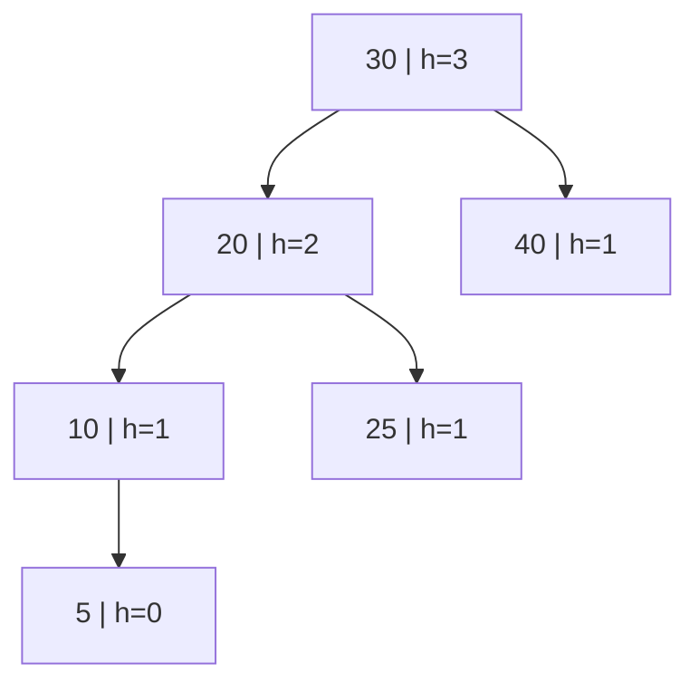
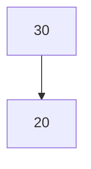
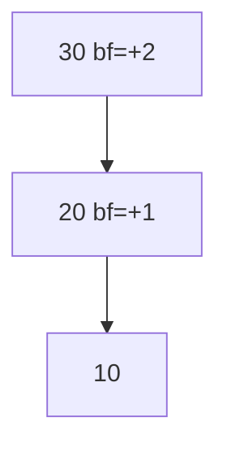
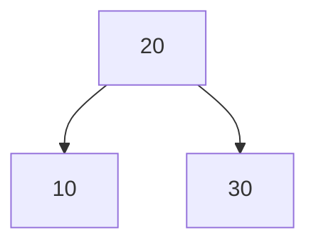
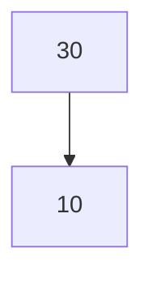
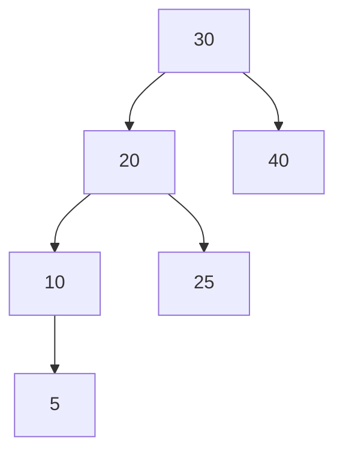
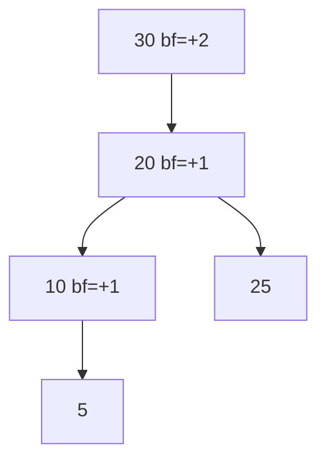
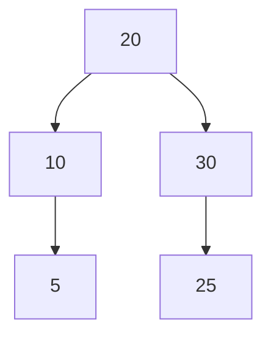

# AVL 树 AVL Tree

> [!note]
> **Ref:** Adelson-Velsky & Landis, 1962；本地笔记 `rotate.md`

## 1. 定义与不变量

AVL 是最早被发明的自平衡 BST。对**每一个节点**都强制：

```text
balance-factor(n) = height(n.left) − height(n.right) ∈ {−1, 0, +1}
```

- 高度上界：`h ≤ 1.44 · log₂(n+2) − 0.328`
- 每节点额外存 `height`（或 `bf`）
- 任何 `insert` / `delete` 破坏了 bf，就用 **rotate.md** 中的旋转就地修复



## 2. Query（与普通 BST 完全一致）

平衡性只影响性能，不改查找逻辑。

```text
AVL-SEARCH(n, key):
    while n ≠ NIL and key ≠ n.key:
        if key < n.key: n ← n.left
        else:           n ← n.right
    return n
```

时间 **O(log n)**，因 AVL 最严格 → 查找通常比 RB 快一点。

## 3. Insert

三步：**BST 插入 → 回溯更新 height → 发现 |bf|=2 时旋转修复**。

### 3.1 四种失衡的判别

设 `z` 是自下而上回溯中**第一个**失衡的节点，`y = z` 的更高子，`x = y` 的更高子：

| z.bf | y 是 z 的 | x 是 y 的 | 形态 | 修复 |
|---|---|---|---|---|
| +2 | 左 | 左 | LL | Right-Rotate(z) |
| +2 | 左 | 右 | LR | Left-Rotate(y); Right-Rotate(z) |
| −2 | 右 | 右 | RR | Left-Rotate(z) |
| −2 | 右 | 左 | RL | Right-Rotate(y); Left-Rotate(z) |

### 3.2 LL 例（依次插入 30, 20, 10）

**① 插入 30, 20 后**



**② 插入 10 → LL 失衡**



**③ Right-Rotate(30) 修复**



### 3.3 LR 例（插入 30, 10, 20）

**① 插入 30, 10 后**



**② 插入 20 → LR 失衡**


**③ Left-Rotate(10)：之字化为直线 LL**


**④ Right-Rotate(30)：完成**


### 3.4 伪代码

```text
AVL-INSERT(T, key):
    T.root ← BST-INSERT-REC(T.root, key, NIL)

BST-INSERT-REC(n, key, parent):
    if n == NIL:
        return NEW-NODE(key, parent, h=1)
    if key < n.key:
        n.left  ← BST-INSERT-REC(n.left,  key, n)
    elif key > n.key:
        n.right ← BST-INSERT-REC(n.right, key, n)
    else:
        return n                              # 已存在
    UPDATE-HEIGHT(n)
    return REBALANCE(n)

REBALANCE(n):
    bf ← BF(n)
    # LL
    if bf >  1 and BF(n.left)  ≥ 0:
        return RIGHT-ROTATE(n)
    # LR
    if bf >  1 and BF(n.left)  <  0:
        n.left ← LEFT-ROTATE(n.left)
        return RIGHT-ROTATE(n)
    # RR
    if bf < -1 and BF(n.right) ≤ 0:
        return LEFT-ROTATE(n)
    # RL
    if bf < -1 and BF(n.right) >  0:
        n.right ← RIGHT-ROTATE(n.right)
        return LEFT-ROTATE(n)
    return n
```

**关键点**：插入最多触发**一次**旋转（单旋或双旋），之后所有祖先 bf 自动恢复。

## 4. Delete

四步：**BST 删除 → 回溯每一层更新 height → 每层都调用 REBALANCE**。

与插入不同：**删除可能在多层持续触发旋转**，最坏 O(log n) 次。

### 4.1 BST 删除的三种基本情形

| 被删节点 | 处理 |
|---|---|
| 叶子 | 直接摘除 |
| 仅 1 个孩子 | 孩子顶替 |
| 2 个孩子 | 用**右子树最小值**（中序后继）的 key 覆盖，然后递归删那个后继 |

### 4.2 删除触发失衡示例

从下面的树删除 `40`：

**① 删除前**



**② 删除 40 → LL 失衡**



**③ Right-Rotate(30) 修复**



### 4.3 伪代码

```text
AVL-DELETE(T, key):
    T.root ← DELETE-REC(T.root, key)

DELETE-REC(n, key):
    if n == NIL: return NIL
    if key < n.key:
        n.left  ← DELETE-REC(n.left,  key)
    elif key > n.key:
        n.right ← DELETE-REC(n.right, key)
    else:
        # 命中
        if n.left == NIL or n.right == NIL:
            n ← (n.left ≠ NIL) ? n.left : n.right
        else:
            succ ← MIN(n.right)                # 中序后继
            n.key   ← succ.key
            n.right ← DELETE-REC(n.right, succ.key)
    if n == NIL: return NIL
    UPDATE-HEIGHT(n)
    return REBALANCE(n)                        # 关键：每层都要检查
```

## 5. 复杂度与适用场景

| 操作 | 时间 | 旋转次数 |
|---|---|---|
| query  | O(log n) | 0 |
| insert | O(log n) | ≤ 2（单旋或双旋，共计一次修复） |
| delete | O(log n) | O(log n)（可能沿路径多次修复） |

**适用**：读远多于写的场景（只读索引、字典、内存型 B-tree 替代品）。

**不适用**：高频写入场景——用 RB 树（见 `rbtree.md`）更合算，因为它每次修改最多 3 次旋转。
