# 红黑树 Red-Black Tree

> [!note]
> **Ref:** CLRS 4e Ch.13；本地笔记 `rotate.md` / `avl.md`
>
> 一个"按 key 有序$lc < par < rc$的动态集合,且支持快速插入/删除——这正是 RB 树的甜点区。

## 1. 五条性质（不变量）

```text
1. 每个节点非红即黑
2. 根节点为黑
3. 每个叶子（NIL 哨兵）为黑
4. 红节点的两个孩子都是黑（不能有连续红）
5. 从任一节点出发，到其所有后代 NIL 的路径上黑节点数相同（黑高 bh 一致）
```

**关键推论**：性质 4 + 5 联合 ⇒ **最长路径 ≤ 2 · 最短路径**，于是 `h ≤ 2 · log₂(n+1)`。平衡得比 AVL 宽松，但换来**修改时最多 O(1) 次旋转**。

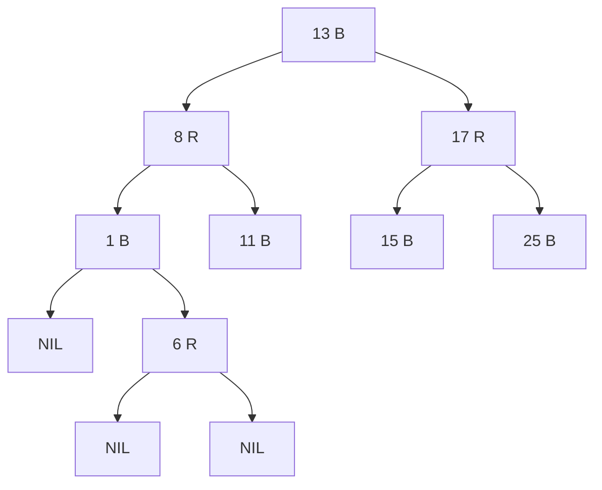

实现中通常用**单个共享哨兵 `T.nil`**（黑色）代替所有空指针，简化边界处理。

## 2. Query

与普通 BST 查找完全相同，颜色在查询中不起作用。时间 **O(log n)**。

```text
RB-SEARCH(n, key):
    while n ≠ T.nil and key ≠ n.key:
        n ← (key < n.key) ? n.left : n.right
    return n
```

## 3. Insert

**两阶段**：① 普通 BST 插入并染成**红色**；② `RB-INSERT-FIXUP` 修复可能被破坏的性质 2 或 4。

**为什么新节点染红？** 红节点不改变任何路径的黑高（性质 5 自动保持），仅可能违反性质 4（父红子红）。把问题局部化。

### 3.1 修复的三种 case（对称的左右各三种，这里只列"父是祖父左孩"的版本）

设 `z` 为当前违规节点（红），`p = z.parent` 红，`g = p.parent` 黑，`u = g.right` 为**叔叔**。

| Case | 条件 | 操作 | 效果 |
|---|---|---|---|
| 1 | `u` 红 | `p`、`u` 变黑，`g` 变红，`z ← g` | 把"红红冲突"上抛两层，继续循环 |
| 2 | `u` 黑 且 `z` 是 `p` 的**右孩**（之字形） | `z ← p`；`LEFT-ROTATE(z)` | 化为 case 3 |
| 3 | `u` 黑 且 `z` 是 `p` 的**左孩**（直线） | `p` 变黑，`g` 变红；`RIGHT-ROTATE(g)` | 终局 |

### 3.2 Case 1 示例：叔叔红，纯粹重染色

**① 插入 15 前**

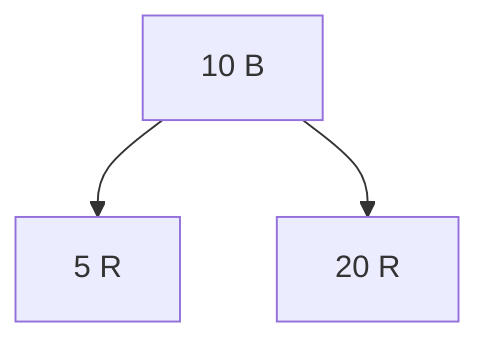

**② 插入 15 → 父 20 红、子 15 红冲突；叔叔 5 红**


**③ Case1：5、20 变黑，10 变红，`z` 上抛到 10**

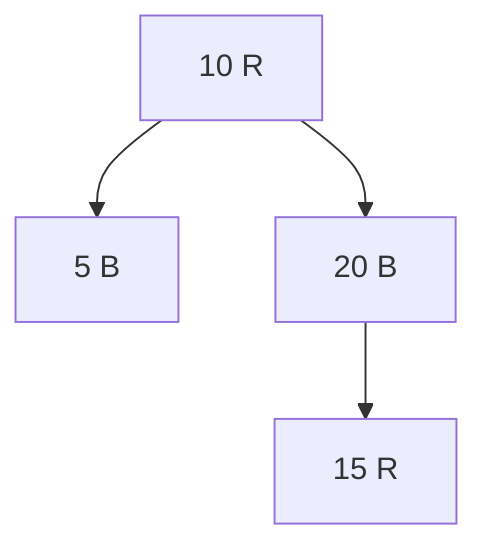

**④ 循环结束后根强制变黑（性质 2）**

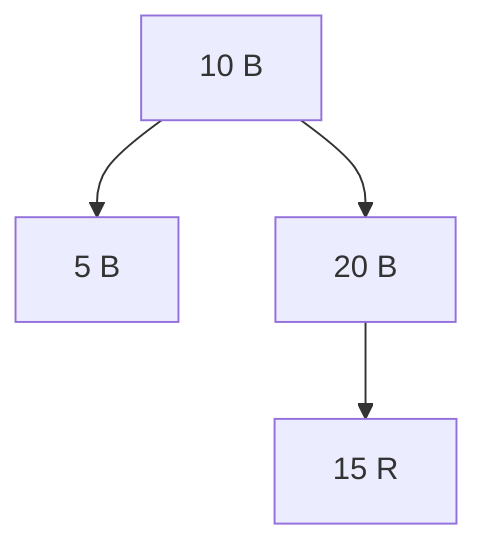

### 3.3 Case 2→3 示例：叔叔黑，之字形转直线

以 `p` = 左孩，`z` = 右孩 的 LR 形态为例：

**① 冲突态：`g` 黑、`p` 红、`z` 红，之字形**

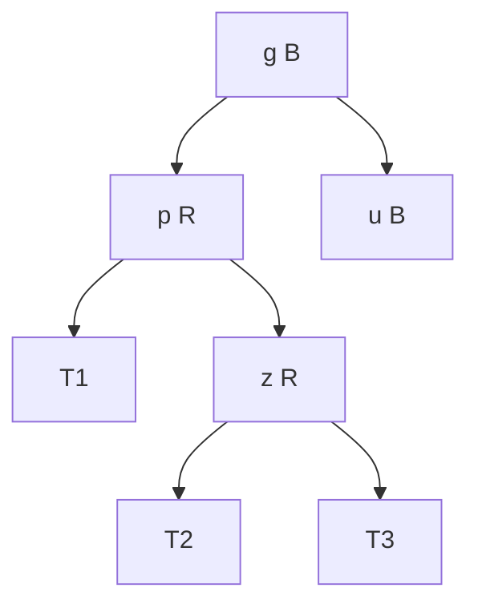

**② Case2：Left-Rotate(p)，之字化为直线**

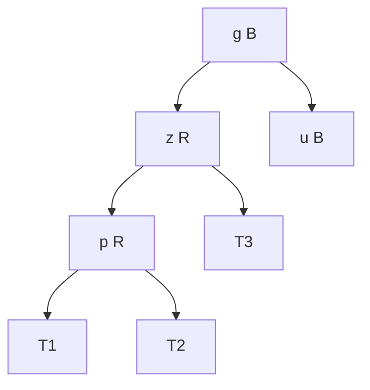

**③ Case3：`z` 变黑、`g` 变红，Right-Rotate(g)**

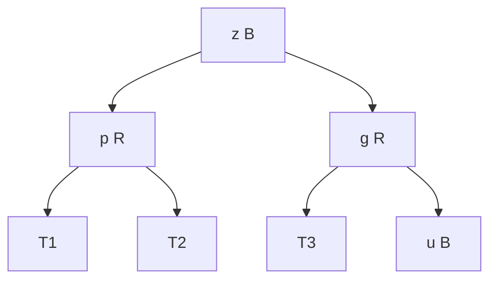

修复后最上方是黑色、两个孩子是红色，且各路径黑高不变——五条性质全部恢复。

### 3.4 伪代码

```text
RB-INSERT(T, key):
    z ← NEW-NODE(key, color=RED, left=T.nil, right=T.nil)
    BST-INSERT(T, z)
    RB-INSERT-FIXUP(T, z)

RB-INSERT-FIXUP(T, z):
    while z.parent.color == RED:
        if z.parent == z.parent.parent.left:
            u ← z.parent.parent.right                 # 叔叔
            if u.color == RED:                        # Case 1
                z.parent.color          ← BLACK
                u.color                 ← BLACK
                z.parent.parent.color   ← RED
                z                       ← z.parent.parent
            else:
                if z == z.parent.right:               # Case 2
                    z ← z.parent
                    LEFT-ROTATE(T, z)
                z.parent.color        ← BLACK         # Case 3
                z.parent.parent.color ← RED
                RIGHT-ROTATE(T, z.parent.parent)
        else:
            # 镜像：把 left↔right 全部互换
            ...
    T.root.color ← BLACK                              # 性质 2
```

**旋转次数**：Case 1 只重染色；Case 2 + 3 合计 ≤ 2 次旋转。**全程最多 2 次旋转**。

## 4. Delete

远比 insert 复杂。核心思想是 **Transplant + 跟踪"额外黑色"（doubly-black）**。

### 4.1 BST 删除 & 确定替身 `x`

与 AVL 一致：按 0/1/2 孩子分情况；有两个孩子时用中序后继 `y` 顶替。令 `x` 为"实际从树里消失的那个节点的孩子"。

- 若被**移走的颜色**是**红** → 所有性质仍然成立，结束。
- 若被移走的颜色是**黑** → `x` 上"背负"了**一层额外的黑色**（doubly-black），违反性质 1 或 5，需要 fixup。

### 4.2 RB-DELETE-FIXUP 的四种 case

设 `x` 为 doubly-black 节点，`w = x.sibling`（必非 `nil`，因 x 所在路径黑高 ≥ 2）：

| Case | 条件 | 动作 | 去向 |
|---|---|---|---|
| 1 | `w` 红 | 交换 `w.p` 与 `w` 颜色；对 `x.p` 左旋 | 变成 2/3/4 之一 |
| 2 | `w` 黑，两孩均黑 | `w` 变红，`x ← x.p` | 把额外黑色上抛一层 |
| 3 | `w` 黑，`w.left` 红、`w.right` 黑 | 交换 `w` 与 `w.left` 颜色；对 `w` 右旋 | 变成 case 4 |
| 4 | `w` 黑，`w.right` 红 | `w.color ← x.p.color`；`x.p` 变黑；`w.right` 变黑；对 `x.p` 左旋；`x ← T.root` | 终局 |

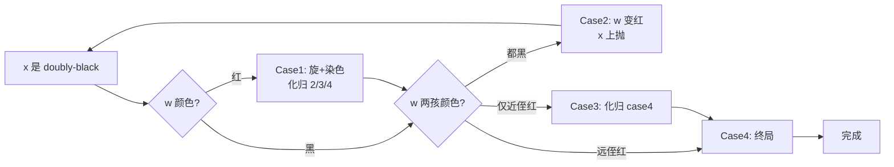

### 4.3 删除示例（Case 2 上抛）

从树里删除一个黑叶子，造成兄弟双黑孩：

**① 删除前 (bh=2)**

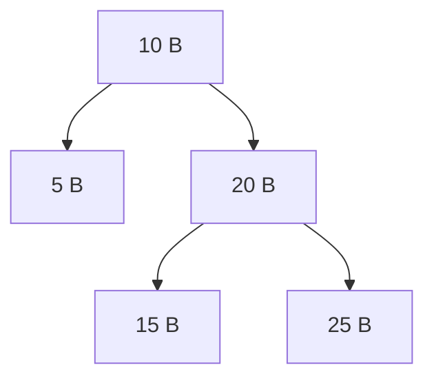

**② 删除 5 → `x = nil` 背负双黑**

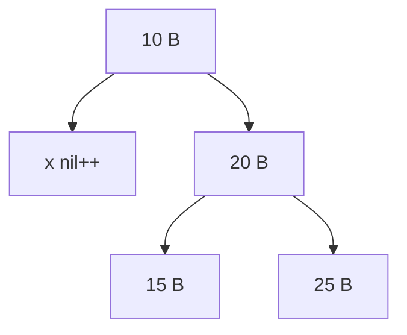

**③ Case2：`w = 20` 变红，额外黑色上抛到 10**

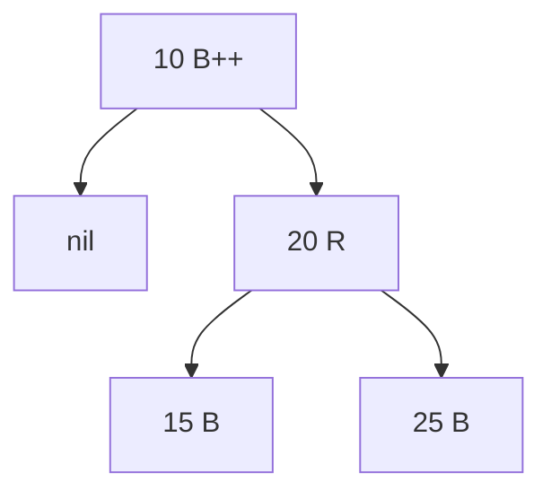

**④ `x` 到达根，直接吸收额外黑色，完成**

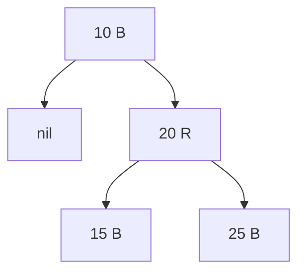

### 4.4 伪代码

```text
RB-DELETE(T, z):
    y ← z
    y-orig-color ← y.color
    if z.left == T.nil:
        x ← z.right
        RB-TRANSPLANT(T, z, z.right)
    elif z.right == T.nil:
        x ← z.left
        RB-TRANSPLANT(T, z, z.left)
    else:
        y ← TREE-MIN(z.right)                         # 中序后继
        y-orig-color ← y.color
        x ← y.right
        if y.parent == z:
            x.parent ← y
        else:
            RB-TRANSPLANT(T, y, y.right)
            y.right        ← z.right
            y.right.parent ← y
        RB-TRANSPLANT(T, z, y)
        y.left        ← z.left
        y.left.parent ← y
        y.color       ← z.color
    if y-orig-color == BLACK:
        RB-DELETE-FIXUP(T, x)

RB-DELETE-FIXUP(T, x):
    while x ≠ T.root and x.color == BLACK:
        if x == x.parent.left:
            w ← x.parent.right
            if w.color == RED:                        # Case 1
                w.color         ← BLACK
                x.parent.color  ← RED
                LEFT-ROTATE(T, x.parent)
                w ← x.parent.right
            if w.left.color == BLACK and w.right.color == BLACK:   # Case 2
                w.color ← RED
                x       ← x.parent
            else:
                if w.right.color == BLACK:            # Case 3
                    w.left.color ← BLACK
                    w.color      ← RED
                    RIGHT-ROTATE(T, w)
                    w ← x.parent.right
                w.color             ← x.parent.color  # Case 4
                x.parent.color      ← BLACK
                w.right.color       ← BLACK
                LEFT-ROTATE(T, x.parent)
                x ← T.root
        else:
            # 镜像 left ↔ right
            ...
    x.color ← BLACK

RB-TRANSPLANT(T, u, v):
    if u.parent == T.nil:
        T.root ← v
    elif u == u.parent.left:
        u.parent.left  ← v
    else:
        u.parent.right ← v
    v.parent ← u.parent
```

## 5. 复杂度总结

| 操作 | 时间 | 旋转次数（最坏） |
|---|---|---|
| query  | O(log n) | 0 |
| insert | O(log n) | **≤ 2** |
| delete | O(log n) | **≤ 3** |

颜色+哨兵把"高度平衡"这个**硬约束**松弛为"黑高一致"的**软约束**，插入删除的 fixup 开销常数化——这就是为什么 **Linux CFS 调度器、epoll、`std::map`、`java.util.TreeMap`** 都选红黑树。

## 6. 与 AVL 的一句话分工

- **AVL**：`|bf| ≤ 1` 的硬约束 → 更矮的树 → **读快**、改慢
- **RB**：黑高一致的软约束 → 稍高的树 → 读稍慢、**改快**

选型依据写入比例，详见 `avl.md` 末尾与本仓根目录的对比笔记。
