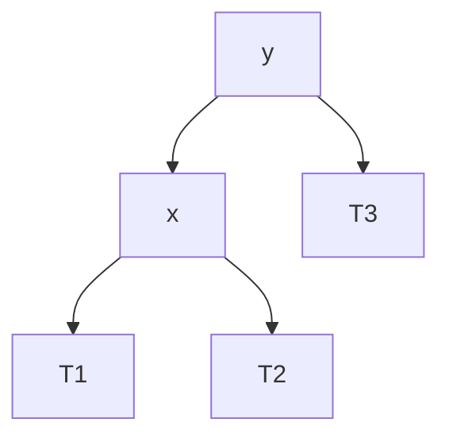
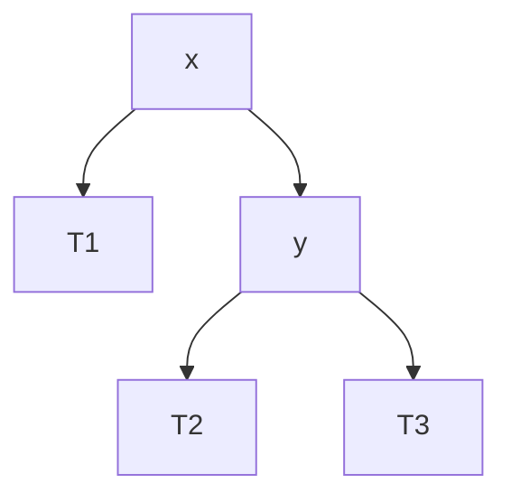
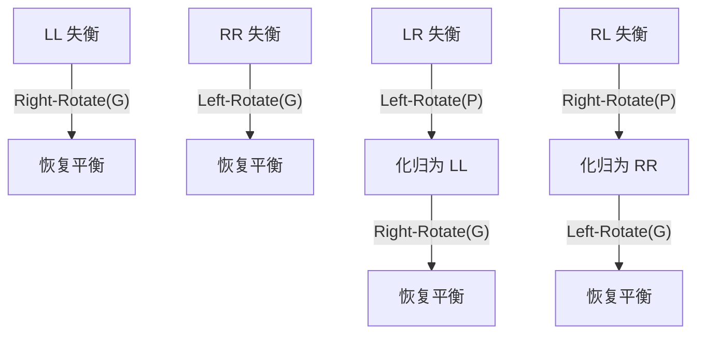

# 二叉树旋转 Rotation

> [!note]
> **Ref:** CLRS Ch.13 *Red-Black Trees*；本地笔记 `avl.md` / `rbtree.md`

## 1. 为什么需要旋转

自平衡 BST 的核心矛盾：**既要维持 BST 有序性（左 < 根 < 右），又要在增删后把"高度"压回 O(log n)**。旋转就是在 **O(1)** 内重构局部父子关系、同时保持中序序列不变的原子操作。

- 中序遍历不变 → BST 合法性天然保持
- 局部高度改变 → 给上层平衡策略提供"杠杆"
- 只改三条指针（父、两个孩子）→ 常数时间

## 2. 右旋 Right-Rotate(y)

**前提**：`y` 有左孩子 `x`。把 `x` 提上来，`y` 降为 `x` 的右孩子，`x` 原来的右子树 `T2` 过继给 `y` 作左孩子。

**① 旋转前**



**② 右旋后**



中序序列两边都是 `T1 → x → T2 → y → T3`，完全一致。

**伪代码**：

```python
RIGHT-ROTATE(T, y):
    x        ← y.left              # 必须非空
    y.left   ← x.right             # T2 过继给 y
    if x.right ≠ NIL:
        x.right.parent ← y
    x.parent ← y.parent            # x 顶替 y 的位置
    if y.parent == NIL:
        T.root ← x
    elif y == y.parent.left:
        y.parent.left  ← x
    else:
        y.parent.right ← x
    x.right  ← y
    y.parent ← x
```

## 3. 左旋 Left-Rotate(x)

右旋的**镜像**。前提：`x` 有右孩子 `y`。把 `y` 提上来。

**① 旋转前**


**② 左旋后**


**伪代码**：

```py
LEFT-ROTATE(T, x):
    y        ← x.right             # 必须非空
    x.right  ← y.left              # T2 过继给 x
    if y.left ≠ NIL:
        y.left.parent ← x
    y.parent ← x.parent
    if x.parent == NIL:
        T.root ← y
    elif x == x.parent.left:
        x.parent.left  ← y
    else:
        x.parent.right ← y
    y.left   ← x
    x.parent ← y
```

## 4. 四种"复合旋转"（AVL 视角）

基本旋转只有左右两种，但失衡模式有四种，需要**一次或两次**组合：

| 失衡形态 | 示意 | 修复方式 |
|---|---|---|
| LL（左-左） | 新节点在左子树的左边 | **右旋** 祖父 |
| RR（右-右） | 新节点在右子树的右边 | **左旋** 祖父 |
| LR（左-右） | 新节点在左子树的右边 | 先**左旋**父，再**右旋**祖父 |
| RL（右-左） | 新节点在右子树的左边 | 先**右旋**父，再**左旋**祖父 |



**核心直觉**：LR / RL 属于"之字形"，需要先把它拉直成 LL / RR 这种"一条直线"，再做一次旋转把线段的中间节点提到顶部。

## 5. 不变量检查清单

旋转实现必查三点：

1. **BST 有序**：中序序列不变
2. **parent 指针**：所有被搬动节点的 `parent` 同步更新
3. **root 更新**：若被旋的节点是根，`T.root` 必须改写

越过这三点，上层 AVL / RB 的 fixup 才能安全调用旋转。
