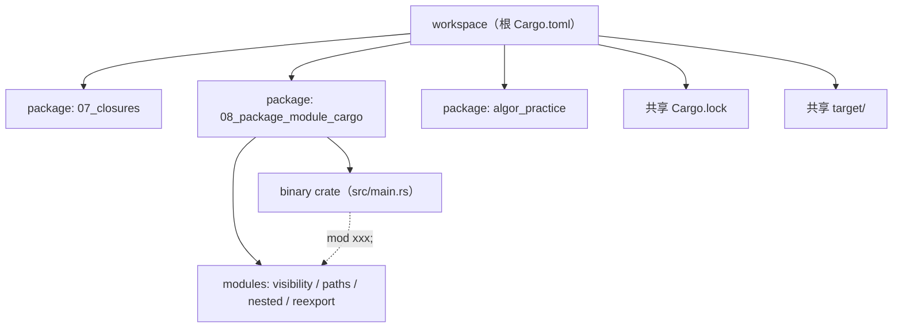

# 包、模块与 Cargo

把 01–07 学到的语法粒度往上抬一层：单文件的 `fn`、`struct`、`closure` 写得再漂亮，最终也要打成**可发布单元**才能交付。本章讲清楚 Rust 的代码组织三层（crate / package / workspace）、模块系统（`mod` + 可见性 + 路径）、`Cargo.toml` 各字段含义、dev vs release profile 调参，以及发布到 crates.io 的流程。

## 模块结构

| 文件 | 主题 |
| --- | --- |
| `src/main.rs` | 入口，按顺序串联 4 段 demo |
| `src/visibility.rs` | `pub` / `pub(crate)` / `pub(super)` / `pub(in path)` / 默认 private |
| `src/paths.rs` | `crate::` / `super::` / `self::` 与 `use ... as ...` 别名/合并 |
| `src/nested.rs` + `src/nested/inner.rs` | 现代（Rust 2018+）`foo.rs + foo/` 布局示范 |
| `src/reexport.rs` | `pub use` 拍平内部深路径，稳定外部 API 表面 |

## 1. 三层组织：crate / package / workspace

| 层级 | 定义 | 物理形态 |
| --- | --- | --- |
| **crate** | 一次编译的最小单元，输出一个 binary 或一个 library | `main.rs` 或 `lib.rs` 为根的源码树 |
| **package** | 一个 `Cargo.toml` 管辖的目录，可含 1–N 个 crate | 一个目录，含 `Cargo.toml` |
| **workspace** | 多个 package 共享同一份 `Cargo.lock` 与 `target/` | 根 `Cargo.toml` 的 `[workspace]` 段 |

**一个 package 的 crate 上限规则**：

- 最多 1 个 library crate（`src/lib.rs`）。
- 可以有 0–N 个 binary crate：默认 binary 是 `src/main.rs`，额外的放在 `src/bin/*.rs`，或用 `[[bin]]` 显式配置。
- library 与多个 binary 可以共存于同一 package：binary 把 library 当依赖来用是常见模式。

**workspace 的价值**：

- **共享 `target/`**：避免每个 package 各自编译相同依赖。
- **共享 `Cargo.lock`**：同一份依赖图，保证所有成员看到相同版本。
- **共享字段**：`[workspace.package]` / `[workspace.dependencies]` 可被成员通过 `edition.workspace = true` 等语法继承，避免逐个改版本号/edition。

本仓库自身就是一个 workspace，根 `Cargo.toml` 的 `members` 列出了 `01_basics_ownership` … `09_threads_process_model` 与 `algor_practice`。



## 2. module 系统：声明、查找规则、现代布局

### 2.1 `mod` 关键字

- `mod foo;` —— 声明一个**外部文件**子模块，编译器去文件系统找它的源码。
- `mod foo { ... }` —— 内联模块，源码直接写在花括号里。
- 子模块**必须**被父模块用 `mod` 声明，文件系统里有 `foo.rs` 但父没写 `mod foo;`，它就是死代码（编译器不会自动包含）。

### 2.2 文件查找规则（关键）

写 `mod inner;` 时，编译器按这个顺序找：

1. 同级的 `inner.rs`
2. 同级目录下的 `inner/mod.rs`（旧式，Rust 2015 风格）

对**当前文件是 `lib.rs` / `main.rs` / `foo.rs`** 的情况，"同级"分别指 `src/`、`src/`、`src/foo/`。

### 2.3 现代布局 vs 旧布局

| 风格 | 父文件 | 子文件 | 备注 |
| --- | --- | --- | --- |
| **现代（推荐，Rust 2018+）** | `src/nested.rs` | `src/nested/inner.rs` | 父和子目录同名并列 |
| 旧式（仍合法，但不推荐） | `src/nested/mod.rs` | `src/nested/inner.rs` | 父变成 `mod.rs` |

**为什么推荐现代布局**：旧式让一个项目里出现一堆叫 `mod.rs` 的文件，编辑器 tab 上全是 "mod.rs / mod.rs / mod.rs"，搜索定位都难受。现代布局每个父模块都有自己的真实文件名，可读性显著更高。

本 chapter 的目录树就是新布局：

```
src/
├── main.rs
├── visibility.rs
├── paths.rs
├── nested.rs            ← 父
├── nested/
│   └── inner.rs         ← 子
└── reexport.rs
```

## 3. 可见性 visibility（白名单语义）

| 修饰符 | 可见范围 |
| --- | --- |
| 无（默认） | **仅当前模块**及其子模块内可见 |
| `pub` | 全开放：本 crate + 所有下游 crate |
| `pub(crate)` | 仅本 crate 内可见，对下游 crate 隐藏 |
| `pub(super)` | 仅父模块可见 |
| `pub(in crate::a::b)` | 限定在某条路径子树内可见 |

> 与 Java/Kotlin 的"不写修饰符 = package-private"不同，Rust 默认是**完全私有**。这意味着对外暴露任何东西都必须显式 `pub`，没有"忘了写就漏出去"这种事——可见性是**白名单**而非黑名单。

代码示范见 `src/visibility.rs`：`private_helper` 没有 `pub`，main.rs 里若取消注释调用它会直接编译失败。

## 4. 路径解析 paths

| 语法 | 含义 |
| --- | --- |
| `crate::a::b` | 绝对路径，从当前 crate 根开始 |
| `super::x` | 当前模块的父模块里的 `x` |
| `self::x` | 当前模块自己里的 `x`（很多场景可省略，主要用于 `use foo::{self, bar}`） |
| `use foo::bar` | 把 `bar` 引入当前作用域，之后直接写 `bar` |
| `use foo::bar as Baz` | 别名导入，避免命名冲突 |
| `use foo::{a, b, c}` | 合并导入，少打字 |
| `pub use foo::bar` | **再导出**：导入的同时让外部也能看到 `bar` |

经验法则：

- **同 crate 内长距离引用** → 用 `crate::`，因为模块被搬动后绝对路径不变更稳。
- **父子之间** → 用 `super::`，意图最清楚。
- **库的对外 API 表面** → 用 `pub use` 把内部深处的实现拍平到顶层（`src/reexport.rs` 演示）。

## 5. binary 与 library 的关系

一个 package 可以**同时**有 `lib.rs` 和 `main.rs`：

| 角色 | 文件 | 作用 |
| --- | --- | --- |
| library | `src/lib.rs` | 可被外部 crate / 集成测试 / doctest 直接 `use` |
| 默认 binary | `src/main.rs` | 跑 `cargo run` 出来的可执行文件 |
| 额外 binary | `src/bin/xxx.rs` 或 `[[bin]]` | `cargo run --bin xxx` 选择性执行 |

**惯例**：`main.rs` 只写参数解析 + 调用 `lib.rs` 里的入口函数。这样：

- 集成测试（`tests/` 目录）可以 `use my_crate::...` 直接调用业务逻辑。
- doctest 可以演示 library API。
- 反之，如果业务代码全堆在 `main.rs`，外部一行都用不到，工程可测试性极差。

## 6. Cargo.toml 关键字段（标注良好的示例）

```toml
[package]
name        = "my_lib"          # 在 crates.io 上唯一
version     = "0.3.1"           # semver
edition     = "2024"            # 2015 / 2018 / 2021 / 2024
authors     = ["You <you@x>"]   # 可选
license     = "MIT OR Apache-2.0"  # SPDX 表达式，发 crates.io 必填
description = "what it does"    # 一句话简介
repository  = "https://github.com/you/my_lib"
readme      = "README.md"

[dependencies]
serde       = "1.2.3"                                # 等价于 ^1.2.3
tokio       = { version = "1", features = ["full"] }  # feature flags
rand        = { version = "0.8", optional = true }    # 只有启用对应 feature 才编译
my_other    = { path = "../my_other" }                # 本地路径依赖（开发期）
git_dep     = { git = "https://github.com/x/y", tag = "v1.0" }

[dev-dependencies]                # 只在 cargo test / cargo bench / examples 里用
proptest    = "1"

[build-dependencies]              # 只在 build.rs 里用（构建脚本）
cc          = "1"

[features]
default     = ["std"]             # 不指定 --no-default-features 时启用
std         = []
fast        = ["dep:rand"]        # 启用 fast 时把 optional rand 引进来

[[bin]]                           # 额外 binary
name = "tool"
path = "src/bin/tool.rs"
```

### 6.1 workspace 字段继承

根 `Cargo.toml` 写：

```toml
[workspace.package]
edition = "2024"
version = "0.1.0"
publish = false
```

成员在自己的 `Cargo.toml` 里写：

```toml
[package]
name = "l08_package_module_cargo"
edition.workspace = true
version.workspace = true
publish.workspace = true
```

升级 edition 或版本号时只改根那一处即可，所有成员同步生效。`[workspace.dependencies]` 同理可以继承外部 crate 的版本号。

### 6.2 `dev-dependencies` vs `build-dependencies`

| 段 | 何时编译 | 谁能 `use` 它 |
| --- | --- | --- |
| `[dependencies]` | 总是 | 主代码、tests、benches、examples、build.rs 都看不到（除非也加） |
| `[dev-dependencies]` | 仅 `cargo test` / `bench` / `--examples` | 只有 tests/benches/examples 能 `use`，主代码看不见 |
| `[build-dependencies]` | 仅编译 `build.rs` 时 | 只有 `build.rs` 能 `use` |

下游用户只装主依赖，不会被 dev/build 拖累——这是 Rust 依赖管理上一个干净的设计。

## 7. dev vs release profile

| 字段 | `[profile.dev]` 默认 | `[profile.release]` 默认 | 含义 |
| --- | --- | --- | --- |
| `opt-level` | `0` | `3` | 优化等级，`0/1/2/3/"s"/"z"` |
| `debug` | `true`（含完整 debuginfo） | `false` | 是否生成调试符号 |
| `overflow-checks` | `true`（panic on overflow） | `false`（wrapping） | 整数溢出是否 panic |
| `lto` | `false` | `false` | Link-Time Optimization，跨 crate 内联 |
| `codegen-units` | `256` | `16` | 并行编译单元数；越多编译越快但优化越差 |
| `strip` | `"none"` | `"none"` | 是否剥离符号 |
| `panic` | `"unwind"` | `"unwind"` | panic 时栈展开还是 abort |
| `incremental` | `true` | `false` | 增量编译缓存 |

> dev 的目标是**编译快、bug 早暴露**（保留 debug 信息、保留溢出检查、不优化代码以保留行号准确性）；release 的目标是**生成最终可发布产物**（开优化、关溢出检查、关 incremental 以避免缓存污染）。

### 7.1 release 调参：speed vs size

**speed-optimized**（追求运行性能，不在乎二进制大小、编译时间）：

```toml
[profile.release]
lto = "fat"           # 全程序 LTO，跨 crate 内联，最大化优化但编译慢
codegen-units = 1     # 单一编译单元，给优化器最大上下文
```

**size-optimized**（追求二进制最小，常用于嵌入式 / wasm）：

```toml
[profile.release]
opt-level = "z"       # 极致体积优化（z < s < 0..3）
lto = true            # 跨 crate 死代码消除
codegen-units = 1     # 单元少，去重更彻底
strip = true          # 剥离符号表
panic = "abort"       # 不展开栈，省掉 unwind 元数据
```

| 调参 | 代价 |
| --- | --- |
| `lto = "fat"` | 编译时间显著上升（可能 2–10×），换更激进内联 |
| `codegen-units = 1` | 失去并行编译，单 crate 编译时间增加 |
| `opt-level = "z"` | 偶尔比 `"s"` 还小，但运行可能慢一点 |
| `strip = true` | 失去 backtrace 行号能力，事后定位崩溃更难 |
| `panic = "abort"` | panic 直接终止进程，无法被 `catch_unwind` 拦截 |

## 8. `Cargo.lock` 的角色与是否提交

`Cargo.lock` 锁定**整棵依赖树**（含 transitive deps）的精确版本，保证"今天能编过的代码，明天/在另一台机器上仍然能编过"。

| Crate 类型 | `Cargo.lock` 是否 commit | 原因 |
| --- | --- | --- |
| **binary / application** | **要 commit** | 部署可重现，避免上游补丁导致线上行为变化 |
| **library** | **加进 .gitignore** | 让下游使用者用他们自己解析出的版本，能更早暴露与他人依赖的兼容冲突 |

> library 提交 lock 文件是有害的——下游根本不会用你的 lock，但 CI 跑你库本身的测试时会以 lock 为准，于是你和下游用户**永远在测试不同的依赖图**，bug 就藏在那道缝里。

## 9. Semver 与版本号约束语法

Rust 的版本号是严格 semver：`MAJOR.MINOR.PATCH`。crates.io 默认按 caret 升级。

| 语法 | 等价区间 | 含义 |
| --- | --- | --- |
| `"1.2.3"` 或 `"^1.2.3"` | `>=1.2.3, <2.0.0` | caret，**默认**；允许任何不破坏 major 的更新 |
| `"~1.2.3"` | `>=1.2.3, <1.3.0` | tilde，更严，只允许 patch 更新 |
| `"=1.2.3"` | `=1.2.3` | 精确锁死，谁都不能动 |
| `">=1, <2"` | 区间，自定义 | 显式区间 |
| `"*"` | 任何版本 | 极不推荐，crates.io 也禁止用它发布 |

约定：**0.x 阶段 minor 升级即视为破坏性**（`0.2.0` 与 `0.3.0` 不兼容）。所以 `"^0.3"` 等价于 `>=0.3.0, <0.4.0`，不会跳到 0.4。

## 10. 常用 cargo 命令

| 命令 | 作用 |
| --- | --- |
| `cargo check` | 只做类型检查不生成二进制，开发期最快的反馈循环 |
| `cargo build` | 编译，默认 dev profile；加 `--release` 出 release |
| `cargo run` | 编译并运行 default binary；`-p pkg` 选 workspace 成员，`--bin name` 选指定 binary |
| `cargo test` | 跑 unit + integration + doctest |
| `cargo bench` | 跑 `#[bench]`（需要 nightly 或 criterion crate） |
| `cargo doc --open` | 生成 rustdoc 并打开浏览器 |
| `cargo clippy` | 风格 / 性能 / 易错 lint，几百条规则 |
| `cargo fmt` | rustfmt 自动格式化 |
| `cargo tree` | 打印依赖树，排查"这个 crate 是谁拉进来的" |
| `cargo update` | 按 `Cargo.toml` 约束重新解析依赖、更新 lock |
| `cargo publish` | 发布到 crates.io |
| `cargo install xxx` | 把 crates.io 上某 binary 装到 `~/.cargo/bin` |

## 11. 发布到 crates.io 流程

1. `cargo login <token>` —— 在 crates.io 申请 API token 并写入 `~/.cargo/credentials.toml`。
2. 完善 `Cargo.toml` 的 `description` / `license` / `repository` / `readme`（缺一个就发不上去）。
3. `cargo publish --dry-run` —— 本地模拟打包、连上服务做校验，但不真发。
4. `cargo publish` —— 真发；版本一旦上传**不可删除、不可覆盖**，只能 `cargo yank` 标记不可被新依赖解析到。
5. 对 workspace 中**不打算发布**的成员，在根 `[workspace.package]` 里写 `publish = false`，并让成员 `publish.workspace = true` 继承——本仓库正是这么用的，避免任何成员被误发到 crates.io。

## 12. 运行

```bash
cargo run -p l08_package_module_cargo
```

预期输出按 4 个小节依次打印：

1. visibility 各档可见性的字符串；
2. paths 中通过 `self::` / `super::` / `crate::` 与 `use as` 拿到的同一个常量；
3. nested 父模块自身的 fn + `nested::inner::leaf_fn`；
4. reexport 通过 `pub use` 把深处的 `greet` 拍平到顶层后被直接调用。

末尾打印 `[08_package_module_cargo] 全部 demo 执行完毕。`。
