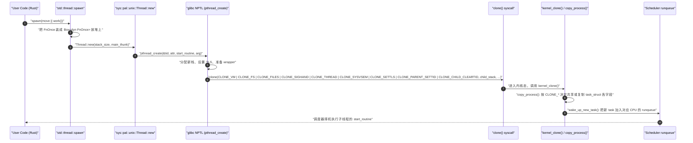
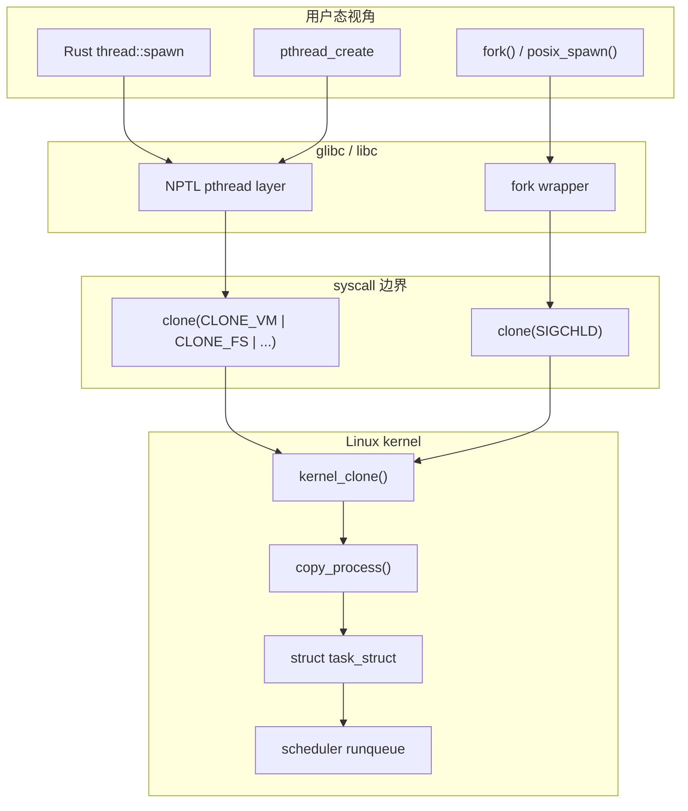

# 多线程与进程模型

> [!note]
> **Ref:**
> - Linux kernel: `kernel/fork.c`、`include/linux/sched.h`（`task_struct` 定义）
> - glibc NPTL: `nptl/pthread_create.c`
> - Rust std: `library/std/src/sys/pal/unix/thread.rs`
> - `man 2 clone`、`man 7 pthreads`

本章把 Rust 的 `std::thread` 和 `std::process` 一直追到 Linux 内核里的同一个数据结构 `task_struct`。读者会发现：**用户态争论"线程 vs 进程"，在内核眼里只是 `clone()` 的几个标志位差别**。

## 模块结构

| 文件 | 主题 |
| --- | --- |
| `src/main.rs` | 入口，按顺序串联 5 个 demo |
| `src/spawn_join.rs` | `thread::spawn` + `JoinHandle::join`，含 `move` 捕获讲解 |
| `src/send_sync.rs` | `Send` / `Sync` 最小演示：跨线程搬 `String`、共享 `Arc<i32>` |
| `src/shared_state.rs` | `Arc<Mutex<i32>>` 计数 + `AtomicUsize::fetch_add` |
| `src/channels.rs` | `mpsc::channel`，多 producer 单 consumer |
| `src/process_demo.rs` | `std::process::Command` 启子进程并读 stdout |

## Rust 的并发模型概览

Rust 标准库选择 **1:1 OS-thread** 模型：每一个 `std::thread::Thread` 一一对应内核里的一个 task（即一个 `task_struct`）。这点和 Go 的 M:N 绿色线程不同，是**有意识的取舍**：

- **FFI 友好**：调用 C 代码时栈和 TLS 与 OS 线程一致，不会因 Go-style 栈搬迁导致 C 拿到悬垂指针。
- **栈大小可控**：每个线程是真正独立的内核栈，可由 `ThreadBuilder::stack_size` 精确配置；没有 split stack / segmented stack 的尾端崩溃。
- **OS 工具兼容**：`gdb`、`perf`、`strace`、`/proc/<pid>/task/` 看到的就是 Rust 的线程，无需特殊适配。

代价是单进程线程数量受限（每根线程一份内核栈和一项 `task_struct`，常见上限几千到几万），且每次 context-switch 都要陷入内核。处理大量 I/O 连接时这套不划算，于是有了 `tokio` 等用户态调度器，本质上是 **M:N 绿色线程**——把 Rust async fn 编译出的状态机当作"轻量任务"在少量 OS 线程上轮转。本章只讲 `std::thread`，async 留到后面章节。

## `thread::spawn` 用法 + `JoinHandle`

签名（来自标准库 `std::thread`）：

```rust
pub fn spawn<F, T>(f: F) -> JoinHandle<T>
where
    F: FnOnce() -> T + Send + 'static,
    T: Send + 'static,
```

逐项解释**为什么是这些约束**：

| 约束 | 为什么 |
| --- | --- |
| `F: FnOnce() -> T` | 闭包在子线程里只会被调用一次（`start_routine`），所以可以消耗自己的捕获 |
| `F: Send` | 闭包整个值要从父线程"搬"到子线程；闭包结构体的字段类型逐项要 `Send` |
| `F: 'static` | 子线程寿命可能超过当前函数栈，闭包不能借用调用者栈上的引用 |
| `T: Send` | `join()` 把返回值从子线程搬回父线程，跨线程移动需要 `Send` |
| `T: 'static` | 同理，返回值不能挂着任何短生命周期借用 |

`JoinHandle::join(self) -> Result<T, Box<dyn Any + Send>>`：阻塞等待子线程结束，正常返回 `Ok(T)`；子线程 `panic!` 则返回 `Err(payload)`。

> 想跨线程借用父线程的栈？标准库 1.63 起提供 `thread::scope`，编译器保证作用域结束前所有子线程都已 join，因此可以放宽 `'static`。本章不展开。

## `Send` 与 `Sync`（auto trait）

| trait | 含义 | 直觉 |
| --- | --- | --- |
| `Send` | `T` 可以**所有权跨线程移动** | "搬过去" |
| `Sync` | `&T` 可以跨线程共享（即 `T: Sync` ⟺ `&T: Send`） | "借给别的线程读" |

它们都是 **auto trait**：编译器对结构体逐字段递归判断，所有字段都满足就自动满足；只要有一个字段不满足，就整体不满足。

常见 **非 `Send`/`Sync`** 类型与原因：

- `Rc<T>`：引用计数是普通 `usize`，并发递增会丢更新 → 提前释放或永不释放，触发 use-after-free / 内存泄漏。
- `RefCell<T>`：运行期借用计数也是 non-atomic，多线程并发借用 ≡ 数据竞争。
- `*mut T` / `*const T`：裸指针默认两者都没有；要跨线程必须自己 `unsafe impl Send`。

线程安全的对应替代：

| 单线程类型 | 多线程替代 |
| --- | --- |
| `Rc<T>` | `Arc<T>` |
| `Cell<T>` / `RefCell<T>` | `Mutex<T>` / `RwLock<T>` |
| `Cell<i32>` 之类 | `AtomicI32` 等原子类型 |

## 共享状态：`Arc<Mutex<T>>` 与原子类型

为什么要 **两层包装**？

- `Arc<T>` 解决**共享所有权**：多个线程都各自持有一份 strong count，最后一个 drop 才释放 T。但 `Arc<T>` 只给得到 `&T`，不能直接改。
- `Mutex<T>` 解决**互斥可变访问**：在内部 cell 里塞一把 OS 锁，调用 `lock()` 拿到 `MutexGuard<'_, T>` 才能 `&mut T`。

合起来 `Arc<Mutex<T>>` 才同时满足"跨线程共享" + "可变"。两者都是裸 `Mutex<T>` 都无法独自完成的。

`lock().unwrap()` 返回 `MutexGuard`：实现了 `Deref/DerefMut`，离开作用域**自动释放锁（RAII）**，写不出"忘记 unlock"的 bug。`unwrap()` 处理的是 lock poisoning：上一个持锁线程 panic 时锁被标记为"中毒"，`lock()` 返回 `Err(PoisonError)`。`PoisonError::into_inner()` 可以无视中毒强行拿数据，但通常 `unwrap()` 让程序立即崩溃更安全。

性能小注：`std::sync::Mutex` 在 Linux 上基于 futex（fast userspace mutex）；第三方 `parking_lot::Mutex` 体积更小、无 poisoning、未竞争时更快，工程项目常替换之，但要引入外部 crate。

**原子类型**（`AtomicUsize`、`AtomicBool`、…）是无锁原语，硬件级 CAS / fetch-add。`Ordering` 由弱到强：

| Ordering | 直觉 |
| --- | --- |
| `Relaxed` | 只保证本操作原子，不约束其他内存顺序 |
| `Acquire` (load) / `Release` (store) | 配对使用，建立 happens-before |
| `AcqRel` | RMW 操作的"两端都加屏障"版 |
| `SeqCst` | 全局单一顺序，最强但开销最大 |

纯计数（增加后没人依赖"读到这个值之后再读别的内存"）用 `Relaxed` 最便宜；要做 lock-free 队列、单次初始化标志这类同步语义时才升到 `Acquire/Release`。

## 消息传递：`mpsc` channel

`mpsc` = **multi-producer, single-consumer**。所有权语义朴素直接：

- `tx.send(x)` 把 `x` 的所有权"递"给通道——发送方再也碰不到。
- `rx.recv()` 阻塞直到收到一个 `T`，或所有 `Sender` 都被 drop 时返回 `Err(RecvError)`（用于优雅退出）。
- `Sender::clone()` 复制发送端，可发给任意多个生产者线程。
- `try_recv()` 非阻塞，立刻返回 `Empty` 或 `Disconnected`。

> 历史小注：`std::sync::mpsc` 在 Rust 1.67 之后底层切换为 crossbeam-channel 实现，性能和正确性都比旧的 select 版好得多。但 API 没变。

通道天然契合 Rust 的所有权模型："发送即转移"消除了"发完之后还在原线程改"的别名问题，也不需要额外锁——通道内部已经是线程安全队列。

## 进程：`std::process::Command`

```rust
let out = std::process::Command::new("echo")
    .arg("hi from child process")
    .output()?;
println!("{}", String::from_utf8_lossy(&out.stdout));
```

概念上这是 Linux 的 **fork + exec** 模型（更现代的实现走 `posix_spawn()`，避免一次完整 COW）。它和线程的根本区别：

- **不共享地址空间**：子进程的 `task_struct.mm` 指向新的 `mm_struct`；父子之间 Rust 对象不能直接共享指针。
- **通过管道通信**：`Stdio::piped()` 可让父子用 fd 互通；其他 IPC 方式（shm / unix socket）需要 `nix`/`libc` crate。
- **崩溃域独立**：子进程 SIGSEGV 不会拖垮父进程，这是"用进程做隔离"的核心卖点。

## 自顶向下：`thread::spawn` 调用链



每一帧在做什么：

1. 用户调用 `thread::spawn(closure)`，闭包是某个**匿名结构体**（实现 `FnOnce`）。
2. libstd 把闭包**堆分配**成 `Box<dyn FnOnce()>`，这样可以拿到一个稳定的 `*mut` 指针塞给 C ABI 入口。具体在 `library/std/src/sys/pal/unix/thread.rs` 里：构造一个 `extern "C" fn thread_start(arg: *mut c_void)`，里面 `Box::from_raw` 把指针还原成闭包再 `call_once()` 调用。
3. libstd 调用 `pthread_create`，传入 `thread_start` 和那个堆指针。
4. glibc NPTL 给新线程**分配栈、初始化 TLS、设置 attr**，然后陷入 `clone()` syscall。
5. `clone()` 的标志位决定了"新 task 与父 task 共享什么"。下一节细讲。
6. 内核进入 `kernel_clone()`（旧名 `_do_fork`），调用 `copy_process()` 真正构建新 `task_struct`：根据各 `CLONE_*`，对应字段要么"指向父结构（共享）"，要么"深拷贝一份（独立）"。
7. `wake_up_new_task()` 把新 task 加入某个 CPU 的 runqueue，调度器择机切到它，开始跑用户态 `start_routine`，最终执行 Rust 闭包。

## 内核眼里：线程 ≡ 进程 ≡ `task_struct`



注意：图里**两条用户路径（thread / process）最后汇成同一个内核入口** `kernel_clone()`，区别只在于传给 `clone()` 的标志位组合。

关键 `CLONE_*` 标志的语义：

| 标志 | 打开后的语义 |
| --- | --- |
| `CLONE_VM` | 共享地址空间（指向同一个 `mm_struct`） |
| `CLONE_FS` | 共享文件系统信息（cwd、umask、root） |
| `CLONE_FILES` | 共享 fd table（同一个 `files_struct`） |
| `CLONE_SIGHAND` | 共享信号处理函数表 |
| `CLONE_THREAD` | 进入同一 thread group（共享 TGID，不再向父进程发 SIGCHLD） |
| `CLONE_SYSVSEM` | 共享 System V 信号量 undo list |
| `CLONE_SETTLS` | 由调用者指定新 TLS 区段 |
| `CLONE_PARENT_SETTID` / `CLONE_CHILD_CLEARTID` | 用户态线程库做 join 同步用：父端写入新 TID，子端在退出时把 TID 清零并 futex_wake，pthread_join 借此醒过来 |

总结公式：

- **`fork()`** ≡ `clone(SIGCHLD, ...)`，**不打开任何共享标志** → 子进程独立，VM/files/fs/signals 全部 copy-on-write 复制。
- **`pthread_create()`** ≡ `clone(CLONE_VM | CLONE_FS | CLONE_FILES | CLONE_SIGHAND | CLONE_THREAD | CLONE_SYSVSEM | CLONE_SETTLS | CLONE_PARENT_SETTID | CLONE_CHILD_CLEARTID, ...)` → 与父几乎全部共享，仅栈 + 寄存器 + TLS 独立。
- 内核侧两条路径都走 `kernel_clone() → copy_process()`，最终都产出一个 `struct task_struct` 加进 runqueue。

> 这就是本章核心论点：**Linux 内核里没有"线程"和"进程"两种对象，只有一种 `task_struct`，加上一组 sharing flags。**

## TID / PID / TGID 的真正含义

这部分容易混，**用户态的"PID" ≠ 内核的 `pid`**。

| 名称 | 内核字段 | 含义 |
| --- | --- | --- |
| TID（kernel pid） | `task_struct.pid` | 每个 task 唯一，相当于"线程 ID" |
| TGID（thread group id） | `task_struct.tgid` | 同一进程下所有线程共享，等于该进程 leader 的 pid |
| 用户态 `getpid()` | 返回 TGID | 所以用户代码看到的"进程号"实际是 TGID |
| 用户态 `gettid()` | 返回 TID | Linux 特有 syscall，C 库需 `syscall(SYS_gettid)` 才能拿到 |

一句话总结：**用户态语义里"进程"对应内核 TGID，"线程"对应内核 TID（即 `task_struct.pid`）**。在 `/proc` 文件系统里也能直接看到：`/proc/<TGID>/task/<TID>/` 列出某进程下所有线程的 task 信息。

## `task_struct` 的关键字段（一瞥）

定义在 `include/linux/sched.h`，体积巨大，这里只挑识别度最高的：

| 字段 | 作用 |
| --- | --- |
| `pid` / `tgid` | 标识：TID 与 TGID |
| `mm` | 指向 `mm_struct`（地址空间）；内核线程为 `NULL` |
| `files` | 指向 `files_struct`（fd 表） |
| `fs` | 指向 `fs_struct`（cwd / root / umask） |
| `signal` / `sighand` | 信号相关：进程级 `signal_struct` 与 共享处理函数表 |
| `state` / `prio` / `sched_class` | 调度器使用：可运行/睡眠状态、优先级、调度类（CFS/RT/Deadline） |
| `parent` / `children` / `sibling` | 进程树指针 |

回到上一节的 `CLONE_*`：每一个标志本质上就是在 `copy_process()` 里决定上面某个指针**指向父的同一份**还是**新分配并拷贝**。

## 进程间通信简表

| 机制 | 一句话 |
| --- | --- |
| pipe / FIFO | 内核环形缓冲，单向；Rust `Stdio::piped()` 直接可用 |
| signal | 异步通知，载荷有限（仅信号号 + siginfo），适合"事件触发"语义 |
| shared memory | `shm_open` + `mmap`，最快，但要自己加锁 |
| unix domain socket | 同机进程双向流/数据报，可传 fd，最常用的现代 IPC |
| message queue | POSIX `mq_open`，带优先级；用得不多 |
| socket（TCP/UDP） | 跨机通用，本机也能用，开销略高 |

Rust 标准库直接覆盖 pipe（通过 `Command` 的 stdio）；其余通常借助 `nix` / `libc` crate 包装。

## 何时选线程 vs 进程 vs async

| 场景 | 选 |
| --- | --- |
| CPU-bound 并行计算（数值、图像、压缩） | OS thread（标准库或 `rayon` 数据并行） |
| 大量 I/O bound 连接（网络服务、爬虫） | async（`tokio` 等运行时） |
| 需要内存隔离 / 独立崩溃域 / 不同二进制 | 子进程 |
| 既要 I/O 并发又要把 CPU 任务切出去 | async + `spawn_blocking` 或线程池 |

> 经验法则：**如果任务数 > 几百，就别开 OS 线程；改用 async**。OS 线程一根栈通常 8 MiB，万级线程会把内存炸光。

## 运行

```bash
cargo run -p l09_threads_process_model
```

预期输出（顺序固定，但 mpsc 的到达顺序不固定，代码里做了 `sort()`）：

```
========== 1. thread::spawn + JoinHandle ==========
[spawn] 子线程：hello, no capture
[spawn] join 返回值 = 42
[spawn] 子线程拿到的 String = "owned-by-child"
[spawn] String.len() = 14
[spawn] squares = [0, 1, 4]

========== 2. Send / Sync ==========
[send] 子线程持有 String = "send-me"
[sync] 线程 0 读到 *shared = 100
[sync] 线程 1 读到 *shared = 100
[sync] 线程 2 读到 *shared = 100

========== 3. Arc<Mutex<T>> 与 AtomicUsize ==========
[mutex] 8 线程 × 1000 次累加 = 8000 (期望 8000)
[atomic] 8 线程 × 1000 次 fetch_add(Relaxed) = 8000 (期望 8000)

========== 4. mpsc channel ==========
[mpsc] 收到 3 条消息：["from-producer-0", "from-producer-1", "from-producer-2"]

========== 5. std::process::Command 子进程 ==========
[process] 子进程 exit = Some(0)
[process] 子进程 stdout = hi from child process
```

如果 `[mutex]` 行不是恰好 8000，说明锁逻辑写错了（多线程写共享变量没有互斥就会丢失更新）；本章 demo 验证 8000 = 锁工作正常。
