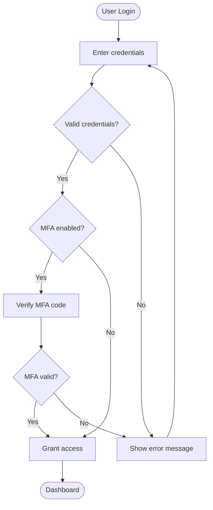
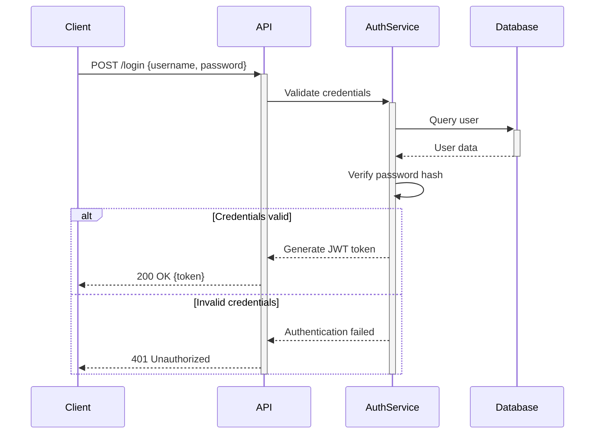
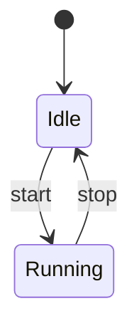
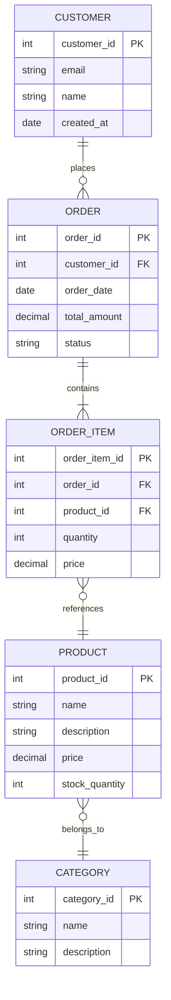

# Mermaid Diagrams Skill

This skill enables you to create valid, well-formed Mermaid.js diagrams with automatic validation using the validate_mermaid.sh script.

## Creating Diagrams

When asked to create a Mermaid diagram:

1. **Reference the cheat sheet**: Consult [reference.md](reference.md) for syntax examples
2. **Choose the right diagram type** based on the use case:
   - Flowcharts: Process flows, decision trees
   - Sequence diagrams: API interactions, message flows
   - Class diagrams: Object relationships, system architecture
   - ER diagrams: Database schemas, data models
   - State diagrams: State machines, workflow states
   - Gantt charts: Project timelines, schedules
   - Git graphs: Branch strategies, commit history

3. **Create the diagram** following proper syntax:
   - Start with the correct diagram type declaration
   - Use consistent indentation
   - Quote labels with spaces or special characters
   - Follow arrow conventions for the diagram type

4. **Always validate** before finalizing (see validation section)

## Validation Process

**CRITICAL**: Every Mermaid diagram MUST be validated before being considered complete.

Use the `validate_mermaid.sh` script for all validation tasks. The script supports:
- Single diagram strings via stdin
- Single diagram files (.mmd)
- Markdown files with embedded diagrams (.md)

### Validation Methods

#### Method 1: Validate diagram from stdin (recommended for inline diagrams)

```bash
echo 'flowchart TD
    A --> B' | base/skills/mermaid/scripts/validate_mermaid.sh
```

Or using heredoc:

```bash
base/skills/mermaid/scripts/validate_mermaid.sh <<'EOF'
flowchart TD
    A --> B
    B --> C
EOF
```

#### Method 2: Validate single diagram file

```bash
base/skills/mermaid/scripts/validate_mermaid.sh /path/to/diagram.mmd
```

#### Method 3: Validate all diagrams in markdown file

```bash
base/skills/mermaid/scripts/validate_mermaid.sh /path/to/document.md
```

### Interpreting Validation Results

**Success**:
```
✅ Diagram stdin: Valid
```

**Failure with error details**:
```
❌ Diagram stdin: Invalid
Error: Parse error on line 2:
...
```

## Common Validation Issues & Fixes

When validation fails, the script will display the error. Check for these common issues:

### Issue 1: Invalid Arrow Syntax
```mermaid
# WRONG
A <-!-> B

# CORRECT
A <--> B
```

### Issue 2: Missing Line Breaks
```mermaid
# WRONG (all on one line)
sequenceDiagram Alice->>Bob: Hi Bob->>Alice: Hi Alice

# CORRECT (proper line breaks)
sequenceDiagram
    Alice->>Bob: Hi
    Bob->>Alice: Hi Alice
```

### Issue 3: Unquoted Labels with Special Characters
```mermaid
# WRONG
flowchart LR
    A[Node with "unescaped quotes]

# CORRECT
flowchart LR
    A["Node with escaped quotes"]
```

### Issue 4: Incorrect Cardinality in ER Diagrams
```mermaid
# WRONG
erDiagram
    USER -->-- ORDER

# CORRECT
erDiagram
    USER ||--o{ ORDER : places
```

### Issue 5: Malformed Class Definitions
```mermaid
# WRONG
classDiagram
    class User {
        string name  // wrong comment syntax
    }

# CORRECT
classDiagram
    class User {
        string name
    }
```

## Iterative Validation Workflow

1. **Generate** the initial diagram
2. **Validate** using the script
3. **If errors found**:
   - Parse error message from script output
   - Identify the problematic syntax
   - Fix the issue
   - Validate again
4. **Repeat** until validation passes (max 3 attempts)
5. **Confirm** with success message

## Error Recovery

If validation fails repeatedly (after 3 attempts):

1. Simplify the diagram to the minimal working example
2. Validate the simple version
3. Add complexity incrementally, validating after each addition
4. This identifies the exact syntax causing the issue

## Best Practices

- **Always validate before showing to user** - never present unvalidated diagrams
- **Use the script for all validation** - don't use inline npx commands
- **Always quote labels** containing spaces, colons, or special characters
- **Use consistent arrow styles** within the same diagram
- **Test complex diagrams incrementally** - build and validate in stages
- **Reference documentation** when unsure about syntax
- **Provide clear diagram titles** for better understanding
- **Use comments** (`%%`) to document complex sections

## Output Format

When presenting diagrams to users:

```markdown
## Diagram Title

Brief description of what the diagram represents.

\```mermaid
diagram-code-here
\```

**Validation Status**: ✅ Validated successfully
```

## Examples

### Example 1: Creating a Flowchart

**User Request**: "Create a flowchart for user authentication"

**Process**:
1. Create the diagram
2. Validate using script
3. Present to user



**Validation command**:
```bash
echo 'flowchart TD
    Start([User Login]) --> Input[Enter credentials]
    Input --> Validate{Valid credentials?}
    Validate -->|Yes| CheckMFA{MFA enabled?}
    Validate -->|No| Error[Show error message]
    Error --> Input
    CheckMFA -->|Yes| MFA[Verify MFA code]
    CheckMFA -->|No| Success[Grant access]
    MFA --> MFACheck{MFA valid?}
    MFACheck -->|Yes| Success
    MFACheck -->|No| Error
    Success --> End([Dashboard])' | base/skills/mermaid/scripts/validate_mermaid.sh
```

**Result**: ✅ Validated successfully

### Example 2: Creating a Sequence Diagram

**User Request**: "Show API authentication flow"



**Validation**: ✅ Passes validation

### Example 3: Fixing a Validation Error

**Initial attempt** (invalid):
```mermaid
stateDiagram-v2
    [*] --> Idle
    Idle -> Running : start
    Running -> Idle : stop
```

**Validation**:
```bash
echo 'stateDiagram-v2
    [*] --> Idle
    Idle -> Running : start
    Running -> Idle : stop' | base/skills/mermaid/scripts/validate_mermaid.sh
```

**Output**:
```
❌ Diagram stdin: Invalid
Error: Parse error on line 3
```

**Analysis**: Arrow syntax wrong - should be `-->` not `->`

**Fixed version**:


**Validation**: ✅ Success

### Example 4: Complex ER Diagram

**User Request**: "Database schema for e-commerce"



**Validation**: ✅ All syntax validated

## Script Location

The validation script is located at:
```
base/skills/mermaid/scripts/validate_mermaid.sh
```

Run it with:
- `echo 'diagram' | base/skills/mermaid/scripts/validate_mermaid.sh` (stdin)
- `base/skills/mermaid/scripts/validate_mermaid.sh file.mmd` (single file)
- `base/skills/mermaid/scripts/validate_mermaid.sh file.md` (markdown with multiple diagrams)

## Resources

- **Cheat Sheet**: See [reference.md](reference.md) for comprehensive syntax examples
- **Script Documentation**: See [scripts/README.md](scripts/README.md) for script usage details
- **Official Docs**: https://mermaid.js.org/
- **Live Editor**: https://mermaid.live/

## Success Criteria

A diagram is complete when:
1. ✅ Syntax is correct for the diagram type
2. ✅ Validation passes with validate_mermaid.sh script
3. ✅ Diagram accurately represents the requested information
4. ✅ Labels are clear and properly quoted
5. ✅ Styling is appropriate (if requested)
6. ✅ Comments document complex sections (if needed)
