# Mermaid Diagrams Cheat Sheet

A comprehensive reference guide for creating various types of Mermaid diagrams.

## Table of Contents
- [Flowcharts](#flowcharts)
- [Sequence Diagrams](#sequence-diagrams)
- [Class Diagrams](#class-diagrams)
- [State Diagrams](#state-diagrams)
- [Entity Relationship Diagrams](#entity-relationship-diagrams)
- [Gantt Charts](#gantt-charts)
- [Git Graphs](#git-graphs)
- [Pie Charts](#pie-charts)
- [User Journey](#user-journey)
- [Architecture Diagrams](#architecture-diagrams)
- [Timeline](#timeline)
- [Mindmap](#mindmap)
- [Block Diagrams](#block-diagrams)
- [Sankey Diagrams](#sankey-diagrams)
- [ZenUML](#zenuml)
- [Quadrant Charts](#quadrant-charts)
- [XY Charts](#xy-charts)
- [Kanban](#kanban)
- [Radar Charts](#radar-charts)
- [Comments](#comments)

---

## Flowcharts

### Basic Syntax
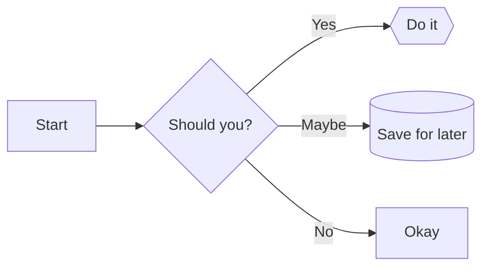

### Directions
- `LR` - Left to Right
- `RL` - Right to Left
- `TB` or `TD` - Top to Bottom
- `BT` - Bottom to Top

### Node Shapes
- `[text]` - Rectangle (default)
- `(text)` - Rounded corners
- `([text])` - Stadium-shaped
- `[[text]]` - Subroutine
- `[(text)]` - Cylindrical
- `((text))` - Circle
- `{text}` - Diamond
- `{{text}}` - Hexagon
- `[/text/]` - Parallelogram
- `[\text\]` - Parallelogram (alt)
- `[/text\]` - Trapezoid
- `[\text/]` - Trapezoid (alt)

### Arrow Types
- `-->` - Solid arrow
- `-.->` - Dotted arrow
- `==>` - Thick arrow
- `--` - Line (no arrow)
- `-- text -->` - Arrow with label

---

## Sequence Diagrams

### Basic Example
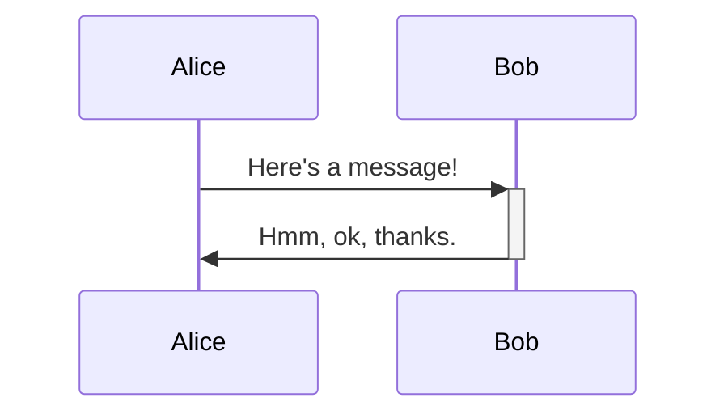

### Message Types
- `->` - Solid line without arrow
- `-->` - Dotted line without arrow
- `->>` - Solid line with arrow
- `-->>` - Dotted line with arrow
- `-x` - Solid line with x
- `--x` - Dotted line with x
- `-)` - Solid line with open arrow
- `--)` - Dotted line with open arrow

### Activation & Deactivation
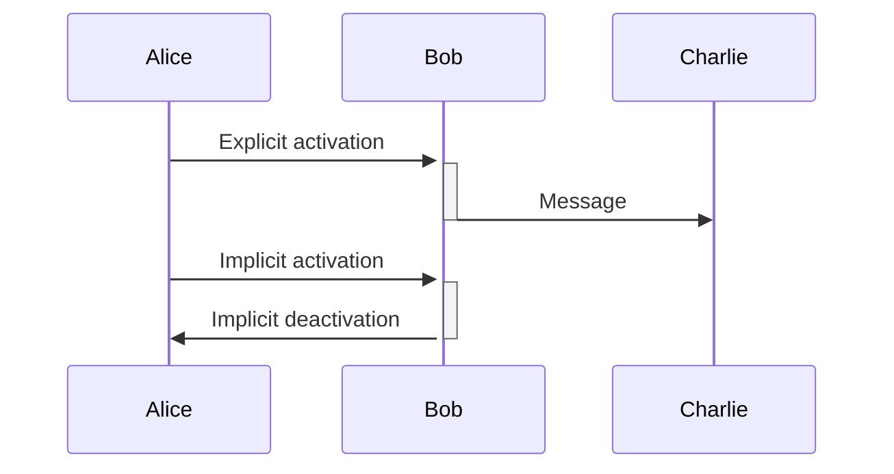

### Control Flow
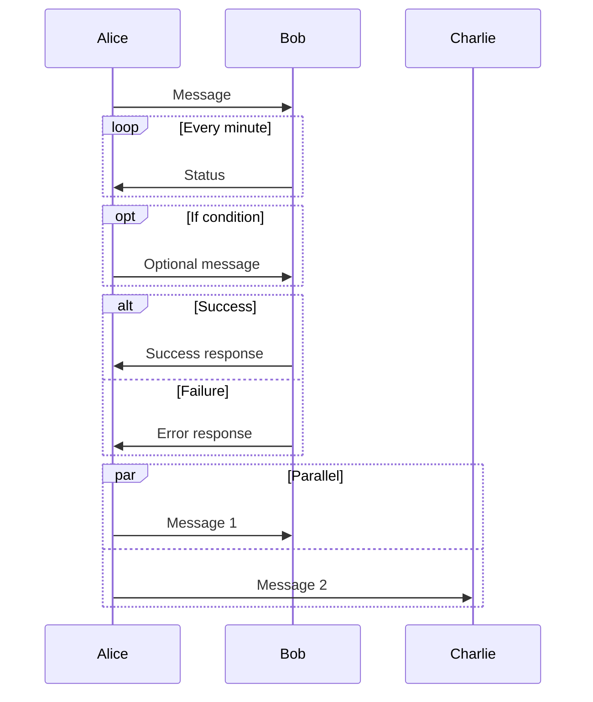

### Notes
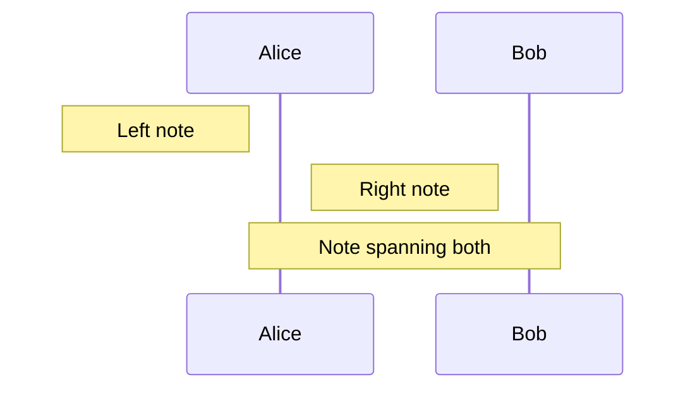

---

## Class Diagrams

### Basic Structure
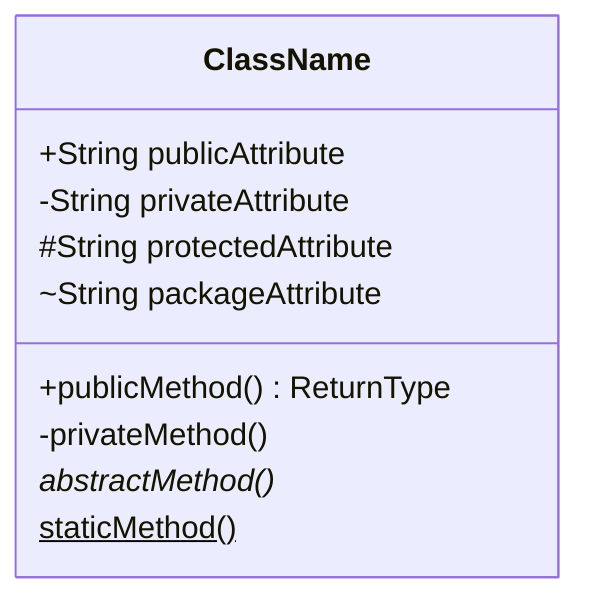

### Relationships
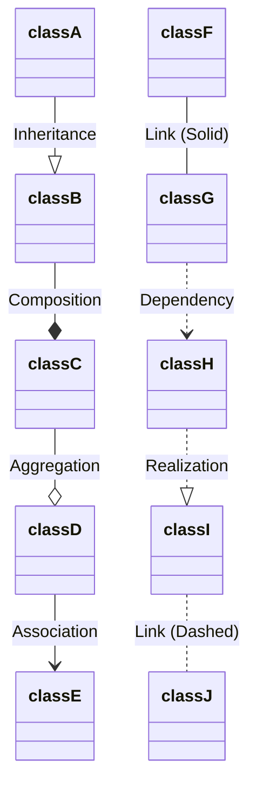

### Generics
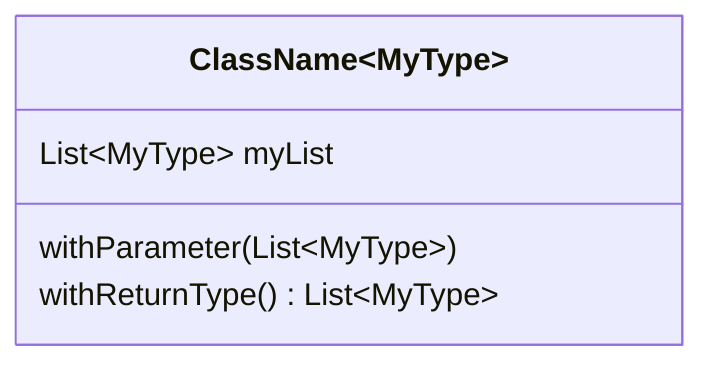

### Visibility Modifiers
- `+` Public
- `-` Private
- `#` Protected
- `~` Package/Internal
- `*` Abstract
- `$` Static

---

## State Diagrams

### Basic Syntax
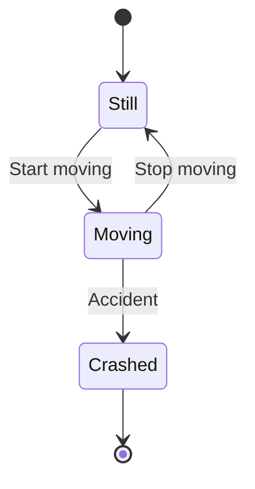

### Composite States
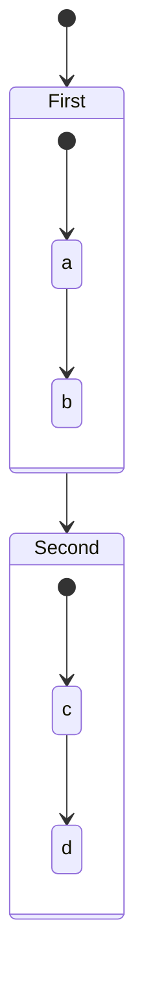

### Concurrency
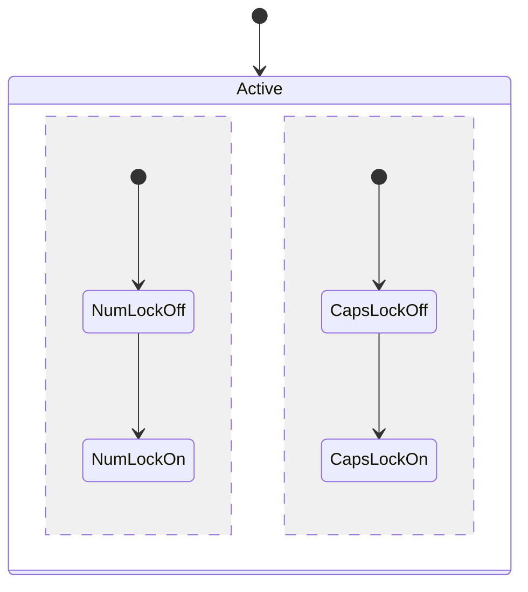

### Notes
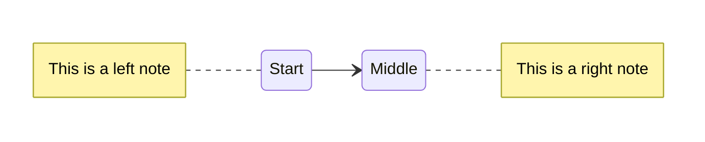

---

## Entity Relationship Diagrams

### Basic Structure
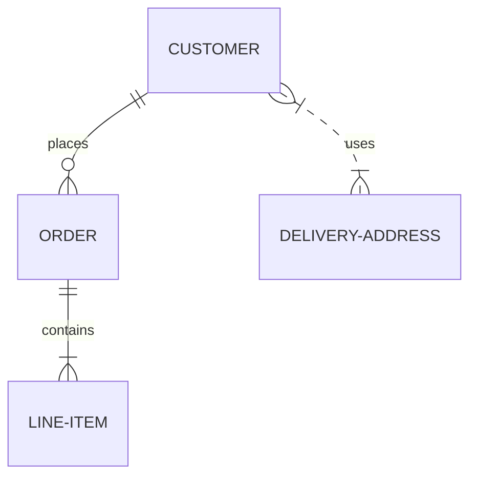

### Entity Definition
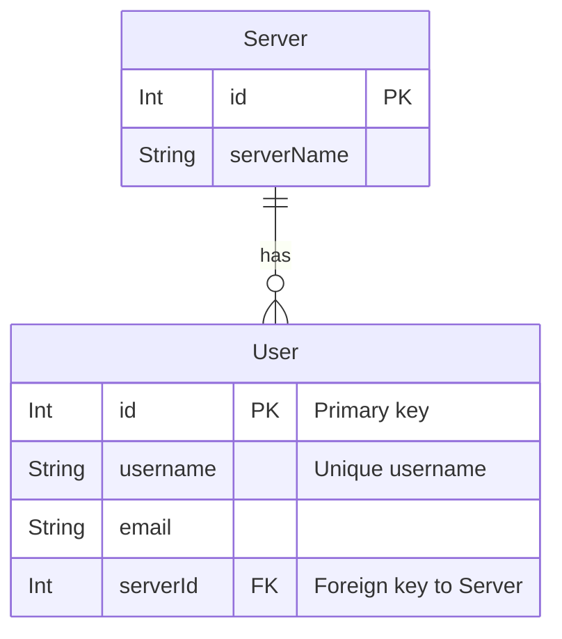

### Relationship Cardinality
- `||--||` - Exactly one to exactly one
- `||--o{` - One to zero or more
- `}o--o{` - Zero or more to zero or more
- `}|--|{` - One or more to one or more
- `|o--o|` - Zero or one to zero or one

---

## Gantt Charts

### Basic Syntax
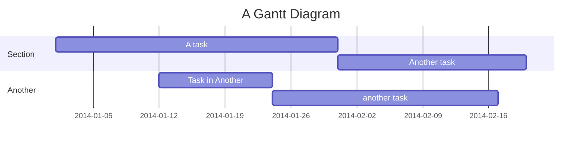

### Advanced Features
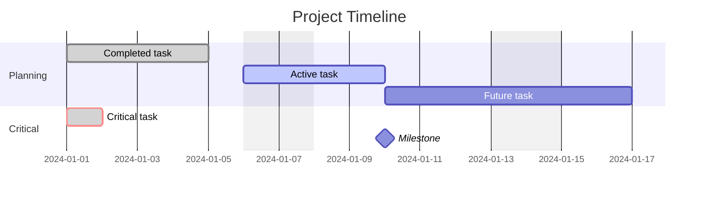

### Task States
- `:done` - Completed
- `:active` - Currently active
- `:crit` - Critical task
- `:milestone` - Milestone marker

---

## Git Graphs

### Basic Example
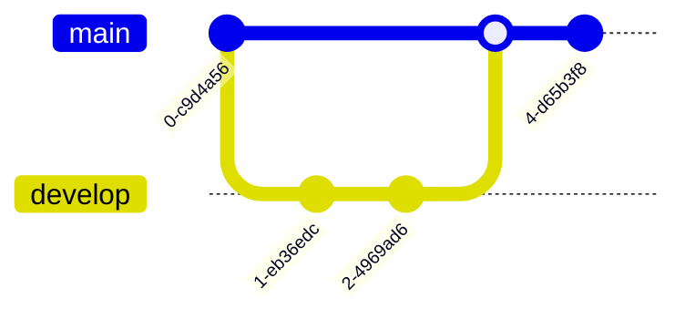

### Advanced Features
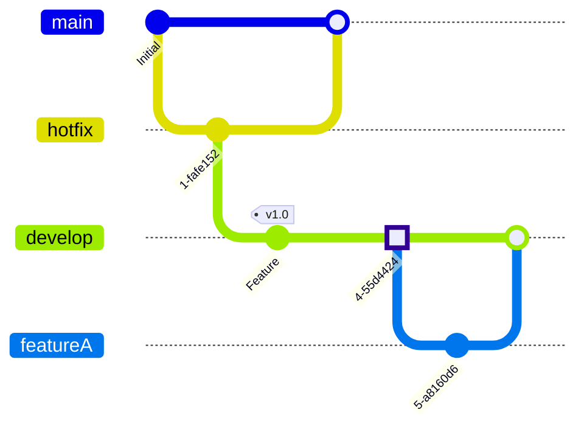

### Commit Types
- `type:NORMAL` - Regular commit
- `type:REVERSE` - Reverse commit
- `type:HIGHLIGHT` - Highlighted commit

---

## Pie Charts

### Basic Syntax
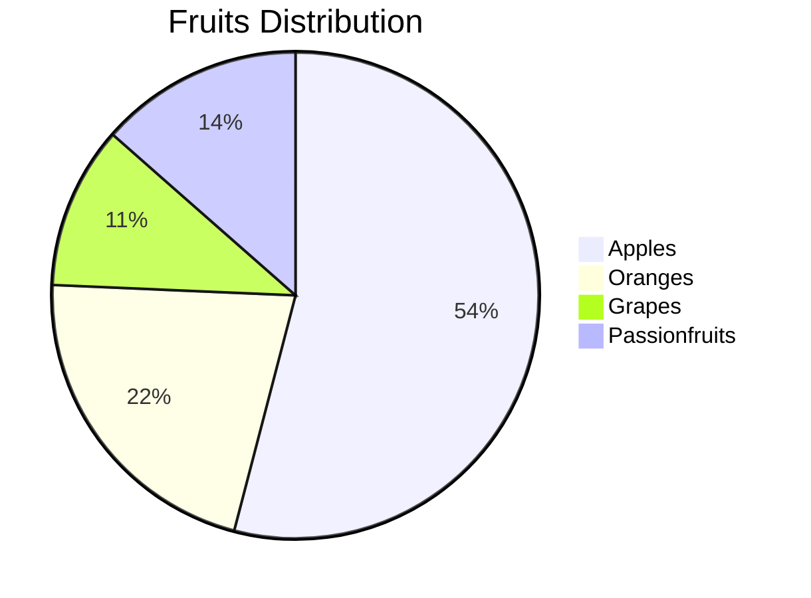

---

## User Journey

### Basic Syntax
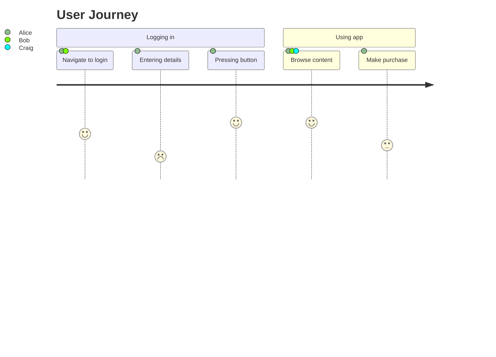

---

## Architecture Diagrams

### Basic Example
```mermaid
architecture-beta
    service db(database)[Database]
    service disk1(disk)[Storage]
    service server(server)[Server]

    db:L <-- R:server
    disk1:T -- B:server
```

### With Groups
```mermaid
architecture-beta
    group cloud[Cloud Infrastructure]
    group onprem[On-Premise] in cloud

    service db(database)[Database] in onprem
    service server(server)[Server] in cloud

    db:L <-- R:server
```

### Service Icons
- `cloud` - Cloud service
- `database` - Database
- `disk` - Storage disk
- `internet` - Internet
- `server` - Server

---

## Timeline

### Basic Syntax
```mermaid
timeline
    title Timeline of Events
    2001: Something happened
    2002: Something else happened
          : Multiple events
    2003: Another event
```

---

## Mindmap

### Basic Syntax
```mermaid
mindmap
    root((Central Idea))
        Topic 1
            Subtopic A
            Subtopic B
        Topic 2
            Subtopic C
                Detail 1
                Detail 2
        Topic 3
```

---

## Block Diagrams

### Basic Structure
```mermaid
block-beta
    columns 3
    a b c
    d e f
```

### With Shapes
```mermaid
block-beta
    columns 4
    a["default"]
    b("rounded")
    c[["double-edged"]]
    d{{"hexagon"}}
```

### Nested Blocks
```mermaid
block-beta
    columns 5
    a:3 b:2
    block:myBlock:2
        columns 2
        i j k
    end
```

### Connections
```mermaid
block-beta
    columns 3
    a space b
    c

    a-->b
    b--"label"-->c
```

---

## Sankey Diagrams

### Basic Syntax
```mermaid
sankey-beta
    BlockA,SubblockA,100
    BlockA,SubblockB,50
    SubblockA,FinalBlock,70
    SubblockB,FinalBlock,50
```

---

## ZenUML

### Basic Sequence
```mermaid
zenuml
    title Demo
    Alice->John: Hello John
    John->Alice: Great!
```

### Message Types
```mermaid
zenuml
    User->Server.SyncMessage
    User->Server.SyncWithResult { return result }
    User->Server: AsyncMessage
    new CreateMessage
    @return Server->User: ReplyMessage
```

### Control Flow
```mermaid
zenuml
    User->Server: Request

    if (condition) {
        Server->User: Response1
    } else {
        Server->User: Response2
    }

    while(condition) {
        Server->User: Repeated message
    }

    try {
        User->Server: Risky operation
    } catch {
        Server->User: Error
    } finally {
        Server->User: Cleanup
    }
```

---

## Quadrant Charts

### Basic Syntax
```mermaid
quadrantChart
    title Product Analysis
    x-axis Low Cost --> High Cost
    y-axis Low Quality --> High Quality
    quadrant-1 Premium Products
    quadrant-2 Overpriced
    quadrant-3 Budget Options
    quadrant-4 Good Value
    Product A: [0.3, 0.6]
    Product B: [0.7, 0.8]
    Product C: [0.2, 0.2]
```

---

## XY Charts

### Basic Syntax
```mermaid
xychart-beta
    title "Sales Data"
    x-axis [Jan, Feb, Mar, Apr, May]
    y-axis "Revenue" 0 --> 10000
    bar [5000, 6000, 7500, 8000, 9500]
    line [4500, 5800, 7200, 7800, 9200]
```

---

## Kanban

### Basic Syntax
```mermaid
kanban
    Todo
        Task A
        Task B@{ priority: 'High' }
    In Progress
        Task C@{ assigned: 'Alice' }
    Done
        Task D@{ ticket: 'ABC-123' }
```

### Metadata Options
```mermaid
kanban
    Backlog
        Task A@{ ticket: ABC-123, assigned: 'Alice', priority: 'High' }

    All Priorities
        Very High@{ priority: 'Very High' }
        High@{ priority: 'High' }
        Normal
        Low@{ priority: 'Low' }
        Very Low@{ priority: 'Very Low' }
```

---

## Radar Charts

### Basic Syntax
```mermaid
radar-beta
    title Skill Levels
    axis Programming, Design, Testing, Documentation, Communication
    curve Developer1{80, 60, 70, 50, 65}
    curve Developer2{70, 80, 60, 70, 75}
```

---

## Comments

Comments can be added to any diagram using `%%`:

```mermaid
flowchart LR
    %% This is a comment
    A --> B
    %% Comments are ignored during rendering
    B --> C
```

For sequence diagrams:
```mermaid
sequenceDiagram
    %% Define participants
    participant Alice
    participant Bob

    Alice ->> Bob: Message
    %% More interactions here
```

---

## Common Patterns

### Direction Control
Most diagrams support direction:
```mermaid
flowchart TB  %% Top to Bottom
classDiagram
    direction LR  %% Left to Right
stateDiagram-v2
    direction RL  %% Right to Left
```

### Styling with Classes
```mermaid
classDiagram
    class MyClass {
        +attribute
    }

    class AnotherClass

    MyClass --|> AnotherClass

    class MyClass cssClass1
    class AnotherClass cssClass2
```

### Accessibility
Add titles and descriptions:
```mermaid
stateDiagram-v2
    accTitle: This is the accessible title
    accDescr: This is an accessible description

    [*] --> State1
```

---

## Tips for Creating Valid Diagrams

1. **Always start with the diagram type** (`flowchart`, `sequenceDiagram`, `classDiagram`, etc.)
2. **Use consistent indentation** for readability
3. **Quote labels with special characters** or spaces: `A["Label with spaces"]`
4. **Escape special characters** if needed
5. **Use semicolons carefully** - some diagram types require them, others don't
6. **Test arrows syntax** - different diagrams use different arrow styles
7. **Check cardinality notation** in ER diagrams - symbols matter
8. **Use comments** (`%%`) to document complex diagrams

---

## Validation

To validate a Mermaid diagram:

```bash
# Single diagram validation
printf 'graph TD; A-->B' | npx -y @mermaid-js/mermaid-cli@latest -i /dev/stdin -o /tmp/_.svg 2>&1 | grep -A2 -m1 '^Error:' && false || true
```

Common issues:
- Invalid node syntax
- Missing semicolons or line breaks
- Invalid arrow types for the diagram type
- Malformed relationships or cardinality notation
- Invalid style/class definitions
