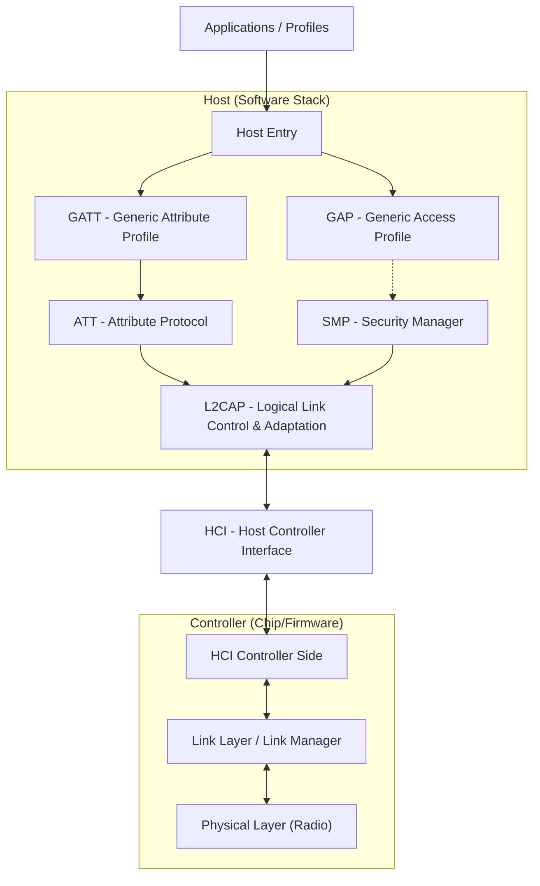

# 蓝牙协议栈架构总览 (Bluetooth Protocol Stack Architecture)

本章节对蓝牙协议栈进行系统性的分层介绍，阐述 Controller、Host、HCI 等核心组件的职责，并将其与 OSI 网络模型进行映射对比。

---

## 1. 宏观架构 (High-Level Architecture)

蓝牙协议栈并非一个单体软件，而是通过硬件和逻辑划分为两个主要部分：**Host（主机）** 和 **Controller（控制器）**，中间通过 **HCI（主机-控制器接口）** 进行通信。

*   **Host (主机)**: 运行在主处理器（如手机 CPU、PC）上的协议栈软件。负责高层逻辑，如数据分包、服务发现、安全配对等。
*   **Controller (控制器)**: 运行在蓝牙芯片（如 SoC）上的固件。负责无线电信号的发送/接收、时序控制、跳频等实时性要求极高的任务。
*   **HCI (Host Controller Interface)**: 两者之间的标准通信接口。物理上可以是 UART, USB, SDIO 等。
*   **L2CAP(Logical Link Control and Adaptation Protocol)** ：逻辑链路控制与是适配协议

---

## 2. 蓝牙协议栈与 OSI 模型的映射 (Bluetooth vs. OSI Model)

将蓝牙协议栈对齐到 OSI 7层模型有助于理解各层的功能定位：

| OSI Layer | 蓝牙对应层级 | 核心职责 (Core Responsibilities) |
| :--- | :--- | :--- |
| **7. 应用层 (Application)** | **Profiles / Services** | 定义特定场景的行为（如音频传输 A2DP、心率监测 HRM）。 |
| **6. 表示层 (Presentation)** | **GATT / GAP** | **GATT**: 定义数据的格式和访问方式（属性、特征）。 **GAP**: 定义设备如何被发现、连接和呈现（广播、扫描、角色）。 |
| **5. 会话层 (Session)** | **ATT / SMP / L2CAP** | **ATT**: 定义客户端与服务器间的 Request/Response 数据交换机制。 **SMP**: 管理会话的安全密钥和配对过程。 **L2CAP**: 管理逻辑通道的建立和拆除。 |
| **4. 传输层 (Transport)** | **L2CAP** | 提供数据分段与重组 (Segmentation & Reassembly)、流控、多路复用。 |
| **3. 网络层 (Network)** | *(No direct equivalent)* | 蓝牙通常是点对点或星型网络，L2CAP 承担了部分寻址功能 (CID)。 |
| **2. 数据链路层 (Data Link)** | **Link Layer (LE) / Link Manager (BR/EDR)** | 数据包的封装、校验 (CRC)、重传 (ACK)、以及信道接入控制 (MAC)。 |
| **1. 物理层 (Physical)** | **PHY** | 2.4GHz ISM 频段的 GFSK/PSK 调制、解调、跳频扩频。 |

---

## 3. 分层详解 (Detailed Layer Breakdown)

### 3.1 Controller 层 (底座)

这是蓝牙的“硬件层”，通常固化在芯片中。

*   **Physical Layer (PHY)**:
    *   **频段**: 2.4 GHz ISM。
    *   **调制**: 
        *   LE: GFSK (1 Mbps / 2 Mbps)。
        *   BR/EDR: GFSK (1 Mbps), π/4-DQPSK (2 Mbps), 8DPSK (3 Mbps)。
    *   **功能**: 发送和接收比特流。

*   **Link Layer (LL - Low Energy) / Baseband & LMP (BR/EDR)**:
    *   **状态机管理**: 广播 (Advertising)、扫描 (Scanning)、连接 (Connected)、待机 (Standby)。
    *   **空中调度**: 决定谁在什么时候发送数据（时分双工 TDD）。
    *   **链路控制**: 跳频序列计算、数据包确认（ACK/NAK）、加密加解密（AES-CCM）。

### 3.2 Host 层 (大脑)

这是蓝牙的“软件层”，运行在操作系统内核或用户空间。

*   **L2CAP (Logical Link Control and Adaptation Protocol)**:
    *   **多路复用**: 将来自上层不同协议（如 ATT, SMP, 音频数据）的数据流合并到同一个逻辑链路中。
    *   **分段与重组**: 将上层的大数据包（MTU）切分为 Controller 能处理的小数据包（PDU）。

*   **Security Manager Protocol (SMP) [仅 LE]**:
    *   负责生成加密密钥、身份认证、配对过程（Pairing & Bonding）。

*   **Attribute Protocol (ATT)**:
    *   蓝牙低功耗（BLE）数据交换的基础。定义了 Client（读/写者）和 Server（存储数据者）的角色。

*   **Generic Attribute Profile (GATT)**:
    *   基于 ATT，定义了数据的**层次结构**：Service（服务） -> Characteristic（特征） -> Descriptor（描述符）。
    *   是所有 BLE 应用层开发的基础。

*   **Generic Access Profile (GAP)**:
    *   定义了设备的**通用行为**：
        *   **模式**: 可发现性（Discoverable）、可连接性（Connectable）。
        *   **角色**: Central（中心设备/手机）、Peripheral（外设/手环）。
        *   **流程**: 广播、扫描、连接建立。

---

## 4. 核心规范对应的卷 (Reference to Core Spec v6.2)

在查阅 Core Spec v6.2 PDF 时，各层对应的卷如下：

*   **Vol 1**: 架构概览 (Architecture & Overview)
*   **Vol 2**: BR/EDR Controller (PHY, Baseband, LMP)
*   **Vol 3**: Host (L2CAP, GATT, GAP, SMP)
*   **Vol 4**: HCI (Host Controller Interface)
*   **Vol 6**: Low Energy Controller (LE PHY, Link Layer)
*   **Vol 7**: Wireless Coexistence (无线共存)