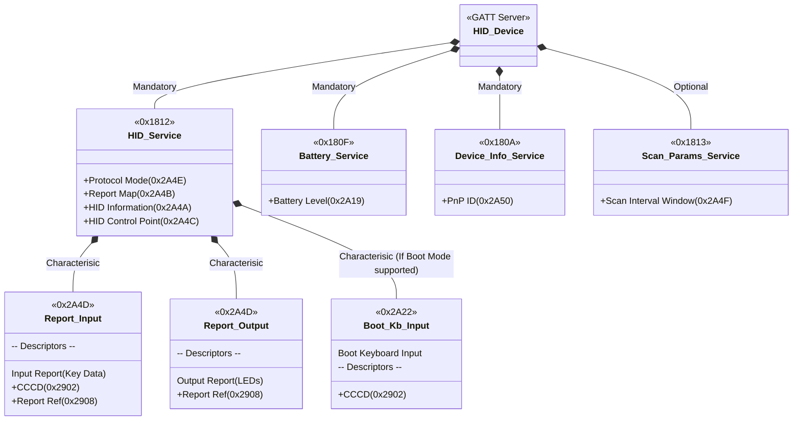
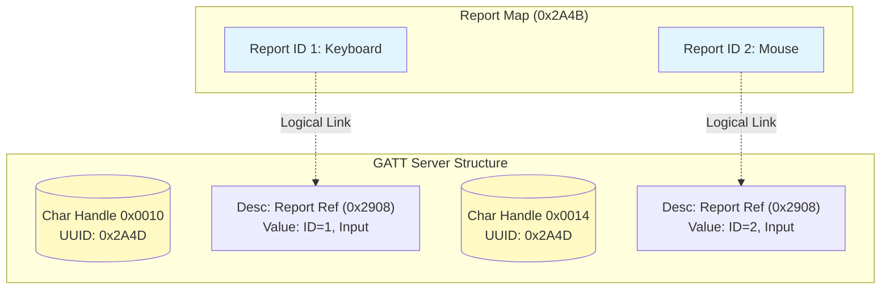

# HOGP (HID over GATT Profile) 架构详解

**HOGP (HID over GATT Profile)** 是连接传统 HID 协议与现代 BLE 协议栈的桥梁。它不重新定义 HID 报文结构（沿用 USB HID 规范），而是定义了**如何将 HID 报文封装在 GATT 特征值 (Characteristics) 中进行传输**。

本文档深入解构 HOGP 的服务层级、特征值属性及 GATT 映射关系。

---

## 1. 协议映射逻辑 (The Mapping Philosophy)

HOGP 的核心思想是将 USB HID 的“端点 (Endpoints)”映射为 GATT 的“特征值 (Characteristics)”。

| USB HID 概念                 | BLE GATT 映射                   | 交互方式 (ATT Protocol)                   |
| :------------------------- | :---------------------------- | :------------------------------------ |
| Interrupt IN Endpoint      | Input Report Characteristic   | Notification (无 ACK, 低延迟)             |
| Interrupt OUT Endpoint     | Output Report Characteristic  | Write without Response (主机推数据)        |
| Control Endpoint (Get/Set) | Feature Report Characteristic | Read / Write                          |
| USB Suspend/Resume         | HID Control Point             | Write (`0x00`: Suspend, `0x01`: Exit) |

---

## 2. 服务层级架构 (Service Hierarchy)

HOGP 设备不仅仅只有一个 HID Service，它是一个服务群。以下 Mermaid 类图展示了标准键盘/鼠标的 GATT 结构：

---

## 3. HID Service (`0x1812`) 特征详解

这是 HOGP 的核心。必须严格遵守以下属性 (Properties) 和权限设置。

| 特征名称 (Characteristic) | UUID | 属性 (Prop) | 描述符 (Descriptors) | 功能描述 |
| :--- | :--- | :--- | :--- | :--- |
| **Protocol Mode** | `0x2A4E` | Read, Write_No_Resp | - | **模式切换**。 `0x00`: Boot Protocol (BIOS模式) `0x01`: Report Protocol (OS模式, 默认) |
| **Report Map** | `0x2A4B` | Read | - | **报文描述符**。 存放完整的 USB HID Report Descriptor 字节码。通常较长（>20 字节），需支持 Read Blob。 |
| **HID Information** | `0x2A4A` | Read | - | **版本信息**。 包含 `bcdHID` (USB HID 版本), `bCountryCode`, `RemoteWake` 标志。 |
| **HID Control Point** | `0x2A4C` | Write_No_Resp | - | **电源控制**。 Host 写入 `0x00` 通知设备进入 Suspend 状态。 |
| **Report** (Input) | `0x2A4D` | Read, Notify | **CCCD** (`0x2902`) **Report Ref** (`0x2908`) | **输入数据流**。 用于发送按键、坐标。必须配置 CCCD 才能发送 Notify。 |
| **Report** (Output) | `0x2A4D` | Read, Write, Write_No_Resp | **Report Ref** (`0x2908`) | **输出数据流**。 用于 Host 控制键盘 LED (NumLock/Caps) 或手柄震动。 |
| **Report** (Feature) | `0x2A4D` | Read, Write | **Report Ref** (`0x2908`) | **双向配置**。 用于自定义配置工具（如设置 DPI、宏定义）。 |
| **Boot Keyboard Input** | `0x2A22` | Read, Notify | **CCCD** (`0x2902`) | **BIOS 兼容输入**。 固定 8 字节格式。仅在 Protocol Mode = 0 时使用。 |
| **Boot Mouse Input** | `0x2A32` | Read, Notify | **CCCD** (`0x2902`) | **BIOS 兼容鼠标**。 固定格式。仅在 Protocol Mode = 0 时使用。 |

> **注意**: `Report` 特征值复用了同一个 UUID (`0x2A4D`)。主机通过 **Report Reference Descriptor** 来区分它们。

---

## 4. 多重 Report 的区分 (Report Reference Descriptor)

当一个设备同时支持键盘、多媒体键和鼠标时，Report Map 中会定义多个 **Report ID**。GATT 层通过 `Report Reference Descriptor (0x2908)` 将特征值与 Report ID 绑定。

**机制如下：**

1.  **Report Map 定义**:
    *   ID `1`: Keyboard (Input/Output)
    *   ID `2`: Mouse (Input)
    *   ID `3`: Consumer Control (Input)

2.  **GATT 特征值实例化**:
    *   **Characteristic A (UUID 0x2A4D)**:
        *   Prop: Notify
        *   Descriptor `0x2908`: Value = `[ID: 0x01, Type: Input]`
    *   **Characteristic B (UUID 0x2A4D)**:
        *   Prop: Write_No_Resp
        *   Descriptor `0x2908`: Value = `[ID: 0x01, Type: Output]`
    *   **Characteristic C (UUID 0x2A4D)**:
        *   Prop: Notify
        *   Descriptor `0x2908`: Value = `[ID: 0x02, Type: Input]`

**Mermaid 关系图:**

---

## 5. 关键依赖服务

HOGP 规范强制要求以下服务，缺少会导致 WHQL 认证失败或兼容性问题。

### 5.1 Device Information Service (`0x180A`)
*   **PnP ID (`0x2A50`)**: 最关键的特征。
    *   结构: `[Vendor ID Source] [Vendor ID] [Product ID] [Product Version]`
    *   作用: Windows/Android 使用 `VID` 和 `PID` 来匹配驱动程序或应用特定补丁。
    *   *示例*: `0x02` (USB IF) | `0x1234` (Logitech) | `0x5678` (Mouse X) | `0x0100` (v1.0)

### 5.2 Battery Service (`0x180F`)
*   **Battery Level (`0x2A19`)**: 单字节 `0-100`。
*   Android/iOS 会直接在蓝牙设置页面显示此电量。

---

## 6. HOGP v1.1 更新：ISO (LE Audio 协同)

HOGP v1.1 引入了对 **LE Isochronous Channels (ISO)** 的支持。

*   **背景**: 传统 ACL 链路在拥塞环境下可能延迟不稳定。
*   **解决**: 利用 CIS (Connected Isochronous Stream) 通道传输 HID 数据。
*   **新特征**:
    *   **HID ISO Request**: 映射 HID Report 到 ISO 通道。
    *   此模式多用于 VR 手柄或高回报率电竞外设。