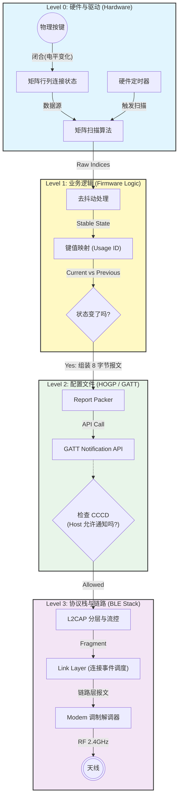
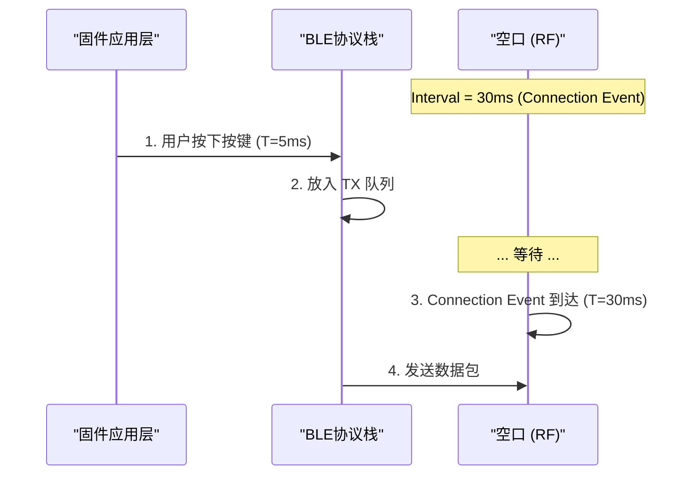

# 嵌入式 HID 设备开发——自底向上视角

本文档采用 **Bottom-Up (自底向上)** 的视角，解构一个蓝牙键盘/鼠标固件是如何将物理世界的“按压”转化为数字世界的“字符”的。我们将穿透 GPIO、固件逻辑、BLE 协议栈，最终抵达主机驱动。

---

## 🏗️ 全局架构 (System Architecture)

让我们通过一张纵向切面图，鸟瞰数据如何在层级间流动。



---

## Level 0: 物理与驱动层 (Physics & Driver)

一切始于电压的变化。

*   **矩阵扫描 (Matrix Scanning)**: 为了节省 IO 口，键盘通常使用 `Row x Column` 矩阵，当(row,col) 被按下，对应行列导通。我们可以通过在col 输出独热码e.g.`0b1111101`的方法，在每个col 的低电平帧 扫描所有row行io电平，若被强下拉为0，则能确定(row,col)按键被按下了。
* 鬼键(Ghost Key): 考虑`(row+1,col)`  `(row,col +1 )` 被同时按下，必然地，`(row+1 , col +1)` 也被导通，这是一个错误地数据源，需要在软件层识别并丢弃这一帧的按键状态（或更智能的鬼键处理算法）


---

## Level 1: 业务逻辑层 (Application Logic)

这是固件工程师写代码最多的地方。

### 1.1 键值映射 (The Mapper)
物理坐标 `(Row:3, Col:5)` 代表什么？
*   固件中需要维护一张查找表 (Lookup Table)，将其映射为 **HID Usage ID** (例如 `0x04` 代表 'A')。
*   *参考*: [HID Report Map 实战指南](hid_report_map_guide.md) 中的 Usage Table 定义。

### 1.2 差异检测 (Diff Engine) —— 核心机制
与 USB HID 的轮询机制不同，**BLE 是事件驱动的**。
*   **USB**: 主机每 1ms 问一次“有数据吗？”，设备回答“有/无”。
*   **BLE**: 设备**只有在数据变化时**才主动发送。
    *   如果用户一直按住 'A' 键不放，设备只在**按下瞬间**发一次包，后续不再发送（直到松开）。（而在私有2.4G协议/usb-hid里，会持续发包）
    *   *例外*: 某些 BIOS 或旧系统可能需要设备定期重发（Phantom Key），但这在 BLE 中不推荐，极其耗电。

``` c
// 嵌入式工程师的经典逻辑
if (memcmp(current_key_buffer, previous_key_buffer, 8) != 0) {
    // 状态变了，准备发送！
    send_report(current_key_buffer);
    memcpy(previous_key_buffer, current_key_buffer, 8);
}
```

---

## Level 2: 协议适配层 (Profile & GATT)

数据从“业务逻辑”进入“蓝牙世界”的入口。

### 2.1 HOGP 服务构建
固件必须按照 [HOGP 架构](hogp_architecture.md) 初始化 GATT 服务表格。
*   **Report Characteristic**: 这是数据的出口。
*   **CCCD (Client Characteristic Configuration Descriptor)**: 这是开关。
    *   **重要**: 在 Host 向 CCCD 写入 `0x0001` (Enable Notification) 之前，**严禁**调用发送函数。

### 2.2 权限与安全
HID 设备通常涉及敏感隐私（如输入密码）。
*   **SMP 配对**: 必须先完成 [SMP 配对流程](../../vol3_host/smp_pairing_process.md)，建立加密链路。
*   **权限**: HID 特征值的权限通常设为 `SEC_JUST_WORKS` 或 `SEC_MITM` 的加密读写。

---

## Level 3: 协议栈与链路层 (Stack & Transport)

当调用 `sd_ble_gatts_hvx` (Nordic) 或类似 API 后，数据经历了什么？

### 3.1 ATT & L2CAP 封装
用户的 8 字节 Report 会被层层包裹：
1.  **ATT Layer**: 加上 Opcode (`0x1B` Notification) 和 Handle ID (`0x0012`)。
    *   *深度阅读*: [ATT 协议深度解析](../../vol3_host/att_protocol.md)
2.  **L2CAP Layer**: 加上长度头 (Length) 和 CID (`0x0004`)。
    *   *深度阅读*: [L2CAP 通用操作](../../vol3_host/l2cap_general_operation.md)

### 3.2 链路层的调度 (The Timing) —— 延迟的本质
这是嵌入式开发最需要关注的 **Latency (延迟)** 来源。

数据不是发了就立刻走的，它必须等待下一个 **Connection Event (连接事件)**。



*   **性能优化**:
    *   如果连接间隔是 30ms，平均延迟就是 15ms，最大延迟 30ms。
    *   **游戏模式**: 请求主机将 Interval 降至 7.5ms。需要通过 [HCI](../../vol4_hci/hci_initialization_flow.md#4-连接建立流程) 命令或 L2CAP 信令申请。

---

## Level 4: 主机侧处理 (Host Handling)

1.  **接收**: PC 蓝牙协议栈 的 Controller 收包，通过 [HCI](../../vol4_hci/hci_packet_structures.md) 上报给 Host Stack。
2.  **解析**: Host Stack 根据之前的服务发现结果，知道 Handle `0x0012` 对应的是 HID Report。
3.  **驱动映射**:
    *   操作系统加载 HID Class Driver。
    *   驱动读取设备之前上传的 **Report Descriptor** (参考 [Report Map 指南](hid_report_map_guide.md))。
    *   驱动解释：“收到 8 字节，第 3 字节是 0x04 -> 查表得 'A' -> 产生键盘事件”。
