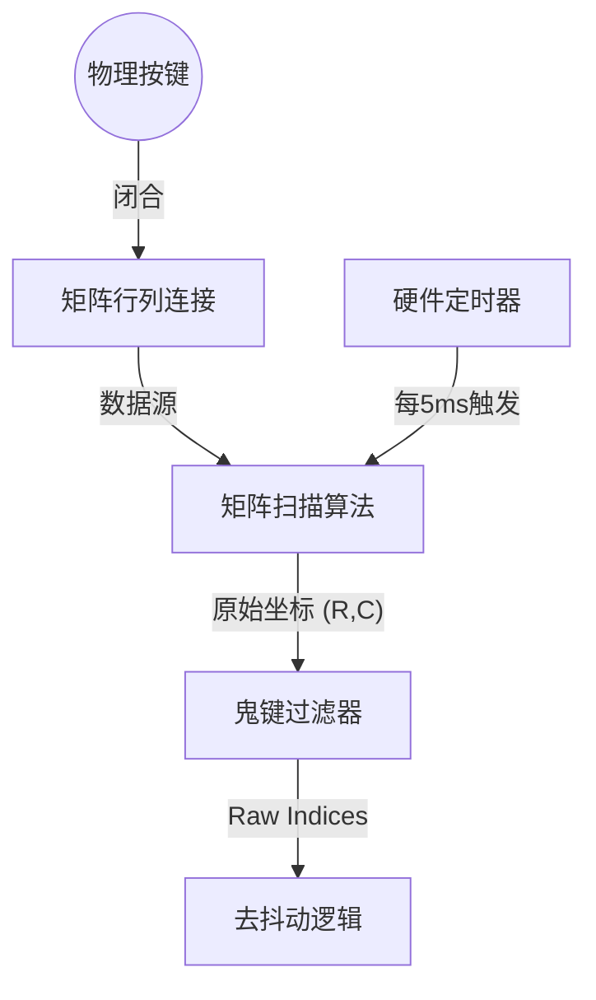
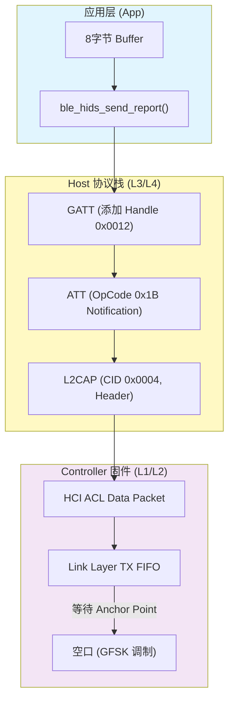
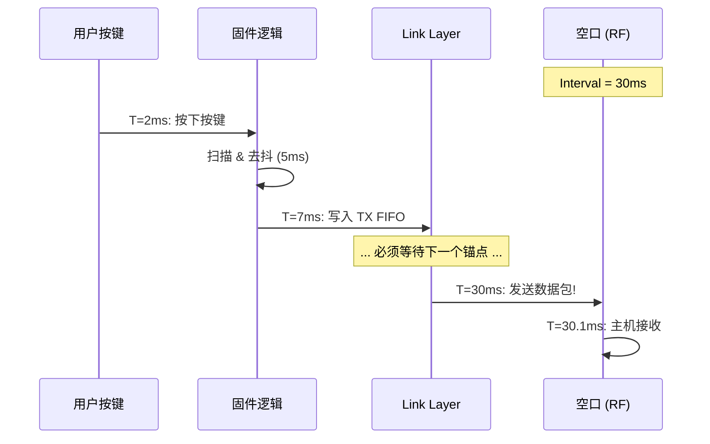
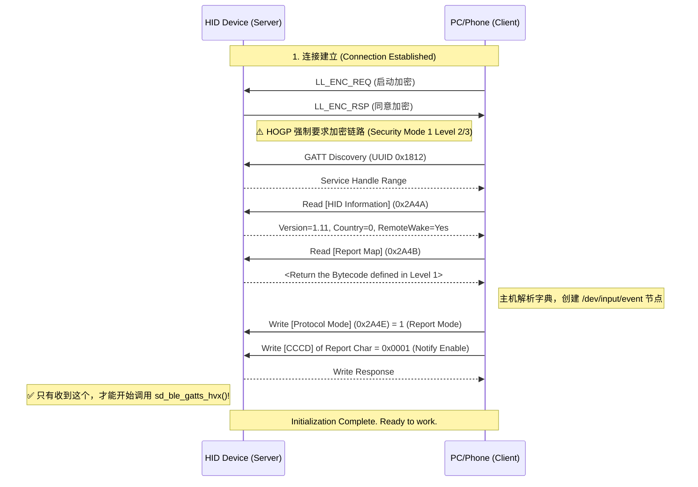

# 嵌入式 HID 设备开发——自底向上视角 (v2)

本文档专为嵌入式工程师设计。我们摒弃教科书式的分层介绍，采用 **"Bottom-Up" (自底向上)** 的视角，从最核心的**报文定义**开始，回溯到**物理按键扫描**，最后跟踪数据如何在**协议栈**中穿梭并飞向主机。

这是一次从 `0x01` 键值编码到 2.4GHz 无线电波的旅程。

---

## 第一层：定义世界 —— Report Descriptor (报文描述符)

在 USB/HID 协议中，设备不直接发送 "A" 或 "B"，而是发送一串二进制数据（Payload）。**Report Descriptor** 就是一本“字典”，它必须在一切开始前被定义好，告诉主机如何翻译这串二进制数据。

它是 HID 开发的灵魂，是一种基于 Item 的紧凑字节码语言。

### 1.1 标准键盘 (Boot Keyboard) 及其字节码解析
这是最兼容的 8 字节结构，也是 BIOS 的最小系统环境下 HID 设备能通用的基础：
`[Modifier] [Reserved] [Key1] [Key2] [Key3] [Key4] [Key5] [Key6]`

```c
// 标准 8 字节键盘描述符解析
0x05, 0x01,        // Usage Page (Generic Desktop Ctrls)
0x09, 0x06,        // Usage (Keyboard)
0xA1, 0x01,        // Collection (Application) -> 集合开始

    // --- 第1字节：修饰键 (Ctrl, Shift, Alt, GUI) ---
    // 定义 8 个 bit，分别对应 Left/Right 的 Ctrl/Shift/Alt/GUI
    0x05, 0x07,    //   Usage Page (Keyboard/Keypad)
    0x19, 0xE0,    //   Usage Minimum (0xE0 = Left Control)
    0x29, 0xE7,    //   Usage Maximum (0xE7 = Right GUI)
    0x15, 0x00,    //   Logical Minimum (0)
    0x25, 0x01,    //   Logical Maximum (1)
    0x75, 0x01,    //   Report Size (1) -> 每个数据占 1 bit
    0x95, 0x08,    //   Report Count (8) -> 一共 8 个
    0x81, 0x02,    //   Input (Data, Var, Abs) -> Variable: 每一位独立表示一个键状态

    // --- 第2字节：保留字节 (Reserved) ---
    // 为了字节对齐，填充 1 个字节的常量
    0x95, 0x01,    //   Report Count (1)
    0x75, 0x08,    //   Report Size (8) -> 8 bits
    0x81, 0x03,    //   Input (Const, Var, Abs) -> Constant: 主机忽略此数据

    // --- 第3-8字节：普通键值数组 (Key Array) ---
    // 只能同时存 6 个键，超过会发生 Phantom State
    0x95, 0x06,    //   Report Count (6) -> 6 个按键槽
    0x75, 0x08,    //   Report Size (8) -> 每个槽 8 bits
    0x15, 0x00,    //   Logical Minimum (0)
    0x25, 0x65,    //   Logical Maximum (101) -> 覆盖大部分常用键
    0x05, 0x07,    //   Usage Page (Key Codes)
    0x19, 0x00,    //   Usage Minimum (0)
    0x29, 0x65,    //   Usage Maximum (101)
    0x81, 0x00,    //   Input (Data, Array, Abs) -> Array: 关键！表示只上报按下的键的索引

0xC0               // End Collection
```

### 1.2 全键无冲 (NKRO) 的本质区别
标准键盘用 `Array` 类型，只能存 6 个 Usage ID。NKRO (N-Key Rollover) 键盘必须将 `Input` 定义为 **Bitmap (位图)**。

*   **逻辑变化**: 不是“发回按下的键的ID”，而是“发回一张巨大的表（例如 128 位），每一位代表一个键，1表示按下，0表示抬起”。
*   **代价**: 报文变长（104 键至少需要 13 字节），且 BIOS 可能不支持。

```c
// NKRO 描述符核心差异
0x05, 0x07,    // Usage Page (Keyboard)
0x19, 0x00,    // Usage Min (0)
0x29, 0x7F,    // Usage Max (127) -> 覆盖 128 个键
0x15, 0x00,    // Logical Min (0)
0x25, 0x01,    // Logical Max (1) -> 只有 0/1 状态
0x75, 0x01,    // Report Size (1) -> 1 bit per key
0x95, 0x80,    // Report Count (128) -> 128 bits total
0x81, 0x02,    // Input (Data, Variable, Absolute) -> 关键：Variable 而非 Array
```

### 1.3 组合设备与 Report ID
多媒体键（音量、播放）属于 **Consumer Page (0x0C)**。为了在一个设备中传输不同类型的数据，我们引入 **Report ID**。
*   Report ID 1: 键盘数据 (Boot Keyboard)
*   Report ID 2: 多媒体数据 (Consumer Control)

---

## 第二层：物理与逻辑 —— 扫描、构造与差异检测

定义好了“字典”，现在我们需要产生数据。这涉及硬件驱动与固件逻辑。

### 2.1 硬件层：矩阵扫描 (Level 0)
为了节省 IO 口，键盘通常使用 `Row x Column` 矩阵。
*   **原理**: 
    1.  将 `Col 1` 置低电平 (Low)，其他 Cols 高阻态/高电平。
    2.  读取所有 `Row` 的电平。如果 `Row 3` 为低，说明 `(Row 3, Col 1)` 被按下。
    3.  循环扫描所有 Cols。
*   **鬼键 (Ghost Key)**: 当 `(R1, C1)`, `(R1, C2)`, `(R2, C1)` 同时按下时，`R2` 与 `C2` 实际上通过按键短路了，导致 MCU 误判 `(R2, C2)` 也被按下。
    *   *解法*: 硬件上串联二极管，或软件上识别并丢弃这种非法状态。



### 2.2 固件层：差异检测引擎 (Level 1)
这是嵌入式 HID 开发中最容易产生误区的地方：**USB 思维 vs BLE 思维**。

*   **USB 模式 (Polling)**: 主机每 1ms 问一次“有数据吗？”，设备回答。固件往往在 `while(1)` 里不停跑。
*   **BLE 模式 (Event-Driven)**: 
    *   **原则**: 只有当**状态发生变化 (Diff)** 时，才触发无线发送。
    *   **节能**: 没按键时，MCU 应该处于 Sleep 模式，仅由定时器唤醒扫描。

```c
// 核心逻辑伪代码
void matrix_scan_handler() {
    uint8_t current_keys[8] = scan_matrix();
    
    // Diff Engine: 只有不一样才发送！
    if (memcmp(current_keys, last_sent_keys, 8) != 0) {
        // 1. 更新历史状态
        memcpy(last_sent_keys, current_keys, 8);
        
        // 2. 构造 Report 并推送到协议栈
        ble_hids_send_report(current_keys);
    }
}
```

---

## 第三层：协议栈穿梭

在 `kb app` 软件层构造好 HID 协议标准的 `report description` 后，在协议栈的某个 TX 入口函数（e.g. `ble_hids_send_report()`），数据并未立即飞出，而是开始了一段穿越 OSI 模型的旅程。

### 3.1 协议栈全景图 (Data Flow)



### 3.2 详细穿梭过程
1.  **GATT/ATT 层 (逻辑通道)**:
    *   数据被封装为 **ATT Handle Value Notification**。
    *   **Handle**: 对应 Report Characteristic 的 Value Handle (例如 `0x0012`)。主机靠这个知道是“键盘数据”而不是“电量”。
    *   **OpCode**: `0x1B`。不需要主机回复确认 (ACK)，追求速度。
    *   *深度参考*: [ATT 协议详解](../../vol3_host/att_protocol.md)
2.  **L2CAP 层 (多路复用)**:
    *   添加 L2CAP Header。
    *   **CID (Channel ID)**: 固定为 `0x0004` (Attribute Protocol)。
    *   *深度参考*: [L2CAP 通用操作](../../vol3_host/l2cap_general_operation.md)
3.  **HCI 接口 (软硬边界)**:
    *   如果是双芯片方案，数据通过 UART/USB 传输。如果是单芯片 (SoC)，这是函数调用边界。
    *   封装为 **HCI ACL Data Packet**。
4.  **Link Layer (时间调度)**:
    *   **关键概念**: 数据进入 TX Buffer 后，**必须等待**下一个 **Connection Interval (连接间隔)** 的到来。
    *   如果 Interval = 30ms，你刚刚错过了上一个锚点，那么延迟就是 30ms。这也是为什么电竞外设要求 7.5ms 的 Interval。

### 3.3 时序图：延迟的真相



---

## 第四层：身份与认可 —— HOGP 规范与设备注册 (Initialization)

数据能发的出去，前提是主机（Windows/Android/iOS）已经“认可”了你的设备身份。这需要严格遵循 **HOGP (HID over GATT Profile)** 规范完成初始化握手。

### 4.1 HOGP 服务架构详解 (Service Hierarchy)
一个标准的 HID 设备必须包含 UUID 为 `0x1812` 的 Primary Service。其内部特征值 (Characteristics) 结构如下：

| Characteristic | UUID | 读写权限 | 功能描述 |
| :--- | :--- | :--- | :--- |
| **Protocol Mode** | `0x2A4E` | Read/Write | **模式切换**。<br>`0`: Boot Protocol Mode (BIOS 简易模式)<br>`1`: Report Protocol Mode (OS 完整模式, 默认) |
| **Report Map** | `0x2A4B` | Read | **字典定义**。<br>存放我们在第一层编写的 Report Descriptor 字节码。 |
| **Report** | `0x2A4D` | Read/Notify/Write | **数据管道**。<br>Input Report (键盘发给PC) 用 Notify;<br>Output Report (PC发给键盘LED) 用 Write。 |
| **HID Information** | `0x2A4A` | Read | **版本与能力**。<br>包含 `bcdHID` (版本号), `bCountryCode`, `Flags` (是否支持远程唤醒)。 |
| **HID Control Point**| `0x2A4C` | Write | **电源管理**。<br>主机写入 `0x00` (Suspend) 让设备休眠;<br>写入 `0x01` (Exit Suspend) 唤醒设备。 |

> **关键点**: **Boot Host vs. Report Host**
> *   在进入操作系统前（BIOS阶段），主机不支持复杂的 Report Descriptor解析，它会写入 `Protocol Mode = 0`。此时设备必须切换到最简单的 8 字节标准格式发送。
> *   进入 OS 后，主机写入 `Protocol Mode = 1`，并读取 Report Map，启用完整功能（如多媒体键）。

### 4.2 设备注册全流程 (The Handshake)
这是设备连接后最初几百毫秒发生的**“入职流程”**。只有走完这个流程，你的按键才会被 OS 接受。



### 4.3 常见“坑”与调试指南
1.  **连上了但没反应**：
    *   检查 **CCCD**：固件是否判断了 `is_notification_enabled`？如果主机没写 CCCD 你就发数据，会被断开。
    *   检查 **Report Map**：字节码是否有语法错误？可以用 USB.org 的 [HID Descriptor Tool](https://www.usb.org/document-library/hid-descriptor-tool) 验证。
2.  **配对失败 (Pairing Failed)**：
    *   **IO Capabilities** 设置错了吗？键盘通常设为 `KeyboardOnly` 或 `DisplayYesNo` (如果有屏幕)。
    *   **Bonding**：HOGP 需要绑定 (Bonding) 才能在重连后跳过握手直接工作。
3.  **延迟大**：
    *   检查 **Connection Interval**。刚连接时可能是 30ms-50ms，设备应主动发起 `L2CAP Connection Parameter Update Request` 请求 7.5ms-15ms。

---

## 总结

一个按键与其定义世界的键值字符，经历了：
1.  **定义**: Report Descriptor 规定了它的含义。
2.  **扫描**: 矩阵电路捕获了它的物理动作。
3.  **过滤**: 固件去抖并确认状态变化。
4.  **封装**: L2CAP/ATT 给它穿上协议的外衣。
5.  **等待**: Link Layer 等待射频时隙。
6.  **注册**: HOGP 服务发现与 CCCD 握手赋予了它合法身份。
7.  **发射**: Linker向Modern推送最终报文，在PHY层（RF），调制为2.4G RF信号